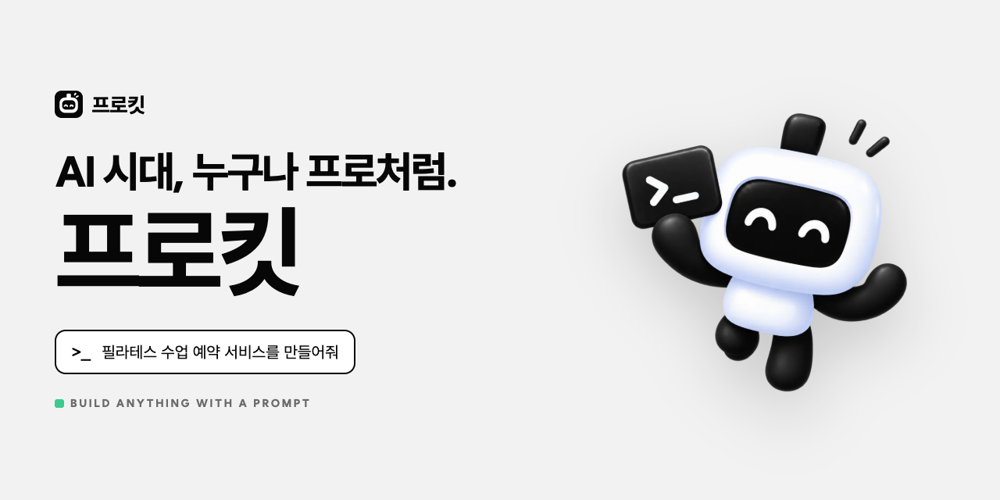
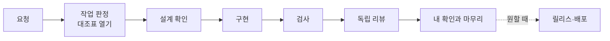
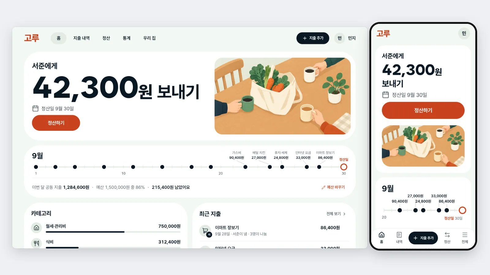
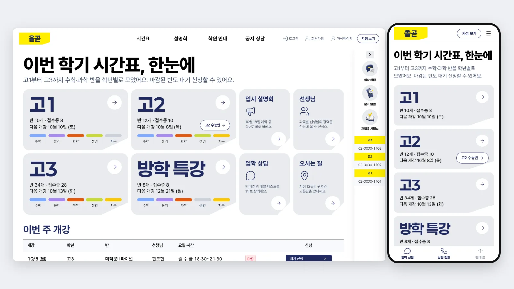
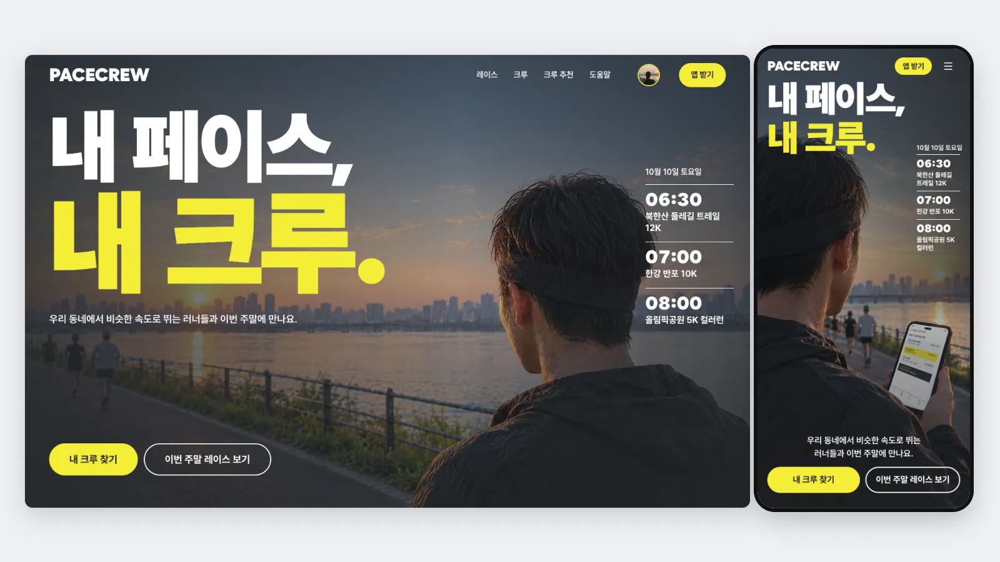

<p align="center"><a href="https://prokit-web.vercel.app/"></a></p>

<h1 align="center">pro-kit</h1>

<p align="center"><strong>Better-T-Stack Next.js 개발 스타터 키트</strong></p>

<p align="center">
  <em>개발을 몰라도, AI로 처음 만들어 봐도 괜찮습니다. 전문 개발자처럼 튼튼한 앱을 만들 수 있습니다.</em>
</p>

<p align="center">
  <a href="https://prokit-web.vercel.app/"><strong>프로킷 사이트 보기 →</strong></a><br>
  <sub>이 키트로 만든 사이트 <!-- v:presets.count -->11<!-- /v -->개를 모든 페이지까지 열어 볼 수 있습니다.</sub>
</p>

<p align="center">
  <a href="https://github.com/roadkwon-ai/pro-kit/releases"></a>
  <a href="LICENSE"></a>
  <a href="https://www.better-t-stack.dev/"></a>
  
  
  
  
  
</p>

> **사용 전에**: 프로킷 자체 코드·스킬·문서는 [MIT License](LICENSE)로 제공합니다. 상업적 이용, 유료 고객 개발, 수정·재판매와 비공개 제품 개발을 허용하며, 재배포할 때 저작권 표시와 허가문을 함께 유지해야 합니다. 외부 스킬에는 [원래 조건](THIRD_PARTY_NOTICES.md)이 적용됩니다.

<p align="center">
  <strong>템플릿 <!-- v:templates.count -->2<!-- /v -->종 &middot; 프로젝트 스킬 <!-- v:prokit.skills.count -->8<!-- /v -->개 &middot; 구현·리뷰 에이전트 <!-- v:prokit.agents.count -->2<!-- /v -->개 &middot; dev-cycle 케이스 <!-- v:devCycle.cases.count -->7<!-- /v -->개 &middot; 디자인 스타일 추천·DESIGN.md &middot; 공식 스킬 최신판 자동 설치 &middot; Vercel 배포</strong>
</p>

<p align="center">
  <a href="#프로킷이란">프로킷이란</a> &middot;
  <a href="#프로킷은-이렇게-일합니다">일하는 방식</a> &middot;
  <a href="#빠른-시작">빠른 시작</a> &middot;
  <a href="#만들어-본-예시">만들어 본 예시</a> &middot;
  <a href="#얼마나-걸리고-얼마-드나요">시간과 비용</a> &middot;
  <a href="#템플릿-두-개">템플릿</a> &middot;
  <a href="#지원하는-에이전트">지원하는 에이전트</a> &middot;
  <a href="#이미-만든-프로젝트-업데이트">업데이트</a> &middot;
  <a href="#옛-저장소에서-받았다면">옛 저장소</a> &middot;
  <a href="#문서-지도">문서</a> &middot;
  <a href="#라이선스">라이선스</a>
</p>

---

## 프로킷이란
AI 코딩 에이전트가 일할 개발 환경을 새 프로젝트에 설치하는 생성기입니다. 에이전트가 요구사항 정리, 직접 실행해 확인, 독립 리뷰, 비밀값 관리 같은 전문 개발자의 순서를 지키며 일하게 하고, 사용자는 "할 일에 마감일 붙여줘"처럼 평소 말로 요청하고 확인 질문에 답하면 됩니다. <!-- v:templates.count.ko -->두<!-- /v --> 템플릿 모두 실제로 설치해 확인했고, 결과는 [검증 결과](handbook/reference/verification.md)에 있습니다.

더 알아보기: [프로킷이란](handbook/start/what-is-prokit.md) · [이런 분께 추천해요](handbook/start/who-is-it-for.md) · [처음 보는 용어](tutorials/reference/glossary.md)

## 프로킷은 이렇게 일합니다
이 저장소는 생성기입니다. [Better-T-Stack](handbook/templates/what-it-adds.md#better-t-stack이란)이 만든 앱 뼈대(Next.js, oRPC, Better Auth, Drizzle 모노레포)에 아래 하네스를 설치하고, 개발은 그렇게 만든 새 프로젝트 폴더에서 합니다([폴더 구조](handbook/reference/project-structure.md)). 기능 하나를 만들거나 고치는 작업 한 번(라운드)은 이렇게 흘러갑니다.



화면만 만들 때는 프롬프트 → 프로젝트 준비 → 기획과 디자인 → 모든 페이지 → 검사와 리뷰 → 내보내기·배포 순서입니다.

| 하네스를 이루는 것 | 하는 일 |
|---|---|
| 규칙 문서 | 에이전트가 시작할 때 `AGENTS.md`, 용어집, 프로젝트 소개를 읽어 새 세션도 같은 원칙으로 일합니다 |
| 스킬 | 전용 스킬 <!-- v:prokit.skills.count -->8<!-- /v -->개가 분야마다 공식 스킬(설치할 때의 최신판)을 불러 쓰고, 필요하면 선택 스킬 묶음을 더합니다. [prokit 스킬](handbook/skills/prokit-skills.md) · [공식 스킬과 연결](handbook/skills/official-skills.md) |
| 역할 나누기 | 구현 에이전트가 만들고, 구현에 참여하지 않은 읽기 전용 리뷰 에이전트가 따로 봅니다. [구현 에이전트와 리뷰 에이전트](handbook/concepts/agent-roles.md) |
| 대조표와 audit | 작업을 케이스로 나눠 대조표를 열고, 모든 칸에 실행한 증거가 있어야 라운드를 닫습니다. [dev-cycle 라운드](handbook/concepts/dev-cycle.md) · [케이스와 대조표](handbook/concepts/cases.md) |
| 자동 검사 | 타입, 린트, 빌드, 테스트, 화면 디자인, 커밋 전 비밀값, 배포 준비를 명령으로 확인합니다 |

화면은 스타일 추천부터 `DESIGN.md`, 모든 페이지까지 [UI/UX 흐름](handbook/design/ui-flow.md)을 따르고, 배포는 내 컴퓨터의 Vercel CLI로 develop과 운영에 올리며 릴리스를 남깁니다([Vercel 배포와 되돌리기](handbook/deploy/vercel.md)). 전체 그림은 [하네스 엔지니어링](handbook/concepts/harness.md)에 있습니다.

그냥 AI에게 맡길 때와 이렇게 다릅니다.

- 사용자 확인이 대조표의 마지막 칸이라, 내가 결과를 보고 확인해야 작업이 끝납니다.
- 테스트와 검사를 실제로 실행한 증거가 없으면 완료라고 하지 않습니다.
- 만든 에이전트가 아닌 리뷰 에이전트가 코드, 보안, DB를 따로 검토합니다.
- 비밀값은 커밋과 배포에서 걸러 내고, 운영 DB는 요청할 때만 마이그레이션 파일로 바꿉니다.

전체 비교는 [그냥 AI에게 맡길 때와 다른 점](handbook/start/what-is-prokit.md#그냥-ai에게-맡길-때와-다른-점)에 있습니다.

## 빠른 시작
준비물은 Node <!-- v:node.min -->22.20<!-- /v --> 이상(<!-- v:node.recommended -->24<!-- /v --> 권장), pnpm, git입니다. 서비스를 만들려면 컨테이너 엔진(Podman 또는 Docker)이 더 필요하고, supabase는 Supabase CLI <!-- v:supabaseCli.min -->2.117<!-- /v --> 이상도 필요합니다([준비물](handbook/start/requirements.md)). Windows는 WSL2의 Ubuntu에서 엽니다. 이 폴더에서 에이전트를 열고 요청합니다. 에이전트마다 여는 명령은 [지원하는 에이전트](handbook/start/supported-agents.md)에 있습니다.

```bash
cd pro-kit
claude
```

### 화면만 만들기 (DB 없이)
코드를 몰라도 됩니다. 작업 폴더(예: `~/projects`)에서 에이전트를 열고 프롬프트 하나를 보내면, 이 저장소를 받는 일부터 화면 만들기와 HTML 내보내기까지 이어집니다.

> https://github.com/roadkwon-ai/pro-kit 을 이 폴더에 받고, 그 안의 AGENTS.md대로 화면만 만들 프로젝트를 pro-kit 옆에 living 폴더로 만들어줘. DB는 쓰지 않아. 없는 준비물은 설치해줘. 같이 사는 사람들이 함께 쓴 생활비를 적고, 월말에 누가 누구에게 얼마를 보내면 되는지 알려 주는 서비스를 만들고 싶어. 필요한 화면을 모두 예시 데이터로 만들어줘. 로그인이나 저장 같은 기능은 빼고 화면만 만들어. 디자인 스타일은 서비스에 어울리는 걸로 추천해주고, 다 만들면 HTML 파일로 내보내줘.

끝에 "GitHub Pages에 배포해줘"나 "Vercel에 배포해줘"를 붙이면 인터넷에 올립니다. 나중에 "실제 서비스로 바꿀 거야"라고 하면 로컬 DB와 로그인·저장이 되는 개발로 이어집니다. 자세히: [빠른 시작: 화면만 만들기](handbook/start/quickstart-screens.md), 단계별 안내는 [튜토리얼](tutorials/README.md).

### 서비스 만들기 (로그인과 DB)
DB 종류와 프로젝트 이름(영어 소문자와 하이픈)을 넣어 요청합니다. DB 종류를 빼면 에이전트가 차이를 설명하고 묻습니다.

> supabase 템플릿으로 my-app 프로젝트 만들어줘

에이전트가 앱 뼈대를 만들고 템플릿을 설치한 뒤, 내 컴퓨터에 개발용 DB를 띄우고 첫 마이그레이션과 커밋까지 마칩니다. 프로젝트는 이 저장소 옆(`../my-app`)에 만들어지고, 원격 DB 연결, 배포, GitHub 올리기는 요청할 때만 합니다. 자세히: [빠른 시작: 서비스 만들기](handbook/start/quickstart-service.md).

### 만든 뒤: 새 프로젝트에서 개발하기
개발은 **새 프로젝트 폴더에서 연 새 세션**에서 합니다. 전용 스킬과 에이전트는 그 세션에서만 불러옵니다.

```bash
cd ../my-app
.agents/skills/impeccable/scripts/impeccable hooks on   # 화면 디자인 검사 켜기. 처음 한 번만
claude
```

"수업 예약 첫 화면 디자인해줘. 서비스에 맞는 스타일도 추천해줘"처럼 평소 말로 요청하면, 에이전트가 스펙과 화면 설계를 보여 주고 확인받은 뒤 만들고 검사합니다. 예시 프롬프트와 배포 흐름은 [만든 뒤 개발하기](handbook/start/after-create.md)에 있습니다.

## 만들어 본 예시
프로킷으로 만든 사이트 중 대표 예시 4개입니다. 화면 예시는 사이트맵의 모든 페이지를 갖춰 링크와 버튼이 모두 동작하고 404나 "준비 중" 페이지가 없으며, 디자인 추천과 사이트맵은 에이전트가 낸 그대로이고 고르기와 수정 요청은 사용자가 직접 했습니다([만든 과정](handbook/design/ui-flow.md#프리셋), [검증 결과](handbook/reference/verification.md#화면-프리셋)).

<table>
<tr>
<td width="50%" valign="top"><a href="https://roadkwon-ai.github.io/pro-kit/goru/"></a><br><strong><!-- v:preset.goru.title -->고루<!-- /v --></strong> · <!-- v:preset.goru.kindLabel -->앱 화면<!-- /v --> · <!-- v:preset.goru.field -->공동 생활비 정산<!-- /v --> · 페이지 <!-- v:preset.goru.pages -->7<!-- /v -->개 · <a href="https://roadkwon-ai.github.io/pro-kit/goru/">HTML</a> · <a href="tutorials/samples/goru.md">만들어 보기</a><br><sub>위 "화면만 만들기" 프롬프트와 같은 생활비 정산 컨셉으로 실제로 만든 앱</sub></td>
<td width="50%" valign="top"><a href="https://roadkwon-ai.github.io/pro-kit/olgot/"></a><br><strong><!-- v:preset.olgot.title -->올곧<!-- /v --></strong> · <!-- v:preset.olgot.kindLabel -->앱 화면<!-- /v --> · <!-- v:preset.olgot.field -->입시학원 수강 신청·상담<!-- /v --> · 페이지 <!-- v:preset.olgot.pages -->203<!-- /v -->개(<!-- v:preset.olgot.pageTypes -->48<!-- /v -->종) · <a href="https://roadkwon-ai.github.io/pro-kit/olgot/">HTML</a> · <a href="tutorials/samples/olgot.md">만들어 보기</a><br><sub>이만큼 큰 사이트도 모든 페이지를 같은 흐름으로 만들고 검사합니다</sub></td>
</tr>
<tr>
<td width="50%" valign="top"><a href="https://roadkwon-ai.github.io/pro-kit/pacecrew/"></a><br><strong><!-- v:preset.pacecrew.title -->PACECREW<!-- /v --></strong> · <!-- v:preset.pacecrew.kindLabel -->랜딩페이지<!-- /v --> · <!-- v:preset.pacecrew.field -->동네 러닝 크루 매칭<!-- /v --> · 페이지 <!-- v:preset.pacecrew.pages -->22<!-- /v -->개 · <a href="https://roadkwon-ai.github.io/pro-kit/pacecrew/">HTML</a> · <a href="tutorials/samples/pacecrew.md">만들어 보기</a></td>
<td width="50%" valign="top"><a href="https://roadkwon-ai.github.io/pro-kit/nextflix/"></a><br><strong><!-- v:preset.nextflix.title -->Nextflix<!-- /v --></strong> · <!-- v:preset.nextflix.kindLabel -->클론 튜토리얼<!-- /v --> · <!-- v:preset.nextflix.field -->영상 구독 서비스<!-- /v --> · <a href="https://roadkwon-ai.github.io/pro-kit/nextflix/">HTML</a> · <a href="tutorials/01-nextflix/README.md">튜토리얼</a><br><sub>유명 서비스를 본뜬 연습용. 화면을 다 만든 뒤 로그인, DB, 기능을 붙여 배포합니다</sub></td>
</tr>
</table>

전체 <!-- v:presets.count -->11<!-- /v -->개(화면 <!-- v:presets.screen.count -->9<!-- /v -->개, 클론 <!-- v:presets.clone.count -->2<!-- /v -->개)는 [프로킷 사이트](https://prokit-web.vercel.app/)에서 모든 페이지까지 열어 보고, 화면은 [컨셉으로 화면 만들기 목록](tutorials/samples/README.md), 클론은 [튜토리얼](tutorials/README.md)에서 만들어 봅니다.

## 얼마나 걸리고 얼마 드나요
<!-- v:limit.pro5h.plans -->Claude Pro · ChatGPT Plus(Codex)<!-- /v --> 같은 구독 요금제로 만들 수 있습니다. 사용량이 <!-- v:limit.window -->5시간<!-- /v --> 한도에 걸리면 안내된 시간이 지난 뒤 "하던 작업 이어서 해줘"로 이어 갑니다. 위 예시를 만드는 데 걸리는 시간은 이렇습니다.

- <!-- v:preset.goru.title -->고루<!-- /v -->(페이지 <!-- v:preset.goru.pages -->7<!-- /v -->개, 프리셋 팩으로): <!-- v:preset.goru.pack.time.text -->한 번에 완성하면 약 1시간\~2시간(여러 번 고쳐 달라고 하면 약 3시간까지)<!-- /v -->
- <!-- v:preset.olgot.title -->올곧<!-- /v -->(페이지 <!-- v:preset.olgot.pages -->203<!-- /v -->개, 프리셋 팩으로): <!-- v:preset.olgot.pack.time.text -->한 번에 완성하면 약 3시간 55분\~7시간 50분(여러 번 고쳐 달라고 하면 약 11시간 45분까지)<!-- /v -->
- <!-- v:preset.nextflix.title -->Nextflix<!-- /v -->: 화면까지 <!-- v:preset.nextflix.screens.time.cell -->약 2시간 25분\~4시간 50분 (여러 번 고치면 약 7시간 15분까지)<!-- /v -->, 로그인·DB·기능까지 <!-- v:preset.nextflix.full.time.cell -->약 5시간 15분\~10시간 30분 (여러 번 고치면 약 15시간 45분까지)<!-- /v -->

여러 번 고치면 왜 늘어나는지, 토큰과 API 요금 환산, 이미지 키는 [시간과 비용 읽는 법](tutorials/reference/costs-and-keys.md#시간과-비용-읽는-법)에 있습니다. 레퍼런스 사이트 리서치부터 어떤 순서로 만들고 단계마다 실제로 얼마나 걸렸는지는 [만드는 과정과 걸리는 시간](tutorials/reference/process-and-time.md)에 있습니다.

## 템플릿 <!-- v:templates.count.ko -->두<!-- /v --> 개
운영 DB로 고릅니다. 앱 코드 구성은 같습니다. 고르기 어려우면 DB 종류를 빼고 요청하세요. 에이전트가 차이를 설명합니다.

| | [prokit-next-neon](templates/prokit-next-neon/README.md) | [prokit-next-supabase](templates/prokit-next-supabase/README.md) |
|---|---|---|
| 운영 DB | Neon | Supabase |
| 이럴 때 | PR마다 DB 브랜치(테스트용 복사본)로 확인하고 싶을 때 | 이미 Supabase를 쓰고 있을 때 |
| 검증 기록 | [neon](templates/prokit-next-neon/VERIFICATION.md) | [supabase](templates/prokit-next-supabase/VERIFICATION.md) |

로컬 DB, 병합 전 확인, 공식 스킬 수까지 비교한 표와 도식은 [템플릿 고르기](handbook/templates/choose.md), 템플릿이 더하는 것은 [템플릿이 더하는 것](handbook/templates/what-it-adds.md), 설치 옵션은 [설치기와 옵션](handbook/templates/installer.md)에 있습니다.

## 지원하는 에이전트
프로킷은 <!-- v:agents.list -->Claude Code, Codex, Antigravity, Grok Build<!-- /v --> <!-- v:agents.count -->4<!-- /v -->개를 지원합니다. 어느 것으로 열어도 같은 규칙과 스킬로 일하고, 도구마다 읽는 파일 위치, 서브에이전트, 이미지 그리기 도구, 여는 명령만 다릅니다. 표와 확인한 범위는 [지원하는 에이전트](handbook/start/supported-agents.md)에 있습니다.

## 이미 만든 프로젝트 업데이트
pro-kit 폴더를 최신으로 받은 뒤(`git pull`), 그 프로젝트가 아니라 pro-kit 폴더에서 연 에이전트에게 "템플릿 변경을 my-app에 반영해줘"라고 요청합니다. 에이전트가 차이와 옮길 항목을 정리해 주면 실제 반영은 그 프로젝트에서 연 세션이 작업 한 번(라운드)으로 하고, 그 프로젝트가 스스로 고친 내용은 덮어쓰지 않습니다. 자세히: [갱신 반영](handbook/templates/update-existing.md).

## 옛 저장소에서 받았다면
2026-10-08에 저장소를 `roadkwon-ai`로 옮기며 이력을 새로 시작했습니다. 그 전에 받은 사본(옛 주소 `github.com/roadkwonai/pro-kit`이나 옛 이름 `bts-starter-kit` 폴더)은 `git pull`로 이어 받을 수 없으니, 폴더 이름을 `pro-kit-old`로 바꾸고 새로 받으세요. 에이전트에게 "그 폴더 이름을 pro-kit-old로 바꾸고 새로 받아줘"라고 해도 됩니다.

```bash
mv pro-kit pro-kit-old
git clone https://github.com/roadkwon-ai/pro-kit
```

옛 이름 `bts-starter-kit` 폴더면 첫 줄을 `mv bts-starter-kit pro-kit-old`로 바꿉니다.

## 문서 지도
| 어디 | 무엇이 있나요 |
|---|---|
| [문서(handbook)](handbook/README.md) | 묶음 <!-- v:handbook.sections.count -->7<!-- /v -->개, 쪽 <!-- v:handbook.pages.count -->33<!-- /v -->개. [시작하기](handbook/start/README.md), [핵심 개념](handbook/concepts/README.md), [템플릿](handbook/templates/README.md), [스킬과 에이전트](handbook/skills/README.md), [디자인](handbook/design/README.md), [배포와 릴리스](handbook/deploy/README.md), [레퍼런스](handbook/reference/README.md) |
| [튜토리얼](tutorials/README.md) | 코드를 몰라도 프롬프트를 붙여 넣으며 화면을 만드는 단계별 안내. [시작하기](tutorials/start/README.md), [컨셉으로 화면 만들기](tutorials/samples/README.md), [Nextflix](tutorials/01-nextflix/README.md), [Claudle](tutorials/02-claudle/README.md), 비용과 키·배포·용어·문제 해결·Windows 가이드. [프로킷 사이트](https://prokit-web.vercel.app/tutorials/)에서도 읽을 수 있습니다 |
| 템플릿 README와 검증 기록 | 명령과 옵션의 정본은 템플릿 README([neon](templates/prokit-next-neon/README.md) · [supabase](templates/prokit-next-supabase/README.md)), 검증 결과와 한계는 VERIFICATION.md([neon](templates/prokit-next-neon/VERIFICATION.md) · [supabase](templates/prokit-next-supabase/VERIFICATION.md)) |
| [AGENTS.md](AGENTS.md) | 에이전트가 새 프로젝트를 만들 때 따르는 절차와 이 저장소의 규칙 |
| [CONTRIBUTING.md](CONTRIBUTING.md) | 저장소 관리자용. 저장소 구조, 템플릿 수정, 테스트, 공통 값, 릴리스, 프리셋 팩 올리기 |
| [docs/reports](docs/reports/) | 측정 보고서 |

## 라이선스
프로킷의 독자 코드·스킬·문서는 [MIT License](LICENSE)로 제공합니다. 외부 스킬은 설치 목록을 통해 원본 출처에서 별도로 받으며, [제3자 안내](THIRD_PARTY_NOTICES.md)에 명시한 원래 조건이 적용됩니다. 생성 앱 전체나 사용자 독자 작성 코드의 저작권은 프로킷 사용만으로 바뀌지 않습니다. 별도 프리셋 팩은 해당 팩에 동봉·명시된 조건을 확인합니다.
