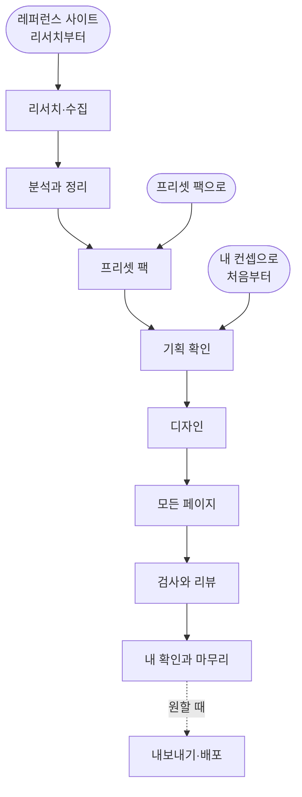

<!-- tutorials/reference/process-and-time.md "시작하는 방법 세 가지"의 흐름도(mermaid). 세 시작점(레퍼런스 리서치, 프리셋 팩, 내 컨셉)이 한 흐름의 어디로 들어가는지 보인다. 단계 이름은 README "프로킷은 이렇게 일합니다"와 홈페이지 워크플로우에 맞춘다 -->

```mermaid
flowchart TD
  RS(["레퍼런스 사이트<br/>리서치부터"]) --> R["리서치·수집"] --> N["분석과 정리"] --> P["프리셋 팩"]
  PK(["프리셋 팩으로"]) --> P
  P --> A["기획 확인"]
  CS(["내 컨셉으로<br/>처음부터"]) --> A
  A --> D["디자인"] --> S["모든 페이지"] --> C["검사와 리뷰"] --> F["내 확인과 마무리"]
  F -.->|원할 때| X["내보내기·배포"]
```
