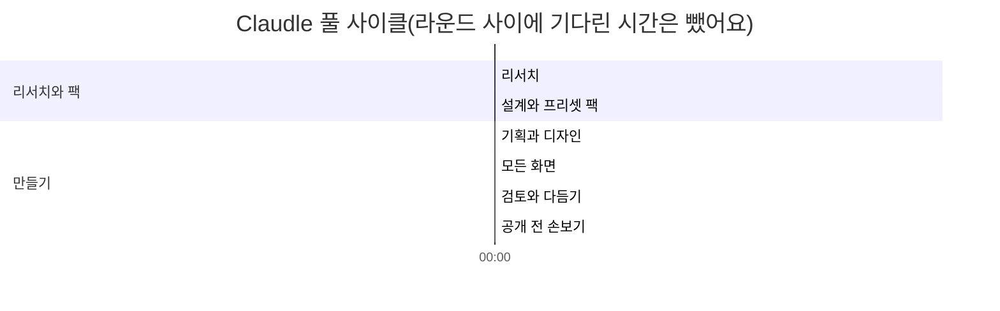

<!-- tutorials/reference/process-and-time.md "예시로 보는 시간"의 Claudle 풀 사이클 gantt(가로축은 시작부터 걸린 시간). 막대 길이는 preset.claudle.prep.*·actual.*의 .min(분). 라운드 사이에 사람을 기다린 시간은 빼고 이어 그린다 -->

```mermaid
gantt
  title Claudle 풀 사이클(라운드 사이에 기다린 시간은 뺐어요)
  dateFormat HH:mm
  axisFormat %H:%M
  todayMarker off
  section 리서치와 팩
  리서치 : research, 00:00, {{v:preset.claudle.prep.research.min}}m
  설계와 프리셋 팩 : pack, after research, {{v:preset.claudle.prep.pack.min}}m
  section 만들기
  기획과 디자인 : plan, after pack, {{v:preset.claudle.actual.plan.min}}m
  모든 화면 : screens, after plan, {{v:preset.claudle.actual.screens.min}}m
  검토와 다듬기 : review, after screens, {{v:preset.claudle.actual.review.min}}m
  공개 전 손보기 : polish, after review, {{v:preset.claudle.actual.polish.min}}m
```
