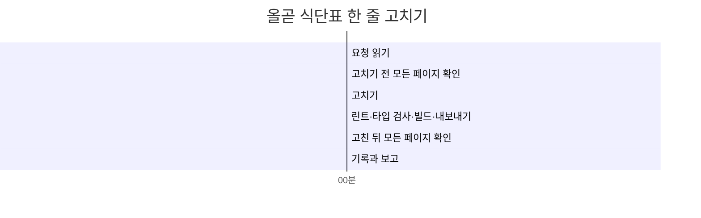

<!-- tutorials/reference/process-and-time.md "고쳐 달라고 할 때마다 더 드는 시간"의 올곧 식단표 한 줄 고치기 gantt(가로축은 시작부터 걸린 분). 막대 길이는 cost.revise.flow.oneSpot.*.min, 색이 다른 막대(active)가 모든 페이지 확인이다 -->

```mermaid
gantt
  title 올곧 식단표 한 줄 고치기
  dateFormat HH:mm
  axisFormat %M분
  todayMarker off
  요청 읽기 : read, 00:00, {{v:cost.revise.flow.oneSpot.read.min}}m
  고치기 전 모든 페이지 확인 : active, before, after read, {{v:cost.revise.flow.oneSpot.before.min}}m
  고치기 : fix, after before, {{v:cost.revise.flow.oneSpot.fix.min}}m
  린트·타입 검사·빌드·내보내기 : build, after fix, {{v:cost.revise.flow.oneSpot.build.min}}m
  고친 뒤 모든 페이지 확인 : active, recheck, after build, {{v:cost.revise.flow.oneSpot.recheck.min}}m
  기록과 보고 : report, after recheck, {{v:cost.revise.flow.oneSpot.report.min}}m
```
