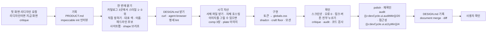

<!-- handbook/design/ui-flow.md 맨 앞 흐름도(mermaid). 화면 점수 기준(audit, 접근성)은 값으로 채운다 -->

```mermaid
flowchart LR
  R["첫 화면·리디자인 요청<br/>리디자인이면 지금 화면 critique"] --> I["기획<br/>PRODUCT.md<br/>impeccable init 인터뷰"]
  I --> Q["한 번에 묻기<br/>카탈로그 3곳에서 스타일 1~3위<br/>직접 정하기 · 대표 색 · 이름·헤드라인 후보<br/>사이트맵 · shape 브리프"]
  Q --> D["DESIGN.md 받기<br/>curl · agent-browser<br/>명세 lint"]
  D --> A["시각 자산<br/>서체 파일 받기 · 자체 호스팅<br/>이미지를 그릴 수 있으면 comp 3장 · plate 이미지"]
  A --> C["구현<br/>토큰 → globals.css<br/>shadcn · craft floor · 모션"]
  C --> V["확인<br/>스크린샷 · 오류 0 · 링크·버튼 전부 누르기<br/>critique · audit · 코드 검사"]
  V --> P["polish · 재확인<br/>audit {{v:devCycle.ui.auditMin}}/20 · 접근성 {{v:devCycle.ui.a11yMin}}/4"]
  P --> M["DESIGN.md 기록<br/>document merge · diff"]
  M --> U["사용자 확인"]
```
