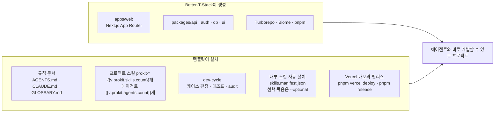

<!-- handbook/templates/what-it-adds.md "뼈대와 그 위에 더하는 것"의 흐름도(mermaid). 스킬 수와 에이전트 수는 값으로 채운다 -->

```mermaid
flowchart LR
  subgraph BTS["Better-T-Stack이 생성"]
    direction TB
    B1["apps/web<br/>Next.js App Router"]
    B2["packages/api · auth · db · ui"]
    B3["Turborepo · Biome · pnpm"]
  end
  subgraph TPL["템플릿이 설치"]
    direction TB
    T1["규칙 문서<br/>AGENTS.md · CLAUDE.md · GLOSSARY.md"]
    T2["프로젝트 스킬 prokit-* {{v:prokit.skills.count}}개<br/>에이전트 {{v:prokit.agents.count}}개"]
    T3["dev-cycle<br/>케이스 판정 · 대조표 · audit"]
    T4["내부 스킬 자동 설치<br/>skills.manifest.json<br/>선택 묶음은 --optional"]
    T5["Vercel 배포와 릴리스<br/>pnpm vercel:deploy · pnpm release"]
  end
  BTS --> APP["에이전트와 바로 개발할 수 있는 프로젝트"]
  TPL --> APP
```
