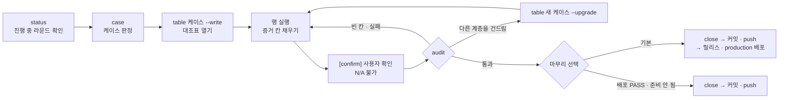

# dev-cycle 라운드
https://prokit-web.vercel.app/docs/concepts/dev-cycle/

> 한눈에: 코드를 바꾸는 작업 하나가 라운드 하나예요. 라운드를 시작하면 할 일과 확인 결과를 적는 표(대조표)를 열고, **모든 칸을 실제로 한 일의 증거로 채워야 끝나요**. 마지막 칸은 사용자가 결과를 직접 보고 확인하는 칸이에요.

## 라운드의 흐름

라운드는 `tasks/todo.md`에 붙는 대조표 하나예요. 모든 행의 증거 칸을 채우고 `pnpm dev-cycle audit`을 통과해야 닫혀요.

| 단계 | 하는 일 |
|---|---|
| 시작 | `pnpm dev-cycle status`로 진행 중인 라운드가 있는지 봐요. 있으면 이어서 하고, 없으면 외부 스킬의 새 버전도 확인해요(원격은 하루 한 번). `AGENTS.md`, `GLOSSARY.md`, `docs/domain/project.md`를 읽고, 요청을 한 문장으로 다시 써 보고, 결과가 달라질 만큼 모호한 데가 있으면 먼저 물어요 |
| 케이스 판정 | 요청이 어떤 종류인지 정해요. 새 기능은 F, 버그는 C이고, 애매하면 더 무거운 쪽을 골라요([케이스 A\~F·H와 대조표](https://prokit-web.vercel.app/docs/concepts/cases/)) |
| 대조표 열기 | `pnpm dev-cycle table <케이스> --write --title "<요청 요약>"`. `--write` 없이 실행하면 미리 보기만 해요 |
| 행 실행 | 위에서부터 순서대로 하고, 끝낸 행마다 증거 칸을 채워요. 행에 적힌 스킬은 실제로 불러 쓰고 증거에 이름을 적어요 |
| 사용자 확인 | 결과를 보여 주고, 사용자가 직접 보거나 써 본 뒤 확인을 받아요([증거와 audit, 사용자 확인](https://prokit-web.vercel.app/docs/concepts/audit-and-confirm/)) |
| 마무리 | audit 통과 → close → 커밋·push → 사용자가 고르면 릴리스와 production 배포 |

## 요청 하나가 흘러가는 모습

"할 일에 마감일 붙이고 지난 건 표시해줘"라는 요청은 화면, API, DB에 모두 걸치는 새 기능이라 케이스 F로 진행돼요.

```mermaid
flowchart LR
  R["할 일에 마감일 붙이고<br/>지난 건 표시해줘"] --> DC["prokit-dev-cycle<br/>케이스 F · 대조표"]
  DC --> SP["스펙 · 테스트 시나리오<br/>용어 기록 GLOSSARY.md"]
  SP --> DB["prokit-db<br/>due_at 마이그레이션<br/>로컬 적용"]
  DB --> API["prokit-api<br/>프로시저 · 격리 테스트"]
  API --> UI["prokit-ui · prokit-web<br/>브리프 → 구현<br/>스크린샷 · 점수"]
  UI --> RF["공통화 · 리팩토링<br/>ponytail-review"]
  RF --> REV["prokit-reviewer<br/>독립 리뷰"]
  REV --> QA["시나리오 QA<br/>오류 예산 0 · 발견 수정"]
  QA --> CF["사용자 확인<br/>[confirm]"]
  CF --> V["prokit-verify<br/>audit 통과 → close"]
  V --> END["커밋 · push<br/>고르면 릴리스 · production 배포"]
```

## 자세히

### 명령

`status`, `case`, `table`, `audit`, `close`, `secrets` 명령과 옵션(`--upgrade`, `--partial`, `--json` 등)은 [명령 모음의 dev-cycle](https://prokit-web.vercel.app/docs/reference/commands/#dev-cycle)에 있어요.

### 라운드를 여는 때

- 고치거나 만들어 달라는 요청이면, 이번에는 원인 분석이나 스펙·계획까지만 하라고 해도 라운드를 열어요. 분석 결과는 대조표 블록 안 메모나 `tasks/evidence/`에 남기고, 행의 증거 칸은 그 행을 실제로 끝냈을 때만 채워요.
- 코드를 바꾸지 않는 질문이나 설명 요청에는 라운드를 열지 않아요.
- 배포 요청도 코드를 바꾸지 않으므로 라운드 없이 `prokit-deploy`가 맡아요.

### 행을 채우는 법

- 첫 증거를 적기 전에 `prokit-verify`를 불러 그 스킬이 정한 검사 고르기와 증거 형식을 따라요.
- 문서는 그 계층을 구현하는 행에서 함께 고쳐요. 새 용어는 `GLOSSARY.md`에, 새 화면·프로시저·테이블은 `docs/domain/project.md`에 넣어요. 그래야 뒤의 리뷰 행이 문서까지 봐요.
- 서버나 DB 테스트가 필요한데 테스트 러너가 없으면 첫 행 앞에 `vitest 도입(최초 1회)` 행을 더하고 그것부터 해요.
- 작업 중 다른 계층을 건드리면 audit이 케이스를 올리라고 알려 줘요. `pnpm dev-cycle table <새 케이스> --write --upgrade`로 올려도 이미 채운 증거와 메모는 남아요.

### 마무리

1. audit으로 남은 문제가 표 끝의 `[confirm]` 행뿐인지 봐요. 다른 행이 남았으면 먼저 끝내요.
2. 사용자 확인을 받아요.
3. audit이 통과해야 해요. `blocked`나 `미실행` 칸이 있으면 "부분 완료"로 보고하고, 사용자가 그대로 닫자고 할 때만 `close --partial`로 닫아요.
4. 배포할 수 있는지 봐요. `pnpm vercel:deploy production --check`는 항상 실행해요. 기본 브랜치, GitHub `origin`, `gh auth status`, 배포 검사(커밋하지 않은 변경과 릴리스 말고)가 모두 갖춰지면 한 번 물어요. 선택지는 "릴리스하고 production 배포 (기본)"와 "커밋·push만 (배포 PASS)"예요. 하나라도 빠지면 묻지 않고 커밋·push까지만 해요.
5. 이 라운드에서 미룬 지적을 `tasks/todo.md`의 백로그로 옮기고 `pnpm dev-cycle close`로 닫아요.
6. 커밋 전에 `pnpm dev-cycle secrets`를 실행하고, 이 라운드에서 바꾼 파일과 `tasks/`만 커밋해요. 제목은 Conventional Commits 접두어(`feat:`, `fix:`, `docs:` …)로 써요. 릴리스 노트의 절이 여기서 정해지고, `!`는 깨지는 변경으로 버전을 올려요. 이어서 push해요.
7. 릴리스와 production 배포를 골랐다면 `prokit-deploy`의 배포 순서를 따라요([Vercel 배포와 되돌리기](https://prokit-web.vercel.app/docs/deploy/vercel/)).

Vercel 프로젝트의 Git 연결이 push마다 배포를 만드는 경우(`Git 자동 배포`)에는 push가 곧 운영 배포라서 커밋만 하고 push하지 않아요. 연결을 끊거나 이 기기에서 확인할 수 있게 한 뒤 push하라고 안내해요.

라운드 끝이 아니면 커밋, push, 릴리스, 배포는 사용자가 요청할 때만 해요.

## 관련 문서

- [케이스 A\~F·H와 대조표](https://prokit-web.vercel.app/docs/concepts/cases/)
- [증거와 audit, 사용자 확인](https://prokit-web.vercel.app/docs/concepts/audit-and-confirm/)
- [구현 에이전트와 리뷰 에이전트](https://prokit-web.vercel.app/docs/concepts/agent-roles/)
- [하네스 엔지니어링](https://prokit-web.vercel.app/docs/concepts/harness/)
- [명령 모음](https://prokit-web.vercel.app/docs/reference/commands/)
