# DESIGN.md
https://prokit-web.vercel.app/docs/design/design-md/

> 한눈에: `DESIGN.md`는 색, 글꼴, 간격 같은 디자인 값을 모아 둔 파일 하나예요. 에이전트는 화면을 만들 때마다 이 파일을 읽어서 새 세션에서도 같은 디자인을 이어 가요. 형식은 Google의 DESIGN.md 스펙을 따르고, 저장할 때마다 검사기로 확인해요.

## 파일의 생김새

[Google DESIGN.md 스펙](https://github.com/google-labs-code/design.md) 형식이에요. 파일 맨 위의 YAML 머리말에 토큰(정확한 값)을, 본문 글에 그 값을 고른 이유를 적어요.

| 스펙의 원칙과 규칙 | 프로킷에서 |
|---|---|
| 머리말의 YAML 토큰은 정확한 값, 본문 글은 그 값의 이유 | 구현할 때 토큰을 `packages/ui`의 `globals.css` shadcn 변수로 옮겨요. 화면 코드에는 색 코드(hex)나 임의 Tailwind 값을 새로 쓰지 않아요 |
| 형용사 목록보다 구체적인 레퍼런스 | "토스 느낌"이라고 말로 전하지 않아요. 카탈로그에서 실제 서비스를 분석한 DESIGN.md 원문을 받아 써요 |
| 의도한 Do's and Don'ts | 원문의 금지 목록을 그대로 두고, 로고, 브랜드 이름, 전용 서체를 쓰지 않는 규칙을 더해요 |
| 정해진 8개 절과 순서 | impeccable `document`가 스펙대로 쓰고, lint가 빠진 절과 순서 오류를 알려 줘요. Refero 원문은 받은 뒤 토큰 머리말을 붙이고 절 순서를 맞춰요 |
| 검사기 `lint` | 저장하거나 고칠 때마다 설치 없이 바로 실행해요(`pnpm dlx @google/design.md lint DESIGN.md`). `missing-primary`가 나오면 대표 색을 더하고, `contrast-ratio`가 나오면 구현에서 WCAG AA 기준으로 맞추고 기록해요 |
| 검사기 `diff` | 카탈로그 파일에 `document` merge를 한 뒤 지워진 토큰(`removed`)이 없는지 봐요 |
| 세션이 바뀌어도 에이전트에게 남는 디자인 맥락 | 새 세션도 `DESIGN.md`를 읽고 같은 디자인 방향을 이어 가요. 덮어쓰기 전에는 사용자에게 물어요 |

## 효과

`DESIGN.md`가 결과를 얼마나 바꾸는지 쟀어요. 앱 화면 서비스 중 4개(고루, 핏슬롯, Uptrail, 하루공부)의 리디자인 전 첫 판을 같은 `PRODUCT.md`와 브리프로 두 번씩 만들었어요.

- A: 카탈로그에서 고른 `DESIGN.md`를 함께 줬어요.
- B: "토스 느낌으로, 대표 색은 #12805C"처럼 브랜드 이름과 대표 색만 말로 줬어요.

두 조건 모두 프로킷의 `prokit-ui` 규칙을 따랐고, 두 번째 화면은 새 세션에서 만들었어요(neon 템플릿, `claude -p`, Opus 5.5, 2026-09-30). 일치율은 두 조건 모두 A가 저장한 `DESIGN.md`의 토큰과 비교했어요.

```mermaid
%%{init: {"themeVariables": {"xyChart": {"plotColorPalette": "#2a78d6, #8c929b"}}}}%%
xychart-beta
  title "DESIGN.md 있음(파랑)과 브랜드 이름·대표 색만(회색) (%)"
  x-axis ["팔레트 일치", "글자 크기 일치", "반경 일치", "두 번째 화면 색 일관성", "블라인드 종합 승률"]
  y-axis "%" 0 --> 100
  bar [99, 100, 100, 95, 75]
  bar [71, 77, 88, 97, 25]
```

| 지표 (서비스 4개, 8화면) | DESIGN.md 있음 | 브랜드 이름·대표 색만 |
|---|---|---|
| 목표 팔레트(색 조합) 일치율 (ΔE2000 3 이내. 눈으로 구별하기 어려운 정도의 색 차이) | 99% | 71% |
| 글자 크기 토큰 일치율 | 100% | 77% |
| 서체가 토큰과 같은 서비스 (서체 토큰이 있는 3개) | 3/3 | 1/3 |
| 블라인드 평가 8회 (어느 쪽이 A인지 숨기고 좌우를 번갈아 배치) | 종합 6승, 충실도 8승 | 종합 2승, 명료성 4승 (A 1승) |
| 두 번째 화면이 첫 화면 색을 따른 비율 | 95% | 97% |
| axe 접근성 위반 | 0 | 2 |
| 서비스당 에이전트 비용과 시간 | $10.34 · 24.1분 | $7.19 · 21.5분 |

같은 서비스(같이살림)의 첫 화면을 나란히 본 [비교 그림](https://github.com/roadkwon-ai/pro-kit/blob/main/docs/assets/design-samples/living-compare.webp)이 있어요. 왼쪽은 `DESIGN.md`가 있는 쪽, 오른쪽은 브랜드 이름과 대표 색만 준 쪽이에요.

- **품질**: `DESIGN.md`가 있으면 고른 디자인 시스템을 거의 그대로 재현해요. B도 깔끔했지만 화면에 쓴 색의 약 29%가 목표 밖 색이었고, 서체와 글자 크기도 에이전트가 새로 정했어요. 블라인드 평가에서는 A가 충실도 8전 8승, 종합 6승 2패였어요. B가 이긴 Uptrail은 상태가 나빠진 서비스를 표 맨 위로 올리는 등 해야 할 일이 더 빨리 읽혔어요.
- **일관성**: 두 번째 화면의 일관성은 차이가 없었어요. B도 새 세션에서 첫 화면 코드를 읽고 따라갔어요. 색 코드를 직접 쓴 곳과 임의 색 클래스는 두 조건 모두 0이었어요(템플릿의 토큰 규칙).
- **효율**: 비용은 A가 44% 더 들었어요. 차이는 추천 단계($0.95, 1분)와 첫 화면의 원문 받기·lint·토큰 옮기기에서 났어요. 두 번째 화면은 비슷했어요($3.05, $2.74). B를 목표에 맞추려면 고치는 라운드가 더 필요하겠지만, 그 비용은 재지 않았어요.
- **한계**: 서비스 4개를 조건마다 한 번씩, 리뷰와 polish 없이 쟀어요. 평가자도 Claude예요. 측정 중 찾은 결함 2건(추천 글이 대표 색을 원문과 다르게 적음, `cn()`이 새 글자 크기 토큰을 지움)은 고쳤어요.

측정 방법, 서비스별 수치, 블라인드 평가 이유, 결함은 [DESIGN.md 효과 측정 보고서](https://github.com/roadkwon-ai/pro-kit/blob/main/docs/reports/2026-09-30-design-md-effect.html)([claude.ai 게시본](https://claude.ai/artifact/2tp355rbvt6QC2dBbfBHzb), 공유받은 계정만 열려요)와 [neon 검증 기록](https://github.com/roadkwon-ai/pro-kit/blob/main/templates/prokit-next-neon/VERIFICATION.md#designmd-효과-측정-2026-09-30-추가)에 있어요.

## 자세히

### 만드는 두 가지 길

- **카탈로그에서 고르기**: 스타일 1~3위 중 하나를 고르면 그 원문을 받아 `DESIGN.md`로 저장하고 lint로 확인해요. getdesign.kr과 awesome-design-md는 `curl`로, Refero는 `agent-browser`로 페이지의 다운로드 버튼을 눌러 받아요. Refero 원문은 Google 스펙 형식이 아니라서(표와 글뿐이고 맨 위의 YAML 토큰 머리말이 없어요) 본문 표의 값을 그대로 옮겨 토큰 머리말을 붙여요. 다른 브랜드 이름(`Similar Brands`)과 새 토큰을 만드는 예시(`Quick Start`)는 지우고, robots.txt가 막은 사이트 검색과 `/api/`는 쓰지 않아요.
- **직접 정하기**: "카탈로그 없이 impeccable로 정하기"를 고르면 시작 전에 `DESIGN.md`를 지어내지 않아요. 만든 화면을 바탕으로 마감 때 impeccable `document`로 기록해요.

### 고칠 때

- 토큰이나 컴포넌트가 바뀌면 impeccable `document`로 갱신해요. 덮어쓰기 전에 사용자에게 물어요.
- 카탈로그에서 들여온 `DESIGN.md`는 덮어쓰지 않고 merge로 바뀐 토큰만 더한 뒤 `diff`로 지워진 토큰이 없는지 봐요.

### 근거 자료

| 자료 | 내용 |
|---|---|
| [DESIGN.md 스펙](https://github.com/google-labs-code/design.md), [PHILOSOPHY](https://github.com/google-labs-code/design.md/blob/main/PHILOSOPHY.md) (Google Labs, 스펙 `alpha`) | 토큰은 정확한 값이고, 글은 그 값의 이유예요. "형용사는 영역을, 구체적인 레퍼런스는 한 점을 가리킨다" |
| [Stitch 발표](https://blog.google/innovation-and-ai/models-and-research/google-labs/stitch-ai-ui-design/) (Google, 2026-03-18) | 디자인 규칙을 다른 디자인·코딩 도구와 주고받는 에이전트용 마크다운 파일로 DESIGN.md를 소개해요 |
| [SpecifyUI](https://arxiv.org/abs/2509.07334) (arXiv 2509.07334, 2025) | 구조화한 스펙으로 만든 UI가 프롬프트만 쓴 경우보다 레퍼런스의 의도를 더 충실히 담았어요. 디자이너 16명 사용자 연구 |
| [Measuring the value of design systems](https://www.figma.com/blog/measuring-the-value-of-design-systems/) (Figma) | 디자인 시스템이 있을 때 사람 디자이너가 작업을 34% 빨리 끝냈어요. Figma는 이 값을 실제 환경의 최대치로 봐요 |
| [The Value of Design Systems Study](https://sparkbox.com/foundry/design_system_roi_impact_of_design_systems_business_value_carbon_design_system) (Sparkbox) | 개발자 8명이 IBM Carbon으로 폼 페이지를 47% 빨리 만들었고, 8명 중 5명의 시각 일관성이 나아졌어요 |
| [neon 검증 기록](https://github.com/roadkwon-ai/pro-kit/blob/main/templates/prokit-next-neon/VERIFICATION.md#google-designmd-명세-검토-2026-09-30-추가) | 스펙 검토, 카탈로그 lint 통계(getdesign.kr 22개, getdesign.md 76개), lint·diff를 넣은 이유 |

## 관련 문서

- [UI/UX 흐름](https://prokit-web.vercel.app/docs/design/ui-flow/)
- [검증 결과](https://prokit-web.vercel.app/docs/reference/verification/)
- [처음 보는 용어](https://prokit-web.vercel.app/tutorials/reference/glossary/)
