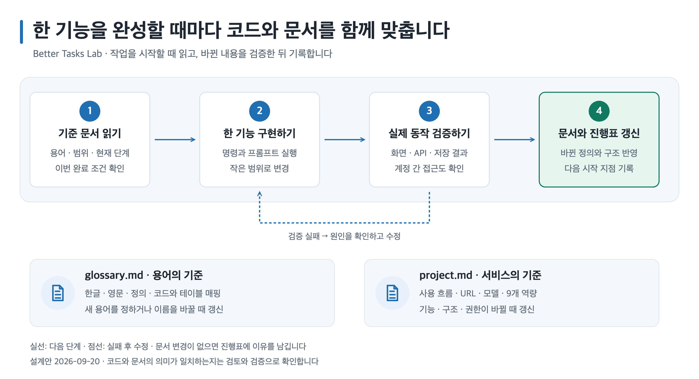

# Better-T-Stack Next.js 데모앱 튜토리얼 설계안

작성일: 2026-09-20  
상태: 사용자 승인 완료. 선택 ①과 사용자가 한 단계씩 직접 커맨드·프롬프트·스킬을 실행하는 학습 방식을 확인한 뒤 승인받았다.  
대상 산출물: 한국어 튜토리얼, 프로젝트 문서 템플릿, 기준 코드, 검증 기록, 도식.  
관련 문서: [스킬·플러그인 검토 보고서](../../research/2026-09-20-better-t-stack-tooling-review.md)

## 1. 만들려는 결과

Better-T-Stack을 처음 사용하는 독자가 개발 환경 설치부터 시작해 **로그인·대시보드·개인 Todo·AI 채팅이 동작하는 Next.js 앱**을 완성한다. 가칭은 **Better Tasks Lab**, 실습 디렉터리 이름은 `better-tasks-lab`이다.

설명에는 각 도구가 필요한 이유를 포함한다. 독자는 터미널 명령과 에이전트 프롬프트를 순서대로 복사하면서 진행할 수 있고, 매 단계의 실제 동작을 확인한 뒤 다음 장으로 넘어간다. AI가 다른 코드를 만들거나 명령이 실패해도 기준 코드와 복구 절차를 통해 현재 단계로 돌아올 수 있어야 한다.

사용자가 확정한 사항:

- Next.js 기반으로 공개 Better-T-Stack 데모의 기능을 학습한다.
- 초보자에게 강의하듯 자세한 한국어 설명을 제공한다.
- 설명, command, 프롬프트, skill 사용을 실행 순서에 맞춘다.
- Skillstead를 활용한 도식을 포함한다.
- Vercel·Supabase 스킬, 내부 fullstack-kit, Karpathy 관련 지침, 지정된 CLAUDE.md를 비교한다.
- `glossary.md`와 `project.md`를 만들고 개발 내내 참고·갱신한다.

이 설계에서 제안하는 기본값:

- 가상 계정과 학습용 데이터만 사용한다.
- macOS·Linux·Windows WSL의 Bash/Zsh를 본문 환경으로 삼는다. PowerShell 직접 실행은 별도 검증 전까지 지원 대상으로 표시하지 않는다.
- Codex와 Claude Code 중 하나로 완주할 수 있게 한다. 명령 문법과 설치 경로가 다른 부분만 별도 블록을 제공한다.
- 기본 과정은 로컬에서 완주한다. 외부 계정·키가 필요한 실제 AI 호출과 배포에는 별도의 완료 기준을 둔다.

## 2. 세 가지 작성 방식 비교

| 방식 | 학습 경험 | 장점 | 한계 | 결정 |
| --- | --- | --- | --- | --- |
| 단계별 직접 구축 + 기준 코드 | 빈 뼈대에 기능을 하나씩 연결 | 요청·인증·DB 흐름을 이해하고 실패 지점을 좁히기 쉽다 | 장 수와 검증 작업이 늘어난다 | **본문으로 추천** |
| Todo·AI 예제 생성 후 해설 | 생성된 기능을 실행하고 수정 | 첫 화면까지 빠르게 도달한다 | 처음부터 구축하는 연습이 줄어든다 | 비교용 부록 |
| 전체 플러그인 키트와 다중 에이전트로 구축 | 자동화된 개발·검수 절차를 경험 | 반복 프로젝트에서 재사용하기 좋다 | 앱보다 도구 설정을 먼저 배워야 하고 기존 규칙과 충돌할 수 있다 | 심화 부록 |

본문은 첫 번째 방식을 사용한다. 프롬프트만 제공하지 않고 **기준 파일·예상 결과·검증 절차**를 함께 제공한다. 생성 예제 전체를 처음부터 넣는 방식은 같은 본문에서 섞어 실행하지 않는다.

## 3. 추천 기술 구성

아래는 구현 전의 추천 조합이며 설치·실행 성공을 주장하는 표가 아니다. 문서 제작 단계에서 고정된 생성기와 실제 생성물로 검증한다.

| 영역 | 추천 구성 | 학습 목적·선택 이유 |
| --- | --- | --- |
| 프로젝트 생성 | Better-T-Stack | 웹·서버·공유 패키지가 연결된 출발점을 만든다 |
| 화면 | Next.js App Router, TypeScript | 사용자가 지정한 프레임워크로 페이지와 클라이언트 경계를 익힌다 |
| 스타일 | 생성된 Tailwind CSS·shadcn/ui 구성 | 새로운 UI 도구를 추가하지 않고 시작한다 |
| API 서버 | Hono, Node.js | 웹과 서버의 역할, 요청 주소, 쿠키·CORS를 명시적으로 학습한다 |
| API 계약 | tRPC, TanStack Query | 입력 검증·타입 공유·조회 갱신을 익힌다 |
| 인증 | Better Auth | 생성기의 인증 흐름을 유지하며 세션과 소유권을 구분한다 |
| 데이터베이스 | PostgreSQL, 로컬 Docker | 처음부터 동일한 SQL 계열로 학습하고 호스팅 DB로 확장한다 |
| ORM | Drizzle | TypeScript 스키마와 API 코드를 함께 읽는 과정을 구성한다 |
| AI | AI SDK와 Google provider | 원본 데모와 연결되는 스트리밍 학습을 제공한다 |
| 패키지·작업 실행 | pnpm, 생성기의 Turborepo 구성 | 웹·서버·공유 패키지의 명령 실행 관계를 학습한다 |
| 검사 | 생성된 린터·타입 검사·빌드 + 필요한 API·브라우저 검사 | 실제 scripts와 사용자 동작을 기준으로 완료를 판정한다 |

공개 데모와 달라지는 점은 명시한다. 원본은 TanStack Router·Bun·Prisma 기반이며, 이 과정은 **기능을 참고한 Next.js 학습용 재구성**이다. 원본 소스를 그대로 복사해 같은 앱을 재현한다고 표현하지 않는다.

Prisma도 유효한 선택이다. 여기서는 Drizzle 스키마를 TypeScript와 함께 읽는 교육 구성을 추천한다. 한 과정에 두 ORM 명령을 섞지 않는다. Hono를 분리하면 포트·쿠키 설명이 늘어나지만, Better-T-Stack 모노레포의 연결 구조를 배우는 데 의미가 있다. 단일 Next.js 서버 구성은 비교 설명만 제공한다.

Supabase는 선택 확장 과정의 PostgreSQL 호스팅 후보로 다룬다. DB를 Supabase로 옮긴다는 이유만으로 Better Auth를 Supabase Auth로 교체하지 않는다. 서버의 DB 연결 권한과 소유권 검사를 별도로 설명하며, Supabase를 사용했다는 이유로 RLS 보호가 자동 적용된다고 서술하지 않는다.

## 4. 앱의 기능과 범위

### 서비스 한 줄 요약

로그인한 사용자가 자신의 할 일을 관리하고 AI와 대화하면서 풀스택 개발 흐름을 연습하는 웹 앱.

타깃은 Better-T-Stack 첫 사용자이며, 핵심 가치는 작은 기능을 끝까지 연결하고 검증하는 경험이다. 실제 고객 서비스 운영을 완료했다고 주장하지 않는다.

### 9개 capability

여기서 capability는 독립적으로 완료 여부를 확인할 수 있는 기능·기술 역량 묶음이다. 아래 9개는 본 강의의 분류이며 원본 프로젝트가 선언한 공식 목록이 아니다.

| ID | 역량 | 기대 동작 | 핵심 완료 기준 |
| --- | --- | --- | --- |
| C01 | 웹·API 연결 | 홈에서 서버 연결 상태 확인 | API 중지 시 실패 상태, 복구 후 정상 상태가 표시된다 |
| C02 | 계정 인증 | 가입·로그인·로그아웃 | 정상·잘못된 입력을 구분하고 로그아웃 후 세션을 사용할 수 없다 |
| C03 | 보호된 화면·API | 로그인한 사용자만 접근 | URL 직접 접근과 API 직접 호출 모두 검사한다 |
| C04 | 개인 Todo 관리 | 목록·등록·수정·완료 변경·삭제 | 새로고침과 서버 재시작 뒤에도 저장 결과가 유지된다 |
| C05 | 데이터 소유권 | 본인의 Todo만 접근 | A·B 두 계정 간 조회·수정·삭제가 차단된다 |
| C06 | 개인 대시보드 | 전체·완료·남은 Todo 집계 | 실제 사용자 데이터와 수치가 일치하고 변경 후 갱신된다 |
| C07 | AI 스트리밍 | 응답을 점진적으로 표시하고 중단 | 키를 서버에 보관하며 전송 중·완료·중단 상태를 구분한다 |
| C08 | AI 접근·사용량·오류 제어 | 인증·입력 제한·호출 제한·실패 안내 | 미로그인·한도 초과 요청은 provider 호출 전에 거절한다 |
| C09 | 재현·검증·실행 환경 전환 | 고정 의존성으로 재실행하고 환경별 주소 확인 | 타입·린트·빌드·API·브라우저 결과와 미검증 범위를 기록한다 |

AI 대화의 영구 저장은 심화 과목으로 둔다. 본 과정에서는 화면을 새로 열면 대화가 사라질 수 있다는 동작을 UI와 문서에 명시한다. 대화 내역을 DB에 저장한 것처럼 설명하지 않는다.

관리자 계정과 관리자 UI, 결제·배송·사진 요청·다국어 기능은 본 과정 범위 밖이다. `project.md`에는 **관리자 플로우 미구현**을 명시하고, 개발자의 환경 설정·로그 확인 절차를 별도의 운영 흐름으로 표현한다. 개인 대시보드를 관리자 대시보드라고 부르지 않는다.

## 5. URL·데이터·요청 설계

예정 화면은 `/`, `/login`, `/dashboard`, `/todos`, `/ai`다. 회원가입 UI가 `/login` 내부 전환인지 별도 경로인지는 고정 버전의 생성물을 확인하고 문서와 기준 코드를 함께 맞춘다.

API는 인증용 `/api/auth/*`, tRPC용 `/trpc/*`, 스트리밍용 `POST /ai`를 설계 기준으로 삼는다. `/ai` 화면과 `POST /ai` 서버 요청은 호스트·포트가 다르다는 점을 예시 주소로 설명한다. 최종 경로는 생성물 검증 뒤 프로젝트 개관에 확정 기록한다.

데이터 모델 제안:

| 논리 모델 | 물리 테이블·매핑 원칙 | 주요 내용 |
| --- | --- | --- |
| 사용자·세션·계정·인증 검증 | Better Auth 생성 스키마의 실제 이름 유지 | 인증 테이블을 추측해서 새로 만들지 않는다 |
| Todo | `todos` | `id`, `user_id`, `title`, `completed`, 생성·수정 시각 |
| AI 사용량 | `ai_usage` | 사용자, UTC 날짜, 예약된 호출 수; 사용자·날짜 유일성 |

도메인 신규 테이블은 snake_case, TypeScript 필드는 camelCase를 쓰고 용어집에 대응을 기록한다. 실제 타입과 인덱스는 DB 장에서 확정한다. 인증 라이브러리가 생성한 이름까지 무조건 바꾸지 않는다.

Todo 요청은 `화면 → tRPC → 세션 검사 → 입력·소유권 검사 → Drizzle → PostgreSQL → 화면 갱신`을 따른다. 소유자 ID는 요청 본문의 값을 신뢰하지 않고 서버 세션에서 결정한다. 조회뿐 아니라 수정·삭제 조건에도 사용자 범위를 포함한다.

AI 요청은 `화면 → 서버 세션·입력 검사 → DB 호출 한도 예약 → provider → 스트림 표시`를 따른다. 서버 메모리 카운터만으로 다중 인스턴스 공통 한도가 생긴다고 설명하지 않는다. 기본 제안값은 사용자당 UTC 하루 20회, 입력 메시지당 2,000자, 전송 대화 최대 20개 메시지, 출력 최대 1,000토큰이다. 이는 학습용 설정값이며 provider 가격이나 과금 상한을 보장하지 않는다.

사용량은 DB에서 원자적으로 예약하고 거절된 요청은 provider를 호출하지 않는다. provider 실패·중단도 예약 1회를 소비하는 단순 정책으로 설명한다. 실패 후 자동 재시도는 기본으로 하지 않는다. 실제 SDK의 출력 제한 옵션과 스트림 종료 방식은 고정 버전 문서·코드로 검증한다.

## 6. 강의 목차와 단계별 완료 기준

최종 본문은 `boilerplate/better-t-stack/nextjs-demo-tutorial/`에 새로 작성한다. 기존 학원 과정과 공개 데모 자료는 참고 자료로 연결한다.

| 장 | 독자가 하는 일 | 확인하고 넘어갈 결과 |
| --- | --- | --- |
| 00. 완성 앱과 학습 지도 | 만들 것·미룰 것·9개 역량 확인 | 자신의 완료 목표를 설명할 수 있다 |
| 01. 개발 도구 준비 | 터미널·Git·Node·pnpm·Docker·에이전트 준비 | 버전과 실행 상태를 확인하고 명령 입력 위치를 구분한다 |
| 02. 프로젝트 생성 | 고정 CLI로 빈 뼈대 생성·의존성 설치 | 설정 기록과 폴더·scripts가 본문 기준과 맞는다 |
| 03. 첫 실행과 DB | 환경변수·로컬 DB·웹·API 실행 | DB 연결과 API 상태를 실제로 확인한다 |
| 04. 프로젝트 문서와 스킬 | 용어집·개관·규칙·진행표 설치 | 에이전트가 문서를 읽고 동일한 범위를 설명한다 |
| 05. 인증 이해와 검증 | 가입·로그인·로그아웃·보호 경로 | 미로그인 직접 호출을 거절한다 |
| 06. Todo 화면 | 샘플 데이터로 입력·상태·오류 화면 구성 | 샘플 표시가 있고 저장된 것처럼 오해하지 않는다 |
| 07. Todo DB·API | 스키마·마이그레이션·검증·소유권 | 두 계정의 CRUD 격리 검사가 통과한다 |
| 08. 실제 연결·대시보드 | mock 교체·조회 갱신·실제 집계 | 새로고침 후 데이터와 집계가 일치한다 |
| 09. AI 화면·모의 스트림 | provider 없이 전송·중단·실패 UI 검증 | 유료 키 없이도 화면 상태를 검사한다 |
| 10. 실제 AI와 보호 장치 | provider 연결·인증·입력·호출 한도 | 모의 provider 보안 검사와 실제 호출 결과를 구분한다 |
| 11. 통합 검증·복구 | 타입·린트·빌드·API·브라우저·문서 대조 | 검사 결과를 남기고 실패를 해결한다 |
| 12. 배포·환경 확장 | 호스팅 PostgreSQL·웹·서버 환경 설정 | 배포한 경우 실제 URL에서 인증·Todo·AI 흐름을 확인한다 |
| 13. 작은 기능으로 반복 | Todo 필터 추가로 개발 주기 재사용 | 문서 갱신과 회귀 검사를 포함해 한 기능을 완성한다 |
| 부록 | 전체 키트, 생성 예제, AI 대화 저장, 도구별 설치 차이 | 본문 실행 순서를 바꾸지 않고 별도 실습한다 |

키가 없는 독자는 09장의 모의 provider 검증까지 완료할 수 있다. 10장의 실제 provider 호출은 미완료로 기록한다. 배포하지 않은 독자에게는 로컬 완료만 인정하며, 배포 검증 완료라고 표시하지 않는다.

### 모든 실습 절의 공통 형식

1. 이 단계에서 할 일과 필요한 이유.
2. 시작 조건: 이전 장 완료 여부, 실행 중이어야 할 프로세스, 필요한 계정.
3. 입력 위치: OS 터미널 / Codex 대화창 / Claude Code 대화창 / 브라우저.
4. 현재 디렉터리와 복사용 명령. 오래된 개인 절대 경로를 넣지 않는다.
5. 명령이 바꾸는 파일·환경과 예상 출력. 비밀값은 사용자가 넣을 위치를 명시한다.
6. 한 단계만 처리하는 프롬프트와 사용할 스킬. 설치 여부를 확인하지 않은 호출은 넣지 않는다.
7. 기준 코드·파일 변경 목록과 동작 해설.
8. 성공 판정: 실제 화면·응답·데이터·테스트로 확인한다.
9. 실패 유형별 원인 확인과 복구 명령. 무조건 재설치하거나 DB를 지우는 절차를 기본으로 두지 않는다.
10. `glossary.md`·`project.md`·진행표를 갱신하고 다음 장 진입 조건을 확인한다.

계정 로그인, 비밀키 발급, 외부 콘솔의 값 선택처럼 사용자가 직접 해야 하는 부분은 미리 표시한다. 이를 포함해 모든 단계가 무조건 무입력 복사만으로 끝난다고 약속하지 않는다.

## 7. 필수 문서의 구조와 갱신 계약

### `docs/domain/glossary.md`

프로젝트 전반에서 사용하는 도메인 용어를 정의한다. 코드, 문서, 커뮤니케이션에서 같은 용어를 사용한다. 각 표는 `한글 용어 | 영문 대응 | 정의 | 코드·테이블·경로 매핑 | 적용 상태`로 구성한다.

사용자가 나열한 항목은 총 9개였다. 선택 ①에 맞춰 아래 9개 범주로 재구성하고, 원래 예시에서 제외한 범주를 기록한다.

| 범주 | 포함할 대표 용어 |
| --- | --- |
| 액터 | 방문자, 사용자, 개발자·운영자 |
| 핵심 도메인 | 할 일(Todo), 완료, 남은 할 일 |
| AI 대화 | 대화, 메시지, 응답, 스트리밍, 중단 |
| 사용자 흐름 | 가입, 로그인, 첫 Todo, 첫 AI 요청 |
| 인증·권한 | 세션, 소유권, 보호된 API |
| 개인 대시보드 | 전체 수, 완료 수, 남은 수 |
| 데이터·저장 | 테이블, 외래 키, 마이그레이션, 샘플 데이터 |
| 운영·제한 | 호출 한도, UTC 기준일, 환경변수, 검증 기록 |
| 기술 용어 | CLI, ORM, tRPC, mock, skill, plugin, agent |

주문·결제·배송·사진·다국어는 현재 범위 밖으로 표시한다. `photo_requests`·`order_items` 같은 실제로 없는 테이블의 매핑을 만들지 않는다. 관리자 대시보드는 개인 대시보드와 구분한다. 예정 매핑은 구현 전이라는 상태를 표시하고 스키마가 생기면 실제 이름과 대조한다.

### `docs/domain/project.md`

다음 순서로 읽으면 새 작업자가 앱의 범위를 이해할 수 있도록 한다.

1. 서비스 한 줄 요약, 타깃 사용자, 핵심 가치.
2. 현재 구현 단계와 완료·미완료 역량.
3. 방문자·로그인 사용자 플로우.
4. 관리자 기능 제외 선언과 개발자·운영자 흐름.
5. 기술 스택 매트릭스와 버전 기록 위치.
6. 웹·API URL 구조, 로컬·배포 주소의 차이.
7. 데이터 모델과 용어집·스키마의 연결.
8. C01~C09 역량·관련 장·검증 근거.
9. 설계 원칙, 실패 처리·소유권 정책.
10. MVP 범위 밖 항목과 다음 확장 후보.

### 언제 무엇을 갱신하나

[편집 가능한 SVG](../../assets/nextjs-tutorial-document-cycle.svg)

| 시점 | 수행할 일 | 남길 근거 |
| --- | --- | --- |
| 작업 시작 | 두 문서와 현재 단계의 완료 조건 읽기 | 진행표에 이번 작업 범위와 관련 capability 기록 |
| 새 용어·이름 결정 | 용어집의 정의·영문·매핑 갱신 | 실제 코드 이름 또는 예정 상태 |
| 경로·모델·권한·기능 변경 | 프로젝트 개관과 관련 도식 갱신 | 변경한 URL·스키마·역량 |
| 검증 후 | 코드·문서·테스트 간 일치 확인 | 실행 결과와 미검증 항목 |
| 작업 종료·재개 준비 | 진행표에 완료 단계와 다음 행동 기록 | 두 문서의 변경 내용 또는 변경 불필요 사유 |

모든 파일에 형식적인 수정 날짜만 바꾸지는 않는다. 변경이 없으면 그 이유를 진행표에 남긴다. 스킬이 두 문서를 읽도록 요구하는 것과, 코드·문서의 의미가 항상 일치함을 자동 보장하는 것은 구분한다.

## 8. 스킬·플러그인·에이전트 구성

프로젝트 규칙의 정본은 `AGENTS.md`로 두고 `CLAUDE.md`는 공통 규칙 참조와 Claude 전용 사용법만 둔다. 상세 도메인 지식은 필수 문서 두 개에 둔다. 같은 지침을 세 파일에 복사해 따로 유지하지 않는다.

| 구성 | 본문 적용 | 책임 |
| --- | --- | --- |
| 프로젝트 규칙 | 필수 | 읽을 문서, 현재 스택, 변경 범위, 검증·갱신 계약 |
| Vercel React 모범 사례 | 추천 | 기존 tRPC·Query 구성 안에서 React·Next.js 구현 검토 |
| Web Design Guidelines | UI 검수 시 | 키보드·레이블·상태·반응형 점검 |
| PostgreSQL 모범 사례 | DB 장부터 | 테이블·인덱스·쿼리 검토 |
| Supabase 스킬 | Supabase 확장 장에서 | 선택한 Supabase 제품의 사용법 |
| Skillstead 도식 | 문서 제작·구조 변경 때 | SVG 원본, PNG 렌더, 시각 검증 |
| 프로젝트 전용 개발 주기 스킬 | 기본 루프를 배운 뒤 | 문서 읽기 → 한 기능 → 검증 → 문서 갱신 → 기록 |
| 전체 fullstack-kit | 심화 부록 | 설치·동기화·감사 도구의 효과와 비용 비교 |

기본은 구현 담당 에이전트 하나다. 독립적인 조사나 검토가 생길 때만 별도 에이전트를 활용한다. 리뷰 담당은 발견과 근거를 보고하고, 변경 통합과 최종 검증은 구현 담당이 책임진다. 모든 단계에 다중 에이전트를 의무화하지 않는다.

Karpathy 관련 자료에서 가정 공개·단순성·국소 변경·검증 가능한 목표를 차용한다. 지정된 Gist에서는 검증과 교훈의 규칙 반영을 차용한다. 기존 `AGENTS.md`·`CLAUDE.md`를 원격 파일로 덮어쓰는 설치 예시는 사용하지 않는다.

프로젝트 전용 스킬을 여러 프로젝트에서 반복 사용하게 됐을 때 플러그인으로 묶는 과정을 부록에 둔다. 학습 앱 제작을 위해 범용 플러그인 저장소부터 새로 구축하지 않는다.

## 9. 재현성과 검증

기존 자료에 기록된 BTS CLI `3.44.0`을 첫 검증 후보로 삼는다. 이를 현재 최신이라고 소개하지 않는다. 문서 제작 단계에서 CLI help·스키마·생성 결과를 확인하고 사용할 정확한 버전을 확정한다. 최신 웹 문서의 옵션을 과거 고정 버전에 검증 없이 섞지 않는다.

최종 기록에는 생성기, Node, 패키지 관리자, 직접 의존성, lockfile, 주요 스킬 출처·리비전, 검증 날짜를 포함한다. 생성기 버전 고정만으로 모든 의존성이 고정되었다고 주장하지 않는다.

| 검증층 | 수행 내용 | 증명하지 못하는 것 |
| --- | --- | --- |
| 문서 정적 검사 | 상대 링크·앵커·코드 펜스·셸 구문·명령 위치 검사 | 실제 외부 서비스 성공 |
| 생성·설치 | 새 실습 폴더에서 생성·설치·scripts 확인 | 모든 사용자 환경의 호환성 |
| 타입·린트·빌드 | 실제 생성된 프로젝트 명령 실행 | 인증·권한·브라우저 동작 전체 |
| API | 인증·Todo CRUD·두 계정 격리·AI 한도·실패 검증 | 실제 provider의 응답 품질 |
| 브라우저 | 회원가입→Todo→집계→AI UI·중단·오류 확인 | 모든 브라우저·기기 지원 |
| 실제 AI·배포 | 계정·키가 있을 때 실제 환경에서 확인 | 모의 검사만으로 대체할 수 없는 영역 |
| 도식 | SVG 검사·2배 PNG 렌더·한글·연결선·잘림 확인 | 시스템 구현의 정확성 |

기준 코드가 통과한 것, 튜토리얼 명령을 실제 실행한 것, 프롬프트로 새 세션에서 재현한 것을 각각 기록한다. 프롬프트는 비결정적이므로 기준 코드와 결과 비교 방법을 제공하고 항상 같은 소스가 생성된다고 보장하지 않는다.

## 10. 산출물과 이번 설계 단계의 종료 조건

최종 튜토리얼에는 진입 README, 00~13장, 문제 해결·프롬프트 지도, 스킬 비교 보고서, `AGENTS.md`·`CLAUDE.md`·필수 문서·진행표 템플릿, 단계별 기준 코드, 검증 기록, SVG·PNG 자산을 포함한다. 기준 코드의 실제 제공 방식과 생성·검증 명령은 후속 구현 계획에서 구체화한다.

현재 단계에서는 설계안·검토 보고서·문서 갱신 도식을 작성했다. 앱 생성·의존성 설치·튜토리얼 본문 구현·실제 AI 호출·배포는 아직 수행하지 않았다.

승인 범위는 **추천 스택**, **로컬 기본 과정과 외부 연동 과정의 구분**, **단계별 구축과 경량 개발 주기**, **필수 문서의 구성·갱신 방식**이다. 후속 [상세 제작·검증 계획](../plans/2026-09-20-better-t-stack-nextjs-tutorial.md)에서 실행 순서와 산출물을 구체화한다.

### 이번 산출물의 검증 기록

- 설계안·검토 보고서 2개 문서의 로컬 링크 10개, 코드 펜스, 셸 블록 1개의 `bash -n` 구문 검사 통과.
- 미완성 자리표시자와 범위·기술 구성·완료 주장 간 모순을 자체 검토했다.
- 도식: 설치된 `svg-infographic` 0.8.3 사용. SVG 검사 오류 0개·경고 0개, PNG 2800×1520으로 2배 출력 확인.
- 렌더러: `/Applications/Google Chrome.app/Contents/MacOS/Google Chrome`, Google Chrome `153.0.8010.50`, Node `v24.19.0`.
- 렌더 명령: 저장소 작업 폴더에서 `node /Users/freelife/.codex/skills/svg-infographic/scripts/render.mjs docs/assets/nextjs-tutorial-document-cycle.svg` 실행. 이 경로는 작성 환경의 기록이며 독자용 설치 명령이 아니다.
- 전체 크기와 원본 해상도에서 한글, 카드 여백, 화살표, 피드백 경로를 시각 확인했다.
- 현재 작업 폴더는 Git 저장소가 아니므로 커밋은 생성하지 않았다. 문서·도식 파일은 로컬에 저장했다.

## 근거 자료

- [Better-T-Stack 옵션](https://www.better-t-stack.dev/docs/cli/options)
- [Better-T-Stack 호환성](https://www.better-t-stack.dev/docs/cli/compatibility)
- [Better-T-Stack 에이전트 연동](https://www.better-t-stack.dev/docs/cli/agent-workflows)
- [Skillstead](https://github.com/kyungseo/skillstead)
