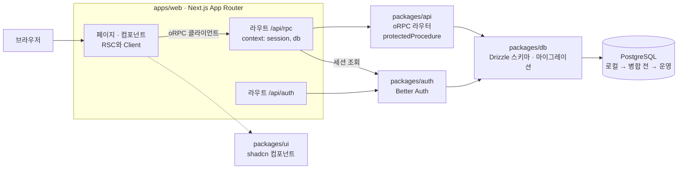

# 앱 구조
https://prokit-web.vercel.app/docs/templates/app-structure/

> 한눈에: 프로킷으로 만든 앱은 웹 앱 하나와 여럿이 함께 쓰는 부품 묶음(패키지)으로 나뉘어요. 화면이 서버에 요청을 보내면 서버가 로그인 정보를 확인한 뒤 DB를 읽고 써요. 다른 사람의 데이터는 로그인한 사용자 정보로 걸러 내요.

## 요청이 오가는 길

화면은 oRPC 클라이언트로 `/api/rpc`에 요청을 보내요. 라우트 핸들러는 요청마다 Better Auth 세션을 읽어 oRPC 라우터가 쓸 context(`session`, `db`)를 만들어요. 사용자 데이터를 다루는 프로시저는 `protectedProcedure`로 로그인 세션을 요구하고, 데이터 주인은 세션의 사용자 ID로 확인해요.

| 위치 | 하는 일 | 맡는 prokit 스킬 |
|---|---|---|
| `apps/web` | Next.js App Router 화면과 라우트 핸들러(`/api/rpc`, `/api/auth`) | `prokit-web`, `prokit-ui` |
| `packages/ui` | 화면에서 함께 쓰는 shadcn 컴포넌트 | `prokit-ui` |
| `packages/api` | oRPC 라우터와 프로시저. 로그인이 필요한 프로시저는 `protectedProcedure` | `prokit-api` |
| `packages/auth` | Better Auth 설정 | `prokit-api` |
| `packages/db` | Drizzle 스키마와 마이그레이션 | `prokit-db` |

## 자세히

- **데이터 주인 확인**: 데이터 주인은 로그인 세션에서만 알아내요. 입력으로 받은 사용자 ID를 믿지 않고, 계정 두 개로 서로의 데이터에 접근할 수 없는지 테스트해요(2계정 격리 테스트, 케이스 D).
- **DB는 마이그레이션으로만 바꿔요**: 스키마를 고치면 마이그레이션 파일을 만들어 로컬 → 병합 전 → 운영 순서로 적용해요. 데이터를 잃을 수 있는 변경(컬럼 삭제, 이름 변경)은 두 번에 나눠요.
- **같은 드라이버**: 두 템플릿 모두 일반 Postgres 드라이버(`pg`)를 써서 로컬 DB와 원격 DB(Neon, Supabase)에 같은 코드로 붙어요.
- **로그인 경로는 보안 리뷰**: `packages/auth`, `apps/web/src/app/api/auth/` 같은 인증 경로를 건드리면 대조표에 보안 리뷰 행이 자동으로 붙어요([케이스 A\~F·H와 대조표](https://prokit-web.vercel.app/docs/concepts/cases/)).
- **Next.js 문서**: 에이전트는 설치된 Next.js 판의 문서(`node_modules/next/dist/docs`)를 먼저 읽어요. 학습한 옛 API를 그대로 쓰는 일을 줄이려는 거예요.

## 관련 문서

- [템플릿이 더하는 것](https://prokit-web.vercel.app/docs/templates/what-it-adds/)
- [prokit 스킬 8개](https://prokit-web.vercel.app/docs/skills/prokit-skills/)
- [설치된 프로젝트의 폴더 구조](https://prokit-web.vercel.app/docs/reference/project-structure/)
- [케이스 A\~F·H와 대조표](https://prokit-web.vercel.app/docs/concepts/cases/)
