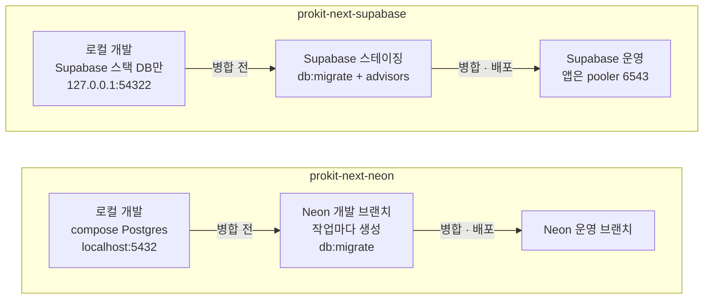

# 템플릿 고르기
https://prokit-web.vercel.app/docs/templates/choose/

> 한눈에: 템플릿은 운영 DB를 어디에 둘지로 골라요. 기능을 바꿀 때마다 DB의 테스트용 복사본을 만들어 확인하고 싶으면 Neon, 이미 Supabase를 쓰고 있으면 Supabase예요. 앱 코드 구성은 두 템플릿이 같아요.

## 두 템플릿 한눈에 보기

| | prokit-next-neon | prokit-next-supabase |
|---|---|---|
| BTS 생성 옵션 | `--db-setup docker` | `--db-setup supabase --manual-db` |
| 로컬 개발 DB | compose Postgres 컨테이너 (`localhost:5432`) | Supabase 로컬 스택 중 DB만 (`127.0.0.1:54322`) |
| 병합 전 확인 | 작업마다 Neon 개발 브랜치를 만들어 `db:migrate` | Supabase 스테이징 프로젝트에 `db:migrate`와 `supabase db advisors` |
| 운영 | Neon 기본 브랜치 | Supabase (앱은 transaction pooler 6543, 마이그레이션은 5432) |
| 추가 규칙 | 없음 | `public`의 모든 테이블에 정책 없는 RLS. Supabase Auth, supabase-js, Data API는 쓰지 않아요 |
| `db:push` | 로컬 실험용으로만 허용 | 로컬에서도 금지 (Supabase 내부 스키마 삭제를 제안하고 인증 테이블 RLS를 꺼요) |
| Vercel 배포 DB | develop: Neon `develop` 브랜치, production: 운영 브랜치 (앱은 pooled 주소) | develop: 스테이징 프로젝트, production: 운영 프로젝트 (앱은 transaction pooler 6543) |
| 필요한 CLI | Podman 또는 Docker, compose provider. 원격 DB에는 Neon CLI, 배포에는 Vercel CLI | Supabase CLI 2.117 이상, Podman 또는 Docker. 배포에는 Vercel CLI |
| 공식 도메인 스킬 | 28개 (neon 4개, Vercel 배포 3개 포함) | 25개 (`supabase`, `supabase-postgres-best-practices`, Vercel 배포 3개 포함) |
| 선택 스킬 (`--optional`) | `ops` 4개(`vercel-optimize`, Neon 함수·파일 저장·LLM 게이트웨이), `motion`, `mobile` | `ops` 1개(`vercel-optimize`), `motion`, `mobile` |

## 무엇으로 고르나요

- **PR(변경 제안)마다 DB 브랜치(테스트용 복사본)를 만들어 확인하고 싶으면** → neon
- **이미 Supabase를 쓰고 있으면** → supabase
- **화면만 만들면(DB 없이)** → 묻지 않고 neon으로 만들어요. 나중에 실제 서비스로 바꿀 때 로컬 DB를 더해요([빠른 시작: 화면만 만들기](https://prokit-web.vercel.app/docs/start/quickstart-screens/)).

요청에 DB 종류가 없으면 에이전트가 추측하지 않고 이 비교표로 차이를 설명한 뒤 물어요.

## 자세히

- **같은 앱 구조**: 두 템플릿 모두 Next.js + oRPC + Better Auth + Drizzle 모노레포에 설치돼요([앱 구조](https://prokit-web.vercel.app/docs/templates/app-structure/)). 둘 다 일반 Postgres 드라이버(`pg`)를 써서 로컬 DB와 원격 DB에 같은 코드로 붙어요.
- **neon이 `--db-setup neon`을 쓰지 않는 이유**: `--db-setup neon`은 Neon 전용 HTTP 드라이버를 만들어 로컬 Postgres에 붙지 않아요. 그래서 `--db-setup docker`로 만들어요.
- **supabase의 RLS**: 앱은 Supabase를 Postgres로만 쓰고, `public`의 모든 테이블에 정책 없는 RLS를 켜서 Data API로 들어오는 접근(`anon`, `authenticated`)을 막아요. 앱은 테이블 소유자 역할로 접속하므로 영향이 없고, 사용자별 데이터 격리는 RLS가 아니라 API의 소유권 검사가 해요. 첫 마이그레이션에 `enable_rls_auth`를 더하고 `supabase db advisors`로 확인해요.
- **검증 기록**: [neon](https://github.com/roadkwon-ai/pro-kit/blob/main/templates/prokit-next-neon/VERIFICATION.md) · [supabase](https://github.com/roadkwon-ai/pro-kit/blob/main/templates/prokit-next-supabase/VERIFICATION.md)

## 관련 문서

- [템플릿이 더하는 것](https://prokit-web.vercel.app/docs/templates/what-it-adds/)
- [준비물](https://prokit-web.vercel.app/docs/start/requirements/)
- [빠른 시작: 서비스 만들기](https://prokit-web.vercel.app/docs/start/quickstart-service/)
- [공식 스킬과 연결](https://prokit-web.vercel.app/docs/skills/official-skills/)
