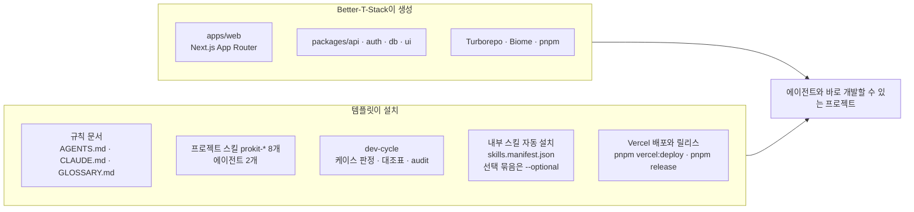

# 템플릿이 더하는 것
https://prokit-web.vercel.app/docs/templates/what-it-adds/

> 한눈에: 앱 뼈대를 만들어 주는 도구(Better-T-Stack)는 실행되는 앱까지만 만들어요. 에이전트가 그 위에서 안정적으로 개발하려면 프로젝트 규칙, 분야별 작업 지식, 끝났다고 말하기 전에 거치는 확인 절차가 더 필요해요. 템플릿이 이 세 가지를 채워요.

## 뼈대와 그 위에 더하는 것

| 구성 | 내용 |
|---|---|
| 프로젝트 스킬 8개 | `prokit-dev-cycle`(작업 진행), `prokit-web`(라우팅·RSC·캐시), `prokit-ui`(화면·UX), `prokit-api`(oRPC·인증·데이터 주인 확인), `prokit-db`(스키마·마이그레이션), `prokit-verify`(검사·증거), `prokit-deploy`(Vercel 배포·릴리스), `prokit-skills-update`(외부 스킬 업데이트) |
| 에이전트 2개 | `prokit-implementer`(구현), `prokit-reviewer`(읽기 전용 리뷰). `.claude/agents`가 원본이고, `.codex/agents`(Codex)와 `.agents/agents`(Antigravity)는 이 원본에서 자동으로 만들어요 |
| dev-cycle | 작업을 케이스(A\~F·H)로 나눠요. 케이스별 대조표의 모든 행에 증거를 채워야 라운드가 끝나요(`pnpm dev-cycle …`) |
| 문서 골격 | `AGENTS.md`(맨 앞에 개발 원칙: 계획, 서브에이전트, 교훈 기록, 완료 전 확인. 이어서 공통 규칙), `CLAUDE.md`(`@AGENTS.md`로 같은 지침을 읽어요), `GLOSSARY.md`, `docs/adr/`, `docs/domain/project.md`, `docs/dev-workflow.md` |
| 내부 스킬 (이 프로젝트에만, 자동 설치) | 공식 도메인 스킬(Next.js, React, Better Auth, shadcn, impeccable, turborepo, DB 스킬, Vercel 배포 스킬 등), Claude 플러그인(superpowers, skill-creator, OMC, ponytail), Codex 스킬(superpowers, skill-creator, ponytail), OMX 스킬·에이전트·프롬프트(`omx`가 있을 때) |
| 선택 스킬 묶음 (기본 설치 안 함) | `ops`(배포한 서비스의 비용·성능 점검. neon은 Neon 함수·파일 저장·LLM 게이트웨이 포함), `motion`(화면 전환 애니메이션), `mobile`(React Native·Expo 앱) |
| 화면만 프로젝트 | `scripts/export-html.mjs`로 DB 없이 만든 화면을 정적 HTML로 내보내요(`pnpm export:html`). 선택해서 쓸 수 있는 사이트 하단 제작 표시 컴포넌트 `apps/web/src/components/prokit-credit.tsx`를 함께 둬요. `scripts/load-keys.mjs`와 SessionStart 훅이 프로젝트나 작업 폴더 `.env`의 `OPENAI_API_KEY`를 Claude Code 세션에 불러와요 |
| Vercel 배포와 릴리스 | `pnpm vercel:deploy develop`·`production`이 배포 전 검사, 배포, 되돌리기 명령 안내를 맡아요. 운영에는 `pnpm release`로 버전 태그, `release/` 노트, GitHub Release를 만든 커밋만 배포해요. `.vercelignore`와 `.gitignore`의 `.env.*` 규칙 덕분에 로컬 비밀값이 배포나 커밋에 섞이지 않아요 |
| 전역 도구 | agent-browser CLI는 없거나 npm 최신판보다 낮으면 기본으로 최신판을 설치해요. OMX CLI, gstack, Vercel CLI, Neon CLI 또는 Supabase CLI는 `--with-global`을 줄 때만 설치해요. ego lite(macOS)는 직접 설치해요 |

## Better-T-Stack이란

[Better-T-Stack](https://www.better-t-stack.dev/)은 TypeScript 프로젝트의 뼈대를 만들어 주는 오픈 소스(MIT) 명령줄 도구예요([GitHub](https://github.com/AmanVarshney01/create-better-t-stack)). 화면부터 DB까지 타입이 처음부터 이어져 있어서 코드가 서로 어긋나지 않아요. 프런트엔드, 백엔드, 런타임, DB, ORM(DB를 코드로 다루는 도구), API, 인증, 결제, 애드온(덧붙이는 기능)을 고른 뒤 `pnpm create better-t-stack` 한 번으로 모노레포를 만들어요. 웹의 [Stack Builder](https://www.better-t-stack.dev/new)에서 조합을 고르면 같은 명령을 만들어 줘요. 만든 프로젝트의 `bts.jsonc`에는 고른 조합과 다시 만들 때 쓰는 명령이 남아요.

템플릿은 그중 한 조합을 고정해서 써요.

| 계층 | 선택 | BTS 옵션 |
|---|---|---|
| 프런트엔드 | Next.js App Router | `--frontend next` |
| 백엔드 | 별도 서버 없이 Next.js 라우트 핸들러가 API를 받아요 | `--backend self --runtime none` |
| API | oRPC | `--api orpc` |
| DB·ORM | PostgreSQL + Drizzle | `--database postgres --orm drizzle` |
| 인증 | Better Auth | `--auth better-auth` |
| 모노레포·린트 | Turborepo, Biome | `--addons turborepo biome` |
| 패키지 매니저 | pnpm | `--package-manager pnpm` |
| CLI 버전 | 생성할 때의 최신판 (마지막 확인 3.44.2) | `pnpm create better-t-stack@latest` |

DB 옵션만 템플릿마다 달라요(neon은 `--db-setup docker`, supabase는 `--db-setup supabase --manual-db`).

## 자세히

- **최신판을 받아요**: 생성기(`@latest`), 공식 스킬, Claude 플러그인은 템플릿에 복사해 두지 않고 설치할 때의 최신판을 받아요. 새 판 때문에 생성이나 설치가 깨지면 pro-kit 쪽에서 템플릿을 고치고, 확인한 판을 `VERIFICATION.md`에 적어요(pro-kit 관리 규칙).
- **템플릿 파일 위치**: 설치기는 `templates/<템플릿>/files/` 아래 파일을 프로젝트에 복사해요. 스킬 목록의 정본은 `files/skills.manifest.json`이에요([설치와 업데이트 구조](https://prokit-web.vercel.app/docs/skills/install-and-update/)).
- **설치된 결과**: 설치한 뒤 프로젝트의 폴더 구조는 [설치된 프로젝트의 폴더 구조](https://prokit-web.vercel.app/docs/reference/project-structure/)에 있어요.

## 관련 문서

- [템플릿 고르기](https://prokit-web.vercel.app/docs/templates/choose/)
- [앱 구조](https://prokit-web.vercel.app/docs/templates/app-structure/)
- [설치기와 옵션](https://prokit-web.vercel.app/docs/templates/installer/)
- [prokit 스킬 8개](https://prokit-web.vercel.app/docs/skills/prokit-skills/)
- [하네스 엔지니어링](https://prokit-web.vercel.app/docs/concepts/harness/)
