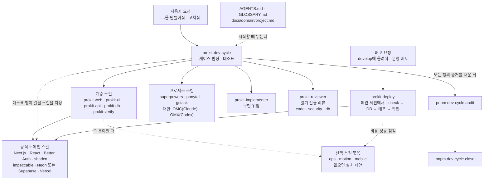

# 하네스 엔지니어링

> 한눈에: 하네스는 에이전트가 정해진 순서와 검사를 지키며 일하게 만드는 규칙, 스킬, 자동 검사의 묶음이에요. 에이전트에게 "잘해 줘"라고 부탁하는 대신 해야 할 일과 확인할 일을 파일과 명령으로 정해 둬요. **그래서 누가 요청하든 에이전트가 같은 순서로 일해요.**

## 하네스를 이루는 것

템플릿을 설치하면 프로젝트에 다섯 가지가 생겨요.

| 부분 | 파일 | 하는 일 |
|---|---|---|
| 규칙 문서 | `AGENTS.md`, `CLAUDE.md`, `GLOSSARY.md`, `docs/domain/project.md` | 에이전트가 시작할 때 읽는 개발 원칙과 공통 규칙, 용어집, 프로젝트 소개. `CLAUDE.md`는 `@AGENTS.md`로 같은 지침을 읽어요 |
| 스킬 | `.agents/skills/prokit-*` <!-- v:prokit.skills.count -->8<!-- /v -->개와 공식 스킬 | 분야마다 일하는 법을 알려 줘요. 대조표의 행마다 그 단계에서 읽을 공식 스킬이 정해져 있어요 |
| 역할 나누기 | `.claude/agents/prokit-implementer.md`, `prokit-reviewer.md` | 구현과 리뷰를 다른 에이전트가 맡아요. `prokit-reviewer(...)` 리뷰 행은 리뷰 에이전트만 채울 수 있어요 |
| 대조표와 audit | `scripts/dev-cycle.mjs`, `.dev-cycle.json`, `docs/dev-workflow.md`, `tasks/` | 작업을 케이스로 나누고 케이스별 대조표를 연 뒤 빈칸이 없는지 검사해요 |
| 자동 검사 | `.dev-cycle.json`의 `commands`, `pnpm skills:check`, `pnpm agents:check`, `pnpm dev-cycle secrets`, `pnpm vercel:deploy … --check` | 타입, 린트, 빌드, 테스트, 스킬과 에이전트 상태, 비밀값, 배포 준비를 명령으로 확인해요. 실행한 결과가 곧 증거예요 |

## 요청이 흘러가는 길

코드를 바꾸는 작업은 `prokit-dev-cycle`에서 시작해요. 요청이 어떤 케이스인지 정하고 대조표를 연 다음, 행마다 분야별 스킬과 프로세스 스킬을 불러 써요. 구현은 `prokit-implementer`에, 리뷰는 `prokit-reviewer`에 맡겨요.

배포 요청은 코드를 바꾸지 않으므로 라운드를 열지 않고 `prokit-deploy`가 맡아요. 배포와 운영 DB 적용은 중간에 사용자 동의가 필요해서 서브에이전트(보조 에이전트)에 맡기지 않고 메인 세션에서 해요. 선택 묶음에 해당하는 분야인데 스킬이 없으면 에이전트가 설치를 제안해요.

## 자세히

- **프로세스 스킬 고르기**: 설계, 계획, 구현, 디버깅, 리뷰, QA, 검증에 쓸 프로세스 스킬은 설치된 프로젝트의 `.agents/skills/prokit-dev-cycle/references/process-routing.md`에 표로 정리돼 있어요. 단계마다 1순위 스킬, Claude와 Codex의 대안, 스킬이 없을 때의 절차가 적혀 있어요. 전역 스킬이 없어도 대체 절차로 라운드를 끝까지 마쳐요.
- **과설계 막기**: 설계, 계획, 구현, 리뷰에 ponytail을 써요. 스펙에 "만들지 않는 것" 절을 두고, 리뷰가 있는 곳마다 `ponytail-review`로 필요 이상으로 복잡한 설계를 덜어 내요. ponytail 규칙보다 `prokit-dev-cycle`, `AGENTS.md`, 대조표가 우선해요.
- **하네스를 고치는 일**: 스킬, 에이전트, dev-cycle 자체를 바꾸는 작업도 라운드로 해요. 케이스 H예요([케이스 <!-- v:devCycle.cases.range -->A\~F·H<!-- /v -->와 대조표](cases.md)). 대조표 행의 정본인 `docs/dev-workflow.md`는 프로젝트에 맞게 고쳐도 되고, 고치는 일 자체가 케이스 H 변경이에요.
- **새 세션도 같은 규칙으로**: 규칙 문서와 대조표가 파일로 남아 있어서 새 세션은 `pnpm dev-cycle status`로 진행 중인 라운드를 이어받아요.

## 관련 문서

- [dev-cycle 라운드](dev-cycle.md)
- [구현 에이전트와 리뷰 에이전트](agent-roles.md)
- [prokit 스킬 <!-- v:prokit.skills.count -->8<!-- /v -->개](../skills/prokit-skills.md)
- [공식 스킬과 연결](../skills/official-skills.md)
- [템플릿이 더하는 것](../templates/what-it-adds.md)
