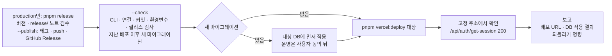

# Vercel 배포와 되돌리기

> 한눈에: 서비스 프로젝트는 내 컴퓨터의 Vercel CLI로 확인용(develop)과 운영(production)에 배포해요. 배포 전에 검사를 통과해야 하고, 새 DB 변경이 있으면 DB에 먼저 적용해요. 문제가 생기면 이전 배포로 되돌리는 명령을 알려 줘요.

## 두 가지 배포

| 대상 | Vercel 환경 | DB | 명령 |
|---|---|---|---|
| develop | Preview + 고정 주소(alias) | 병합 전 확인용 원격 DB (neon `develop` 브랜치, supabase 스테이징 프로젝트) | `pnpm vercel:deploy develop` |
| production | Production | 운영 DB | `pnpm release` 뒤 `pnpm vercel:deploy production` (기본 브랜치의 릴리스한 커밋만) |

새 프로젝트 세션에서 "develop에 배포해줘", "운영에 배포해줘"처럼 요청하면 `prokit-deploy` 스킬이 준비 확인부터 배포 뒤 확인까지 진행해요. 배포는 두 경우에만 해요. 사용자가 요청할 때, 그리고 기능 라운드를 마친 뒤 사용자가 "릴리스하고 production 배포"를 고를 때예요.

## 배포 순서

1. **검사**: `pnpm vercel:deploy <대상> --check`로 준비 상태와 지난 배포 이후 새 마이그레이션을 봐요. 커밋하지 않은 변경, 빠진 환경변수, production의 기본 브랜치와 릴리스, Vercel Git 자동 배포를 검사해서 하나라도 걸리면 배포하지 않아요.
2. **DB 먼저**: 새 마이그레이션이 있으면(첫 배포처럼 지난 배포 기록이 없으면 전체) 배포 전에 대상 DB에 적용해요. develop DB에는 바로 적용하고, 운영 DB는 적용할 목록을 보여 주고 동의를 받은 뒤 적용해요. 새 코드가 새 컬럼을 쓰므로 순서가 바뀌면 배포 직후 오류가 나요. 컬럼이나 테이블을 지우는 변경만은 새 코드를 먼저 배포하고 그다음 적용해요.
3. **배포**: `pnpm vercel:deploy <대상>`.
4. **확인**: 고정 주소에서 `/api/auth/get-session`이 200인지 봐요. 운영 데이터를 만드는 확인(가입, 글쓰기)은 하지 않아요.
5. **보고**: 배포 URL, 릴리스(production만), DB 적용 결과, 확인 결과, 되돌리기 명령을 알려 줘요.

## 되돌리기

| 대상 | 명령 |
|---|---|
| production | 스크립트가 출력한 `vercel rollback <이전 배포 URL>`. Hobby 요금제는 직전 production 배포로만 되돌릴 수 있어요 |
| develop | `vercel alias set <이전 배포 URL> <고정 주소>` |

- 되돌린 뒤에는 새 production 배포가 운영 주소를 자동으로 가져가지 않으므로 고친 배포를 `vercel promote <배포 URL>`로 올려요.
- production을 되돌려도 릴리스(태그, 노트, GitHub Release)는 지우지 않아요. 고친 코드는 새 patch 릴리스로 배포해요.
- DB 마이그레이션은 되돌리지 않아요. 앱만 되돌려도 동작하도록 데이터를 잃을 수 있는 변경은 두 번(expand → contract)에 나눠요.
- 되돌리기도 배포라서 사용자가 요청할 때만 해요.

## 자세히

### 처음 한 번 준비

Vercel 계정, 원격 DB, GitHub 저장소가 필요해요. "Vercel 배포 준비해줘"라고 하면 에이전트가 순서를 안내해요. 사용자가 직접 할 일은 Vercel CLI 설치와 `vercel login`, `gh auth login`, GitHub 원격 저장소 만들기예요. 연결 명령과 환경변수(`DATABASE_URL`, `BETTER_AUTH_SECRET`, `BETTER_AUTH_URL`)를 값이 출력되지 않게 넣는 법은 템플릿 README의 "Vercel 배포"([neon](../../templates/prokit-next-neon/README.md#vercel-배포) · [supabase](../../templates/prokit-next-supabase/README.md#vercel-배포))에 있어요.

- Vercel은 프로젝트의 첫 배포를 production으로 만들어서 production부터 배포해요. 스크립트는 production 배포가 없으면 develop을 막아요.
- `vercel link`가 GitHub 저장소를 연결하면 기본 브랜치 push가 곧 production 배포가 돼서 릴리스 검사를 거치지 않아요. 그래서 새 프로젝트를 만들며 연결됐을 때는 연결을 끊어요(`vercel git disconnect --yes`). push마다 자동 배포하는 방식은 사용자가 요청할 때만 쓰고, 결정은 `docs/adr/`에 남겨요.

### develop 주소로 보기

Better Auth는 `BETTER_AUTH_URL`만 믿어서 배포마다 생기는 고유 URL에서는 로그인이 실패해요. develop은 고정 주소로 열어요. Preview에는 Vercel 배포 보호가 걸려 있어 Vercel에 로그인한 브라우저로 보거나 `vercel curl https://<고정 주소>/…`로 확인해요.

### 쓰지 않는 도구

로그인 없이 `.env`까지 외부에 올리는 `vercel-deploy-claimable`, 커밋과 push까지 하는 gstack `ship`과 `land-and-deploy`, Vercel 플러그인의 `/vercel:deploy`는 이 프로젝트에서 쓰지 않아요.

### 화면만 프로젝트는 다른 길

화면만 프로젝트는 이 절차를 쓰지 않고 `pnpm export:html`로 만든 정적 HTML을 올려요([GitHub Pages 배포](github-pages.md)).

## 관련 문서

- [버전과 릴리스](release.md)
- [비밀값 지키기](secrets.md)
- [dev-cycle 라운드](../concepts/dev-cycle.md)
- [비용과 키](../../tutorials/reference/costs-and-keys.md#배포-비용)
