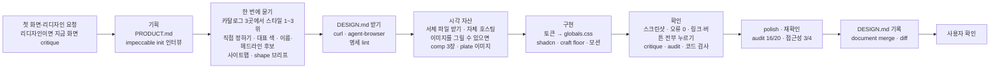

# UI/UX 흐름

> 한눈에: 화면은 `prokit-ui` 스킬이 맡아요. 코드를 쓰기 전에 서비스를 파악하고, 어울리는 디자인 스타일을 추천받아 고른 뒤 화면 설계(브리프)를 확인받아요. 만든 뒤에는 모든 링크와 버튼을 눌러 보고 디자인 점수로 검사해요.

## 흐름

[impeccable](https://github.com/pbakaus/impeccable)의 단계를 그대로 따라 기획(`PRODUCT.md`), 디자인 값 정하기(`DESIGN.md`), 화면 설계(브리프), 구현, 리뷰, 마감 순서로 진행해요.

<!-- b:ui-flow-diagram -->

<!-- /b -->

| 단계 | 에이전트가 하는 일 | 남는 것 | 사용자가 하는 일 |
|---|---|---|---|
| 기획 (프로젝트당 1회) | impeccable `init` 인터뷰로 서비스를 파악해요 | `PRODUCT.md` | 질문에 답하기 |
| 시각 방향 (첫 화면, 리디자인) | 리디자인이면 지금 화면을 찍어 critique하고 버릴 것을 적어요. 카탈로그 1~3위와 "직접 정하기"를 추천하고, 고른 스타일의 원문을 받아 스펙 검사기(lint)로 확인해요 | `DESIGN.md` | 스타일과 대표 색 고르기 |
| 설계 (화면마다) | 사이트맵에 링크와 버튼이 이어지는 곳을 모두 적고, impeccable `shape`로 화면마다 상호작용, 서체, 이미지, 아이콘, 모션 계획을 세워요. 이름이나 헤드라인을 새로 정하면 비슷한 서비스를 조사해 후보 3~4개를 내요 | `docs/briefs/site-map.md`, `docs/briefs/<화면>.md` | 브리프 확인, 이름·문구 고르기 |
| 시각 자산 (화면마다) | 서체 파일을 받아 프로젝트에 직접 넣어요. 이미지를 그릴 수 있으면 방향 comp 3장을 그리고, 고른 comp에 맞춰 사진·일러스트(plate)를 만들어요 | `apps/web/src/fonts/`, `apps/web/public/images/`, `.impeccable/mocks/` | comp 고르기 |
| 개발 | 디자인 토큰을 `globals.css`의 shadcn 변수로 옮기고 컴포넌트를 조합해 화면을 만들어요 | 코드 | |
| 리뷰 | 스크린샷, 모든 링크·버튼 누르기(404, "준비 중", 반응 없는 버튼이 없어야 해요), `critique`, `audit`, `web-design-guidelines` | 점수, P0~P3, 위반 목록 | |
| 마감 | `polish`(마무리 손질), 재확인 1회 | 통과 점수 | 기준에 못 미치면 더 다듬을지 결정 |
| 기록 | `document` merge(기존 파일에 합치기), lint, diff | 갱신한 `DESIGN.md` | 덮어쓰기 전 확인 |

스타일 선택, 이름·문구 후보, 브리프 확인은 한 번에 물어요. 사용자 답을 받기 전에는 코드를 쓰지 않아요.

## 스타일 추천 1~3위

후보는 세 카탈로그에서만 뽑아요. 목록에 없는 브랜드는 지어내지 않아요.

| 카탈로그 | 범위 | 잘 맞는 화면 |
|---|---|---|
| [<!-- v:catalogs.kr.name -->getdesign.kr<!-- /v -->](https://www.getdesign.kr) | 한국 서비스 <!-- v:catalogs.kr.count -->23<!-- /v -->개(<!-- v:catalogs.kr.date -->2026-10-04<!-- /v -->) | 한국어 앱 화면 |
| [<!-- v:catalogs.awesome.name -->awesome-design-md<!-- /v -->](https://github.com/VoltAgent/awesome-design-md) | 해외 제품 <!-- v:catalogs.awesome.count -->74<!-- /v -->개(<!-- v:catalogs.awesome.date -->2026-09-30<!-- /v -->). AI, 개발자 도구, 핀테크, 커머스 등 | 해외 제품 톤, 개발자 도구 |
| [<!-- v:catalogs.refero.name -->Refero Styles<!-- /v -->](https://styles.refero.design) | 해외 제품 웹사이트 <!-- v:catalogs.refero.count -->1,342<!-- /v -->개(<!-- v:catalogs.refero.date -->2026-10-04<!-- /v -->) | 랜딩, 가격, 브랜드 페이지처럼 시각 연출이 큰 화면 |

- 화면 유형과 관계없이 세 카탈로그를 모두 봐요. `PRODUCT.md`의 분야, 화면 모드(앱 화면, 랜딩, 문서), 정보 밀도, 어조, UI 언어로 순위를 매겨요.
- "토스처럼", "넷플릭스처럼"처럼 브랜드를 지목하면 세 카탈로그 모두에서 그 브랜드를 찾고, 찾은 원문이 1위예요. Refero 분류 페이지에는 일부 스타일만 실리고 분류 이름이 실제 화면 성격과 다를 수 있어요(넷플릭스는 "에디토리얼" 분류에만 있어요). 그래서 분류에 없으면 웹 검색(`site:styles.refero.design <브랜드>`)으로 찾아요. 같은 브랜드의 스타일이 여럿이면 모두 후보로 두고, 세 곳 모두 없으면 "카탈로그에 없음"이라고 알린 뒤 같은 분야 후보를 내요.
- 후보마다 카탈로그 이름, 이유 한 줄, 미리 보기 주소를 붙여요. "카탈로그 없이 impeccable로 정하기"도 선택지에 넣어요. 대표 색은 원본을 쓸지 제품 색으로 바꿀지도 물어요.
- 고른 원문의 값은 그대로 두고, 이름은 제품명으로 바꿔요. 로고와 원래 브랜드 이름은 화면에 쓰지 않고, 전용 서체는 공개 서체로 바꿔요. 같은 업종이면 원래 브랜드와 헷갈리지 않도록 제품 색을 권해요.

## 자세히

### 새 작업과 좁은 개선

`prokit-ui`는 요청이 어느 쪽인지 먼저 정해요.

- **새 작업**: 새 화면, 새 흐름, 리디자인처럼 화면 전체의 모양을 바꾸는 요청이에요. 브리프를 확정하기 전에는 코드를 쓰지 않아요.
- **좁은 개선**: 기존 화면의 구성은 그대로 두고 간격, 문구, 상태 하나를 고치는 요청이에요. 브리프 없이 진행하고 대조표에 `N/A: 좁은 개선(버튼 간격)`처럼 적어요. 애매하면 새 작업으로 봐요.

### 지키는 규칙

- **모든 링크와 버튼이 동작해요**: 실제 페이지나 실제 동작(모달, 드로어, 상태 바꾸기, 복사, 폼 제출 뒤 완료 화면)으로 이어져요. 404, "준비 중", `#`만 걸린 링크는 두지 않아요.
- **토큰만 써요**: 색, 간격, 반경, 그림자는 토큰으로만 쓰고 색 코드(hex)나 임의 Tailwind 값(`bg-[#123456]`)을 새로 넣지 않아요.
- **통과 기준**: critique의 P0·P1은 해결하거나 사유를 적어요. audit 총점은 <!-- v:devCycle.ui.auditMin -->16<!-- /v -->/20 이상, 접근성 점수는 <!-- v:devCycle.ui.a11yMin -->3<!-- /v -->/4 이상이에요(`.dev-cycle.json`의 `ui.auditMin`, `ui.a11yMin`). 못 미치면 완료로 보고하지 않고 더 다듬을지 물어요.
- **편집 중 자동 검사**: 프로젝트 루트에서 `.agents/skills/impeccable/scripts/impeccable hooks on`을 실행해 켜 두면(스킬 호출로 켜지 않아요) UI 파일을 고칠 때마다 detector가 결과를 알려 줘요.

### 이미지 그리기

그리는 길은 이 순서로 골라요.

1. 에이전트 자체 이미지 도구(Codex `image_gen`, Antigravity `generate_image`, Grok Build `image_gen`)
2. `OPENAI_API_KEY`가 있으면 impeccable `generate-image`. 비용은 사용자의 OpenAI API 계정에 청구돼요
3. Codex CLI가 ChatGPT로 로그인되어 있으면 `gpt-image` 스킬. ChatGPT 요금제 사용량을 써요
4. 모두 없으면 배치도로 구성을 골라요. 사진 자리를 도형이나 이모지로 흉내 내지 않아요

키는 프로젝트나 작업 폴더의 `.env`에 두면 Claude Code 세션을 열 때 훅이 불러와요. 준비 방법은 [비용과 키](../../tutorials/reference/costs-and-keys.md#이미지-그리기)에 있어요.

### 실제 추천 예 (<!-- v:preset.uptrail.title -->Uptrail<!-- /v --> 리디자인)

| 순위 | 스타일 | 추천 이유 |
|---|---|---|
| 1 | [<!-- v:preset.uptrail.design.rec1 -->Default<!-- /v -->](https://styles.refero.design/style/eeeb6ac9-fc07-4965-935a-e1989ed831f1) (<!-- v:preset.uptrail.design.src1 -->Refero Styles<!-- /v -->) | 무광 검정 판에 대표 색 Signal Blue 하나만 써요. 초록과 빨강은 상태 신호로만 써서, 하루 종일 띄워 두는 모니터에서 인시던트(장애) 빨강이 가장 눈에 띄어요 |
| 2 | [<!-- v:preset.uptrail.design.rec2 -->리멤버<!-- /v -->](https://www.getdesign.kr/services/remember) (<!-- v:preset.uptrail.design.src2 -->getdesign.kr<!-- /v -->) | 흰 바탕에 검정과 오렌지 한 점만 써요. "색이 보이면 곧 이상"이라는 규칙으로 이전 시안의 색 문제를 구조로 풀어요 |
| 3 | [<!-- v:preset.uptrail.design.rec3 -->ClickHouse<!-- /v -->](https://getdesign.md/clickhouse/design-md) (<!-- v:preset.uptrail.design.src3 -->awesome-design-md<!-- /v -->) | 검정 바탕, 전기 노랑, 72px 굵은 제목으로 인상이 가장 강해요. 노랑이 경고색과 헷갈릴 수 있어요 |
| 4 | 카탈로그 없이 impeccable로 정하기 | 스타일 세 가지를 새로 만들어 이미지 시안과 함께 보여 줘요 |

### 프리셋

이 흐름으로 만든 화면 프리셋 <!-- v:presets.screen.count -->9<!-- /v -->개(랜딩페이지 <!-- v:presets.landing.count -->4<!-- /v -->개, 앱 화면 <!-- v:presets.app.count -->5<!-- /v -->개, 모두 <!-- v:presets.screen.pages -->337<!-- /v -->페이지)를 [프로킷 사이트](https://prokit-web.vercel.app/)에서 볼 수 있어요. 추천 순위, comp, 사이트맵은 에이전트가 낸 그대로이고, 고르기와 수정 요청은 사용자가 직접 했어요.

- **앱 화면 <!-- v:presets.app.count -->5<!-- /v -->개**(<!-- v:preset.goru.title -->고루<!-- /v -->, <!-- v:preset.fitslot.title -->핏슬롯<!-- /v -->, <!-- v:preset.uptrail.title -->Uptrail<!-- /v -->, <!-- v:preset.studyday.title -->하루공부<!-- /v -->, <!-- v:preset.olgot.title -->올곧<!-- /v -->): 분야가 다른 서비스를 사이트맵의 모든 페이지까지 만들었어요. 올곧을 뺀 넷은 템플릿을 설치한 프로젝트에서 `prokit-ui`의 흐름을 그대로 따랐어요.
  1. 이전 시안을 critique(디자인 리뷰)했어요.
  2. 카탈로그 3곳에서 스타일을 다시 추천받고, impeccable이 OpenAI 이미지로 그린 방향 comp(화면 방향 시안) 3장 중 하나를 골랐어요.
  3. 사이트맵을 쓰고, 페이지마다 브리프와 comp를 만들었어요.
  4. 서체, 이미지, 모션을 넣어 모든 페이지를 구현했어요. 모달, 툴팁, 햄버거 메뉴, 사이드바, 페이지 전환도 넣었어요.
  5. critique와 polish(마무리 손질)를 거친 뒤 모든 링크와 버튼을 눌러 확인했어요.
- **올곧**: 카탈로그 추천 대신 입시학원 사이트 한 곳을 실측한 `DESIGN.md`로 시작했어요. 첫 화면 comp 3장은 ChatGPT로 로그인한 Codex로 그렸고, 공개 페이지와 로그인 뒤 화면까지 <!-- v:preset.olgot.pages -->203<!-- /v -->개(<!-- v:preset.olgot.pageTypes -->48<!-- /v -->종)를 만들었어요.
- **랜딩페이지 <!-- v:presets.landing.count -->4<!-- /v -->개**(<!-- v:preset.ullim.title -->울림<!-- /v -->, <!-- v:preset.jecheol.title -->제철상자<!-- /v -->, <!-- v:preset.pacecrew.title -->PACECREW<!-- /v -->, <!-- v:preset.afterglow.title -->AFTERGLOW<!-- /v -->): 랜딩페이지처럼 시각 연출이 큰 사이트예요. 첫 화면에서 시작해 요금, 상세, 로그인, 마이페이지, 고객센터, 약관까지 사이트맵의 모든 페이지를 같은 흐름으로 만들었어요. <!-- v:preset.ullim.title -->울림<!-- /v -->, <!-- v:preset.jecheol.title -->제철상자<!-- /v -->, <!-- v:preset.afterglow.title -->AFTERGLOW<!-- /v -->는 스타일 후보마다 첫 화면 comp를 한 장씩 그렸고, 그 comp를 보고 스타일과 구도를 한 번에 골랐어요. 서비스 이름과 첫 화면 문구는 비슷한 서비스를 조사해 후보를 받은 뒤 사용자가 골랐어요.

측정한 결과(페이지 수, critique 점수, 비용)는 [검증 결과](../reference/verification.md#화면-프리셋)에 있어요.

## 관련 문서

- [DESIGN.md](design-md.md)
- [화면만 프로젝트와 HTML 내보내기](screen-only.md)
- [케이스 <!-- v:devCycle.cases.range -->A\~F·H<!-- /v -->와 대조표](../concepts/cases.md)
- [공식 스킬과 연결](../skills/official-skills.md)
