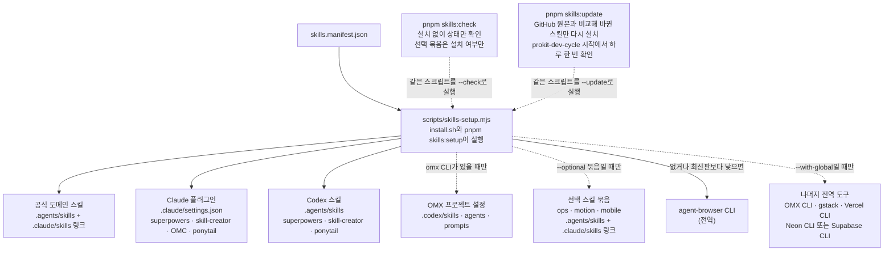

# 설치와 업데이트 구조

> 한눈에: 스킬 목록은 파일 하나에 모여 있고, 설치할 때 프로젝트에 빠진 것만 넣어요. 설치한 스킬은 프로젝트와 함께 저장돼요. 새 버전은 하루 한 번 확인해서 올릴지 물어요.

## 설치되는 길



- **최신판을 받아요**: 공식 스킬은 템플릿에 복사해 두지 않고, 설치할 때 원본 저장소의 최신 커밋을 받아요(skills CLI도 `skills@latest`). Claude 플러그인은 마켓플레이스를 최신으로 받은 뒤 설치해요.
- **프로젝트에만 설치해요**: 스킬과 플러그인은 그 프로젝트 범위(project scope)에 들어가요. 플러그인 마켓플레이스 등록과 ponytail 모드 파일(`~/.claude/.ponytail-active`)은 사용자 범위에 남아요.
- **전역 도구는 둘로 나뉘어요**: <!-- v:policy.agentBrowser.yo -->agent-browser CLI는 없거나 npm 최신판보다 낮으면 기본으로 최신판을 설치해요<!-- /v -->. 나머지 전역 도구는 `--with-global`을 줄 때만 설치해요.

## 업데이트

설치한 외부 스킬은 프로젝트에 복사되어 커밋돼요. 그래서 원격 저장소가 바뀌어도 저절로 따라가지 않아요.

```bash
pnpm skills:update --check     # 설치한 외부 스킬을 GitHub 원본과 비교해 새 버전만 알려 준다
pnpm skills:update             # 바뀐 스킬과 빠진 스킬만 다시 설치한다
pnpm skills:update <이름>...   # 지정한 스킬만 다시 설치한다
```

- **하루 한 번 확인**: 진행 중인 라운드가 없을 때 `pnpm dev-cycle status`가 하루 한 번 새 버전을 확인해요(GitHub API를 저장소마다 한 번 호출). 새 버전이 있으면 `prokit-skills-update`가 업데이트할지 물어요(지금, 항상 자동, 나중에, 다시 묻지 않기).
- **케이스 H로 커밋**: 업데이트는 하네스를 바꾸는 일이라 케이스 H 라운드로 커밋해요.
- **비교 방법**: `pnpm skills:update`는 `skills-lock.json`에 적힌 GitHub 폴더와 설치본을 파일 단위로 비교하고, 바뀐 스킬만 목록에 적힌 에이전트(Claude, Codex)로 다시 설치해요.

## 자세히

### 스크립트가 바뀐 스킬은 먼저 읽어요

훅이 스킬 스크립트를 바로 실행하므로 스크립트나 설정 파일이 바뀐 스킬은 설치 전에 원격 파일을 먼저 읽어요. 알림 방식을 자동으로 둬도 이런 스킬은 물어요. `--check`로 검토한 그 판을 이름으로 지정해야 설치되고, 그사이 원격이 바뀌면 설치하지 않아요. 원격에서 없어진 스킬은 지우지 않고 알리기만 해요.

### 플러그인은 따로 올려요

Claude 플러그인은 `skills:update`가 업데이트하지 않아요. 네 플러그인 모두 훅이 있어서 업데이트하는 즉시 새 코드가 실행되기 때문이에요. 사용자가 요청하면 플러그인 저장소의 `hooks/` 변경을 먼저 보고 올려요.

```bash
claude plugin marketplace update <마켓플레이스>
claude plugin update <플러그인> --scope project   # 세션을 다시 열어야 적용된다
```

### ponytail 훅

ponytail(Claude 플러그인)은 훅 3개(SessionStart, SubagentStart, UserPromptSubmit)로 세션과 서브에이전트에 과설계를 막는 규칙을 넣어요. 프로젝트 범위로 설치해도 모드 파일(`~/.claude/.ponytail-active`)은 전역이라 한 세션에서 "stop ponytail"로 끄면 다른 프로젝트 세션에서도 꺼져요. 이 프로젝트에서만 끄려면 `.claude/settings.local.json`의 `enabledPlugins`에 `"ponytail@ponytail": false`를 둬요. Codex에는 훅 없이 스킬(`ponytail`, `ponytail-review`)만 설치해요.

### 상태 확인

`pnpm skills:check`는 설치하지 않고 상태만 봐요. 프로젝트 범위 항목이 빠졌으면 exit 1이에요. 선택 묶음은 상태만 보여 주고, `omx`가 없는 기기는 OMX를 누락으로 세지 않아요.

## 관련 문서

- [공식 스킬과 연결](official-skills.md)
- [선택 스킬 묶음](optional-bundles.md)
- [설치기와 옵션](../templates/installer.md)
- [만든 뒤 개발하기](../start/after-create.md)
