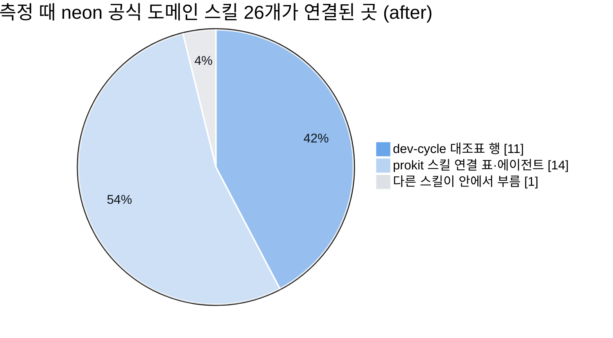

# 공식 스킬과 연결

> 한눈에: 공식 스킬은 Next.js, Vercel, Better Auth처럼 도구를 만든 곳이 직접 관리하는 에이전트 스킬이에요. 프로킷은 새 프로젝트를 만들 때 그 최신판을 설치하고, 어느 단계에서 어떤 스킬을 읽을지 에이전트의 짐작에 맡기지 않고 미리 정해 둬요. 읽은 스킬은 대조표의 증거 칸에 이름이 남아요.

## 설치되는 공식 스킬

기본으로 neon은 <!-- v:skills.official.neon -->28<!-- /v -->개, supabase는 <!-- v:skills.official.supabase -->25<!-- /v -->개를 설치해요. 기준 목록은 각 템플릿의 `files/skills.manifest.json`이에요. 용어 정리에 쓰는 `domain-modeling`처럼 널리 쓰이는 외부 스킬도 같은 방식으로 설치해요.

| 분야 | 스킬 | 출처 | 읽는 곳 |
|---|---|---|---|
| Next.js 동작·성능 | `next-dev-loop`, `next-cache-components-adoption`, `next-cache-components-optimizer`, `next-partial-prefetching-adoption`, `next-partial-prefetching-optimizer` | vercel/next.js | `prokit-web`, `prokit-verify`. `next-dev-loop`는 B·F 런타임 확인 행 |
| React·화면 규칙 | `vercel-react-best-practices`, `vercel-composition-patterns`, `web-design-guidelines` | vercel-labs/agent-skills | `prokit-web`(앞의 둘), `prokit-reviewer`(react-best-practices), `prokit-ui`(web-design-guidelines). B 구현 행(react-best-practices), audit 행(web-design-guidelines) |
| 컴포넌트 | `shadcn` | shadcn/ui | `prokit-ui`. B 구현 행 |
| 화면 디자인 | `impeccable` | pbakaus/impeccable | `prokit-ui`. B·F 브리프, critique, audit 행 |
| 이미지 그리기 (ChatGPT 요금제) | `gpt-image` | GENEXIS-AI/gpt-image-skill | `prokit-ui`. Claude Code에서 `OPENAI_API_KEY`가 없고 Codex CLI가 ChatGPT로 로그인되어 있을 때 comp와 plate 이미지를 그려요 |
| 디자인 스타일 카탈로그 | `use-design-md` | CaesiumY/ko-design-md | `prokit-ui`. B 첫 행에서 고른 스타일(getdesign.kr, awesome-design-md, Refero Styles)의 DESIGN.md를 받아 적용해요. 받은 파일은 Google 스펙 CLI(`@google/design.md`)로 lint해요 |
| 브라우저 확인 | `agent-browser` | vercel-labs/agent-browser | `prokit-verify`. B·F 런타임 확인 행(macOS는 ego lite를 먼저 써요) |
| 인증 | `better-auth-best-practices`, `better-auth-security-best-practices`, `email-and-password-best-practices` | better-auth/skills | `prokit-api`, `prokit-reviewer`(security). D 구현 행 |
| Postgres 스키마 | `supabase-postgres-best-practices` | supabase/agent-skills | `prokit-db`, `prokit-reviewer`(db). E 스키마 행 |
| Neon (neon만) | `neon`, `neon-postgres`, `neon-postgres-branches`, `neon-postgres-egress-optimizer` | neondatabase/agent-skills | `prokit-db`. `neon-postgres-branches`는 E 병합 전 행 |
| Supabase (supabase만) | `supabase` | supabase/agent-skills | `prokit-db`, `prokit-reviewer`(db). E advisors 행의 보안 체크리스트 |
| 모노레포 | `turborepo` | vercel/turborepo | `prokit-web`, `prokit-dev-cycle`. `turbo.json`을 바꿀 때 |
| 용어·설계 질문 | `domain-modeling`, `grill-with-docs`, `grilling` | mattpocock/skills | `prokit-dev-cycle`, `prokit-db`. F 스펙 행과 공통 문서 행 |
| Vercel 배포 | `deploy-to-vercel`, `vercel-cli-with-tokens`, `access-protected-vercel-deployment` | vercel-labs/agent-skills, vercel/vercel-plugin | `prokit-deploy` |

일부 프로젝트만 쓰는 스킬은 [선택 스킬 묶음](optional-bundles.md)에 따로 모아 두었어요.

## 프로세스 스킬과 전역 도구

위 표의 공식 도메인 스킬은 무엇으로 만드는지(Next.js, DB, 인증)를 다뤄요. 아래 도구는 어떤 순서로 일하는지(설계, 계획, 구현, 리뷰, 확인)를 다뤄요. 단계마다 무엇을 먼저 쓰고, 없으면 무엇으로 대신하는지는 설치된 프로젝트의 `.agents/skills/prokit-dev-cycle/references/process-routing.md`가 정본이에요. Vercel CLI, Neon CLI, Supabase CLI, GitHub CLI처럼 DB와 배포에 쓰는 명령줄 도구는 [쓰는 기술과 도구](../reference/tech-stack.md)에 모았어요.

| 이름 | 무엇인가 | 설치 | 프로킷에서 맡는 일 |
|---|---|---|---|
| superpowers | 설계, 계획, TDD(테스트 먼저 쓰기), 디버깅, 완료 전 확인 절차를 담은 스킬 묶음(obra/superpowers) | 프로젝트에 자동. Claude Code는 플러그인, Codex는 스킬 <!-- v:skills.codex.superpowers -->15<!-- /v -->개 | 단계마다 1순위예요. 요구 정리 `brainstorming`, 계획 `writing-plans`, 구현 `subagent-driven-development`·`test-driven-development`, 디버깅 `systematic-debugging`, 리뷰 지적 처리 `receiving-code-review`, 검증 `verification-before-completion` |
| ponytail | 필요 이상으로 복잡한 설계를 막는 모드와 리뷰(DietrichGebert/ponytail) | 프로젝트에 자동. Claude Code는 플러그인(훅 3개), Codex는 `ponytail`·`ponytail-review` 스킬 | 구현은 ponytail 모드로 해요. 계획 리뷰와 코드 리뷰마다 `ponytail-review`가 과설계 목록을 내고, 고치지는 않아요 |
| skill-creator | 스킬을 만들고 평가하는 도구(Anthropic) | 프로젝트에 자동. Claude Code는 플러그인, Codex는 스킬 | 스킬 본문을 바꾼 라운드(케이스 H)에서 eval을 다시 돌려요 |
| OMC (oh-my-claudecode) | Claude Code에서 여러 에이전트를 나눠 돌리는 플러그인 | 프로젝트에 자동(Claude Code 플러그인) | Claude Code에서 superpowers가 없을 때 쓰는 대안이에요. 요구 정리 `deep-interview`, 계획 `plan`·`ralplan`, 큰 병렬 구현 `team`·`ralph`, 디버깅 `debug`, 검증 `verify` |
| OMX (oh-my-codex) | Codex에서 같은 일을 하는 도구 | CLI(`omx`)는 전역이라 `--with-global`이나 <!-- v:cli.omx.installCode -->`npm install -g oh-my-codex`<!-- /v -->로 설치해요. `omx`가 있으면 설치기가 이 프로젝트에 스킬, 에이전트, 프롬프트(`.codex/`)를 설정하고, 없으면 건너뛰어요 | Codex에서 쓰는 대안이에요. 요구 정리 `deep-interview`, 계획 `plan`·`ralplan`, 병렬 구현 `team`(tmux 안에서만). 리뷰에서는 `code-review`를 추가 관점으로 써요 |
| gstack | 계획 리뷰, 디버깅, 코드 리뷰, QA 스킬 묶음(garrytan/gstack) | 전역만 지원해요. `--with-global`일 때 설치하고 bun이 필요해요(Claude Code `~/.claude/skills/gstack`, Codex `~/.codex/skills/gstack`) | 계획 리뷰 `plan-eng-review`(화면이 있으면 `plan-design-review`), 디버깅 보강 `investigate`, F 병합 전 추가 리뷰 `review`, QA `qa-only`·`qa`(사용자가 요청할 때만) |
| ego-browser (ego lite) | 실제 브라우저 창으로 화면을 보고 눌러 보는 macOS 앱 | 직접 설치해요([lite.ego.app](https://lite.ego.app/)) | `prokit-verify`의 화면 확인과 F의 QA 행에서 1순위예요. 없으면(macOS 밖, CI, Codex 샌드박스) agent-browser CLI로 같은 흐름을 확인해요 |
| agent-browser CLI | 명령으로 브라우저를 다루는 도구 | 전역. <!-- v:policy.agentBrowser.cell -->없거나 npm 최신판보다 낮으면 기본으로 최신판을 설치<!-- /v --> | ego-browser가 없을 때 쓰는 대안이에요. 쓰는 법은 위 표의 `agent-browser` 스킬이 알려 줘요 |

지키는 경계도 정해 두었어요.
- 리뷰 행의 증거는 `prokit-reviewer`만 채워요. `ponytail-review`, gstack `review`, OMX `code-review`, Claude Code의 `/code-review`는 추가 관점이에요.
- OMC·OMX의 모드(`team`, `ralph` 등)는 실행 수단이에요. 모드가 낸 완료 보고는 증거가 아니고, 라운드가 끝났는지는 `pnpm dev-cycle audit`만 판정해요. 모드가 커밋, push, 배포를 하게 두지 않아요.
- 코드를 고치거나 배포하는 gstack 스킬(`qa`, `ship`, `land-and-deploy`)은 사용자가 요청할 때만 써요. 배포는 `prokit-deploy`로 해요.
- 빠진 것은 `pnpm skills:check`로 확인해요. `omx`가 없는 기기는 OMX를 빠진 것으로 세지 않아요.

## 읽을 스킬을 정해 두는 방법

- `prokit-web`, `prokit-api`, `prokit-db`, `prokit-deploy`, `prokit-dev-cycle`에는 어떤 상황에서 어떤 공식 스킬을 읽을지 적은 "공식 스킬 연결" 표가 있어요. `prokit-ui`와 `prokit-verify`는 본문의 단계와 규칙에 스킬 이름을 적어 둬요.
- dev-cycle 대조표의 행에도 그 단계에서 읽을 스킬 이름이 괄호로 들어가 있어요. 에이전트는 그 행을 진행할 때 스킬을 실제로 읽고 증거 칸에 이름을 남겨요(`사용: supabase-postgres-best-practices(schema-data-types)`).
- 외부 스킬은 `.agents/skills/<이름>/SKILL.md`를 직접 읽게 해요. 같은 이름의 개인 스킬(`~/.claude/skills`)이 있으면 Claude Code의 Skill 도구가 그쪽을 먼저 불러오기 때문이에요.

## 자세히

### 호출률과 활용도

새 세션에서 사용자가 할 법한 요청 7개(스펙·계획, 화면, API, DB, 인증 설정, 성능 분석, 배포 준비)를 두 판으로 두 번씩 실행하고 각 단계에서 읽어야 할 스킬을 실제로 읽었는지 로그로 셌어요. 두 판은 v0.6.1(before)과 공식 스킬 연결을 보강한 판(after)이에요(neon 템플릿, `claude -p`, Opus 5.5, 2026-09-30). 무엇을 읽어야 하는지는 보강하기 전에 미리 정했어요.

```mermaid
%%{init: {"themeVariables": {"xyChart": {"plotColorPalette": "#2a78d6, #8c929b"}}}}%%
xychart-beta
  title "기대 스킬 호출률 (%) — 회색 before, 파랑 after"
  x-axis ["전체 110항목", "공식 스킬 36", "프로세스 스킬 20", "prokit 스킬 44"]
  y-axis "호출률 (%)" 0 --> 100
  bar [95, 97, 90, 95]
  bar [69, 36, 70, 89]
```

before에서도 대조표 행에 이름이 있던 스킬은 거의 매번 불렸어요. 분야별 스킬의 연결 표에만 있던 공식 스킬은 대부분 건너뛰었어요. after는 그 단계의 행에 스킬 이름을 넣었어요. 공식 스킬별 결과는 다음과 같아요(두 번 실행한 평균).

| 공식 스킬 | before | after | 기대한 요청 |
|---|---|---|---|
| `vercel-react-best-practices` | 0% | 100% | 화면, 성능 분석 |
| `shadcn` | 0% | 100% | 화면 |
| `turborepo` | 0% | 100% | API |
| `next-cache-components-*`, `next-partial-prefetching-*` | 0% | 100% | 성능 분석 |
| `email-and-password-best-practices` | 0% | 100% | 인증 설정 |
| `better-auth-best-practices` | 0% | 50% | 인증 설정 (한 번 빠짐) |
| `supabase-postgres-best-practices` | 25% | 100% | 스펙·계획, DB |
| `next-dev-loop` | 50% | 100% | 화면, 성능 분석 |
| `domain-modeling` | 50% | 100% | 스펙·계획, DB |
| `impeccable`, `web-design-guidelines`, `better-auth-security-best-practices`, 브라우저 확인(`ego-browser` 또는 `agent-browser`) | 100% | 100% | 화면, 인증 설정 |

활용도는 두 가지로 봤어요. 설치한 공식 스킬이 하네스의 어디에 연결되어 있는지, 그리고 측정에서 실제로 읽혔는지예요.

| 지표 | before | after |
|---|---|---|
| dev-cycle 행에 이름이 나오는 공식 도메인 스킬 | neon 5/26, supabase 5/23 | neon 11/26, supabase 10/23 |
| 측정 14번 실행에서 한 번 이상 읽힌 공식 도메인 스킬 (neon) | 7/26 | 15/26 |
| 프로젝트에 설치된 외부 스킬을 그 판에서 읽은 비율 | 42% (8/19) | 100% (60/60) |

- after에서도 읽히지 않은 11개는 측정 요청에 그 상황이 없었기 때문이에요. 해당하는 스킬은 원격 Neon 브랜치(`neon` 4종), 실제 배포(Vercel 배포 3종), 컴포넌트 조합 설계(`vercel-composition-patterns`), 설계 질문(`grill-with-docs`, `grilling`. 요청이 질문을 모아 두라고 했어요)이에요. `agent-browser`는 macOS에서 ego lite를 먼저 써서 읽히지 않았어요.
- 같은 이름의 개인 스킬(`~/.claude/skills`)이 있으면 Claude Code의 Skill 도구가 그 스킬을 먼저 불러와요. 그래서 before에서는 프로젝트에 설치한 판 대신 전역 판을 읽는 일이 많았어요. after는 `.agents/skills/<이름>/SKILL.md`를 Read로 읽게 했어요.
- 측정할 때 공식 도메인 스킬은 neon 26개, supabase 23개였어요. 그 뒤 `use-design-md`와 `gpt-image`가 더해져 지금은 neon <!-- v:skills.official.neon -->28<!-- /v -->개, supabase <!-- v:skills.official.supabase -->25<!-- /v -->개예요.
- 한계: 설정마다 두 번만 실행했고, neon 템플릿과 전역 스킬이 많은 기기 하나에서만 쟀어요. 스킬을 읽었는지만 셌고, 읽은 내용을 제대로 적용했는지는 채점하지 않았어요.
- 2026-09-30에는 Codex CLI에서도 따로 검수했어요. 스킬을 읽는지와 적용하는지를 나눠 확인했고, 그 결과 Vitest 행이 빠지거나 다른 자리로 옮겨지는 문제를 고쳤어요. Neon·Supabase DB 사례와 전역 스킬을 제외한 사례도 다시 확인했어요. 운영 인증 보안과 성능 재현의 한계는 [Codex 검수 보고서](../../docs/reports/2026-09-30-codex-skill-wiring-check.html)에 적었어요. 위 호출률 차트는 이전에 Claude로 잰 값이에요.
- 측정 방법, 찾은 결함 3건, 시나리오별 세부 결과, 비용은 [스킬 연결 점검 보고서](../../docs/reports/2026-09-30-skill-wiring-check.html)에 있어요. 내려받아 브라우저로 열거나 [claude.ai 게시본](https://claude.ai/artifact/BHpjS12NRAzY36xBxbArBN)을 보세요. 수치와 판정은 [neon 검증 기록](../../templates/prokit-next-neon/VERIFICATION.md#스킬-연결-점검과-보강-2026-09-30-추가)에도 있어요.

## 관련 문서

- [prokit 스킬 <!-- v:prokit.skills.count -->8<!-- /v -->개](prokit-skills.md)
- [선택 스킬 묶음](optional-bundles.md)
- [설치와 업데이트 구조](install-and-update.md)
- [템플릿 고르기](../templates/choose.md)
