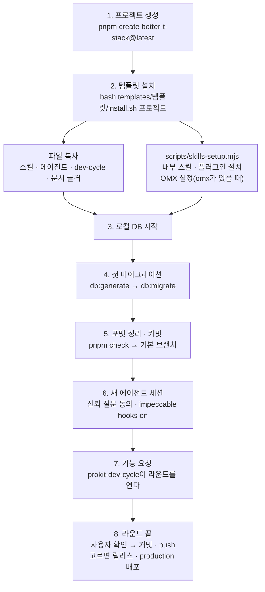

# 빠른 시작: 서비스 만들기

> 한눈에: 로그인과 DB까지 갖춘 서비스는 pro-kit 폴더에서 에이전트에게 템플릿과 프로젝트 이름을 말하면 만들어져요. 에이전트가 앱 뼈대를 만들고 템플릿을 설치한 다음, 내 컴퓨터에 개발용 DB를 띄우고 결과를 저장(커밋)하는 데까지 마쳐요. 기능 개발은 그다음 새 폴더에서 시작해요.

## 요청하기

pro-kit 폴더에서 에이전트를 열고 DB 종류와 프로젝트 이름을 넣어 요청해요.

<!-- b:open-in-kit -->
```bash
cd pro-kit          # pro-kit 폴더
claude              # Codex는 codex, Antigravity는 agy, Grok Build는 grok --trust
```
<!-- /b -->

여는 명령과 도구마다 읽는 파일은 [지원하는 에이전트](supported-agents.md)에 있어요.

```text
supabase 템플릿으로 my-app 프로젝트 만들어줘
```

```text
neon 템플릿으로 study-planner 프로젝트 만들어줘
```

- **DB 종류**: `supabase` 또는 `neon`이에요. 고르기 어려우면 빼고 요청하세요. 에이전트가 차이를 설명하고 물어봐요([템플릿 고르기](../templates/choose.md)).
- **프로젝트 이름**: 영어 소문자와 하이픈(`-`)으로 지어요. 예: `my-app`, `study-planner`
- **만들어지는 곳**: pro-kit과 같은 폴더에 프로젝트 이름으로 새 폴더가 생겨요. 다른 곳을 원하면 요청에 경로를 적어요.
- **Windows**: WSL2의 Ubuntu에서 열어요([준비물](requirements.md#windows)).

## 요청하면 이렇게 진행돼요

1. **확인**: DB 종류나 이름이 없으면 물어요. 같은 이름의 폴더가 이미 있거나 필요한 프로그램이 없으면 멈추고 설치 방법을 알려 줘요.
2. **앱 뼈대 만들기**: Better-T-Stack으로 로그인까지 되는 Next.js 앱을 만들어요.
3. **템플릿 설치**: 프로젝트 규칙, 전용 스킬 <!-- v:prokit.skills.count -->8<!-- /v -->개, 구현·리뷰 에이전트, 작업 확인 도구(dev-cycle), 배포 스크립트를 넣어요. 공식 스킬과 플러그인은 그때의 최신판으로 설치해요.
4. **개발용 DB 준비**: 내 컴퓨터에 DB를 띄우고 로그인에 필요한 테이블을 만들어요.
5. **점검과 커밋**: 코드 형식을 정리하고 검사를 모두 통과하는지 확인한 뒤 결과를 git에 커밋해요.
6. **보고**: 프로젝트 위치, DB 주소와 끄는 명령, 검사 결과, 이어서 할 일을 알려 줘요.

원격 DB 연결, Vercel 배포, GitHub에 올리기(push), 전역 도구 설치는 요청할 때만 해요. 다만 <!-- v:policy.agentBrowser.yo -->agent-browser CLI는 없거나 npm 최신판보다 낮으면 기본으로 최신판을 설치해요<!-- /v -->.



## 자세히

### 에이전트가 따르는 절차

에이전트는 [AGENTS.md](../../AGENTS.md)의 "템플릿으로 새 프로젝트 만들기" 1~10번을 순서대로 따르고, 명령은 템플릿 README의 "새 프로젝트 시작"과 "설치한 뒤"를 그대로 써요.

| 단계 | 하는 일 |
|---|---|
| 위치 | pro-kit 밖에 만들어요. 기본은 pro-kit의 상위 폴더(`../<이름>`)예요. 대상 폴더가 이미 있으면 멈추고 물어요 |
| 생성 | neon은 `--db-setup docker`, supabase는 `--db-setup supabase --manual-db`로 `pnpm create better-t-stack@latest <이름> …`을 실행해요 |
| 설치 | `bash <pro-kit>/templates/<템플릿>/install.sh <프로젝트 경로>`로 설치해요. `--with-global`은 전역 도구 설치를 요청할 때만 붙여요 |
| 로컬 DB (neon) | <!-- v:port.neonDb -->5432<!-- /v --> 포트가 쓰이는지 먼저 보고, 쓰이면 `DB_PORT`로 바꿔요. `packages/db`에서 `podman compose up -d`(Docker면 `db:start`)로 띄워요 |
| 로컬 DB (supabase) | Podman이면 `DOCKER_HOST`를 먼저 설정해요. `packages/db`에서 `supabase init`을 실행하고 `project_id`를 프로젝트 이름으로 바꾼 뒤 `supabase start -x …`로 DB만 띄워요 |
| 첫 마이그레이션 | `db:generate`로 인증 테이블 마이그레이션을 만들고 `db:migrate`로 적용해요. supabase는 적용 전에 `enable_rls_auth` 커스텀 마이그레이션을 더하고, 적용 뒤 `supabase db advisors --local --type security`가 `No issues found`인지 확인해요. BTS가 만든 README의 `db:push` 단계는 따르지 않아요 |
| 확인 | `pnpm check`로 포맷과 정렬을 한 번 정리한 뒤 `pnpm skills:check`, `pnpm agents:check`, `pnpm check-types`, `pnpm exec biome check .`가 모두 exit 0인지 봐요 |
| 커밋 | 설치 결과, 포맷 정리, 첫 마이그레이션을 기본 브랜치에 커밋해요 |

> [!IMPORTANT]
> 첫 커밋을 건너뛰면 설치한 파일과 첫 마이그레이션(`packages/db`, 케이스 E)이 첫 라운드의 변경 내용(diff)에 섞여요. 그러면 `audit`이 실제 작업보다 무거운 케이스로 올리라고 요구해요. 라운드는 기본 브랜치와 갈라진 지점(merge-base)부터 바뀐 내용을 보므로 기능 브랜치에 커밋해도 해결되지 않아요([케이스 <!-- v:devCycle.cases.range -->A\~F·H<!-- /v -->와 대조표](../concepts/cases.md)).

### 직접 하기

명령 전체는 각 템플릿 README의 "새 프로젝트 시작"에 있어요([neon](../../templates/prokit-next-neon/README.md#새-프로젝트-시작) · [supabase](../../templates/prokit-next-supabase/README.md#새-프로젝트-시작)).

1. 상위 폴더에서 `pnpm create better-t-stack@latest my-app …`을 실행해요. 옵션은 템플릿 README에 적힌 그대로 써요.
2. `bash pro-kit/templates/<템플릿>/install.sh my-app`으로 설치해요.
3. 로컬 DB를 띄워요. neon은 `packages/db`에서 `podman compose up -d`, supabase는 `supabase init`, `project_id` 변경, `supabase start -x …`예요.
4. `db:generate` → (supabase는 `enable_rls_auth` 커스텀 마이그레이션) → `db:migrate` 순서로 첫 마이그레이션을 적용해요.
5. `pnpm check`로 포맷을 정리하고 `pnpm exec biome check .`가 exit 0인지 본 뒤 기본 브랜치에 커밋해요.
6. 새 에이전트 세션을 열고 신뢰 질문에 동의해요. 프로젝트 루트에서 `.agents/skills/impeccable/scripts/impeccable hooks on`을 실행하고 `GLOSSARY.md`, `docs/domain/project.md`를 채워요.

이미 만든 프로젝트를 팀원이 클론했다면 `pnpm install` 뒤에 `pnpm skills:setup`을 한 번 실행해요. 선택 스킬 묶음을 쓰는 프로젝트면 `--optional <묶음>`을 붙여요.

## 관련 문서

- [템플릿 고르기](../templates/choose.md)
- [설치기와 옵션](../templates/installer.md)
- [만든 뒤 개발하기](after-create.md)
- [dev-cycle 라운드](../concepts/dev-cycle.md)
