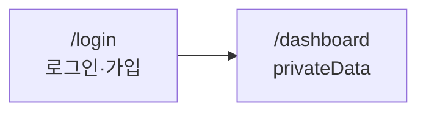

# 프로젝트 개관

이 문서는 서비스의 현재 모습을 적는다. 용어는 `GLOSSARY.md`, 결정 이유는 `docs/adr/`, 대상 사용자와 제품 어조는 `PRODUCT.md`(impeccable 스킬이 만든다)에 둔다. 기능을 바꾼 라운드는 닫기 전에 이 문서를 갱신하거나 대조표에 `N/A: 사유`를 적는다.

갱신은 해당 절의 표와 문장을 고치는 것이다. 날짜별 절이나 진행 경과를 덧붙이지 않는다(경과는 `tasks/archive/`에 남는다). 계획 중인 기능은 `기능` 표에 `계획` 상태로 넣고 스펙을 링크한다. 표의 `용어` 칸에는 `GLOSSARY.md`의 용어를 그대로 적는다.

## 한 줄 요약
무엇을, 누구를 위해 제공하는지 한 문장.

## 사용자와 권한
| 역할 | 할 수 있는 일 | 확인 위치 |
|---|---|---|
| 방문자 | 로그인, 가입 | `apps/web/src/app/login` |
| 로그인 사용자 | 자기 데이터만 조회와 변경 | `protectedProcedure` |

## 주요 흐름
사용자가 목적을 이루는 흐름을 화면(URL)과 프로시저로 그린다. 흐름이 바뀐 라운드에서 고친다.

## 기능
| 기능 | 상태 | 화면 | API | 스펙 |
|---|---|---|---|---|
| 로그인과 가입 | 구현 | `/login` | Better Auth | 해당 없음 |

상태는 `계획`, `구현`, `중단` 가운데 하나다.

## 화면과 URL
| URL | 화면 | 보호 | 파일 |
|---|---|---|---|
| `/` | 홈 | 공개 | `apps/web/src/app/page.tsx` |
| `/login` | 로그인과 가입 | 공개 | `apps/web/src/app/login/page.tsx` |
| `/dashboard` | 대시보드 | 로그인 | `apps/web/src/app/dashboard/page.tsx` |

## API (oRPC)
| 프로시저 | 용어 | 보호 | 입력 | 설명 |
|---|---|---|---|---|
| `healthCheck` | 해당 없음 | 공개 | 없음 | 상태 확인 |
| `privateData` | 사용자 | 로그인 | 없음 | 세션 확인 예시 |

## 데이터 모델과 코드 매핑
| 테이블 | 용어 | 스키마 파일 | 소유자 컬럼 | RLS | 설명 |
|---|---|---|---|---|---|
| `user` | 사용자 | `packages/db/src/schema/auth.ts` | 해당 없음 | 켬(커스텀 마이그레이션, 정책 없음) | Better Auth 생성물 (`pnpm auth:generate`) |
| `session`, `account`, `verification` | 해당 없음 | `packages/db/src/schema/auth.ts` | 해당 없음 | 켬(커스텀 마이그레이션, 정책 없음) | Better Auth 내부 테이블 |

## 범위 밖
아직 하지 않기로 한 것과 그 이유. 뒤로 미룬 기능도 여기에 옮긴다.
