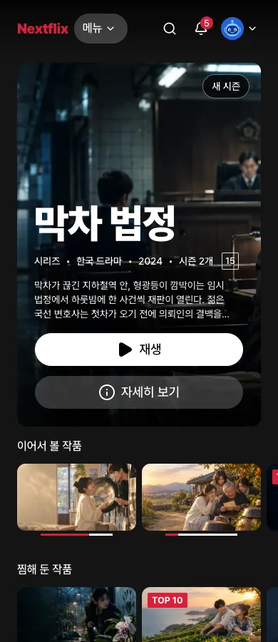
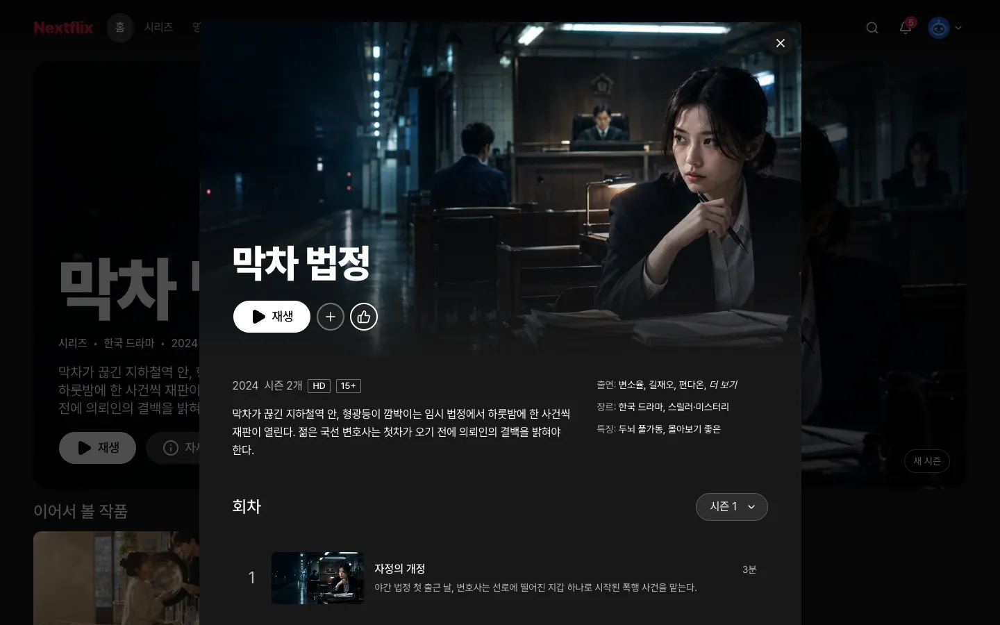

# 4장. 모든 화면 만들기

## 이번 장에서 할 일

사이트맵의 모든 페이지를 [프리셋 팩](../reference/glossary.md#만들기)(<!-- v:gloss.clonePack -->만들 서비스의 화면 구성, 기능 규칙, 디자인 노트, 예시 데이터, 그림을 묶어 둔 폴더<!-- /v -->)의 [예시 데이터](../reference/glossary.md#만들기)(화면을 먼저 보기 위해 넣어 두는 가짜 데이터)와 그림으로 만들어요. **로그인과 저장 같은 기능은 아직 없고 화면만 있어요.** 찜이나 평가 버튼은 눌러도 화면에서만 바뀌고, 새로고침하면 처음으로 돌아가요.

<!-- b:clone-screens-preset-site name=nextflix -->
[프리셋 사이트](https://roadkwon-ai.github.io/pro-kit/nextflix/)가 이 장의 완성 예시예요. 가장 오래 걸리는 장이에요.
<!-- /b -->

## 1. 모든 페이지 만들기

3장에서 화면 구성을 고른 대화창에 보내요.

```prompt
사이트맵의 모든 페이지를 프리셋 팩의 예시 데이터(data)와 그림으로 만들어줘. 그림은 팩의 images 폴더에 있어.
푸터에는 팩에 적힌 연습용 안내 문구를 넣어줘.
로그인과 저장 같은 기능은 다음에 만들 거야. 지금은 넣지 마.
```

에이전트는 이런 일을 해요.

- 프리셋 팩의 예시 데이터를 프로젝트에 복사해요.
- 프리셋 팩의 `images/`에 있는 그림을 `apps/web/public/images/`에 복사해요.
- [빌보드](../reference/glossary.md#디자인)(홈 맨 위의 큰 대표 작품 화면), 작품 줄, [hover 창](../reference/glossary.md#디자인)(카드에 마우스를 올리면 펼쳐지는 작은 창), 상세 창부터 만들어요. 이어서 랜딩, 로그인, 가입, 프로필, 검색, 재생, 계정, 게임, 클립, 고객 센터까지 사이트맵의 모든 페이지를 차례로 만들어요.
- 페이지마다 데스크톱과 휴대폰 화면을 찍어 확인하고, 모든 링크와 버튼을 눌러 봐요.
- 디자인 리뷰([critique](../reference/glossary.md#디자인))와 검사로 점수를 매기고 다듬어요.

중간에 멈추면 이렇게 보내세요.

```prompt
이어서 만들어줘.
```

## 2. 직접 보기

만드는 중이거나 다 만든 뒤에 내 브라우저로 볼 수 있어요.

```prompt
개발 서버 켜고 브라우저로 열 주소 알려줘.
```

알려 준 주소(보통 <!-- v:port.web.urlCode -->`http://localhost:3001`<!-- /v -->)는 첫 화면(랜딩)이에요. 랜딩에서 로그인으로 들어가(아무 이메일과 비밀번호를 넣어도 돼요) 프로필을 고르면 홈이 나와요. 메뉴와 카드를 눌러 보고, 창 너비를 줄여 휴대폰 크기에서도 보세요.

프로필 메뉴의 계정과 고객 센터, 홈의 클립과 라이브 줄도 열어 보세요. 자물쇠가 붙은 예시 프로필은 화면에 적힌 예시 PIN으로 들어가요.

**이렇게 되면 성공**
- 카드에 마우스를 올리면 잠시 뒤 크게 펼쳐져요.
- 작품을 누르면 주소가 바뀌며 상세 창이 뜨고, `Esc`로 닫혀요.
- 헤더 메뉴가 홈, 시리즈, 영화, 게임, 요즘 대세, 나의 Nextflix, 언어별로 찾아보기 7개예요.
- 창을 좁히면 한 줄에 보이는 카드 수가 줄고 메뉴가 접혀요.
- 게임 3개를 브라우저에서 끝까지 할 수 있어요.
- 재생 화면에 "음성 및 자막"과 속도 버튼이 있어요.
- 가입과 계정 화면의 결제 수단은 예시 중에서 고르기만 하고, 카드 번호를 넣는 칸이 없어요.
- 푸터에 연습용 안내 문구가 있어요.






프리셋 사이트는 이런 모습이에요. 내 화면은 그림이 달라도 정상이에요.

## 3. 확인하고 마치기

<!-- b:clone-screens-review -->
다 만들면 에이전트가 결과를 직접 보고 확인해 달라고 해요. 볼 순서와 남은 문제를 함께 알려 줘요. 괜찮으면 `확인했어`라고 보내고, 고칠 곳이 있으면 이렇게 말하세요.
<!-- /b -->

```prompt
휴대폰 크기에서 프로필 메뉴가 안 열려. 고쳐줘.
```

<!-- b:clone-screens-confirmed -->
확인하면 [라운드](../reference/glossary.md#만들기)(기능 하나를 만들거나 요청한 것을 고치고 확인까지 마치는 작업 묶음)가 닫히고 에이전트가 이번 작업을 기록(커밋)해요.
<!-- /b -->

<details>
<summary>막히면</summary>

- **그림을 못 찾는대요**: `그림은 옆 폴더 pro-kit의 packs/nextflix/images에 있어`라고 보내세요.
- **영상이 안 나와요**: 영상은 Blender 공개 영화 사이트에서 바로 받아요. 주소가 바뀌었을 수 있으니 `재생 화면에서 영상이 안 나와. videos.json의 apiUrl에서 새 주소를 받아 바꿔줘`라고 보내세요.
- **중간에 멈췄어요**: `이어서 만들어줘`라고 보내세요. 사용량 한도에 걸렸으면 안내된 시간이 지난 뒤 `~/projects/nextflix`에서 `claude --continue --dangerously-skip-permissions`(Codex는 `codex resume --last --yolo`)로 다시 열고 `이어서 해줘`라고 보내세요. 기다리는 법은 [<!-- v:limit.window -->5시간<!-- /v --> 한도에 걸리면](../reference/costs-and-keys.md#5시간-한도에-걸리면)에 있어요.
- **로그인이나 저장까지 만들려고 해요**: `로그인과 저장은 다음에 만들 거야. 지금은 넣지 마`라고 보내세요.
- **게임이나 고객 센터 같은 페이지가 빠졌어요**: `screens.md 사이트맵과 비교해서 빠진 페이지를 만들어줘`라고 보내세요.
- **화면이 고른 구성과 많이 달라요**: `홈 화면을 3장에서 고른 구성과 비교해서 다른 곳을 맞춰줘`라고 보내세요.
- **화면이 안 열려요**: `개발 서버가 켜져 있는지 확인하고 다시 켜줘`라고 보내세요.
- **화면에 Nextflix가 남았어요(이름을 바꿨을 때)**: `팩은 고치지 말고, 화면과 제목, 메타 정보에 남은 팩의 서비스 이름을 내가 정한 이름으로 바꿔줘`라고 보내세요.

</details>

## 에이전트가 물어보면

| 질문 | 답 |
|---|---|
| 결과를 직접 보고 확인해 달라 | 알려 준 주소로 둘러본 뒤 `확인했어` 또는 고칠 곳 |
| 점수가 기준에 못 미칠 때 더 다듬을지 | `한 번 더 다듬어줘` 또는 `이대로 둬` |
| 페이지 전환 효과에 쓸 도구를 설치할지 | `설치해줘` |

다음: [5장. 로그인과 프로필](05-auth-profiles.md)
