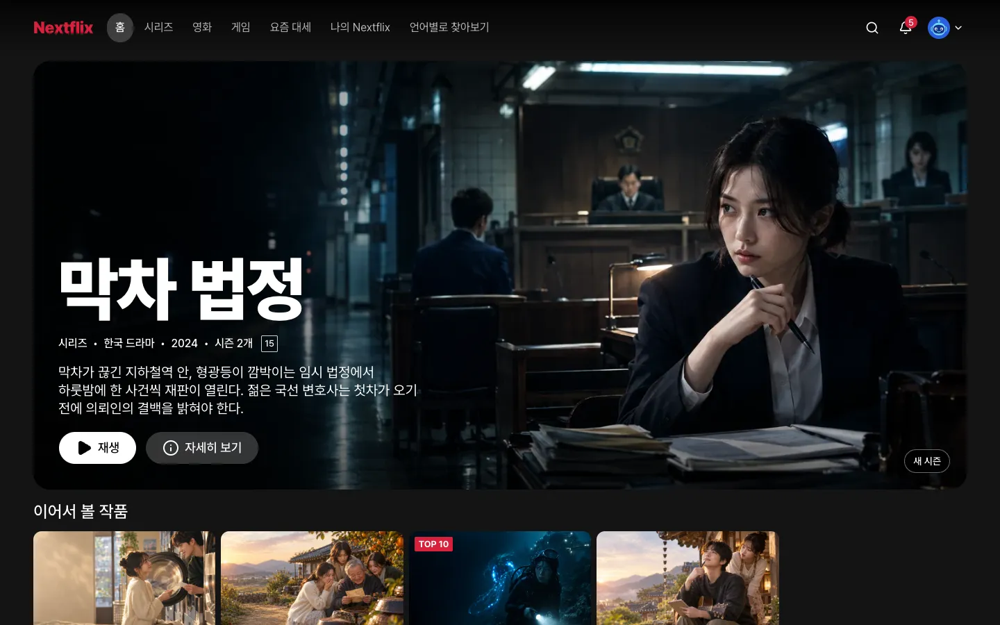

# 6장. 작품을 DB로

## 이번 장에서 할 일

4장에서 [예시 데이터](../reference/glossary.md#만들기) 파일로 보여 주던 작품, 시즌, 회차, 줄 구성을 DB로 옮겨요. 작품의 언어, 예고편, 프로필마다 다르게 고르는 카드 그림(맞춤 썸네일)도 함께 옮기고, 언어별로 찾아보기도 DB에서 걸러 보여 줘요. **화면은 그대로이고 값만 DB에서 와요.**

7~10장의 검색, 찜, 평가, 이어 보기가 모두 이 장에서 만드는 표를 써요. 게임, 클립, 고객 센터 글은 DB로 옮기지 않고 예시 데이터 그대로 둬요.

## 1. 작품을 DB로 옮기기

5장의 확인을 마친 에이전트에 보내요. 프로젝트 폴더에서 새로 연 에이전트여도 돼요.

```prompt
예시 데이터로 보여 주던 작품, 시즌, 회차, 줄 구성을 DB로 옮겨줘. 작품의 언어, 예고편, 대체 카드 그림도 함께 옮겨줘.
프리셋 팩 features.md "작품·언어·예고편·게임·도움말"의 규칙과 데이터 모델 힌트대로 만들고, 화면은 지금 모습 그대로 DB에서 읽게 해줘.
언어별로 찾아보기의 필터도 DB 질의로 바꾸고, 카드 그림은 팩 규칙대로 프로필마다 골라줘.
5장에서 만든 어린이 프로필의 등급 상한은 모든 질의에서 지켜줘.
```

데이터 모델 힌트는 [프리셋 팩](../reference/glossary.md#만들기)(<!-- v:gloss.clonePack -->만들 서비스의 화면 구성, 기능 규칙, 디자인 노트, 예시 데이터, 그림을 묶어 둔 폴더<!-- /v -->)에 적어 둔 표 설계의 출발점이에요. 에이전트는 이런 순서로 일해요.

1. [스펙](../reference/glossary.md#만들기)(<!-- v:gloss.spec -->기능의 범위와 동작을 적은 문서<!-- /v -->)을 보여 주며 확인을 받아요.
2. 작품, 태그, 그림, 언어, 예고편, 시즌, 회차, 영상, 줄 구성 표를 만드는 [마이그레이션](../reference/glossary.md#만들기)(<!-- v:gloss.migration -->DB의 표를 만들거나 바꾸는 기록<!-- /v -->)을 만들어 내 컴퓨터의 DB에 적용해요.
3. 예시 데이터를 DB에 넣는 프로그램(씨앗 데이터 스크립트)을 만들어 실행해요. 다시 실행해도 데이터가 겹치지 않아요.
4. 화면이 예시 데이터 파일 대신 DB에서 읽게 바꾸고, 데스크톱과 휴대폰 화면을 찍어 확인해요.
5. 리뷰를 마치면 개발 서버를 켜 두고 확인을 요청해요.

이어서 볼 작품, 찜해 둔 작품, 시청한 예고편, 좋아요 표시한 작품 줄은 8~10장에서 내 데이터로 바꿀 때까지 예시 데이터 그대로예요. 그래서 이 장에서 DB로 옮겨도 비지 않아요.

**이렇게 되면 성공**
- 홈, 시리즈, 영화, 요즘 대세 화면이 전과 같아요.
- 대화창에 `DB에 작품이 몇 개 있어?`라고 물으면 50개(시리즈·영화 48편과 라이브 2편)라고 답해요.
- 상세 창에 [관람 등급](../reference/glossary.md#만들기)(볼 수 있는 나이 기준)이 보여요. 누구나 볼 수 있는 작품(예: 솔방울 우체부)은 "전체"로 나와요.
- 상세 창의 "예고편 및 다른 영상"이 전과 같고, 언어별로 찾아보기에서 언어를 바꾸면 결과가 걸러져요.
- 어린이 프로필로 바꾸면 상한을 넘는 작품이 보이지 않아요.



프리셋 사이트의 홈 화면이에요. 이 장을 마친 뒤에도 화면은 이대로이고, 작품만 DB에서 와요.

괜찮으면 `확인했어`라고 보내세요. 확인하면 에이전트가 [라운드](../reference/glossary.md#만들기)(<!-- v:gloss.round -->기능 하나를 만들거나 요청한 것을 고치고 확인까지 마치는 작업 묶음<!-- /v -->)를 닫고 이번 작업을 기록(커밋)해요.

<details>
<summary>막히면</summary>

- **줄 순서나 줄 안의 작품 순서가 4장과 달라요**: `줄 구성은 rows.json 순서 그대로 DB에 넣고 그 순서로 보여줘`라고 보내세요.
- **작품이 50개가 아니래요**: `titles.json의 작품이 모두 DB에 들어갔는지 세어 보고, 빠진 작품을 다시 넣어줘`라고 보내세요.
- **이어 보기, 찜, 예고편, 좋아요 줄이 비었어요**: `이어 보기, 찜, 시청한 예고편, 좋아요 줄은 8~10장 전까지 rows.json의 예시 그대로 보여줘`라고 보내세요.
- **작품 그림이 안 나와요**: `작품 그림이 안 나와. DB의 그림 주소가 apps/web/public/images의 파일을 가리키는지 확인해줘`라고 보내세요.
- **DB에 연결할 수 없대요**: Docker Desktop이 켜져 있는지 보고 `DB가 켜져 있는지 확인하고 안 켜져 있으면 켜줘`라고 보내세요.
- **프리셋 팩을 못 찾는대요**: `프리셋 팩은 옆 폴더 pro-kit의 packs/nextflix에 있어. 없으면 pro-kit 폴더에서 node scripts/pack.mjs nextflix 명령으로 받아줘`라고 보내세요. pro-kit 폴더가 2026-10-08 전에 받은 것이라 팩 받기가 멈추면 `그 폴더 이름을 pro-kit-old로 바꾸고 새로 받아줘`라고 보내세요.
- **앞 장 작업을 이어서 하려 하거나 중간에 멈췄어요**: [5장의 막히면](05-auth-profiles.md#3-직접-써-보고-확인하기)과 같아요.
- 그 밖의 문제는 [막혔을 때](../reference/troubleshooting.md)를 보세요.

</details>

## 에이전트가 물어보면

<!-- b:feature-round-outro auth=05-auth-profiles.md -->
5장처럼 [라운드](../reference/glossary.md#만들기)(기능 하나를 만들거나 요청한 것을 고치고 확인까지 마치는 작업 묶음) 하나로 진행되고, 끝에 직접 써 보고 확인해 달라고 해요. [4장](04-screens.md#에이전트가-물어보면)과 [5장](05-auth-profiles.md#에이전트가-물어보면) 표의 질문(디자인 점수, 스킬 업데이트 등)도 나올 수 있어요. 선택지 창에서 답하는 법은 [질문에 답하는 법](../reference/claude-code-and-codex.md#질문에-답하는-법)에 있어요.
<!-- /b -->

| 질문 | 답 |
|---|---|
| 데이터 모델 힌트와 다르게 만들자는 제안 | 모르겠으면 `추천대로 해줘` |
| 스펙을 확인해 달라 | 읽어 보고 `좋아, 진행해줘` 또는 고칠 곳 |
| 계획을 확인하고 구현 방식을 골라 달라 | `추천대로 해줘` |
| 직접 보고 확인해 달라 | 둘러본 뒤 `확인했어` 또는 고칠 곳 |

다음: [7장. 검색](07-search.md)
