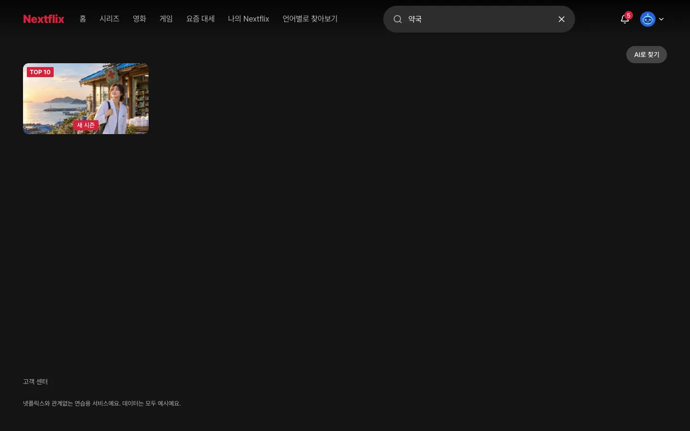

# 7장. 검색

## 이번 장에서 할 일

헤더의 검색 칸으로 작품 이름, 배우, 장르를 찾게 해요. 4장에서는 예시 데이터 파일에서 찾았는데, 이제 6장에서 만든 DB에서 찾아요. 한글 두 글자로도 찾을 수 있어야 해요.

검색 화면의 "AI로 찾기"도 DB에서 찾게 바꿔요. **이름은 AI지만 프리셋 팩의 규칙표로 문장을 조건으로 풀 뿐, 실제 AI 모델은 부르지 않아요.** 실제 AI 모델을 붙이는 법은 [더 해 보기](#더-해-보기)에 있어요.

## 1. 검색 만들기

6장의 확인을 마친 에이전트에 보내요.

```prompt
검색을 실제로 동작하게 해줘. 프리셋 팩 features.md "검색과 AI 검색"의 규칙대로 제목, 배우, 장르로 찾게 해줘.
AI로 찾기도 DB에서 찾게 바꾸되, 같은 절의 규칙표만 써줘. 실제 AI 모델은 부르지 마.
어린이 프로필이면 등급 상한을 넘는 작품은 결과에서 빼줘.
```

<!-- b:feature-round-intro -->
[프리셋 팩](../reference/glossary.md#만들기)은 만들 서비스의 화면 구성, 기능 규칙, 디자인 노트, 예시 데이터, 그림을 묶어 둔 폴더예요. 에이전트는 이런 순서로 일해요.
<!-- /b -->

1. [스펙](../reference/glossary.md#만들기)(<!-- v:gloss.spec -->기능의 범위와 동작을 적은 문서<!-- /v -->)을 보여 주며 확인을 받아요.
2. DB의 검색 기능(`pg_trgm`, 글자를 몇 개씩 잘라 비슷한 말을 찾는 기능)을 켜고, 작품 이름에 검색용 색인(빨리 찾게 해 주는 목차)을 다는 [마이그레이션](../reference/glossary.md#만들기)(<!-- v:gloss.migration -->DB의 표를 만들거나 바꾸는 기록<!-- /v -->)을 만들어 적용해요.
3. 한글 검색에도 색인을 쓸 수 있는지 DB 문자 설정을 확인해요.
4. 검색 결과를 DB에서 가져오게 바꾸고, 결과 화면과 결과가 없을 때의 안내를 확인해요.
5. 리뷰를 마치면 개발 서버를 켜 두고 확인을 요청해요.

**이렇게 되면 성공**
- `약국`처럼 작품 이름 두 글자로 찾으면 소금바람 약국이 나와요.
- `도해솔`처럼 배우 이름으로 찾으면 그 배우의 작품이 여러 개 나와요.
- 없는 말로 찾으면 맞는 작품이 없다는 안내와 추천 검색어가 나와요.
- "AI로 찾기"에 `웃기고 짧은 거`를 넣으면 "이렇게 이해했어요" 칩 두 개와 결과가 나와요.
- 어린이 프로필로 찾으면 상한을 넘는 작품이 나오지 않아요.



프리셋 사이트에서 `약국`을 입력한 화면이에요. 오른쪽 위 "AI로 찾기"를 누르면 문장으로 찾는 화면으로 바뀌어요. 이 장을 마치면 이 화면이 실제로 동작해요.

검색어를 칠 때마다 주소 끝의 `q=` 뒤 글자와 결과가 함께 바뀌어요. 괜찮으면 `확인했어`라고 보내세요.

<details>
<summary>막히면</summary>

- **한글로 찾으면 결과가 하나도 없어요**: `한글로 찾으면 결과가 없어. features.md "검색과 AI 검색" 규칙대로 ILIKE로 찾는지, 검색어가 서버에 그대로 가는지 확인하고 고쳐줘.`라고 보내세요.
- **검색 칸에 한글을 치면 글자가 끊기거나 사라져요**: `검색 칸에 한글을 치면 글자가 끊겨. screens.md의 검색 규칙대로 주소가 입력값을 따라가게 고쳐줘`라고 보내세요.
- **DB에 연결할 수 없대요**: Docker Desktop이 켜져 있는지 보고 `DB가 켜져 있는지 확인하고 안 켜져 있으면 켜줘`라고 보내세요.
- **프리셋 팩을 못 찾거나, 앞 장 작업을 이어서 하려 하거나, 중간에 멈췄어요**: [5장의 막히면](05-auth-profiles.md#3-직접-써-보고-확인하기)과 같아요.
- 그 밖의 문제는 [막혔을 때](../reference/troubleshooting.md)를 보세요.

</details>

## 더 해 보기

이 장의 확인을 마친 뒤 보내면 에이전트가 [라운드](../reference/glossary.md#만들기)를 새로 열어요.

### AI로 찾기에 실제 AI 모델 붙이기

> [!TIP]
> 규칙표가 모르는 문장도 AI 모델이 조건으로 바꿔 줘요. 모델을 부를 API 키가 필요하고, 쓴 만큼 요금이 나와요.

```prompt
AI로 찾기에 실제 AI 모델을 붙여줘. 팩은 고치지 말고, 이 프로젝트에서는 features.md "검색과 AI 검색"에서 실제 LLM을 쓰지 않는다는 부분만 이 기능으로 바꿔줘.
모델은 문장을 규칙표와 같은 조건으로만 바꾸고, 작품은 지금처럼 DB에서 찾아줘. 어떤 모델과 키를 쓸지는 추천해줘.
키는 .env에만 둬.
입력한 문장과 대화 기록은 저장하지 마. 키가 없거나 응답이 실패하면 규칙표로 돌아가게 해줘.
```

## 에이전트가 물어보면

<!-- b:feature-round-outro auth=05-auth-profiles.md -->
5장처럼 [라운드](../reference/glossary.md#만들기)(기능 하나를 만들거나 요청한 것을 고치고 확인까지 마치는 작업 묶음) 하나로 진행되고, 끝에 직접 써 보고 확인해 달라고 해요. [4장](04-screens.md#에이전트가-물어보면)과 [5장](05-auth-profiles.md#에이전트가-물어보면) 표의 질문(디자인 점수, 스킬 업데이트 등)도 나올 수 있어요. 선택지 창에서 답하는 법은 [질문에 답하는 법](../reference/claude-code-and-codex.md#질문에-답하는-법)에 있어요.
<!-- /b -->

| 질문 | 답 |
|---|---|
| 스펙을 확인해 달라 | 읽어 보고 `좋아, 진행해줘` 또는 고칠 곳 |
| 계획을 확인하고 구현 방식을 골라 달라 | `추천대로 해줘` |
| 직접 써 보고 확인해 달라 | 성공 항목대로 찾아본 뒤 `확인했어` 또는 고칠 곳 |

다음: [8장. 찜](08-my-list.md)
