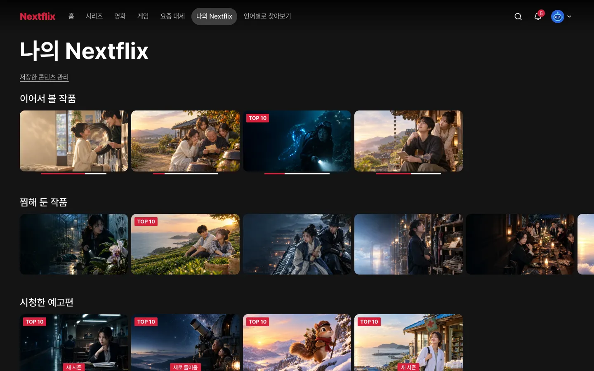

# 9장. 평가

## 이번 장에서 할 일

[hover 창](../reference/glossary.md#디자인)(카드에 마우스를 올리면 펼쳐지는 작은 창)과 상세 창의 평가를 DB에 저장해요. 평가는 "별로예요", "좋아요", "아주 좋아요" 세 단계예요. **"좋아요"나 "아주 좋아요"를 고른 작품은 나의 Nextflix의 "좋아요 표시한 작품" 줄에 모여요.**

## 1. 평가 저장하기

8장의 확인을 마친 에이전트에 보내요. 서비스 이름을 바꿨다면 `[Nextflix]`도 바꾸세요.

```prompt
평가를 실제로 저장되게 해줘. 프리셋 팩 features.md "찜·평가·다운로드·알림"의 평가 규칙대로 만들고, 좋아요 표시한 작품을 나의 [Nextflix] 화면에 모아줘.
어린이 프로필이면 등급 상한을 넘는 작품은 좋아요 줄에서도 빼줘.
```

<!-- b:feature-round-intro -->
[프리셋 팩](../reference/glossary.md#만들기)은 만들 서비스의 화면 구성, 기능 규칙, 디자인 노트, 예시 데이터, 그림을 묶어 둔 폴더예요. 에이전트는 이런 순서로 일해요.
<!-- /b -->

1. [스펙](../reference/glossary.md#만들기)(<!-- v:gloss.spec -->기능의 범위와 동작을 적은 문서<!-- /v -->)을 보여 주며 확인을 받아요.
2. 평가 표를 만드는 [마이그레이션](../reference/glossary.md#만들기)(<!-- v:gloss.migration -->DB의 표를 만들거나 바꾸는 기록<!-- /v -->)을 만들어 적용해요.
3. 평가를 저장하고 지우는 서버 기능을 만들어요. 찜처럼 고른 프로필로만 저장해요.
4. 두 계정으로 서로의 평가를 보거나 바꿀 수 없는지 자동 테스트로 확인해요.
5. 리뷰를 마치면 개발 서버를 켜 두고 확인을 요청해요.

처음에는 "좋아요 표시한 작품" 줄이 비어 있어요. 4장의 예시 대신 내가 평가한 작품이 나와서예요. 비어 있는 동안은 나의 Nextflix에 안내가 나와요.

평가 버튼을 누르면 세 단계가 펼쳐져요. 요즘 대세 화면의 "다음 주에 공개될 작품" 줄에 있는 작품은 아직 볼 수 없어서 평가 버튼이 없어요.

**이렇게 되면 성공**
- 세 단계 중 하나를 고르면 새로고침해도 남아 있어요.
- 같은 단계를 다시 누르면 취소돼요.
- "좋아요"나 "아주 좋아요"를 고른 작품이 "좋아요 표시한 작품" 줄에 모여요. "별로예요"를 고른 작품은 모이지 않아요.



프리셋 사이트의 나의 Nextflix 화면이에요(예시 데이터가 미리 들어 있어요). "좋아요 표시한 작품" 줄은 맨 아래 "시청한 예고편" 줄 다음이라 그림에서는 잘려 있어요. 이 장을 마치면 이 화면이 실제로 동작해요.

괜찮으면 `확인했어`라고 보내세요.

<details>
<summary>막히면</summary>

- **같은 단계를 다시 눌러도 취소되지 않아요**: `같은 평가를 다시 누르면 취소되게 해줘. features.md "찜·평가·다운로드·알림"의 평가 규칙대로`라고 보내세요.
- **다음 주에 공개될 작품에 평가 버튼이 있어요**: `공개 예정 작품에서는 평가 버튼을 빼고, 서버도 거부하게 해줘`라고 보내세요.
- **좋아요 줄에 예시 작품이 그대로 있어요**: `좋아요 표시한 작품 줄이 예시 데이터를 보여 줘. 내 프로필의 평가로 바꿔줘`라고 보내세요.
- **프리셋 팩을 못 찾거나, 앞 장 작업을 이어서 하려 하거나, 중간에 멈췄어요**: [5장의 막히면](05-auth-profiles.md#3-직접-써-보고-확인하기)과 같아요.
- 그 밖의 문제는 [막혔을 때](../reference/troubleshooting.md)를 보세요.

</details>

## 에이전트가 물어보면

<!-- b:feature-round-outro auth=05-auth-profiles.md -->
5장처럼 [라운드](../reference/glossary.md#만들기)(기능 하나를 만들거나 요청한 것을 고치고 확인까지 마치는 작업 묶음) 하나로 진행되고, 끝에 직접 써 보고 확인해 달라고 해요. [4장](04-screens.md#에이전트가-물어보면)과 [5장](05-auth-profiles.md#에이전트가-물어보면) 표의 질문(디자인 점수, 스킬 업데이트 등)도 나올 수 있어요. 선택지 창에서 답하는 법은 [질문에 답하는 법](../reference/claude-code-and-codex.md#질문에-답하는-법)에 있어요.
<!-- /b -->

| 질문 | 답 |
|---|---|
| 스펙을 확인해 달라 | 읽어 보고 `좋아, 진행해줘` 또는 고칠 곳 |
| 계획을 확인하고 구현 방식을 골라 달라 | `추천대로 해줘` |
| 직접 써 보고 확인해 달라 | 세 단계를 모두 눌러 본 뒤 `확인했어` 또는 고칠 곳 |

다음: [10장. 재생과 이어 보기](10-watch.md)
