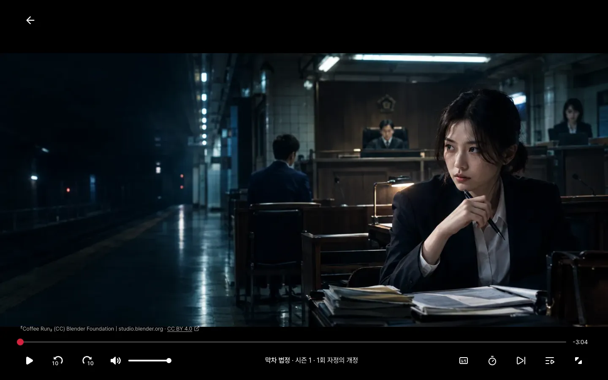

# 10장. 재생과 이어 보기

## 이번 장에서 할 일

영상은 4장부터 이미 나와요. **이번 장에서는 본 위치를 프로필마다 저장해 이어 보기 줄을 내 기록으로 바꿔요.** 보다 만 작품은 홈 첫 줄과 나의 Nextflix의 이어 보기 줄에 진행 막대와 함께 나와요.

이어서 시청 기록과 숨기기, 시청한 예고편 줄, 실제 기록으로 매기는 TOP 10을 만들어요. 광고형 요금제의 조건(속도 버튼 숨김, 볼 수 없는 작품)은 이 장에서도 지켜요. 광고와 라이브 방송은 끝까지 화면만 흉내 내요.

## 1. 재생과 이어 보기 만들기

9장의 확인을 마친 에이전트에 보내요.

```prompt
본 위치를 저장해서 이어 보기 줄에 보여줘.
프리셋 팩 features.md "재생·자막·광고·라이브·기록"의 규칙대로 하고, 재생기 판과 저작자 표기가 규칙과 맞는지 확인해줘.
광고형 요금제에서 속도 버튼을 숨기고 일부 작품을 막는 조건도 같은 절의 규칙대로 지켜줘. 어린이 프로필의 등급 상한도 지켜줘.
```

[저작자 표기](../reference/glossary.md#만들기)는 영상을 만든 곳과 이용 허락 조건을 밝히는 글이에요. 에이전트는 이런 순서로 일해요.

1. [스펙](../reference/glossary.md#만들기)(<!-- v:gloss.spec -->기능의 범위와 동작을 적은 문서<!-- /v -->)을 보여 주며 확인을 받아요.
2. 4장에서 설치한 영상 재생기 부품(`@videojs/react`)이 [프리셋 팩](../reference/glossary.md#만들기)(<!-- v:gloss.clonePack -->만들 서비스의 화면 구성, 기능 규칙, 디자인 노트, 예시 데이터, 그림을 묶어 둔 폴더<!-- /v -->)에 적힌 판으로 고정돼 있는지 확인해요(없으면 더해요). 고정해 두면 새 판이 나와도 저절로 바뀌지 않아요.
3. 시청 진행 표를 만드는 [마이그레이션](../reference/glossary.md#만들기)(<!-- v:gloss.migration -->DB의 표를 만들거나 바꾸는 기록<!-- /v -->)을 만들어 적용해요.
4. 본 위치를 저장하는 서버 기능을 만들어요. 끝까지 봤는지는 화면이 아니라 서버가 정해요.
5. 두 계정으로 서로의 시청 기록을 보거나 바꿀 수 없는지 자동 테스트로 확인해요.
6. 재생 화면의 영상 정보와 상세 창에 저작자 표기가 있는지 확인해요(없으면 더해요).
7. 리뷰를 마치면 개발 서버를 켜 두고 확인을 요청해요.

처음에는 이어 보기 줄이 비어 있어요. 4장의 예시 이어 보기 대신 내가 본 작품이 나와서예요. 홈의 이어 보기 줄은 비어 있으면 감춰지고, 나의 Nextflix에는 안내가 나와요.

시리즈를 하나 골라 재생해 보세요.

**이렇게 되면 성공**
- 30초쯤 보고 홈으로 돌아오면 이어 보기 줄에 진행 막대가 있어요.
- 다시 누르면 그 위치부터 재생돼요.
- 회차 끝까지 넘기면 다음 회차가 이어 보기 줄에 나와요.
- 이어 보기 줄 작품의 [hover 창](../reference/glossary.md#디자인)(카드에 마우스를 올리면 펼쳐지는 작은 창)이나 상세 창에서 "줄에서 제거"를 누르면 그 작품이 줄에서 빠져요.



프리셋 사이트의 재생 화면이에요. 아래 오른쪽 아이콘 가운데 앞의 두 개가 "음성 및 자막"과 속도 버튼이에요. 이 장을 마치면 이 화면이 실제로 동작해요.

괜찮으면 `확인했어`라고 보내세요.

<details>
<summary>막히면</summary>

- **영상이 안 나오고 "영상을 불러오지 못했어요"가 떠요**: 영상 주소가 바뀌었을 수 있어요. `영상이 안 나와. videos.json의 apiUrl에서 주소를 다시 받아줘.`라고 보내세요.
- **재생기 판이 맞지 않는다는 오류가 나요**: `재생기 판 오류가 나. features.md에 적힌 판으로 고정해서 다시 설치해줘`라고 보내세요.
- **보다가 홈으로 나오면 이어 보기 줄에 없어요**: 나갈 때 본 위치가 저장되지 않았을 때예요. `재생 화면에서 나갈 때 본 위치가 저장되지 않아. 나갈 때 저장하는 부분을 확인하고 고쳐줘`라고 보내세요.
- **DB에 연결할 수 없대요**: Docker Desktop이 켜져 있는지 보고 `DB가 켜져 있는지 확인하고 안 켜져 있으면 켜줘`라고 보내세요.
- **프리셋 팩을 못 찾거나, 앞 장 작업을 이어서 하려 하거나, 중간에 멈췄어요**: [5장의 막히면](05-auth-profiles.md#3-직접-써-보고-확인하기)과 같아요.
- 그 밖의 문제는 [막혔을 때](../reference/troubleshooting.md)를 보세요.

</details>

## 2. 시청 기록, 예고편 기록, TOP 10

1절의 확인을 마친 에이전트에 보내요. 에이전트는 이 기능으로 [라운드](../reference/glossary.md#만들기)(<!-- v:gloss.round -->기능 하나를 만들거나 요청한 것을 고치고 확인까지 마치는 작업 묶음<!-- /v -->)를 새로 열어요. 서비스 이름을 바꿨다면 `[Nextflix]`도 바꾸세요.

```prompt
프리셋 팩 features.md "재생·자막·광고·라이브·기록"의 규칙대로 시청 기록을 저장해서 계정의 시청 기록 화면과 숨기기를 실제로 동작하게 해줘.
예고편과 미리 보기를 본 기록도 팩 규칙대로 저장해서 나의 [Nextflix]의 시청한 예고편 줄에 보여줘.
TOP 10 줄은 같은 절의 규칙대로 시청 기록을 시리즈와 영화로 따로 집계하고, 기록이 없으면 예시 순서를 써줘.
어린이 프로필이면 등급 상한을 넘는 작품은 TOP 10과 시청한 예고편 줄에서도 빼줘.
카드 그림도 팩 규칙대로 이 기록에서 많이 본 분위기에 맞춰 골라줘.
```

**이렇게 되면 성공**
- 계정의 프로필별 시청 기록에서 항목을 숨기면 그 작품이 이어 보기 줄에서 바로 빠져요.
- "모두 숨기기"는 확인 창을 거쳐요.
- 상세 창에서 예고편을 5초 넘게 보면 나의 Nextflix의 시청한 예고편 줄에 나와요.
- 시청 기록이 없으면 TOP 10이 4장과 같은 순서이고, 여러 작품을 재생한 뒤에는 본 작품이 순위에 들어와요. 라이브는 TOP 10에서 빠져요.

괜찮으면 `확인했어`라고 보내세요.

## 에이전트가 물어보면

<!-- b:feature-round-outro auth=05-auth-profiles.md -->
5장처럼 [라운드](../reference/glossary.md#만들기)(기능 하나를 만들거나 요청한 것을 고치고 확인까지 마치는 작업 묶음) 하나로 진행되고, 끝에 직접 써 보고 확인해 달라고 해요. [4장](04-screens.md#에이전트가-물어보면)과 [5장](05-auth-profiles.md#에이전트가-물어보면) 표의 질문(디자인 점수, 스킬 업데이트 등)도 나올 수 있어요. 선택지 창에서 답하는 법은 [질문에 답하는 법](../reference/claude-code-and-codex.md#질문에-답하는-법)에 있어요.
<!-- /b -->

| 질문 | 답 |
|---|---|
| 스펙을 확인해 달라 | 읽어 보고 `좋아, 진행해줘` 또는 고칠 곳 |
| 계획을 확인하고 구현 방식을 골라 달라 | `추천대로 해줘` |
| 직접 써 보고 확인해 달라 | 성공 항목대로 재생해 본 뒤 `확인했어` 또는 고칠 곳 |

다음: [11장. 검사와 다듬기](11-check.md)
