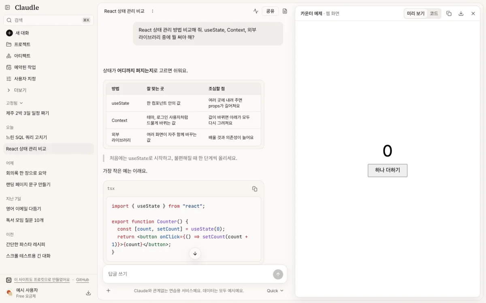
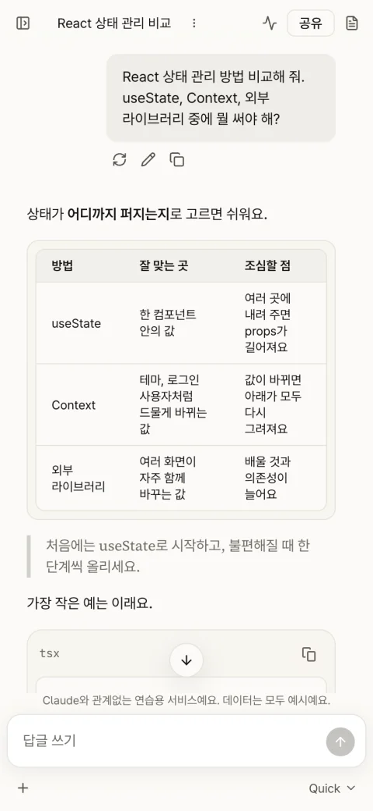

# Claude 같은 AI 대화 서비스 만들기

> [!NOTE]
> Claude와 관계없는 연습용 서비스예요. 데이터는 모두 예시예요.

Claude를 본떠 AI 대화 서비스 **Claudle**을 만들어요. 이름은 마음대로 바꿔도 돼요. 코드를 몰라도 프롬프트를 복사해 [에이전트](../reference/glossary.md#도구)(<!-- v:agents.list -->Claude Code, Codex, Antigravity, Grok Build<!-- /v --> 중 하나)에 붙여 넣으며 따라가면 돼요.

> [!WARNING]
> **토큰을 많이 쓰는 튜토리얼이에요.** 화면까지(1\~4장)는 <!-- v:preset.claudle.screens.time.text -->한 번에 완성하면 약 2시간 25분\~4시간 50분(여러 번 고쳐 달라고 하면 약 7시간 15분까지)<!-- /v --> 걸리고 최소 약 <!-- v:preset.claudle.screens.tokens -->300만<!-- /v --> 토큰(캐시 포함 약 <!-- v:preset.claudle.screens.cached -->1.5억<!-- /v -->)이 들어요. 끝까지(1\~12장)는 <!-- v:preset.claudle.full.time.text -->한 번에 완성하면 약 5시간\~10시간(여러 번 고쳐 달라고 하면 약 15시간까지)<!-- /v --> 걸리고 최소 약 <!-- v:preset.claudle.full.tokens -->610만<!-- /v --> 토큰(캐시 포함 약 <!-- v:preset.claudle.full.cached -->3억<!-- /v -->)이 들어요. 자세한 내용은 [시간과 비용](#시간과-비용)에 있어요.

## 무엇을 만드나요

[프리셋 사이트](https://roadkwon-ai.github.io/pro-kit/claudle/)에서 4장까지 만든 화면을 미리 볼 수 있어요. 프리셋 사이트는 로그인이나 저장 같은 기능 없이 화면만 있고, 답은 미리 써 둔 [모의 응답](../reference/glossary.md#만들기)이에요. 5장부터 이 화면에 실제 기능을 붙여요.

- **대화**: 인사말과 큰 입력창이 있는 새 대화 화면, "생각 중" 표시 뒤 글자가 흘러나오는 답([스트리밍](../reference/glossary.md#만들기)), 멈추기(`Esc`), 다시 시도, 복사, 질문 고치기, 표와 코드 블록이 있는 답, 맨 아래로 버튼
- **사이드바**: 고정한 대화와 이전 대화 목록, 접기(`⌘B`)와 너비 조절, 휴대폰의 전체 화면 메뉴, 대화 검색(`⌘K`), 사용자 메뉴, 단축키 창, 비공개 모드
- **프로젝트와 아티팩트**: 지침과 파일을 둔 프로젝트, 답 속 HTML을 그 자리와 오른쪽 창에서 미리 보는 [아티팩트](../reference/glossary.md#만들기)
- **로그인 전 화면**: 소개, 로그인, 요금제

앱 안 요금제, 앱 안내, 아티팩트 목록, 예약된 작업, 사용자 지정, 설정의 계정·결제·사용량 같은 탭은 끝까지 화면만 흉내 내요. 음성 모드와 받아쓰기, 웹 검색, 결제, 다른 제품(디자인·코드 도구) 화면은 만들지 않아요.





화면 배치와 흐름, 분위기는 Claude와 거의 같게 만들어요. 다만 로고는 서비스 이름 글자이고, 색과 서체는 비슷한 계열의 다른 것을 써요. 모델 이름도 지어낸 `Quick`, `Balanced`, `Deep`이에요. 대화, 프로젝트, 그림은 모두 지어낸 거예요.

<!-- b:clone-readme-pack name=claudle -->
원래 서비스는 미리 조사해서 [프리셋 팩](../reference/glossary.md#만들기)(만들 서비스의 화면 구성, 기능 규칙, 디자인 노트, 예시 데이터, 그림을 묶어 둔 폴더)에 담아 두었어요. 에이전트가 프리셋 팩만 보고 만드니 따로 조사하지 않아도 돼요. 팩에는 화면 구성(`screens.md`), 기능 규칙(`features.md`), 디자인 노트(`design-notes.md`), 배치도(`wireframes/`), 예시 데이터(`data/`), 그림(`images/`)이 들어 있어요.
<!-- /b -->

### AI 키가 없어도 끝까지 가요

4장의 답은 프리셋 팩에 미리 써 둔 답을 질문의 낱말로 골라 흘려 보여 줘요. 5장에서도 키가 없으면 같은 방식([모의 응답](../reference/glossary.md#만들기))으로 답하고 저장해요. **그래서 AI 키나 결제 없이 12장까지 갈 수 있어요.**

실제 AI 답을 보고 싶으면 [7장](07-ai-reply.md)에서 Kilo AI Gateway의 무료 키를 넣으면 돼요. 가입은 무료이고 결제 정보도 넣지 않아요. 키를 넣으면 무료 모델이 답하고, 서비스 전체에서 하루 <!-- v:preset.claudle.dailyLimit -->200<!-- /v -->번까지 써요.

## 가장 쉬운 방법

<!-- b:clone-readme-one-prompt -->
**프롬프트 하나로 4장까지 가요.** 에이전트가 pro-kit을 받아 프로젝트를 만들고, 프리셋 팩으로 기획, 디자인, 모든 화면을 이어서 만들어요. 중간에 몇 번 멈춰서 물어보는데, 잘 모르겠으면 `추천대로 해줘`라고 답하면 돼요.

5장부터는 만든 프로젝트 폴더에서 장별로 이어 가요.
<!-- /b -->

### 1. 작업 폴더에서 에이전트 열기

<!-- b:open-already-line -->
[시작하기](../start/README.md) 5단계에서 이미 열었다면 2단계로 가세요. 아니면 터미널에 입력하세요. `~/projects`는 pro-kit과 앞으로 만들 프로젝트가 모두 들어갈 작업 폴더예요.
<!-- /b -->

<!-- b:open-agent -->
```bash
mkdir -p ~/projects && cd ~/projects
claude --dangerously-skip-permissions   # Codex는 codex --yolo
```
<!-- /b -->

<!-- b:yolo-option tail="" -->
`--dangerously-skip-permissions`(Codex는 `--yolo`)는 **명령마다 허락을 묻지 않고 진행하는 옵션**이에요. 설치하고 검사하는 명령이 많아서 편의상 이 옵션으로 열어요. Claude Code는 처음 한 번 경고 화면이 나와요. 읽어 보고 `Yes, I accept`를 고르세요.
<!-- /b -->

<!-- b:yolo-warning-short -->
> [!WARNING]
> 이 옵션으로 연 에이전트는 묻지 않고 파일을 바꾸고, 프로그램을 설치하고, 인터넷에서 파일을 받아요. **작업 폴더나 그 안의 프로젝트 폴더에서만 열고**, 이상한 일을 하면 `Esc`로 바로 멈추세요. 자세한 주의는 [묻지 않고 진행하게 열기](../reference/claude-code-and-codex.md#묻지-않고-진행하게-열기)에 있어요.
<!-- /b -->

<!-- b:clone-readme-workfolder name=claudle -->
**프롬프트는 꼭 작업 폴더 `~/projects`에서 보내요.** 에이전트가 작업 폴더 안에 pro-kit과 새 프로젝트를 나란히 만들어요.

| 폴더 | 무엇이 들어 있나요 |
|---|---|
| `~/projects` | 작업 폴더. 여기서 에이전트를 열고 프롬프트를 보내요 |
| `~/projects/pro-kit` | 에이전트가 받아 오는 pro-kit. 프리셋 팩은 이 안의 `packs/claudle`에 받아요 |
| `~/projects/claudle` | 새 프로젝트. pro-kit 안이 아니라 옆에 생겨요 |
<!-- /b -->

### 2. 프롬프트 하나로 시작하기

<!-- b:clone-readme-paste name=claudle neun=은 -->
작업 폴더에서 연 에이전트에 붙여 넣으세요. 바꿀 곳은 `[ ]` 안 두 군데예요.

`[claudle]`은 프로젝트 폴더 이름(영어 소문자와 `-`), `[Claudle]`은 서비스 이름이에요. 폴더 이름을 바꿨다면 이후 명령의 `claudle`도 내 폴더 이름으로 바꿔요. 시안을 그려서 고르고 싶으면 보내기 전에 아래 팁을 보세요.

> [!IMPORTANT]
> **프롬프트만 보내면 에이전트가 이 프리셋 팩을 자동으로 받아 설치해요. 따로 받지 않아도 돼요.**
>
> 직접 받으려면 [claudle-pack.zip](https://github.com/roadkwon-ai/pro-kit-premium-packs/releases/download/pack-claudle/claudle-pack.zip)(1.0MB, [릴리스](https://github.com/roadkwon-ai/pro-kit-premium-packs/releases/tag/pack-claudle))을 받고, 프롬프트 끝에 `프리셋 팩 zip은 [~/Downloads/claudle-pack.zip]에 받아 뒀어.` 한 줄을 더하세요. 에이전트가 그 zip이 최신 판인지 확인하고, 옛 판이면 새로 받아요.
<!-- /b -->

```prompt
https://github.com/roadkwon-ai/pro-kit 을 이 폴더에 받고, 그 안의 AGENTS.md대로 neon 템플릿으로 pro-kit 옆에 [claudle] 폴더로 프로젝트를 만들어줘. 나중에 DB를 쓸 거라 로컬 DB까지 준비해줘. 없는 준비물은 설치해줘.
Claude 같은 AI 대화 서비스를 만들 거야. 이름은 [Claudle].
옆 폴더 pro-kit의 packs/claudle에 프리셋 팩을 받아줘.
그 팩으로 서비스 기획을 채워줘. 팩은 고치지 말고, 팩 데이터의 서비스 이름은 내가 정한 이름으로 바꿔 써.
디자인은 팩의 design-notes.md대로 DESIGN.md를 받아 고쳐 쓰고, 사이트맵의 모든 페이지를 팩의 예시 데이터와 그림으로 만들어줘.
홈 화면 구성은 시안을 그리지 말고 구성도로 보여 주고 고르게 해줘.
로그인, 저장, 실제 AI 답 같은 기능은 다음에 만들 거야. 지금은 답을 팩의 모의 응답으로 흘려 보여 줘.
푸터에는 팩에 적힌 연습용 안내 문구를 넣어줘.
```

에이전트는 먼저 이런 일을 해요. 몇 분 걸려요.

- pro-kit을 `~/projects/pro-kit`에 받고, 프리셋 팩을 그 안의 `packs/claudle`에 받아요.
- 준비물(Node, pnpm, git, Docker 또는 Podman)을 확인하고, 없는 것을 설치해요.
- **빈 프로젝트** `~/projects/claudle`을 만들고 pro-kit의 규칙, 스킬, 전문 에이전트를 설치해요.
- 내 컴퓨터에 [DB](../reference/glossary.md#만들기)(서비스의 데이터를 저장하는 곳)를 켜고, 로그인 정보를 담을 표를 만들어 둬요.
- 서비스 요청(`Claude 같은…`이 있는 줄부터 끝까지)을 새 프로젝트에 저장하고, 새 폴더에서 이어 갈 **명령 한 줄**을 알려 줘요.

<!-- b:clone-readme-db-note -->
> [!NOTE]
> 5장부터 DB를 쓰니 프로젝트를 만들 때 내 컴퓨터에 DB를 미리 켜 둬요. 그러려면 [Docker](../reference/glossary.md#도구) Desktop이나 Podman이 있어야 해요. 없으면 에이전트가 설치하거나 설치 방법을 알려 줘요.
<!-- /b -->

<!-- b:clone-readme-image-tip pic=그림 -->
> [!TIP]
> 그림은 프리셋 팩에서 받고, 홈 화면 구성은 [구성도](../reference/glossary.md#디자인)(고르기 페이지가 직접 그리는 화면 구성 그림)로 골라요. 그래서 AI로 그릴 그림이 없어요. [시안](../reference/glossary.md#디자인)(완성 화면을 미리 그린 그림)을 그려서 고르고 싶으면 프롬프트에서 `홈 화면 구성은`으로 시작하는 줄을 빼고 보내세요. Codex, Antigravity, Grok Build는 자체 이미지 도구로 그려서 준비할 것이 없어요. Claude Code는 스스로 그리지 못해서 이미지 API 연결이 필요해요. 보내기 전에 유료 OpenAI API 키를 넣거나 ChatGPT 유료 요금제로 Codex CLI에 로그인해 두세요([이미지 그리기](../reference/costs-and-keys.md#이미지-그리기)). 준비하지 않으면 구성도로 만들어요.
<!-- /b -->

### 3. 알려 준 한 줄로 이어 가기

<!-- b:exit-line -->
대화창에 `/exit`(Codex는 `/quit`)를 입력해 닫고, 에이전트가 알려 준 한 줄을 복사해 터미널에 붙여 넣으세요. 이런 모양이에요.
<!-- /b -->

<!-- b:continue-line folder=claudle -->
```bash
cd ~/projects/claudle && claude --dangerously-skip-permissions "docs/first-request.md의 요청대로 이어서 해줘"
```
<!-- /b -->

<!-- b:open-new-folder -->
**새 프로젝트 폴더에서 열어야 pro-kit의 규칙, 스킬, 전문 에이전트가 모두 켜져요.** 처음 보낸 요청은 에이전트가 저장해 두었으니 다시 쓰지 않아도 돼요. 폴더를 믿을지 물으면 "예"를 고르세요.
<!-- /b -->

<!-- b:codex-hooks-line -->
Codex로 열었다면 대화창에 `/hooks`를 입력해 디자인 검사기 훅을 믿는다고 확인하세요.
<!-- /b -->

### 4. 답하며 4장까지 가기

<!-- b:clone-readme-qa-intro auth=05-auth-chats.md -->
새 폴더에서 열린 에이전트는 프리셋 팩을 읽고, 화면을 만들기 전에 몇 가지를 물어봐요. [2장](02-plan.md)~[4장](04-screens.md)의 "에이전트가 물어보면"과 같은 질문이고, 스킬 업데이트 질문은 [5장](05-auth-chats.md#에이전트가-물어보면) 표에 있어요. 선택지 창이 뜨면 직접 입력하는 칸을 고르고 아래 답을 붙여 넣으세요([질문에 답하는 법](../reference/claude-code-and-codex.md#질문에-답하는-법)).
<!-- /b -->

| 에이전트가 묻는 것 | 이렇게 답해요 |
|---|---|
| 서비스 질문: 누가 쓰는지, 무엇이 좋아지는지 | `질문의 답은 프리셋 팩에서 채우고, 없는 건 추천대로 해줘` |
| 첫 화면 문구 후보 | 마음에 드는 번호. 모르겠으면 `추천대로 해줘` |
| 디자인 스타일 1~3위 | `프리셋 팩에 적힌 주소의 스타일로 해줘` |
| 대표 색을 원본대로 쓸지 바꿀지 | `design-notes.md대로 바꿔줘` |
| 페이지 목록(사이트맵)과 페이지별 설계 | 빠진 화면이 없으면 `이대로 진행해줘` |
| 화면 구성 고르기 | 브라우저에 열린 고르기 페이지에서 마음에 드는 카드를 눌러요 |
| 시안을 그리게 했는데 이미지를 그릴 수 없어서 구성도로 고를지 | `그렇게 해줘. 이미지 없이 고를게` |
| 스트리밍 마크다운에 쓸 도구를 설치할지 | `설치해줘` |
| 점수가 기준에 못 미칠 때 더 다듬을지 | `한 번 더 다듬어줘` 또는 `이대로 둬` |
| 외부 스킬의 새 판이 있다며 업데이트할지 | `나중에` |
| 결과를 직접 보고 확인해 달라 | 알려 준 주소로 둘러본 뒤 `확인했어` |

**이렇게 되면 성공**
- 에이전트가 알려 준 주소를 브라우저로 열면 소개 화면이 보여요. 로그인 카드의 버튼을 누르면(아무것도 넣지 않아도 돼요) 새 대화 화면으로 가요.
- 질문을 보내면 "생각 중" 표시 뒤 답이 글자씩 흘러나와요.
- 사이드바로 예시 대화, 프로젝트, 아티팩트를 오갈 수 있어요.
- 화면 아래나 사이드바에 연습용 안내 문구가 있어요.

<details>
<summary>막히면</summary>

<!-- b:course-trouble folder=claudle name=claudle iyo=이에요 -->
- **비밀번호를 입력하라고 해요**: 프로그램 설치에 컴퓨터 비밀번호가 필요할 때예요. 에이전트가 알려 준 명령을 새 터미널 창에서 직접 실행하고, 끝나면 대화창에 `설치했어. 이어서 해줘`라고 보내세요.
- **git을 설치하라는 창이 떴어요(macOS)**: "설치"를 누르세요. 끝나면 대화창에 `다시 해줘`라고 보내세요.
- **pro-kit 폴더나 claudle 폴더가 이미 있대요**: pro-kit이면 `있는 pro-kit을 최신으로 받아서 써줘`, 프로젝트면 `claudle2라는 이름으로 만들어줘`처럼 다른 이름을 보내세요.
- **pro-kit 폴더가 예전 것이라 받기가 멈춰요**: 2026-10-08에 pro-kit 저장소를 옮기며 기록을 새로 시작해서, 그 전에 받은 pro-kit은 최신으로 받을 수 없어요. `그 폴더 이름을 pro-kit-old로 바꾸고 새로 받아줘`라고 보내세요.
- **이어 갈 한 줄을 알려 주지 않았어요**: `새 폴더에서 이어 갈 명령 알려줘`라고 보내세요.
- **프리셋 팩을 못 찾는대요**: `프리셋 팩은 옆 폴더 pro-kit의 packs/claudle에 있어. 없으면 pro-kit 폴더에서 node scripts/pack.mjs claudle 명령으로 받아줘`라고 보내세요. pro-kit 폴더가 2026-10-08 전에 받은 것이라 팩 받기가 멈추면 `그 폴더 이름을 pro-kit-old로 바꾸고 새로 받아줘`라고 보내세요.
- **Docker나 Podman이 없다고 멈췄어요**: [Docker Desktop](https://www.docker.com/products/docker-desktop/)을 받아 설치하고 앱을 켜 두세요. 그다음 `설치했어. 이어서 해줘`라고 보내세요.
- **DESIGN.md를 받지 못했대요**: [3장의 막히면](03-design.md#1-designmd-받아-고치기)대로 하세요.
- **사용량 한도에 걸려 멈췄어요**: 안내된 시간이 지난 뒤 멈춘 폴더에서 `claude --continue --dangerously-skip-permissions`(Codex는 `codex resume --last --yolo`)로 다시 열고 `이어서 해줘`라고 보내세요. 2단계에서 멈췄으면 `~/projects`, 3·4단계면 `~/projects/claudle`이에요. 기다리는 법은 [5시간 한도에 걸리면](../reference/costs-and-keys.md#5시간-한도에-걸리면)에 있어요.
- 그 밖의 문제는 [막혔을 때](../reference/troubleshooting.md)를 보세요.
<!-- /b -->

</details>

<!-- b:clone-readme-continue name=claudle auth=05-auth-chats.md -->
4장까지 끝나면 같은 프로젝트 폴더(`~/projects/claudle`)에서 에이전트를 열고 [5장](05-auth-chats.md)부터 이어 가세요.
<!-- /b -->

## 장별로 자세히

<!-- b:clone-readme-chapters-intro -->
가장 쉬운 방법을 장으로 나눴어요. **1~4장은 가장 쉬운 방법이 한 번에 하는 일이라 그 방법으로 4장까지 왔다면 5장부터 하면 돼요.** 1장은 pro-kit을 직접 받아 둔 상태에서 시작해요([시작하기](../start/README.md#직접-준비하기-선택)의 "직접 준비하기").
<!-- /b -->

| 장 | 할 일 | 결과 |
|---|---|---|
| [1. 프로젝트 만들기](01-create-project.md) | pro-kit 폴더에서 neon 템플릿으로 프로젝트를 만들어요 | 빈 프로젝트와 내 컴퓨터에 켠 DB |
| [2. 서비스 기획](02-plan.md) | 프리셋 팩으로 서비스 소개, 용어, 사이트맵을 채워요 | `PRODUCT.md`, `GLOSSARY.md`, 사이트맵 |
| [3. 디자인 정하기](03-design.md) | 프리셋 팩에 적힌 주소에서 `DESIGN.md`를 받아 고치고, 홈 화면 구성을 골라요 | `DESIGN.md`와 고른 구성 |
| [4. 모든 화면 만들기](04-screens.md) | 예시 데이터와 그림으로 사이트맵의 모든 페이지를 만들고, 답은 미리 써 둔 답으로 흘려 보여요 | 프리셋 사이트 같은 화면(저장 없음) |
| [5. 로그인과 대화 저장](05-auth-chats.md) | 로그인하고, 대화와 답을 DB에 저장해요. 답은 아직 모의 응답이에요 | 새로고침해도 남는 내 대화와 자동 제목 |
| [6. 대화 관리](06-chat-manage.md) | 고정, 이름 바꾸기, 삭제를 실제로 저장해요 | 고정됨과 이전 두 구역의 목록 |
| [7. 실제 AI 답](07-ai-reply.md) | Kilo 무료 키를 넣으면 무료 모델이 답해요. 멈추기, 다시 만들기, 하루 한도도 붙여요 | 키가 있으면 실제 답, 없으면 모의 응답 그대로 |
| [8. 대화 검색](08-search.md) | `⌘K`로 내 대화의 제목과 내용을 찾아요 | 실제로 찾아지는 검색 |
| [9. 프로젝트](09-projects.md) | 프로젝트 지침과 파일을 저장하고 대화에 붙여요 | 지침대로 답하는 프로젝트 대화 |
| [10. 아티팩트](10-artifacts.md) | 답의 HTML 코드를 안전한 창에서 미리 봐요 | 오른쪽 미리 보기 창 |
| [11. 검사와 다듬기](11-check.md) | 지금까지 만든 것을 검사하고 디자인 리뷰로 다듬어요 | 검사를 통과한 서비스 |
| [12. 배포(선택)](12-deploy.md) | 인터넷에 올려요. GitHub, Vercel, Neon 계정이 필요해요 | 누구나 들어올 수 있는 주소 |

## 시간과 비용

이 프롬프트와 프리셋 팩으로 만들 때의 값이에요.

| 어디까지 | 시간 | 최소 토큰 | <!-- v:limit.pro5h.plans -->Claude Pro · ChatGPT Plus(Codex)<!-- /v --> |
|---|---|---|---|
| 화면까지(1~4장) | <!-- v:preset.claudle.screens.time.cell -->약 2시간 25분\~4시간 50분 (여러 번 고치면 약 7시간 15분까지)<!-- /v --> | 약 <!-- v:preset.claudle.screens.tokens -->300만<!-- /v -->(캐시 포함 약 <!-- v:preset.claudle.screens.cached -->1.5억<!-- /v -->) | 가능 (<!-- v:preset.claudle.screens.limitText -->5시간 한도에 약 1번 걸려요<!-- /v -->) |
| 끝까지(1\~12장) | <!-- v:preset.claudle.full.time.cell -->약 5시간\~10시간 (여러 번 고치면 약 15시간까지)<!-- /v --> | 약 <!-- v:preset.claudle.full.tokens -->610만<!-- /v -->(캐시 포함 약 <!-- v:preset.claudle.full.cached -->3억<!-- /v -->) | 가능 (<!-- v:preset.claudle.full.limitText -->5시간 한도에 약 3번 걸려요<!-- /v -->) |

[<!-- v:limit.window -->5시간<!-- /v --> 한도란?](../reference/costs-and-keys.md#5시간-한도에-걸리면)

<!-- b:revise-time-detail -->
<details>
<summary>자세히 보기: 고쳐 달라고 하면 왜 늘어날까요</summary>

| 과정 | 하는 일 | 더 드는 시간 |
|---|---|---|
| 고치기 | 요청을 읽고 고칠 곳을 찾아 고쳐요 | 약 2\~12분 |
| 검사 | 타입 검사, 포맷, 빌드 | 약 1\~3분 |
| 모든 페이지 다시 확인 | 고친 부품이 다른 페이지를 깨지 않았는지 봐요 | 13쪽 약 5분, 203쪽 약 6\~37분 |
| 리뷰 에이전트 | 크게 고쳤으면 고친 코드를 한 번 더 검토해요 | 약 4\~10분 |
| 마무리 | 기록, 검사, 커밋. 마지막에 한 번만 해요 | 약 1\~15분 |

**한 군데를 고치면 약 10분, 두 군데면 약 28\~43분이 더 들어요.** 마무리 검토(디자인 리뷰, 리뷰 에이전트, 모든 페이지 다시 확인)를 한 번 더 하면 2\~3시간이 더 들어요. 프리셋을 만들 때 잰 값이고, 내가 결과를 보고 확인하는 시간은 따로예요. [고쳐 달라고 할 때마다 더 드는 시간](../reference/process-and-time.md#고쳐-달라고-할-때마다-더-드는-시간)

</details>
<!-- /b -->

<!-- b:cost-note -->
시간의 앞 숫자와 토큰은 순조롭게 한 번에 끝날 때의 최솟값이에요. 토큰도 시간처럼 쓰는 AI와 고쳐 달라는 횟수에 따라 2~3배까지 늘 수 있어요. [읽는 법](../reference/costs-and-keys.md#시간과-비용-읽는-법) · [실제로 걸린 시간 자세히](../reference/process-and-time.md)
<!-- /b -->

- 그림은 프리셋 팩에서 받고 홈 화면 구성은 구성도로 골라서, AI로 그리는 그림이 없어요.
- 서비스의 AI 답은 키가 없으면 모의 응답이라 돈이 들지 않아요. 7장의 Kilo 무료 모델도 결제 없이 써요.
- **화면이 많아서 4장이 가장 오래 걸려요.**

<details>
<summary>단계별 예상</summary>

<!-- b:clone-readme-stage-note -->
칸은 순조롭게 한 번에 끝날 때의 최솟값이에요. 한 번에 완성할 때의 범위와 여러 번 고칠 때는 위 표에 있어요.
<!-- /b -->

| 장 | 시간 | 토큰 | 캐시 포함 | API 요금 환산 | 근거 |
|---|---|---|---|---|---|
| 1장 프로젝트 만들기 | <!-- v:cost.stage.setup.time -->5분<!-- /v --> | <!-- v:cost.tokens.1 -->5.5만<!-- /v --> | <!-- v:cost.cached.1 -->280만<!-- /v --> | 1달러 | 예상 |
| 2장 서비스 기획 | <!-- v:preset.claudle.chapter.2.time -->8분<!-- /v --> | <!-- v:cost.tokens.3 -->17만<!-- /v --> | <!-- v:cost.cached.3 -->830만<!-- /v --> | 3달러 | 실측(2~3장 <!-- v:preset.claudle.actual.plan.time -->18분<!-- /v -->, 약 <!-- v:preset.claudle.actual.plan.usd -->7<!-- /v -->달러)에서 나눔 |
| 3장 디자인 정하기(구성도로 고르기) | <!-- v:cost.stage.clone.design.time -->10분<!-- /v --> | <!-- v:cost.tokens.4 -->22만<!-- /v --> | <!-- v:cost.cached.4 -->1,100만<!-- /v --> | 4달러 | 같음. 시안을 그리면 약 <!-- v:cost.stage.clone.mockup.time -->5분<!-- /v -->, 2달러 더 들고 이미지 요금은 따로예요 |
| 4장 모든 화면 만들기 | <!-- v:preset.claudle.actual.screens.time -->2시간<!-- /v --> | <!-- v:cost.tokens.46 -->250만<!-- /v --> | <!-- v:cost.cached.46 -->1.3억<!-- /v --> | 46달러 | 실측 |
| 5장 로그인과 대화 저장 | <!-- v:preset.claudle.chapter.5.time -->30분<!-- /v --> | <!-- v:cost.tokens.12 -->66만<!-- /v --> | <!-- v:cost.cached.12 -->3,300만<!-- /v --> | 12달러 | 예상 |
| 6장 대화 관리 | <!-- v:preset.claudle.chapter.6.time -->15분<!-- /v --> | <!-- v:cost.tokens.5 -->28만<!-- /v --> | <!-- v:cost.cached.5 -->1,400만<!-- /v --> | 5달러 | 예상 |
| 7장 실제 AI 답 | <!-- v:preset.claudle.chapter.7.time -->25분<!-- /v --> | <!-- v:cost.tokens.10 -->55만<!-- /v --> | <!-- v:cost.cached.10 -->2,800만<!-- /v --> | 10달러 | 예상. Kilo 가입과 키 만들기 시간은 빼요 |
| 8장 대화 검색 | <!-- v:preset.claudle.chapter.8.time -->15분<!-- /v --> | <!-- v:cost.tokens.5 -->28만<!-- /v --> | <!-- v:cost.cached.5 -->1,400만<!-- /v --> | 5달러 | 예상 |
| 9장 프로젝트 | <!-- v:preset.claudle.chapter.9.time -->20분<!-- /v --> | <!-- v:cost.tokens.8 -->44만<!-- /v --> | <!-- v:cost.cached.8 -->2,200만<!-- /v --> | 8달러 | 예상 |
| 10장 아티팩트 | <!-- v:preset.claudle.chapter.10.time -->15분<!-- /v --> | <!-- v:cost.tokens.5 -->28만<!-- /v --> | <!-- v:cost.cached.5 -->1,400만<!-- /v --> | 5달러 | 예상 |
| 11장 검사와 다듬기 | <!-- v:cost.stage.clone.check.time -->20분<!-- /v --> | <!-- v:cost.tokens.8 -->44만<!-- /v --> | <!-- v:cost.cached.8 -->2,200만<!-- /v --> | 8달러 | 예상 |
| 12장 배포 | <!-- v:cost.stage.clone.deploy.time -->15분<!-- /v --> | <!-- v:cost.tokens.5 -->28만<!-- /v --> | <!-- v:cost.cached.5 -->1,400만<!-- /v --> | 5달러 | 예상. 계정 가입과 로그인 허락 시간은 빼요 |

<!-- b:clone-readme-cost-basis -->
예상은 실제로 잰 단위값(기능 하나를 만들고 검사하는 데 약 15분, 7달러 등)으로 어림한 값이에요.
<!-- /b -->

</details>

<details>
<summary>만든 사람이 실제로 쓴 값</summary>

2~4장 프롬프트로 프리셋을 만든 라운드와 공개 전에 손본 라운드, 그 전에 원래 서비스를 조사하고 프리셋 팩을 만든 값이에요. 프롬프트에 없는 검토와 다듬기, 공개 전 손보기가 들어 있어서 위 최솟값보다 커요.

| 라운드 | 시간 | 토큰 |
|---|---|---|
| 2~3장 기획과 디자인(구성도 세 안을 보여 줄 때까지) | 약 <!-- v:preset.claudle.actual.plan.time -->18분<!-- /v --> | 약 <!-- v:preset.claudle.actual.plan.tokens -->39만<!-- /v -->(캐시 포함 약 <!-- v:preset.claudle.actual.plan.cached -->1,900만<!-- /v -->, API 요금 환산 약 <!-- v:preset.claudle.actual.plan.usd -->7<!-- /v -->달러) |
| 4장 모든 화면(<!-- v:preset.claudle.pages -->13<!-- /v -->쪽과 겹쳐 뜨는 창, 검사 포함) | 약 <!-- v:preset.claudle.actual.screens.time -->2시간<!-- /v --> | 약 <!-- v:preset.claudle.actual.screens.tokens -->250만<!-- /v -->(캐시 포함 약 <!-- v:preset.claudle.actual.screens.cached -->1.3억<!-- /v -->, 약 <!-- v:preset.claudle.actual.screens.usd -->46<!-- /v -->달러) |
| 검토와 다듬기, 확정 | 약 <!-- v:preset.claudle.actual.review.time -->2시간 50분<!-- /v --> | 약 <!-- v:preset.claudle.actual.review.tokens -->280만<!-- /v -->(캐시 포함 약 <!-- v:preset.claudle.actual.review.cached -->1.4억<!-- /v -->, 약 <!-- v:preset.claudle.actual.review.usd -->51<!-- /v -->달러) |
| 공개 전 손보기(모의 응답 규칙 더하기, 남은 기본 코드 지우기, 정적 내보내기 확인, 확정) | 약 <!-- v:preset.claudle.actual.polish.time -->42분<!-- /v --> | 약 <!-- v:preset.claudle.actual.polish.tokens -->61만<!-- /v -->(캐시 포함 약 <!-- v:preset.claudle.actual.polish.cached -->3,000만<!-- /v -->, 약 <!-- v:preset.claudle.actual.polish.usd -->11<!-- /v -->달러) |
| 만들기 합계 | 약 <!-- v:preset.claudle.actual.total.time -->5시간 50분<!-- /v --> | 약 <!-- v:preset.claudle.actual.total.tokens -->630만<!-- /v -->(캐시 포함 약 <!-- v:preset.claudle.actual.total.cached -->3.2억<!-- /v -->, 약 <!-- v:preset.claudle.actual.total.usd -->115<!-- /v -->달러) |
| 원래 서비스 조사와 분석(claude.ai를 둘러보고 화면 브리프 쓰기) | 약 <!-- v:preset.claudle.prep.research.time -->1시간 28분<!-- /v --> | 약 <!-- v:preset.claudle.prep.research.tokens -->270만<!-- /v -->(캐시 포함 약 <!-- v:preset.claudle.prep.research.cached -->1.9억<!-- /v -->, 약 <!-- v:preset.claudle.prep.research.usd -->49<!-- /v -->달러) |
| 설계와 프리셋 팩 만들기(예시 데이터, 배치도, 그림 18장) | 약 <!-- v:preset.claudle.prep.pack.time -->35분<!-- /v --> | 약 <!-- v:preset.claudle.prep.pack.tokens -->43만<!-- /v -->(캐시 포함 약 <!-- v:preset.claudle.prep.pack.cached -->2,500만<!-- /v -->, 약 <!-- v:preset.claudle.prep.pack.usd -->8<!-- /v -->달러) |
| 조사와 팩까지 더한 합계 | 약 <!-- v:preset.claudle.all.time -->7시간 55분<!-- /v --> | 약 <!-- v:preset.claudle.all.tokens -->940만<!-- /v -->(캐시 포함 약 <!-- v:preset.claudle.all.cached -->5.3억<!-- /v -->, 약 <!-- v:preset.claudle.all.usd -->172<!-- /v -->달러) |
| 1장 프로젝트 만들기(템플릿으로 따로 만듦), 튜토리얼 쓰기 | 세지 않음 | 세지 않음 |

<!-- b:clone-readme-prep-note -->
**조사와 프리셋 팩 만들기는 팩을 만든 사람이 한 번 한 일이라, 튜토리얼처럼 프리셋 팩으로 시작하면 하지 않아요.** 조사와 팩 만들기 행의 토큰은 기록에서 잰 값이고, 달러는 그 토큰을 1달러당 약 5.5만으로 나눠 어림했어요. 위 만들기 행은 거꾸로 달러에서 토큰을 바꾼 값이라 표 안에 두 방식이 섞여 있어요. 단계와 걸린 시간은 [만드는 과정과 걸리는 시간](../reference/process-and-time.md#레퍼런스-사이트-리서치부터-하는-과정)에 있어요.
<!-- /b -->

</details>

## 만든 기록

- 2026-10-08 기준 pro-kit에 맞춰 썼어요.
- Claudle 프리셋은 Claude Code(<!-- v:meta.presetModel -->Opus 5.5<!-- /v -->)에 2~4장 프롬프트를 그대로 넣어 프리셋 팩만으로 만들었어요. 1장의 프로젝트는 템플릿으로 미리 만들어 두었어요.
- 먼저 2~3장 라운드가 기획과 디자인을 채우고 소개 쪽(홈) 구성도 세 안을 보여 줬어요. 만든 사람이 A안을 고른 뒤 4장 라운드가 <!-- v:preset.claudle.pages -->13<!-- /v -->쪽과 겹쳐 뜨는 창을 만들었어요.
- 이어서 검토 라운드에서 디자인 리뷰와 검사, 프리셋 팩 값과 맞추기, 다크 모드, 서비스 이름 정리, 코드 리뷰를 했어요. 만든 사람이 개발 서버에서 둘러보고 확인한 뒤 라운드를 닫았어요.
- 공개 전에 손보기 라운드를 한 번 더 했어요. 프리셋 팩에 나중에 더한 모의 응답 규칙(HTML 카운터 위젯을 코드 블록으로 답하는 규칙)을 프리셋에 넣고, 프로젝트를 만들 때 생긴 기본 코드(대시보드 쪽과 그 링크) 중 쓰지 않는 것을 지운 뒤 정적 내보내기로 확인했어요. 만든 사람이 확인한 뒤 라운드를 닫았어요. 라운드마다 든 시간과 비용은 [시간과 비용](#시간과-비용)의 "만든 사람이 실제로 쓴 값"에 있어요.
- 5\~12장은 실행해 확인하지 않았어요. 그래서 5\~12장의 시간과 비용은 예상이에요.
- 같은 프롬프트라도 결과는 매번 달라요. 튜토리얼 그림과 내 화면이 달라도 정상이에요.
