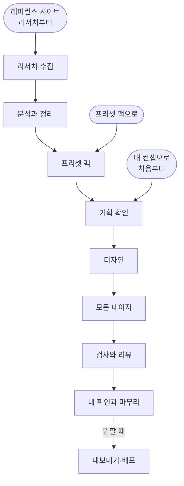
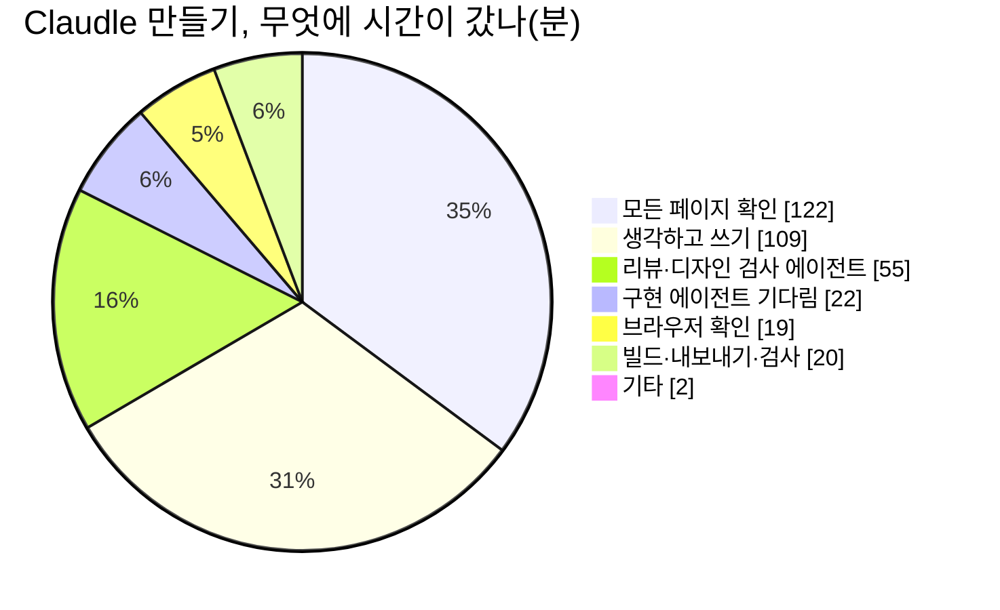
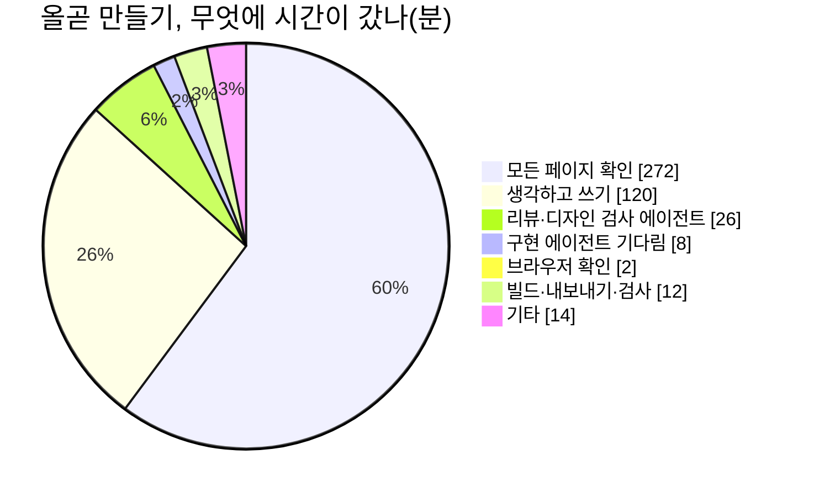

# 만드는 과정과 걸리는 시간

프로킷으로 만들 때 많이 묻는 세 가지에 답해요.

- **어떤 순서로 만드나요**? [시작하는 방법 세 가지](#시작하는-방법-세-가지), [레퍼런스 사이트 리서치부터 하는 과정](#레퍼런스-사이트-리서치부터-하는-과정)
- **얼마나 걸리나요**? [예시로 보는 시간](#예시로-보는-시간)
- **왜 표시된 시간보다 오래 걸릴 수 있나요**? [시간이 어디에 쓰이나요](#시간이-어디에-쓰이나요), [고쳐 달라고 할 때마다 더 드는 시간](#고쳐-달라고-할-때마다-더-드는-시간)

값은 프리셋을 만든 Claude Code 기록에서 쟀어요(2026-10-08). 만들기는 <!-- v:meta.presetModel -->Opus 5.5<!-- /v -->, 리서치 에이전트는 Sonnet 5.5였어요. 에이전트가 일한 시간이고, 따로 적은 곳(올곧의 백그라운드 작업 기다림, Nextflix의 로그인 확인 기다림)을 빼고는 10분 넘게 아무 일도 없던 구간을 뺐어요. 내가 결과를 보고 확인하는 시간은 들어 있지 않아요. 튜토리얼 표의 시간 범위를 읽는 법은 [시간과 비용 읽는 법](costs-and-keys.md#시간과-비용-읽는-법)에 있어요.

## 시작하는 방법 세 가지

**시작하는 곳만 다르고, 그 뒤는 같은 흐름을 따라요.**

<!-- b:process-flow-diagram -->

<!-- /b -->

| 시작 | 이럴 때 | 내가 주는 것 | 에이전트가 더 하는 일 | 걸리는 시간 |
|---|---|---|---|---|
| 프리셋 팩으로 | 프로킷의 예시를 따라 만들어 볼 때 | 프리셋 쪽의 프롬프트 | 없어요. 팩에 든 사이트맵, 화면 설명, 예시 데이터, 그림을 읽고 바로 기획을 확인해요 | <!-- v:presets.pack.time.cell -->약 1시간\~7시간 50분 (여러 번 고치면 약 11시간 45분까지)<!-- /v --> |
| 내 컨셉으로 처음부터 | 만들고 싶은 서비스가 따로 있을 때 | 누가 쓰고 무엇을 하는 서비스인지 한두 문장 | 서비스 질문, 이름, 사이트맵, 스타일 추천, 시안과 그림 | <!-- v:presets.scratch.time.cell -->약 1시간 30분\~11시간 30분 (여러 번 고치면 약 17시간 15분까지)<!-- /v --> |
| 레퍼런스 사이트 리서치부터 | 본뜨고 싶은 서비스가 있을 때 | 참고할 서비스 주소와 볼 범위 | 사이트를 둘러보고 화면, 디자인 값, 동작을 모아 정리한 뒤 프리셋 팩처럼 묶어요 | 리서치와 팩 만들기가 더 들어요(Claudle 약 <!-- v:preset.claudle.prep.total.time -->2시간 5분<!-- /v -->) |

시간은 화면 프리셋 <!-- v:presets.screen.count -->9<!-- /v -->개를 만들 때의 범위예요. 페이지가 많을수록 길어요. 프리셋마다 값은 [예시로 보는 시간](#예시로-보는-시간)에 있어요.

## 레퍼런스 사이트 리서치부터 하는 과정

클론 튜토리얼(Nextflix, Claudle)과 올곧은 실제 사이트를 둘러보는 것부터 시작했어요. 에이전트가 브라우저로 사이트를 열어 보고 모았어요. Nextflix와 Claudle은 모은 것을 프리셋 팩으로 정리한 뒤 그 팩으로 만들었고, 올곧은 둘러본 결과로 DESIGN.md만 만들어 처음부터 만들었어요(팩은 다 만든 뒤 묶었어요). 아래 표는 팩까지 만든 Claudle과 Nextflix 값이에요.

| 단계 | 에이전트가 하는 일 | 내가 정할 것 | 결과물 | Claudle 실측 | Nextflix 실측 |
|---|---|---|---|---|---|
| 1. 레퍼런스와 범위 정하기 | 요청을 읽고 무엇을 어디까지 볼지 조사 지시를 써요 | 참고할 서비스, 볼 범위(공개 페이지만, 로그인 화면까지) | 조사 지시 | 약 <!-- v:process.research.claudle.scope -->3분<!-- /v --> | 약 <!-- v:process.research.nextflix.scope -->4분<!-- /v --> |
| 2. 둘러보고 모으기 | 페이지마다 여러 너비로 스크린샷을 찍고, 색·서체·간격 같은 디자인 값과 누르면 어떻게 움직이는지를 재요 | 로그인 화면을 보려면 브라우저에 내 계정으로 로그인해 두기 | 스크린샷, 디자인 값 | 첫 조사 약 <!-- v:process.research.claudle.first -->34분<!-- /v -->, 보강 약 <!-- v:process.research.claudle.more -->21분<!-- /v --> | 공개 페이지 약 <!-- v:process.research.nextflix.public -->18분<!-- /v -->, 로그인 화면 약 <!-- v:process.research.nextflix.login -->27분<!-- /v -->(둘이 동시에) |
| 3. 기능과 규칙 정리 | 다른 에이전트가 2와 같은 시간에 기능, 정책, 만들 때 참고할 기술을 정리해요 | 없어요 | 기능·정책 자료 | 약 <!-- v:process.research.claudle.features -->31분<!-- /v --> | 약 <!-- v:process.research.nextflix.features -->1시간 2분<!-- /v -->(에이전트 둘이 같은 시간에 일한 것을 더한 값) |
| 4. 분석과 요약 | 화면을 넣을 것·화면만 만들 것·뺄 것으로 나누고, 화면별 구성, 이름 후보, 대체 색과 서체, 예시 데이터와 그림 계획을 써요 | 없어요 | 화면 브리프 | 약 <!-- v:process.research.claudle.analysis -->17분<!-- /v --> | 약 <!-- v:process.research.nextflix.analysis -->13분<!-- /v -->(검증 포함) |
| 5. 이름과 범위 정하기 | 이름 후보와 만들 범위를 묻고 기다려요 | 서비스 이름, 어디까지 만들지 | 결정 | 내 답 약 <!-- v:process.research.claudle.decide -->3분<!-- /v --> | 이름은 미리 정했어요 |
| 6. 프리셋 팩 만들기 | 화면 설명(screens.md), 기능(features.md), 디자인 메모(design-notes.md), 예시 데이터, 배치도, 그림을 만들어요 | 없어요 | 프리셋 팩 | 설계와 팩 약 <!-- v:preset.claudle.prep.pack.time -->35분<!-- /v --> | 기획 약 <!-- v:preset.nextflix.prep.plan.time -->49분<!-- /v -->, 팩 첫 판 약 <!-- v:preset.nextflix.prep.pack.time -->1시간 26분<!-- /v --> |
| 7. 만들기 | 여기부터는 프리셋 팩으로 만드는 과정과 같아요 | 디자인 고르기, 결과 확인 | 프리셋 | 약 <!-- v:preset.claudle.actual.total.time -->5시간 50분<!-- /v --> | 약 <!-- v:preset.nextflix.made.time -->3시간 40분<!-- /v --> |
| 리서치 합(1\~4, 에이전트마다 일한 시간을 더한 값) | | | | 약 <!-- v:process.research.claudle.total -->1시간 45분<!-- /v --> | 약 <!-- v:process.research.nextflix.total -->2시간 5분<!-- /v --> |

- 2와 3은 에이전트 여럿이 같은 시간에 나눠 해서, 요청부터 리서치 끝까지는 Claudle 약 <!-- v:preset.claudle.prep.research.time -->1시간 28분<!-- /v -->, Nextflix 약 <!-- v:preset.nextflix.prep.research.time -->1시간 22분<!-- /v -->이 걸렸어요. 내가 답하거나 로그인해 주는 시간도 그 안에 들어 있어요.
- Nextflix는 처음 만든 프리셋 팩이라 팩 검사 도구, 그림 도구, 배치도 생성기까지 이때 만들어서 오래 걸렸어요. Claudle은 그 도구와 리서치의 화면 계획을 그대로 써서 설계와 팩 만들기가 약 <!-- v:preset.claudle.prep.pack.time -->35분<!-- /v -->에 끝났어요.

**본뜰 때 지키는 것**

- 배치, 흐름, 분위기는 비슷하게 만들어요.
- **로고, 이름, 문구, 사진은 가져오지 않아요.** 이름은 새로 짓고, 문구와 예시 데이터는 새로 쓰고, 그림은 AI로 그려요.
- 색과 서체는 비슷한 계열의 다른 것으로 바꿔요.
- 연습용이고 원래 서비스와 관계없다고 화면에 밝혀요.

**조사할 때 지키는 것**

- 공개 페이지 위주로 봐요.
- 로그인한 화면은 내 계정으로 보이는 것만 봐요. 설정 바꾸기, 결제, 다른 사람에게 보내기처럼 계정에 남는 일은 하지 않아요. Claudle은 답이 나오는 모습을 재려고 기록이 남지 않는 대화로 메시지 몇 개를 보냈어요. 이런 동작은 내가 허락한 만큼만 해요.
- 그 사이트의 이용약관을 따르고, 페이지를 한꺼번에 많이 여는 자동 수집은 하지 않아요.

<details>
<summary>조사 범위에 따라 얼마나 걸리나요</summary>

| 조사 범위 | 근거(실측) | 에이전트가 일한 시간 | 토큰 |
|---|---|---|---|
| 공개 페이지 몇 개 | Nextflix 공개 페이지 4종을 두 가지 너비로, 스크린샷 12장 | 약 <!-- v:process.research.nextflix.public -->18분<!-- /v --> | 약 <!-- v:process.scope.public.tokens -->30만<!-- /v --> |
| 공개 사이트 전체와 DESIGN.md | 올곧: 입시학원 사이트 한 곳의 공개 주소 약 30개, 스크린샷 61장 | 약 <!-- v:preset.olgot.prep.research.time -->43분<!-- /v --> | 약 <!-- v:preset.olgot.prep.research.tokens -->82만<!-- /v --> |
| 로그인 화면까지(대표 화면) | Claudle 첫 조사와 요약: 공개 페이지와 로그인한 앱 화면, 스크린샷 33장 | 약 <!-- v:process.scope.login.time -->45분<!-- /v --> | 약 <!-- v:process.scope.login.tokens -->75만<!-- /v --> |
| 웹의 거의 모든 화면 | Claudle 보강까지: 스크린샷 83장. 기능과 규칙 정리까지 더하면 위 끝 | 약 <!-- v:process.scope.all.time -->1시간 10분\~1시간 45분<!-- /v --> | 약 <!-- v:process.scope.all.tokens -->180만\~270만<!-- /v --> |

처음에는 로그인 프로필을 고르고 지침을 읽는 준비가 들어서, 첫 스크린샷까지 시간이 걸려요. 에이전트 둘이 나눠 맡으면 기다리는 시간은 더 짧아요.

</details>

### 직접 해 보려면

작업 폴더에서 [가장 쉬운 방법](../samples/README.md#가장-쉬운-방법)의 프롬프트에 레퍼런스 한 줄을 더해 보내요. 바꿀 곳은 `[ ]` 안 세 군데(폴더 이름, 서비스, 참고할 서비스 주소)예요.

<!-- b:screen-prompt folder=my-bakery concept="동네 빵집에서 빵을 미리 주문하고 찾아가는 서비스" ref=" [참고할 서비스 주소]의 공개 페이지를 먼저 둘러보고 화면 구성과 디자인 값을 정리한 뒤, 그걸 바탕으로 기획하고 디자인해줘. 로고와 이름, 문구, 사진은 가져오지 말고, 원래 서비스와 관계없는 연습용이라고 화면에 밝혀줘." design="디자인은 정리한 디자인 값을 따르되 색과 서체는 비슷한 계열의 다른 것으로 바꾸고, " -->
```prompt
https://github.com/roadkwon-ai/pro-kit 을 이 폴더에 받고, 그 안의 AGENTS.md대로 화면만 만들 프로젝트를 pro-kit 옆에 [my-bakery] 폴더로 만들어줘.
DB는 쓰지 않아. 없는 준비물은 설치해줘.
[동네 빵집에서 빵을 미리 주문하고 찾아가는 서비스]를 만들고 싶어. [참고할 서비스 주소]의 공개 페이지를 먼저 둘러보고 화면 구성과 디자인 값을 정리한 뒤, 그걸 바탕으로 기획하고 디자인해줘. 로고와 이름, 문구, 사진은 가져오지 말고, 원래 서비스와 관계없는 연습용이라고 화면에 밝혀줘.
필요한 화면을 모두 예시 데이터로 만들어줘. 로그인이나 저장 같은 기능은 빼고 화면만 만들어.
디자인은 정리한 디자인 값을 따르되 색과 서체는 비슷한 계열의 다른 것으로 바꾸고, 다 만들면 HTML 파일로 내보내줘.
```
<!-- /b -->

이 꼴은 프리셋을 만든 요청을 줄인 것이고, 이 프롬프트를 그대로 다시 실행해 확인하지는 않았어요. 로그인한 화면까지 보게 하려면 에이전트가 물을 때 브라우저에 내 계정으로 로그인해 주세요.

## 시간이 어디에 쓰이나요

Claudle과 올곧을 만들 때 메인 에이전트가 무엇에 시간을 썼는지예요(단위 분). 같은 시간에 따로 일한 다른 에이전트의 시간은 빼고, 메인이 그 에이전트를 기다린 시간만 넣었어요.

<!-- b:process-pie name=claudle title="Claudle 만들기, 무엇에 시간이 갔나(분)" -->

<!-- /b -->

<!-- b:process-pie name=olgot title="올곧 만들기, 무엇에 시간이 갔나(분)" -->

<!-- /b -->

- **모든 페이지 확인**이 가장 커요. 고친 곳만 보지 않고 링크와 버튼, 여러 너비의 화면, 접근성을 페이지마다 봐요. 페이지가 많을수록 커져서, Claudle은 <!-- v:process.pie.claudle.recheck.pct -->35<!-- /v -->%, 페이지가 <!-- v:preset.olgot.pages -->203<!-- /v -->개인 올곧은 <!-- v:process.pie.olgot.recheck.pct -->60<!-- /v -->%였어요.
- **프로킷은 확인해야 끝나요.** 검사를 실제로 돌린 증거가 없으면 끝났다고 하지 않아서 그냥 AI에게 맡길 때보다 시간이 더 들어요. 대신 깨진 링크나 겹친 화면을 내가 찾지 않아도 돼요([그냥 AI에게 맡길 때와 다른 점](https://github.com/roadkwon-ai/pro-kit/blob/main/handbook/start/what-is-prokit.md#그냥-ai에게-맡길-때와-다른-점)).
- **생각하고 쓰기**는 요청을 읽고 고칠 곳을 찾아 코드를 쓰는 시간이에요. Claudle <!-- v:process.pie.claudle.model.pct -->31<!-- /v -->%, 올곧 <!-- v:process.pie.olgot.model.pct -->27<!-- /v -->%예요.

## 예시로 보는 시간

### 프리셋 <!-- v:presets.count -->11<!-- /v -->개 한눈에

**앞 숫자는 순조롭게 한 번에 끝날 때의 최솟값이고, 괄호는 여러 번 고쳐 달라고 할 때예요.** 리서치와 팩 만들기는 들어 있지 않아요.

| 프리셋 | 분류 | 페이지 | 프리셋 팩으로 | 처음부터 |
|---|---|---|---|---|
| [<!-- v:preset.goru.title -->고루<!-- /v -->](../samples/goru.md) | <!-- v:preset.goru.kindLabel -->앱 화면<!-- /v --> | <!-- v:preset.goru.pages -->7<!-- /v --> | <!-- v:preset.goru.pack.time.cell -->약 1시간\~2시간 (여러 번 고치면 약 3시간까지)<!-- /v --> | <!-- v:preset.goru.scratch.time.cell -->약 1시간 30분\~3시간 (여러 번 고치면 약 4시간 30분까지)<!-- /v --> |
| [<!-- v:preset.ullim.title -->울림<!-- /v -->](../samples/ullim.md) | <!-- v:preset.ullim.kindLabel -->랜딩페이지<!-- /v --> | <!-- v:preset.ullim.pages -->11<!-- /v --> | <!-- v:preset.ullim.pack.time.cell -->약 1시간 15분\~2시간 30분 (여러 번 고치면 약 3시간 45분까지)<!-- /v --> | <!-- v:preset.ullim.scratch.time.cell -->약 2시간 10분\~4시간 20분 (여러 번 고치면 약 6시간 30분까지)<!-- /v --> |
| [<!-- v:preset.studyday.title -->하루공부<!-- /v -->](../samples/studyday.md) | <!-- v:preset.studyday.kindLabel -->앱 화면<!-- /v --> | <!-- v:preset.studyday.pages -->14<!-- /v --> | <!-- v:preset.studyday.pack.time.cell -->약 1시간 30분\~3시간 (여러 번 고치면 약 4시간 30분까지)<!-- /v --> | <!-- v:preset.studyday.scratch.time.cell -->약 2시간 5분\~4시간 10분 (여러 번 고치면 약 6시간 15분까지)<!-- /v --> |
| [<!-- v:preset.afterglow.title -->AFTERGLOW<!-- /v -->](../samples/afterglow.md) | <!-- v:preset.afterglow.kindLabel -->랜딩페이지<!-- /v --> | <!-- v:preset.afterglow.pages -->17<!-- /v --> | <!-- v:preset.afterglow.pack.time.cell -->약 1시간 40분\~3시간 20분 (여러 번 고치면 약 5시간까지)<!-- /v --> | <!-- v:preset.afterglow.scratch.time.cell -->약 2시간 30분\~5시간 (여러 번 고치면 약 7시간 30분까지)<!-- /v --> |
| [<!-- v:preset.fitslot.title -->핏슬롯<!-- /v -->](../samples/fitslot.md) | <!-- v:preset.fitslot.kindLabel -->앱 화면<!-- /v --> | <!-- v:preset.fitslot.pages -->20<!-- /v --> | <!-- v:preset.fitslot.pack.time.cell -->약 1시간 55분\~3시간 50분 (여러 번 고치면 약 5시간 45분까지)<!-- /v --> | <!-- v:preset.fitslot.scratch.time.cell -->약 2시간 45분\~5시간 30분 (여러 번 고치면 약 8시간 15분까지)<!-- /v --> |
| [<!-- v:preset.jecheol.title -->제철상자<!-- /v -->](../samples/jecheol.md) | <!-- v:preset.jecheol.kindLabel -->랜딩페이지<!-- /v --> | <!-- v:preset.jecheol.pages -->21<!-- /v --> | <!-- v:preset.jecheol.pack.time.cell -->약 2시간\~4시간 (여러 번 고치면 약 6시간까지)<!-- /v --> | <!-- v:preset.jecheol.scratch.time.cell -->약 2시간 55분\~5시간 50분 (여러 번 고치면 약 8시간 45분까지)<!-- /v --> |
| [<!-- v:preset.pacecrew.title -->PACECREW<!-- /v -->](../samples/pacecrew.md) | <!-- v:preset.pacecrew.kindLabel -->랜딩페이지<!-- /v --> | <!-- v:preset.pacecrew.pages -->22<!-- /v --> | <!-- v:preset.pacecrew.pack.time.cell -->약 2시간 5분\~4시간 10분 (여러 번 고치면 약 6시간 15분까지)<!-- /v --> | <!-- v:preset.pacecrew.scratch.time.cell -->약 3시간 10분\~6시간 20분 (여러 번 고치면 약 9시간 30분까지)<!-- /v --> |
| [<!-- v:preset.uptrail.title -->Uptrail<!-- /v -->](../samples/uptrail.md) | <!-- v:preset.uptrail.kindLabel -->앱 화면<!-- /v --> | <!-- v:preset.uptrail.pages -->22<!-- /v --> | <!-- v:preset.uptrail.pack.time.cell -->약 2시간 5분\~4시간 10분 (여러 번 고치면 약 6시간 15분까지)<!-- /v --> | <!-- v:preset.uptrail.scratch.time.cell -->약 2시간 50분\~5시간 40분 (여러 번 고치면 약 8시간 30분까지)<!-- /v --> |
| [<!-- v:preset.olgot.title -->올곧<!-- /v -->](../samples/olgot.md) | <!-- v:preset.olgot.kindLabel -->앱 화면<!-- /v --> | <!-- v:preset.olgot.pages -->203<!-- /v -->(<!-- v:preset.olgot.pageTypes -->48<!-- /v -->종) | <!-- v:preset.olgot.pack.time.cell -->약 3시간 55분\~7시간 50분 (여러 번 고치면 약 11시간 45분까지)<!-- /v --> | <!-- v:preset.olgot.scratch.time.cell -->약 5시간 45분\~11시간 30분 (여러 번 고치면 약 17시간 15분까지)<!-- /v --> |
| [<!-- v:preset.nextflix.title -->Nextflix<!-- /v -->](../01-nextflix/README.md) | <!-- v:preset.nextflix.kindLabel -->클론 튜토리얼<!-- /v --> | 튜토리얼 12장 | 화면까지 <!-- v:preset.nextflix.screens.time.cell -->약 2시간 25분\~4시간 50분 (여러 번 고치면 약 7시간 15분까지)<!-- /v -->, 끝까지 <!-- v:preset.nextflix.full.time.cell -->약 5시간 15분\~10시간 30분 (여러 번 고치면 약 15시간 45분까지)<!-- /v --> | 프리셋 팩으로만 해요 |
| [<!-- v:preset.claudle.title -->Claudle<!-- /v -->](../02-claudle/README.md) | <!-- v:preset.claudle.kindLabel -->클론 튜토리얼<!-- /v --> | 튜토리얼 12장 | 화면까지 <!-- v:preset.claudle.screens.time.cell -->약 2시간 25분\~4시간 50분 (여러 번 고치면 약 7시간 15분까지)<!-- /v -->, 끝까지 <!-- v:preset.claudle.full.time.cell -->약 5시간\~10시간 (여러 번 고치면 약 15시간까지)<!-- /v --> | 프리셋 팩으로만 해요 |

### Claudle을 리서치부터 만든 시간

```mermaid
gantt
  title Claudle 풀 사이클(라운드 사이에 기다린 시간은 뺐어요)
  dateFormat HH:mm
  axisFormat %H:%M
  todayMarker off
  section 리서치와 팩
  리서치 : research, 00:00, 88m
  설계와 프리셋 팩 : pack, after research, 35m
  section 만들기
  기획과 디자인 : plan, after pack, 18m
  모든 화면 : screens, after plan, 120m
  검토와 다듬기 : review, after screens, 170m
  공개 전 손보기 : polish, after review, 42m
```

Claudle은 claude.ai를 둘러보는 리서치부터 시작해 프리셋 팩을 만들고, 그 팩으로 프리셋을 만들었어요. 가로축은 시작부터 걸린 시간(시:분)이에요. [라운드](glossary.md#만들기)(<!-- v:gloss.round -->기능 하나를 만들거나 요청한 것을 고치고 확인까지 마치는 작업 묶음<!-- /v -->) 사이에 내가 확인하느라 기다린 시간은 빼고 이어 그렸어요.

<!-- b:process-gantt-claudle -->

<!-- /b -->

| 단계 | 걸린 시간 | 토큰 | API 요금 환산 |
|---|---|---|---|
| 리서치(조사와 분석) | 약 <!-- v:preset.claudle.prep.research.time -->1시간 28분<!-- /v --> | 약 <!-- v:preset.claudle.prep.research.tokens -->270만<!-- /v -->(캐시 포함 약 <!-- v:preset.claudle.prep.research.cached -->1.9억<!-- /v -->) | 약 <!-- v:preset.claudle.prep.research.usd -->49<!-- /v -->달러 |
| 설계와 프리셋 팩 | 약 <!-- v:preset.claudle.prep.pack.time -->35분<!-- /v --> | 약 <!-- v:preset.claudle.prep.pack.tokens -->43만<!-- /v -->(캐시 포함 약 <!-- v:preset.claudle.prep.pack.cached -->2,500만<!-- /v -->) | 약 <!-- v:preset.claudle.prep.pack.usd -->8<!-- /v -->달러 |
| 기획과 디자인(구성도 세 안까지) | 약 <!-- v:preset.claudle.actual.plan.time -->18분<!-- /v --> | 약 <!-- v:preset.claudle.actual.plan.tokens -->39만<!-- /v -->(캐시 포함 약 <!-- v:preset.claudle.actual.plan.cached -->1,900만<!-- /v -->) | 약 <!-- v:preset.claudle.actual.plan.usd -->7<!-- /v -->달러 |
| 모든 화면 | 약 <!-- v:preset.claudle.actual.screens.time -->2시간<!-- /v --> | 약 <!-- v:preset.claudle.actual.screens.tokens -->250만<!-- /v -->(캐시 포함 약 <!-- v:preset.claudle.actual.screens.cached -->1.3억<!-- /v -->) | 약 <!-- v:preset.claudle.actual.screens.usd -->46<!-- /v -->달러 |
| 검토와 다듬기 | 약 <!-- v:preset.claudle.actual.review.time -->2시간 50분<!-- /v --> | 약 <!-- v:preset.claudle.actual.review.tokens -->280만<!-- /v -->(캐시 포함 약 <!-- v:preset.claudle.actual.review.cached -->1.4억<!-- /v -->) | 약 <!-- v:preset.claudle.actual.review.usd -->51<!-- /v -->달러 |
| 공개 전 손보기 | 약 <!-- v:preset.claudle.actual.polish.time -->42분<!-- /v --> | 약 <!-- v:preset.claudle.actual.polish.tokens -->61만<!-- /v -->(캐시 포함 약 <!-- v:preset.claudle.actual.polish.cached -->3,000만<!-- /v -->) | 약 <!-- v:preset.claudle.actual.polish.usd -->11<!-- /v -->달러 |
| 합계 | 약 <!-- v:preset.claudle.all.time -->7시간 55분<!-- /v --> | 약 <!-- v:preset.claudle.all.tokens -->940만<!-- /v -->(캐시 포함 약 <!-- v:preset.claudle.all.cached -->5.3억<!-- /v -->) | 약 <!-- v:preset.claudle.all.usd -->172<!-- /v -->달러 |

만들기 네 줄의 토큰은 달러에서 1달러당 약 <!-- v:cost.tokensPerUsd -->5.5만<!-- /v -->(캐시 포함 약 <!-- v:cost.cachedPerUsd -->275만<!-- /v -->)으로 바꾼 값이고, 리서치와 팩 두 줄의 토큰은 기록에서 잰 값이에요. 이 두 줄의 달러는 거꾸로 토큰을 같은 비율로 나눠 어림해서, 표 안에 두 방식이 섞여 있어요. 프리셋 팩으로 시작하면 이 두 줄이 빠져요.

<details>
<summary>올곧을 만든 라운드별 시간</summary>

올곧은 입시학원 사이트 한 곳을 둘러보고 DESIGN.md를 만드는 데 약 <!-- v:preset.olgot.prep.research.time -->43분<!-- /v -->이 걸렸어요. 범위를 넓혀 사이트맵을 다시 정리하는 조사(약 <!-- v:preset.olgot.prep.expand.time -->7분<!-- /v -->)는 아래 1번 라운드와 같은 시간에 했어요. 라운드는 이랬어요.

| 순서 | 한 일 | 걸린 시간 |
|---|---|---|
| 1 | 기획과 홈 시안 3장 | 약 <!-- v:process.olgot.plan -->20분<!-- /v --> |
| 2 | 범위 넓히기(공개 페이지와 로그인한 뒤 화면까지) | 약 <!-- v:process.olgot.expand -->13분<!-- /v --> |
| 3 | 1차 14쪽과 그림 37장 | 약 <!-- v:process.olgot.first -->2시간 37분<!-- /v -->(백그라운드 작업을 기다린 <!-- v:process.olgot.wait -->48분<!-- /v --> 포함) |
| 4 | 나머지 35종과 그림 44장 | 약 <!-- v:process.olgot.rest -->1시간 51분<!-- /v --> |
| 5 | 마무리 검토(코드·보안 리뷰, 디자인 리뷰, 고침) | 약 <!-- v:cost.revise.example.reviewRoundOlgot.total -->2시간 20분<!-- /v --> |
| 6 | 두 군데 고치기(가려진 빠른 메뉴, 새 신청 배지) | 약 <!-- v:cost.revise.example.twoSpotsOlgot.total -->43분<!-- /v --> |
| 7 | 식단표 한 줄 고치기 | 약 <!-- v:cost.revise.oneSpot -->10분<!-- /v --> |
| 8 | 닫기 | 약 <!-- v:process.olgot.close -->10분<!-- /v --> |
| 합계 | | 약 <!-- v:process.olgot.total -->8시간 20분<!-- /v -->(기다린 시간을 빼면 약 <!-- v:process.olgot.work -->7시간 35분<!-- /v -->) |

</details>

## 고쳐 달라고 할 때마다 더 드는 시간

결과를 보고 고쳐 달라고 하면 에이전트는 고친 곳만 보지 않아요. 여러 페이지가 함께 쓰는 부품을 고치면 다른 페이지가 깨질 수 있어서, **고칠 때마다 모든 페이지를 다시 확인해요.** 그래서 한 번 고칠 때 드는 시간은 이렇게 쌓여요.

| 과정 | 하는 일 | 한 번에 더 드는 시간 |
|---|---|---|
| 고칠 곳 찾고 고치기 | 요청을 읽고, 고칠 파일을 찾아 코드를 고쳐요. 에이전트가 생각하고 쓰는 시간이에요 | 약 <!-- v:cost.revise.fix -->2\~12분<!-- /v --> |
| 검사 | 타입 검사, 포맷 검사, 빌드를 다시 돌려요 | 약 <!-- v:cost.revise.check -->1\~3분<!-- /v --> |
| 모든 페이지 다시 확인 | 링크와 버튼, 여러 너비의 화면, 접근성을 페이지마다 다시 봐요. 페이지 수에 비례하고, 작은 수정은 고친 곳에 맞는 검사만 다시 돌려 짧아요 | <!-- v:preset.claudle.pages -->13<!-- /v -->쪽(Claudle) 약 <!-- v:cost.revise.recheck.13 -->5분<!-- /v -->, <!-- v:preset.olgot.pages -->203<!-- /v -->쪽(올곧) 약 <!-- v:cost.revise.recheck.203 -->6\~37분<!-- /v --> |
| 리뷰 에이전트 | 크게 고쳤으면 다른 에이전트가 고친 코드를 검토하고, 지적을 다시 고쳐요 | 약 <!-- v:cost.revise.review -->4\~10분<!-- /v --> |
| 마무리 | 내가 확인했다고 하면 기록을 남기고 검사한 뒤 커밋해요. 고친 횟수와 관계없이 마지막에 한 번이에요. 정적 내보내기를 다시 확인하면 길어져요 | 약 <!-- v:cost.revise.close -->1\~15분<!-- /v --> |

### 한 군데를 고치면

```mermaid
gantt
  title 올곧 식단표 한 줄 고치기
  dateFormat HH:mm
  axisFormat %M분
  todayMarker off
  요청 읽기 : read, 00:00, 1m
  고치기 전 모든 페이지 확인 : active, before, after read, 2m
  고치기 : fix, after before, 1m
  린트·타입 검사·빌드·내보내기 : build, after fix, 1m
  고친 뒤 모든 페이지 확인 : active, recheck, after build, 4m
  기록과 보고 : report, after recheck, 1m
```

올곧에서 식단표 한 줄을 고칠 때 약 <!-- v:cost.revise.oneSpot -->10분<!-- /v -->이 들었어요. 가로축은 시작부터 걸린 분이고, 옅은 막대 두 개가 모든 페이지 확인이에요.

<!-- b:revise-flow-gantt -->

<!-- /b -->

**고치는 일은 <!-- v:cost.revise.flow.oneSpot.fix -->1분<!-- /v -->이었는데, 고치기 전과 뒤에 모든 페이지를 확인하느라 <!-- v:cost.revise.example.oneSpot.recheck -->6분<!-- /v -->이 들었어요.** 작은 수정이라 고친 곳에 맞는 검사(배지 줄바꿈 검사를 <!-- v:preset.olgot.pages -->203<!-- /v -->쪽 × 6가지 너비로)와 바뀐 쪽 검사만 돌렸어요. 배치를 고치면 모든 검사를 다시 돌려서 아래 두 군데 예처럼 <!-- v:cost.revise.example.twoSpotsOlgot.recheck -->37분<!-- /v -->까지 늘어요.

### 두 군데를 고치면

**약 <!-- v:cost.revise.twoSpots -->28\~43분<!-- /v -->이 들었어요.** Claudle에서 공개 전에 두 가지를 손볼 때는 약 <!-- v:cost.revise.example.twoSpotsClaudle.total -->28분<!-- /v -->이 이렇게 들었어요.

| 순서 | 한 일 | 걸린 시간 |
|---|---|---|
| 1 | 요청을 읽고 고치기(모의 응답 규칙 넣기, 남은 기본 코드 지우기) | 약 <!-- v:cost.revise.flow.twoSpotsClaudle.fix -->5분<!-- /v --> |
| 2 | 타입 검사와 빌드, 개발 서버에서 답을 확인하며 고치기 | 약 <!-- v:cost.revise.flow.twoSpotsClaudle.dev -->4분<!-- /v --> |
| 3 | 정적으로 내보내고 모든 페이지 확인 | 약 <!-- v:cost.revise.flow.twoSpotsClaudle.recheck -->6분<!-- /v --> |
| 4 | 리뷰 에이전트가 고친 코드를 검토 | 약 <!-- v:cost.revise.flow.twoSpotsClaudle.review -->5분<!-- /v --> |
| 5 | 지적을 고치고 다시 내보내 모두 확인 | 약 <!-- v:cost.revise.flow.twoSpotsClaudle.refix -->5분<!-- /v --> |
| 6 | 기록과 보고 | 약 <!-- v:cost.revise.flow.twoSpotsClaudle.report -->3분<!-- /v --> |

올곧에서 두 군데를 고칠 때는 약 <!-- v:cost.revise.example.twoSpotsOlgot.total -->43분<!-- /v -->(모든 페이지 다시 확인 <!-- v:cost.revise.example.twoSpotsOlgot.recheck -->37분<!-- /v -->, 고치기 <!-- v:cost.revise.example.twoSpotsOlgot.fix -->5분<!-- /v -->)이 들었어요. 페이지가 많은 올곧은 모든 페이지 다시 확인이 대부분이에요.

### 마무리 검토를 한 번 더 하면

다시 디자인하거나 마무리 검토(디자인 리뷰, 리뷰 에이전트, 모든 페이지 다시 확인)를 한 번 더 하면 **<!-- v:cost.revise.reviewRound -->2\~3시간<!-- /v -->이 더 들어요.** 올곧은 약 <!-- v:cost.revise.example.reviewRoundOlgot.total -->2시간 20분<!-- /v -->(모든 페이지 다시 확인 <!-- v:cost.revise.example.reviewRoundOlgot.recheck -->1시간 36분<!-- /v -->, 리뷰·디자인 검사 에이전트 약 <!-- v:cost.revise.example.reviewRoundOlgot.review -->15분<!-- /v -->, 고치기 <!-- v:cost.revise.example.reviewRoundOlgot.fix -->19분<!-- /v -->), Claudle은 약 <!-- v:cost.revise.example.reviewRoundClaudle.total -->2시간 48분<!-- /v -->(모든 페이지 다시 확인 <!-- v:cost.revise.example.reviewRoundClaudle.recheck -->1시간 14분<!-- /v -->, 리뷰·디자인 검사 에이전트 약 <!-- v:cost.revise.example.reviewRoundClaudle.review -->49분<!-- /v -->, 고치기 <!-- v:cost.revise.example.reviewRoundClaudle.fix -->34분<!-- /v -->)이 들었어요.

내가 결과를 보고 확인하는 시간은 이 값에 들어 있지 않아요.

## 시간을 줄이는 법

1. **프리셋 팩으로 시작해요**. 리서치와 팩 만들기가 빠져서 Claudle 약 <!-- v:preset.claudle.prep.total.time -->2시간 5분<!-- /v -->, Nextflix 약 <!-- v:preset.nextflix.prep.total.time -->3시간 35분<!-- /v -->이 줄어요. 올곧은 처음부터 만든 뒤 팩을 묶어서, 빠지는 사전 작업은 사이트 조사(약 <!-- v:preset.olgot.prep.total.time -->50분<!-- /v -->)예요. 팩으로 만들면 처음부터 만들 때보다 기획과 그림도 줄어요([위 표](#예시로-보는-시간)).
2. **작은 범위로 시작해요**. 페이지 5\~7개짜리로 먼저 만들고 넓혀요. 모든 페이지 확인은 페이지 수에 비례해요(<!-- v:preset.claudle.pages -->13<!-- /v -->쪽 약 <!-- v:cost.revise.recheck.13 -->5분<!-- /v -->, <!-- v:preset.olgot.pages -->203<!-- /v -->쪽 약 <!-- v:cost.revise.recheck.203 -->6\~37분<!-- /v -->).
3. **고칠 것은 모아서 한 번에 요청해요**. 요청할 때마다 모든 페이지 확인을 다시 해서, 한 군데를 따로 고칠 때마다 약 <!-- v:cost.revise.oneSpot -->10분<!-- /v -->이 더 들어요. 모아서 요청하면 확인은 한 번이에요.
4. **리서치 범위를 정해요**. 공개 페이지 몇 개만 보면 약 <!-- v:process.research.nextflix.public -->18분<!-- /v -->, 웹의 거의 모든 화면을 보면 약 <!-- v:process.scope.all.time -->1시간 10분\~1시간 45분<!-- /v -->이 들어요.
5. **하루에 다 하려고 하지 않아요**. 큰 프리셋은 [<!-- v:limit.window -->5시간<!-- /v --> 한도](costs-and-keys.md#5시간-한도에-걸리면)에 걸려요. 올곧을 처음부터 만들면 <!-- v:preset.olgot.scratch.limitText -->5시간 한도에 약 4번 걸려요<!-- /v -->. 나눠서 만들어도 결과는 같아요.
6. **끊기면 이어서 해요**. 멈춘 폴더에서 에이전트를 다시 열고 `하던 작업 이어서 해줘`라고 보내면 멈춘 곳부터 해요. 처음부터 다시 시키면 같은 일을 두 번 해요.

## 자주 묻는 질문

<details>
<summary>왜 표시된 시간보다 오래 걸렸나요?</summary>

**튜토리얼에 적은 시간의 앞 숫자는 순조롭게 한 번에 끝날 때의 최솟값이에요.** 올곧은 팩 없이 처음부터 만들었으니, 비교할 값은 처음부터 만들 때의 범위예요(<!-- v:preset.olgot.scratch.time.text -->한 번에 완성하면 약 5시간 45분\~11시간 30분(여러 번 고쳐 달라고 하면 약 17시간 15분까지)<!-- /v -->). 실제로는 사이트를 조사해 DESIGN.md를 만드는 데 약 <!-- v:preset.olgot.prep.research.time -->43분<!-- /v -->, 그 뒤 만들기에 약 <!-- v:preset.olgot.actual.total.time -->8시간 20분<!-- /v -->이 들었어요(범위 넓히기 조사는 만들기와 같은 시간에 해서 따로 더하지 않았어요). 범위 안이지만 앞 숫자보다 길었어요. 이유는 이래요.

- 모든 페이지 확인이 만들기 시간의 <!-- v:process.pie.olgot.recheck.pct -->60<!-- /v -->%였어요(Claudle은 <!-- v:process.pie.claudle.recheck.pct -->35<!-- /v -->%).
- 마무리 검토를 한 번 하는 데 <!-- v:cost.revise.reviewRound -->2\~3시간<!-- /v -->이 들었어요.
- 그림 그리기 같은 백그라운드 작업이 끝나기를 <!-- v:process.olgot.wait -->48분<!-- /v --> 기다린 라운드가 있었어요.
- 범위를 넓히고 두 번 고쳐 달라고 했어요.
- 라운드 사이에 내가 결과를 보고 답하는 시간은 표시에 들어 있지 않아요. 기다리는 동안 시계는 계속 가요.

Nextflix는 4장 라운드가 중간에 끊겨 이어 가느라 더 들었어요.

</details>

<details>
<summary>프리셋 팩으로 하면 얼마나 빨라지나요?</summary>

**리서치, 분석, 팩 만들기를 건너뛰어요.** 프리셋을 만든 사람이 쓴 시간으로 Claudle 약 <!-- v:preset.claudle.prep.total.time -->2시간 5분<!-- /v -->, Nextflix 약 <!-- v:preset.nextflix.prep.total.time -->3시간 35분<!-- /v -->이에요. 올곧은 처음부터 만든 뒤 팩을 묶어서, 빠지는 사전 작업은 사이트 조사(약 <!-- v:preset.olgot.prep.total.time -->50분<!-- /v -->)예요. 팩에 사이트맵과 화면 설명, 예시 데이터, 그림이 들어 있어서 기획 질문도 줄고 그림을 새로 그리지 않아요. 처음부터 만들 때와 비교한 시간은 [프리셋 한눈에](#예시로-보는-시간) 표에 있어요.

</details>

<details>
<summary>리서치를 꼭 해야 하나요?</summary>

아니요. **컨셉 한두 문장만으로 만들 수 있어요.** 본뜨고 싶은 서비스가 있을 때만 하세요. 리서치 없이 만들면 에이전트가 디자인 카탈로그에서 서비스에 어울리는 스타일을 추천해요.

</details>

<details>
<summary>기다리는 동안 무엇을 하나요? 내가 정할 것은 언제 나오나요?</summary>

**에이전트가 일하는 동안에는 다른 일을 해도 돼요.** 내가 정할 것은 정해진 때에 물어요.

- **시작할 때**: 서비스 이름과 만들 범위. 리서치부터 하면 볼 범위와 로그인도 물어요.
- **기획이 끝나면**: 사이트맵과 화면 설계를 확인해요.
- **디자인**: 추천 스타일이나 홈 화면 구성을 골라요.
- **다 만든 뒤**: 결과를 보고 확인하거나 고칠 것을 말해요.

물을 때는 답을 기다리며 멈춰 있어요. 가끔 터미널을 보고, 잘 모르겠으면 `추천대로 해줘`라고 답하세요.

</details>
