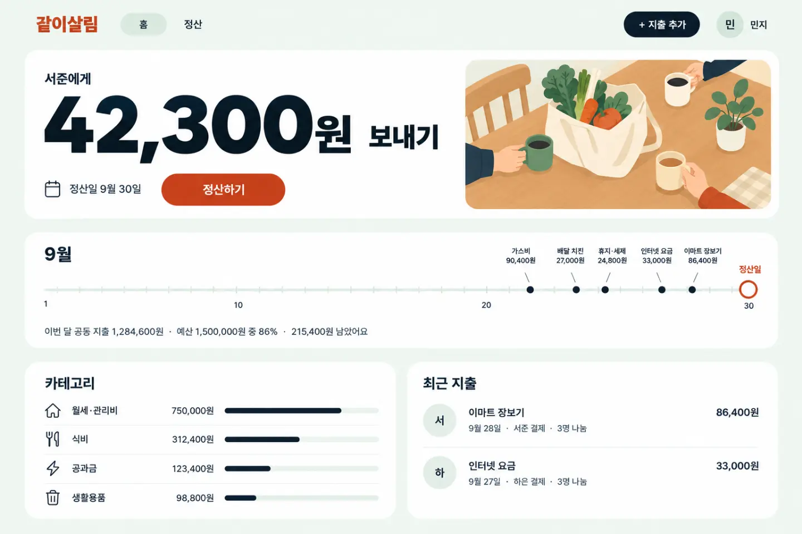
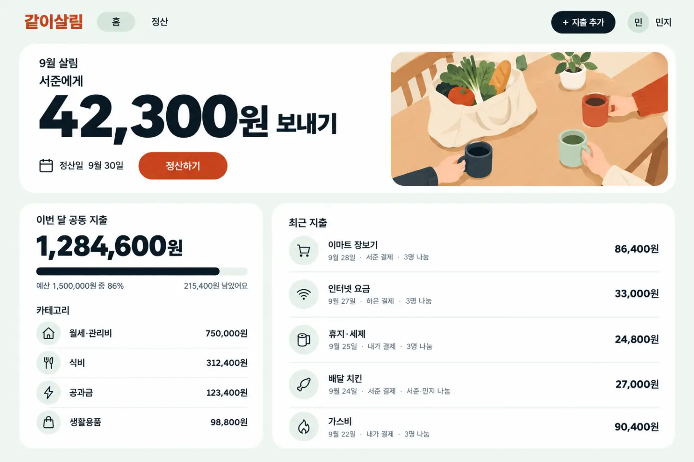
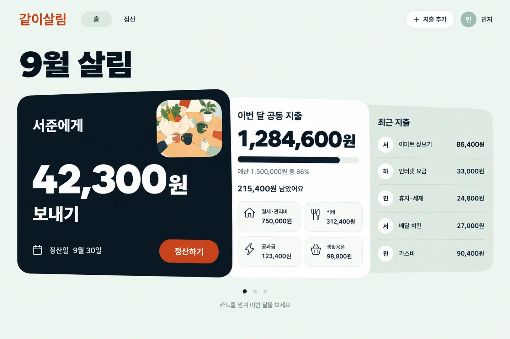

# 5장. 화면 만들기

## 이번 장에서 할 일

화면 구성을 고르고, 모든 페이지를 만들어요. 가장 오래 걸리는 장이에요. 에이전트가 페이지를 하나씩 만들고 스스로 화면을 찍어 확인해요.

## 1. 화면 구성 고르기

에이전트가 서체 파일을 받고, 브라우저에 화면 구성 고르기 페이지를 열어요. 같은 스타일로 배치를 달리한 카드 세 장이 나와요. 이미지를 그릴 수 있으면(<!-- v:agents.imageTools -->Codex, Antigravity, Grok Build<!-- /v -->, 또는 [이미지 그리기](../reference/costs-and-keys.md#이미지-그리기)를 준비한 Claude Code) 카드마다 시안(완성 화면을 미리 그린 그림)이, 아니면 간단한 배치도가 그려져요. 마음에 드는 카드를 눌러 고르세요.

> [!NOTE]
> 고르기 페이지에는 THE ROLL(이번에 뽑힌 추천), re-roll(다시 뽑기) 같은 영어 표시가 있어요. 카드를 고르는 것만 하면 돼요.

고루는 이 세 장의 시안을 받았어요. 이때 이름은 아직 같이살림이었어요.







여러 시안을 섞고 싶으면 대화창에 적어 보내도 돼요.

```prompt
A안으로 해줘.
```

```prompt
A안으로 하되, 아래쪽 두 단은 B안처럼 아이콘과 함께 읽기 쉽게 해줘.
```

고루는 두 번째처럼 A안에 B안의 아래쪽을 섞었어요.

> [!NOTE]
> 이미지를 그릴 수 없으면 사진 자리는 이미지 없이도 보기 좋은 구성으로 만들거나, 내가 가진 사진을 쓰자고 물어봐요.

## 2. 모든 페이지 만들기

구성을 고르면 에이전트가 첫 화면부터 사이트맵의 모든 페이지를 차례로 만들어요. 필요하면 사진을 그리고, 페이지마다 데스크톱과 휴대폰 화면을 찍어 확인해요. 중간에 멈추면 이렇게 보내세요.

```prompt
하던 작업 이어서 해줘
```

## 3. 직접 보기

만드는 중이거나 다 만든 뒤에 내 브라우저로 볼 수 있어요.

```prompt
개발 서버 켜고 브라우저로 열 주소 알려줘.
```

알려 준 주소(보통 <!-- v:port.web.urlCode -->`http://localhost:3001`<!-- /v -->)를 열고 메뉴와 버튼을 눌러 보세요. 다 봤으면 `개발 서버 꺼줘`라고 보내세요.

**이렇게 되면 성공**
- 사이트맵의 모든 페이지가 열려요.
- 버튼을 누르면 다른 페이지로 가거나, 창이 열리거나, 화면이 바뀌어요.
- 휴대폰 크기로 줄여도 화면이 깨지지 않아요.

<details>
<summary>막히면</summary>

- **사용량 한도에 걸렸어요**: 안내된 시간이 지난 뒤 같은 폴더에서 에이전트를 열고 `하던 작업 이어서 해줘`라고 보내세요. 기다리는 법은 [<!-- v:limit.window -->5시간<!-- /v --> 한도에 걸리면](../reference/costs-and-keys.md#5시간-한도에-걸리면)에 있어요.
- **화면이 시안과 많이 달라요**: `첫 화면을 시안 A와 비교해서 다른 곳을 맞춰줘`라고 보내세요.
- **사진이 이상해요**: [다듬기](refine.md)의 사진 프롬프트를 보세요.
- **화면이 안 열려요**: `개발 서버가 켜져 있는지 확인하고 다시 켜줘`라고 보내세요.

</details>

## 에이전트가 물어보면

| 질문 | 답 |
|---|---|
| 화면 구성 카드 중 무엇으로 할지 | 브라우저에서 카드를 눌러 고르기. 섞고 싶으면 대화창에 적기 |
| 페이지 전환 효과에 쓸 도구를 설치할지 | `설치해줘` |
| 사진이 필요한데 이미지를 그릴 수 없을 때 | `사진 없이도 보기 좋은 구성으로 해줘` |

다음: [6장. 검사하고 다듬기](06-review.md)
