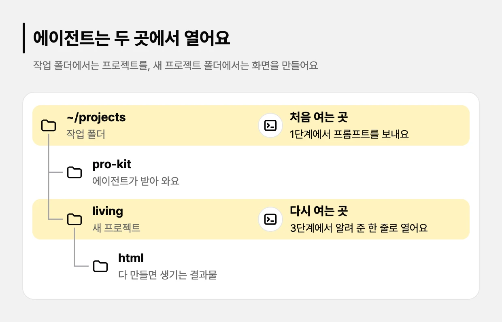

# 컨셉으로 화면 만들기

만들고 싶은 서비스를 한두 문장으로 말하면, 에이전트가 디자인을 추천하고 필요한 페이지를 모두 예시 데이터로 만들어 줘요. 결과는 로그인이나 저장 같은 기능 없이 **화면만** 있는 HTML 파일이에요.

**코드를 몰라도 프롬프트 하나로 시작하면 돼요.** pro-kit이 설치한 규칙과 스킬, 전문 에이전트가 개발자와 디자이너가 밟는 절차를 단계마다 나눠 맡아요. 그래서 짧은 프롬프트로도 에이전트의 실력을 끝까지 끌어내 전문가 수준의 화면을 얻을 수 있어요.

> [!NOTE]
> 에이전트(<!-- v:agents.list -->Claude Code, Codex, Antigravity, Grok Build<!-- /v --> 중 하나)를 설치하고 로그인만 해 두세요([시작하기](../start/README.md)). pro-kit 받기와 필요한 프로그램 설치는 프롬프트를 받은 에이전트가 해요. 화면만 만들 때는 Docker가 없어도 돼요.

## 프리셋으로 만들어 보기

[프로킷 사이트](https://prokit-web.vercel.app/)의 화면 프리셋 <!-- v:presets.screen.count -->9<!-- /v -->개(랜딩페이지 <!-- v:presets.landing.count -->4<!-- /v -->개, 앱 화면 <!-- v:presets.app.count -->5<!-- /v -->개)도 이 튜토리얼과 같은 흐름으로 만들었어요. **만들어 보고 싶은 프리셋을 고르고, 프리셋 쪽의 프롬프트 셋 중 하나를 보내세요.**

- **프리셋 팩으로 만들어 보기**: 팩에 든 화면 구성, 디자인, 그림으로 프리셋과 같은 서비스를 만들어 봐요. AI가 만들기 때문에 100% 똑같지는 않을 수 있어요. 이름만 바꿀 수도 있어요.
- **프리셋 팩으로 나만의 서비스 만들기**: 프리셋 팩을 바탕으로 이름, 색, 페이지, 주제를 바꿔요.
- **이 컨셉으로 처음부터 만들기**: 같은 컨셉으로 나만의 화면을 새로 만들어요. 이름, 스타일, 화면이 프리셋과 다르게 나와요.

| 프리셋 | 분류 | 컨셉 | 페이지 | 실제 서비스로 바꾸기 |
|---|---|---|---|---|
| [<!-- v:preset.goru.title -->고루<!-- /v -->](goru.md) | <!-- v:preset.goru.kindLabel -->앱 화면<!-- /v --> | <!-- v:preset.goru.summary -->같이 사는 사람들의 생활비 정산<!-- /v --> | <!-- v:preset.goru.pages -->7<!-- /v --> | <!-- v:preset.goru.difficulty -->쉬움<!-- /v --> |
| [<!-- v:preset.ullim.title -->울림<!-- /v -->](ullim.md) | <!-- v:preset.ullim.kindLabel -->랜딩페이지<!-- /v --> | <!-- v:preset.ullim.summary -->대본을 한국어 내레이션으로 만드는 AI 스튜디오<!-- /v --> | <!-- v:preset.ullim.pages -->11<!-- /v --> | <!-- v:preset.ullim.difficulty -->어려움<!-- /v --> |
| [<!-- v:preset.studyday.title -->하루공부<!-- /v -->](studyday.md) | <!-- v:preset.studyday.kindLabel -->앱 화면<!-- /v --> | <!-- v:preset.studyday.summary -->시험 날짜까지 하루 공부 나누기와 공부 기록<!-- /v --> | <!-- v:preset.studyday.pages -->14<!-- /v --> | <!-- v:preset.studyday.difficulty -->가장 쉬움<!-- /v --> |
| [<!-- v:preset.afterglow.title -->AFTERGLOW<!-- /v -->](afterglow.md) | <!-- v:preset.afterglow.kindLabel -->랜딩페이지<!-- /v --> | <!-- v:preset.afterglow.summary -->가정용 태양광 배터리 소개와 설치 상담<!-- /v --> | <!-- v:preset.afterglow.pages -->17<!-- /v --> | <!-- v:preset.afterglow.difficulty -->어려움<!-- /v --> |
| [<!-- v:preset.fitslot.title -->핏슬롯<!-- /v -->](fitslot.md) | <!-- v:preset.fitslot.kindLabel -->앱 화면<!-- /v --> | <!-- v:preset.fitslot.summary -->필라테스 수업 예약과 수강권 관리<!-- /v --> | <!-- v:preset.fitslot.pages -->20<!-- /v --> | <!-- v:preset.fitslot.difficulty -->보통<!-- /v --> |
| [<!-- v:preset.jecheol.title -->제철상자<!-- /v -->](jecheol.md) | <!-- v:preset.jecheol.kindLabel -->랜딩페이지<!-- /v --> | <!-- v:preset.jecheol.summary -->제철 농산물 정기배송<!-- /v --> | <!-- v:preset.jecheol.pages -->21<!-- /v --> | <!-- v:preset.jecheol.difficulty -->어려움<!-- /v --> |
| [<!-- v:preset.pacecrew.title -->PACECREW<!-- /v -->](pacecrew.md) | <!-- v:preset.pacecrew.kindLabel -->랜딩페이지<!-- /v --> | <!-- v:preset.pacecrew.summary -->동네 러닝 크루 매칭과 레이스 신청<!-- /v --> | <!-- v:preset.pacecrew.pages -->22<!-- /v --> | <!-- v:preset.pacecrew.difficulty -->어려움<!-- /v --> |
| [<!-- v:preset.uptrail.title -->Uptrail<!-- /v -->](uptrail.md) | <!-- v:preset.uptrail.kindLabel -->앱 화면<!-- /v --> | <!-- v:preset.uptrail.summary -->개발팀의 서비스 상태와 배포 모니터링<!-- /v --> | <!-- v:preset.uptrail.pages -->22<!-- /v --> | <!-- v:preset.uptrail.difficulty -->올곧 다음으로 어려움<!-- /v --> |
| [<!-- v:preset.olgot.title -->올곧<!-- /v -->](olgot.md) | <!-- v:preset.olgot.kindLabel -->앱 화면<!-- /v --> | <!-- v:preset.olgot.summary -->고등부 수학·과학 입시학원 웹 앱<!-- /v --> | <!-- v:preset.olgot.pages -->203<!-- /v --> | <!-- v:preset.olgot.difficulty -->가장 어려움<!-- /v --> |

표는 페이지가 적은 순이에요. 페이지가 많을수록 오래 걸려요. 랜딩페이지는 서비스를 알리는 시각 연출이 큰 사이트이고, 앱 화면은 서비스를 쓰는 화면이 중심인 웹 앱이에요. "실제 서비스로 바꾸기"는 로그인과 DB를 붙여 진짜 서비스로 바꿀 때의 난이도예요. 필요한 외부 서비스와 지킬 데이터 규칙으로 견줬고, 까닭은 프리셋 쪽의 "실제 서비스로 만들 때"에 있어요.

만들고 싶은 서비스가 따로 있으면 [가장 쉬운 방법](#가장-쉬운-방법)의 프롬프트에 내 컨셉을 넣어 보내세요.

프리셋 쪽마다 프롬프트 세 가지를 모았어요. 팩으로 만들어 보기, 팩을 바탕으로 이름·색·페이지·주제를 바꿔 나만의 서비스 만들기, 팩 없이 그 컨셉으로 처음부터 만들기예요. 실제로 거친 과정과 실제 서비스로 만들 때 필요한 것도 함께 있어요. <!-- v:presets.screen.count -->9<!-- /v -->개 모두 기획 문서를 미리 쓰고 결과를 보며 여러 번 다시 요청해서 만들었어요. 프리셋 쪽의 디자인 리뷰 점수는 화면이 쓰기 편한지 10가지 기준으로 매긴 40점 만점 점수예요([처음 보는 용어](../reference/glossary.md)).

**프리셋 팩**은 프리셋마다 zip 파일 하나예요. 프리셋 쪽마다 있는 "프리셋 팩 받기" 상자에서 바로 받을 수 있고, 모아 보려면 [팩 릴리스](https://github.com/roadkwon-ai/pro-kit-packs/releases)와 [프리미엄 팩 릴리스](https://github.com/roadkwon-ai/pro-kit-premium-packs/releases)를 보세요. 프롬프트에 `packs/<이름> 프리셋 팩`이 있으면 에이전트가 pro-kit의 `AGENTS.md`대로 `node scripts/pack.mjs <이름>`으로 그 팩만 받아요. 받은 zip이 목록(`tutorials/packs.json`)에 적힌 sha256과 같은지 확인한 뒤 `pro-kit/packs/<이름>/`에 풀어요. zip을 미리 받아 두었다면 프롬프트 끝에 `프리셋 팩 zip은 [받은 zip 경로]에 받아 뒀어.` 한 줄을 더하세요. 에이전트가 `node scripts/pack.mjs <이름> --zip <경로>`로 같은 sha256 확인을 거쳐 풀고, 옛 판이면 새로 받아요. 팩은 팩에 함께 든 이용 조건을 따라요. pro-kit 자체의 조건은 [LICENSE](https://github.com/roadkwon-ai/pro-kit/blob/main/LICENSE), 팩과 외부 원본의 조건은 [제3자 안내의 프리셋 팩 절](https://github.com/roadkwon-ai/pro-kit/blob/main/THIRD_PARTY_NOTICES.md#사용자-작성-코드와-프리셋-팩)에 있어요.

## 가장 쉬운 방법

**프롬프트 하나면 돼요.** 설치 명령을 찾아 치거나 설정 파일을 만질 일이 없어요. 에이전트가 pro-kit을 받아 프로젝트를 만들고, 화면을 모두 만든 뒤 HTML로 내보내기까지 이어서 해요. 중간에 몇 번 멈춰서 물어보는데, 잘 모르겠으면 `추천대로 해줘`라고 답하면 돼요.

**기획 → 디자인 추천 → 화면 설계 → 시안 → 구현 → 검사 → 디자인 리뷰 → HTML 내보내기**

프리셋을 골랐다면 2단계에서 아래 프롬프트 대신 프리셋 쪽의 프롬프트를 보내세요. 나머지는 같아요.

### 1. 작업 폴더에서 에이전트 열기

<!-- b:open-already-line -->
[시작하기](../start/README.md) 5단계에서 이미 열었다면 2단계로 가세요. 아니면 터미널에 입력하세요. `~/projects`는 pro-kit과 앞으로 만들 프로젝트가 모두 들어갈 작업 폴더예요.
<!-- /b -->

<!-- b:open-agent -->
```bash
mkdir -p ~/projects && cd ~/projects
claude --dangerously-skip-permissions   # Codex는 codex --yolo
```
<!-- /b -->

<!-- b:yolo-option tail="" -->
`--dangerously-skip-permissions`(Codex는 `--yolo`)는 **명령마다 허락을 묻지 않고 진행하는 옵션**이에요. 설치하고 검사하는 명령이 많아서 편의상 이 옵션으로 열어요. Claude Code는 처음 한 번 경고 화면이 나와요. 읽어 보고 `Yes, I accept`를 고르세요.
<!-- /b -->

<!-- b:yolo-warning -->
> [!WARNING]
> 이 옵션으로 연 에이전트는 묻지 않고 파일을 바꾸거나 지우고, 프로그램을 설치하고, 인터넷에서 파일을 받아요. 폴더 안에서 열어도 폴더 밖까지 보호되지는 않아요. Codex의 `--yolo`는 격리 장치(샌드박스)도 함께 꺼요. **작업 폴더나 그 안의 프로젝트 폴더에서만 열고**, 출처를 모르는 프롬프트나 저장소 주소는 붙여 넣지 마세요. 이상한 일을 하면 `Esc`로 바로 멈추세요. 걱정되면 옵션 없이 `claude`(Codex는 `codex`)로 여세요. 명령마다 허락을 물어서 느리지만 더 안전해요. 자세한 내용은 [묻지 않고 진행하게 열기](../reference/claude-code-and-codex.md#묻지-않고-진행하게-열기)에 있어요.
<!-- /b -->

**프롬프트는 꼭 작업 폴더 `~/projects`에서 보내요.** pro-kit 폴더 안에서 보내면 안 돼요. 에이전트가 작업 폴더 안에 pro-kit과 새 프로젝트를 나란히 만들어요.

| 폴더 | 무엇이 들어 있나요 |
|---|---|
| `~/projects` | 작업 폴더. 여기서 에이전트를 열고 프롬프트를 보내요 |
| `~/projects/pro-kit` | 에이전트가 받아 오는 pro-kit |
| `~/projects/living` | 새 프로젝트. pro-kit 안이 아니라 옆에 생겨요 |

### 2. 프롬프트 하나로 프로젝트 시작하기

이 프롬프트로 **바로** 프로젝트를 시작할 수 있어요. 작업 폴더 `~/projects`에서 연 에이전트에 붙여 넣어 보세요. pro-kit 설치부터 기획, 디자인, 모든 화면, HTML 내보내기까지 에이전트가 이어서 해요. 바꿀 곳은 `[ ]` 안 두 군데예요. 첫째는 프로젝트 폴더 이름(영어 소문자와 `-`), 둘째는 누가 쓰고 무엇을 하는 서비스인지예요.

<!-- b:screen-prompt folder=living concept="같이 사는 사람들이 함께 쓴 생활비를 적고, 월말에 누가 누구에게 얼마를 보내면 되는지 알려 주는 서비스" -->
```prompt
https://github.com/roadkwon-ai/pro-kit 을 이 폴더에 받고, 그 안의 AGENTS.md대로 화면만 만들 프로젝트를 pro-kit 옆에 [living] 폴더로 만들어줘.
DB는 쓰지 않아. 없는 준비물은 설치해줘.
[같이 사는 사람들이 함께 쓴 생활비를 적고, 월말에 누가 누구에게 얼마를 보내면 되는지 알려 주는 서비스]를 만들고 싶어.
필요한 화면을 모두 예시 데이터로 만들어줘. 로그인이나 저장 같은 기능은 빼고 화면만 만들어.
디자인 스타일은 서비스에 어울리는 걸로 추천해주고, 다 만들면 HTML 파일로 내보내줘.
```
<!-- /b -->

결과는 HTML 파일로 받아서 내 컴퓨터에서 봐요. **만들자마자 인터넷에 올려 다른 사람도 보게 하려면** [배포하기](../reference/deploy.md)에서 계정과 토큰을 먼저 준비하고, 거기 있는 배포 프롬프트로 시작하세요. 배포에 관심이 없으면 위 프롬프트를 그대로 보내면 돼요.

에이전트는 먼저 이런 일을 해요. 몇 분 걸려요.

- pro-kit을 `~/projects/pro-kit`에 받아요.
- **빈 프로젝트** `~/projects/living`을 pro-kit 옆에 만들어요. 화면을 담을 틀과 pro-kit의 규칙, 스킬, 에이전트만 들어 있고 내 서비스 화면은 아직 없어요.
- 서비스 요청(`[같이 사는 사람들이…]`가 있는 줄부터 끝까지)을 새 프로젝트에 저장하고, 새 폴더에서 이어 갈 **명령 한 줄**을 알려 줘요.

보고에 원격 DB 연결 같은 할 일이 함께 나오면, [실제 서비스로 만들기](real-service.md) 때 하는 일이라 지금은 넘어가도 돼요.

> [!TIP]
> **Claude Code로 시안과 사진을 AI로 그리려면** 프롬프트를 보내기 전에 ChatGPT 유료 요금제(Codex CLI로 로그인)나 유료 OpenAI API 키(작업 폴더의 `.env`에 저장) 중 하나를 준비하세요. 늦었으면 화면 구성을 고르기 전에 준비하고 에이전트를 닫았다가 같은 폴더에서 다시 열면 돼요. 방법은 [이미지 그리기](../reference/costs-and-keys.md#이미지-그리기)에 있어요. <!-- v:agents.imageTools -->Codex, Antigravity, Grok Build<!-- /v -->는 자체 이미지 도구가 있어서 따로 준비할 것이 없어요. 이미지 준비가 없어도 시안 대신 배치도로 끝까지 만들어요.

### 3. 알려 준 한 줄로 이어 가기

<!-- b:exit-line -->
대화창에 `/exit`(Codex는 `/quit`)를 입력해 닫고, 에이전트가 알려 준 한 줄을 복사해 터미널에 붙여 넣으세요. 이런 모양이에요.
<!-- /b -->

<!-- b:continue-line folder=living -->
```bash
cd ~/projects/living && claude --dangerously-skip-permissions "docs/first-request.md의 요청대로 이어서 해줘"
```
<!-- /b -->

<!-- b:open-new-folder extra="결과물의 품질이 여기서 나와요. " -->
**새 프로젝트 폴더에서 열어야 pro-kit의 규칙, 스킬, 전문 에이전트가 모두 켜져요.** 결과물의 품질이 여기서 나와요. 처음 보낸 요청은 에이전트가 저장해 두었으니 다시 쓰지 않아도 돼요. 폴더를 믿을지 물으면 "예"를 고르세요.
<!-- /b -->



### 4. 답하며 요청을 자세히 채우기

새 폴더에서 열린 에이전트는 바로 화면을 만들지 않고 몇 가지를 물어봐요. **질문에 답하는 일은 짧은 프롬프트를 자세한 요청으로 채워 가는 과정이에요.** 구체적으로 답할수록 한 번에 원하는 결과가 나올 가능성이 높아져요. 정할 것을 처음 프롬프트에 미리 적어 두면 질문이 줄어요([한 번에 자세히 요청하기](refine.md#3-한-번에-자세히-요청하기)).

| 에이전트가 묻는 것 | 이렇게 답해요 |
|---|---|
| 서비스 질문: 누가 쓰는지, 꼭 있어야 할 것 | 아는 만큼 구체적으로. 예: `같이 사는 2~4명이 쓰고, 월말 정산은 노트북으로도 해`. 모르는 건 `추천대로 해줘` |
| 디자인 스타일 1~3위와 대표 색 | `1위로 해줘`처럼 번호로. 후보마다 주소가 있어서 열어 볼 수 있어요 |
| 서비스 이름과 첫 화면 문구 후보 | 마음에 드는 후보 번호 |
| 페이지 목록(사이트맵)과 페이지별 설계 | 빼거나 더할 페이지. 괜찮으면 `이대로 진행해줘` |
| 화면 구성 고르기 | 브라우저에 고르기 페이지가 열려요. 마음에 드는 카드를 눌러요. 이미지를 그릴 수 있으면 시안 그림, 아니면 간단한 배치도예요 |
| 점수가 기준에 못 미칠 때 더 다듬을지 | `한 번 더 다듬어줘` 또는 `이대로 둬` |
| 결과를 직접 보고 확인해 달라 | 알려 준 주소로 둘러본 뒤 `확인했어` |

Claude Code는 고를 것이 있으면 선택지 창을 띄워요. 방향키로 고르세요([답하는 법](../reference/claude-code-and-codex.md#질문에-답하는-법)).

답을 보내면 에이전트가 모든 페이지를 만들고 스스로 검사한 뒤 HTML로 내보내요. 그사이 화면 구성 고르기와 마지막 확인 질문이 한두 번 더 와요. **가장 오래 걸리는 단계예요.**

**이렇게 되면 성공**
- 프로젝트 폴더에 `html` 폴더가 생겨요.
- 에이전트가 알려 준 주소를 브라우저로 열면 내 서비스의 첫 화면이 보여요.
- 메뉴와 버튼을 누르면 다른 페이지나 창이 열려요.

<details>
<summary>막히면</summary>

<!-- b:samples-trouble folder=living -->
- **비밀번호를 입력하라고 해요**: 프로그램 설치에 컴퓨터 비밀번호가 필요할 때예요. 에이전트가 알려 준 명령을 새 터미널 창에서 직접 실행하고, 끝나면 대화창에 `설치했어. 이어서 해줘`라고 보내세요.
- **git을 설치하라는 창이 떴어요(macOS)**: "설치"를 누르세요. 끝나면 대화창에 `다시 해줘`라고 보내세요.
- **pro-kit 폴더나 living 폴더가 이미 있대요**: pro-kit이면 `있는 pro-kit을 최신으로 받아서 써줘`, 프로젝트면 `living2라는 이름으로 만들어줘`처럼 다른 이름을 보내세요.
- **pro-kit 폴더가 예전 것이라 받기가 멈춰요**: 2026-10-08에 pro-kit 저장소를 옮기며 기록을 새로 시작해서, 그 전에 받은 pro-kit은 최신으로 받을 수 없어요. `그 폴더 이름을 pro-kit-old로 바꾸고 새로 받아줘`라고 보내세요.
- **이어 갈 한 줄을 알려 주지 않았어요**: `새 폴더에서 이어 갈 명령 알려줘`라고 보내세요.
- **템플릿을 neon과 supabase 중에서 고르라고 해요**: `화면만 만들 거야. 추천대로 해줘`라고 답하세요.
- **Docker가 없다고 멈췄어요**: `화면만 만들 거라 DB는 쓰지 않아. Docker 없이 진행해줘`라고 보내세요.
- **에이전트가 바로 화면부터 만들어요**: `먼저 서비스 질문과 디자인 추천부터 해줘. 화면은 설계를 확인한 뒤에 만들어`라고 보내세요.
- **사용량 한도에 걸려 멈췄어요**: 안내된 시간이 지난 뒤 `~/projects/living`에서 에이전트를 열고 `하던 작업 이어서 해줘`라고 보내세요. 기다리는 법은 [5시간 한도에 걸리면](../reference/costs-and-keys.md#5시간-한도에-걸리면)에 있어요.
- 그 밖의 문제는 [막혔을 때](../reference/troubleshooting.md)를 보세요.
<!-- /b -->

</details>

### 다음에 할 때

**다른 프로젝트를 또 만들 때**는 작업 폴더(`~/projects`)에서 에이전트를 열고 같은 프롬프트를 보내세요. `[ ]` 안의 프로젝트 이름과 서비스만 바꾸면 돼요. pro-kit은 이미 받아 두었으니 에이전트가 그대로 써요.

<!-- b:open-agent cd="cd ~/projects" -->
```bash
cd ~/projects
claude --dangerously-skip-permissions   # Codex는 codex --yolo
```
<!-- /b -->

**만든 프로젝트를 고치거나 본격적으로 개발할 때**는 그 프로젝트 폴더에서 에이전트를 여세요. 작업 폴더에서 연 에이전트는 새 프로젝트를 만드는 곳이에요. 그 프로젝트의 규칙, 스킬, 전문 에이전트는 프로젝트 폴더에서 열어야 켜져요.

<!-- b:open-agent cd="cd ~/projects/living" -->
```bash
cd ~/projects/living
claude --dangerously-skip-permissions   # Codex는 codex --yolo
```
<!-- /b -->

열고 나서 [다듬기](refine.md)나 [실제 서비스로 만들기](real-service.md)의 프롬프트를 보내면 돼요.

## 이어서 할 수 있는 것

| 쪽 | 이럴 때 |
|---|---|
| [다듬기](refine.md) | 결과를 보고 고치고 싶을 때, 스타일·색·서체를 내가 정해 자세히 요청하고 싶을 때 |
| [장별로 자세히](#장별로-자세히) | 에이전트가 알아서 하는 일을 단계마다 확인하며 만들고 싶을 때 |
| [실제 서비스로 만들기](real-service.md) | 로그인과 DB 저장이 되는 진짜 서비스로 바꾸고 싶을 때. 화면 만들기와는 따로예요 |

## 장별로 자세히

가장 쉬운 방법을 일곱 장으로 나눴어요. pro-kit을 직접 받아 둔 상태에서 시작하고, 장마다 결과를 보고 고르면서 가요.

1. [화면만 만드는 프로젝트 만들기](01-project.md)
2. [컨셉 알려 주기](02-concept.md)
3. [디자인 고르기](03-design.md)
4. [화면 설계 확인하기](04-sitemap.md)
5. [화면 만들기](05-build.md)
6. [검사하고 다듬기](06-review.md)
7. [HTML로 내보내기](07-export.md)

## 시간과 비용

프리셋 팩으로 만들 때 프리셋 하나에 **<!-- v:presets.pack.time.text -->한 번에 완성하면 약 1시간\~7시간 50분(여러 번 고쳐 달라고 하면 약 11시간 45분까지)<!-- /v -->** 걸리고, 토큰은 최소 **약 <!-- v:presets.pack.tokens.range -->125만\~550만<!-- /v -->**(캐시 포함 약 <!-- v:presets.pack.cached.range -->6,900만\~2.8억<!-- /v -->)이 들어요. 이 튜토리얼로 화면을 처음부터 만들 때는 <!-- v:presets.scratch.time.text -->한 번에 완성하면 약 1시간 30분\~11시간 30분(여러 번 고쳐 달라고 하면 약 17시간 15분까지)<!-- /v --> 걸리고, 토큰은 최소 약 <!-- v:presets.scratch.tokens.range -->190만\~800만<!-- /v -->(캐시 포함 약 <!-- v:presets.scratch.cached.range -->9,600만\~4.0억<!-- /v -->)이 들어요. 프리셋마다 값은 각 쪽의 "시간과 비용"에 있어요.

<!-- b:revise-time-detail -->
<details>
<summary>자세히 보기: 고쳐 달라고 하면 왜 늘어날까요</summary>

| 과정 | 하는 일 | 더 드는 시간 |
|---|---|---|
| 고치기 | 요청을 읽고 고칠 곳을 찾아 고쳐요 | 약 2\~12분 |
| 검사 | 타입 검사, 포맷, 빌드 | 약 1\~3분 |
| 모든 페이지 다시 확인 | 고친 부품이 다른 페이지를 깨지 않았는지 봐요 | 13쪽 약 5분, 203쪽 약 6\~37분 |
| 리뷰 에이전트 | 크게 고쳤으면 고친 코드를 한 번 더 검토해요 | 약 4\~10분 |
| 마무리 | 기록, 검사, 커밋. 마지막에 한 번만 해요 | 약 1\~15분 |

**한 군데를 고치면 약 10분, 두 군데면 약 28\~43분이 더 들어요.** 마무리 검토(디자인 리뷰, 리뷰 에이전트, 모든 페이지 다시 확인)를 한 번 더 하면 2\~3시간이 더 들어요. 프리셋을 만들 때 잰 값이고, 내가 결과를 보고 확인하는 시간은 따로예요. [고쳐 달라고 할 때마다 더 드는 시간](../reference/process-and-time.md#고쳐-달라고-할-때마다-더-드는-시간)

</details>
<!-- /b -->

<!-- v:limit.pro5h.plans -->Claude Pro · ChatGPT Plus(Codex)<!-- /v -->: 가능 (프리셋 팩으로는 <!-- v:presets.pack.limit.range -->5시간 한도 안\~약 3번<!-- /v -->, 처음부터는 <!-- v:presets.scratch.limit.range -->약 1\~4번<!-- /v --> 걸려요. 올곧을 처음부터 만들면 2\~3일에 나눠 만들어요) · [<!-- v:limit.window -->5시간<!-- /v --> 한도란?](../reference/costs-and-keys.md#5시간-한도에-걸리면)

<!-- b:cost-note -->
시간의 앞 숫자와 토큰은 순조롭게 한 번에 끝날 때의 최솟값이에요. 토큰도 시간처럼 쓰는 AI와 고쳐 달라는 횟수에 따라 2~3배까지 늘 수 있어요. [읽는 법](../reference/costs-and-keys.md#시간과-비용-읽는-법) · [실제로 걸린 시간 자세히](../reference/process-and-time.md)
<!-- /b -->

- 페이지가 많을수록 오래 걸려요. 처음에는 페이지 5~7개짜리 작은 서비스로 해 보세요.
- 이미지 그리기는 선택이에요. <!-- v:agents.imageTools -->Codex, Antigravity, Grok Build<!-- /v -->는 자체 도구로 그려요. Claude Code는 ChatGPT 유료 요금제(Codex CLI)나 유료 OpenAI API 키가 있어야 그려요. API 키로 그리면 장수만큼 내 OpenAI 계정에 요금이 나가요. 자세한 내용은 [비용과 키](../reference/costs-and-keys.md)에 있어요.

<details>
<summary>만든 사람이 실제로 쓴 값</summary>

프리셋 하나에 약 370만\~1,000만 토큰(캐시 포함 약 1.9억\~5억, API 요금 환산 68\~181달러)을 썼어요. **첫 리디자인부터 모든 페이지로 넓히기, 사진 다시 만들기, 지워진 작업 폴더를 되살린 일까지 더한 값이라 처음 만드는 것보다 많아요.** 리디자인과 모든 페이지로 넓히기만 세면 약 <!-- v:presets.actual.time.range -->2시간 15분\~4시간 25분<!-- /v -->, 약 <!-- v:presets.actual.tokens.range -->360만\~940만<!-- /v --> 토큰(API 요금 환산 약 <!-- v:presets.actual.usd.range -->65\~170<!-- /v -->달러)이었어요. 올곧은 리디자인 없이 처음부터 모든 페이지를 만들어 약 <!-- v:preset.olgot.actual.total.time -->8시간 20분<!-- /v -->, 약 <!-- v:preset.olgot.actual.total.tokens -->630만<!-- /v --> 토큰(API 요금 환산 약 <!-- v:preset.olgot.actual.total.usd -->115<!-- /v -->달러)이 들었어요. 프리셋마다 값은 프리셋 쪽에 있어요.

</details>

## 만든 기록

- 2026-10-02에 썼어요. 올곧은 2026-10-08에 더했어요. 2026-10 기준 pro-kit에 맞췄어요.
- 프리셋은 Claude Code(<!-- v:meta.presetModel -->Opus 5.5<!-- /v -->)로 만들었어요. 튜토리얼은 Claude Code와 Codex로 확인했어요([에이전트별 차이](../reference/claude-code-and-codex.md)). 고루는 첫 화면 리디자인에 <!-- v:preset.goru.actual.redesign.time -->56분<!-- /v --> 걸렸어요.
- 프리셋 <!-- v:presets.screen.count -->9<!-- /v -->개를 만든 실제 요청 기록과 pro-kit의 절차(프로젝트 생성 절차, 화면을 만드는 `prokit-ui` 스킬)에 맞춰 썼어요. 튜토리얼의 프롬프트를 처음부터 끝까지 다시 실행해 확인하지는 않았어요.
- 같은 프롬프트라도 결과는 매번 달라요. 튜토리얼 그림과 내 화면이 달라도 정상이에요.
- 프리셋의 인물과 사진은 AI로 만든 가상 이미지이고, 데이터는 모두 예시예요.
