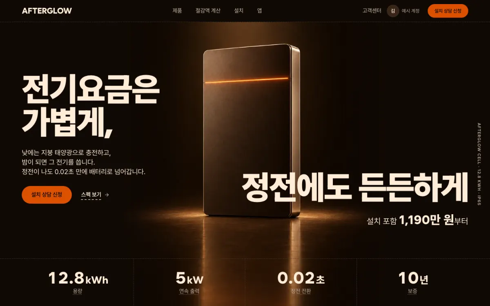
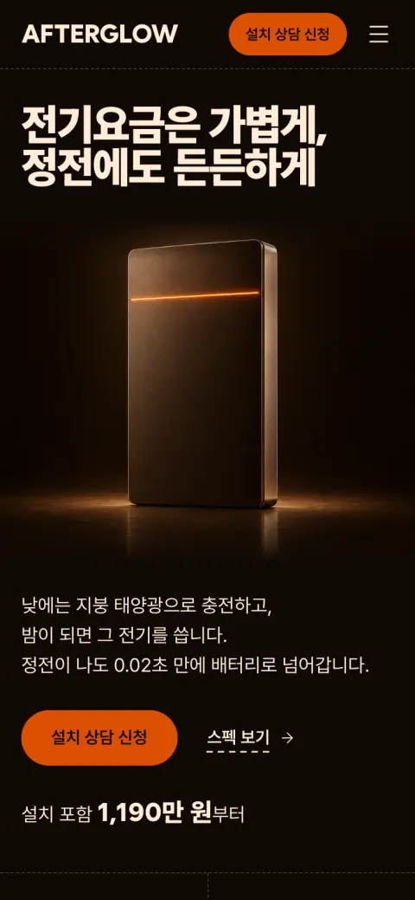

# AFTERGLOW

가정용 태양광 배터리를 파는 서비스예요. 낮에 남는 전기를 배터리에 담아 두었다가 밤에 쓰고, 정전이 나면 자동으로 집에 전기를 보내요. 방문자는 제품을 보고 절감액을 계산해 설치 상담을 신청하고, 설치한 고객은 앱에서 우리 집 에너지를 확인해요. 첫 화면 문구는 "전기요금은 가볍게, 정전에도 든든하게"예요.



[프리셋 사이트 열기](https://roadkwon-ai.github.io/pro-kit/afterglow/) · [프로킷 사이트에서 모든 페이지 보기](https://prokit-web.vercel.app/work/afterglow/)

| 항목 | 내용 |
|---|---|
| 페이지 | <!-- v:preset.afterglow.pages -->17<!-- /v -->개: 첫 화면, 제품, 절감액 계산, 설치 상담 신청, 설치 과정과 사례, 설치 사례 3곳(제주, 세종, 양평), 앱, 로그인, 가입, 내 에너지, 알림, 설정, 고객센터, 이용약관, 개인정보처리방침 |
| 스타일 | <!-- v:preset.afterglow.design.src1 -->Refero Styles<!-- /v -->의 [<!-- v:preset.afterglow.design.rec1 -->ORYZO AI<!-- /v -->](https://styles.refero.design/style/1f204e95-454a-437e-845b-c1b169d35607) |
| 대표 색 | <!-- v:preset.afterglow.design.color -->불씨 주황<!-- /v -->(Ember) <!-- v:preset.afterglow.design.hexCode -->`#dc5000`<!-- /v --> |
| 서체 | 제목 Wanted Sans, 본문 Pretendard |
| AI로 그린 그림 | <!-- v:preset.afterglow.design.images -->22<!-- /v -->장 |
| 검사 | 버튼과 링크 <!-- v:preset.afterglow.design.clicks -->277<!-- /v -->번 눌러 봄. 없는 페이지 0, 콘솔 오류 0 |

## 프리셋 팩으로 만들어 보기

<!-- b:preset-pack name=afterglow -->
작업 폴더 `~/projects`에서 연 에이전트에 이 프롬프트를 보내면 AFTERGLOW 프리셋과 같은 서비스를 만들어요. [프리셋 팩](https://github.com/roadkwon-ai/pro-kit-packs/releases/tag/pack-afterglow)의 화면 구성, 디자인, 예시 데이터, 그림을 그대로 써서 AI 그림을 새로 그리지 않아요. `[ ]` 안의 이름만 바꾸면 이름만 다른 서비스가 나와요. 팩을 써도 AI가 만들기 때문에 100% 똑같지는 않을 수 있어요.

```prompt
https://github.com/roadkwon-ai/pro-kit 을 이 폴더에 받고, 그 안의 AGENTS.md대로 화면만 만들 프로젝트를 pro-kit 옆에 [afterglow] 폴더로 만들어줘.
DB는 쓰지 않아. 없는 준비물은 설치해줘.
옆 폴더 pro-kit의 packs/afterglow에 프리셋 팩을 받아줘.
그 팩대로 AFTERGLOW 프리셋과 똑같은 서비스를 만들 거야. 이름은 [AFTERGLOW].
팩의 README.md 순서대로 하고, 팩은 고치지 마. 이름을 바꿨으면 팩의 이름 대신 내가 정한 이름을 써.
디자인, 화면 구성, 그림은 팩에 있는 것을 써. 스타일 추천, 시안, 새 그림은 만들지 마.
모든 페이지를 팩의 스크린샷과 같게 만들고, 다 만들면 HTML 파일로 내보내줘.
```

> [!IMPORTANT]
> **프롬프트만 보내면 에이전트가 이 프리셋 팩을 자동으로 받아 설치해요. 따로 받지 않아도 돼요.**
>
> 직접 받으려면 [afterglow-pack.zip](https://github.com/roadkwon-ai/pro-kit-packs/releases/download/pack-afterglow/afterglow-pack.zip)(21.5MB, [릴리스](https://github.com/roadkwon-ai/pro-kit-packs/releases/tag/pack-afterglow))을 받고, 프롬프트 끝에 `프리셋 팩 zip은 [~/Downloads/afterglow-pack.zip]에 받아 뒀어.` 한 줄을 더하세요. 에이전트가 그 zip이 최신 판인지 확인하고, 옛 판이면 새로 받아요.
<!-- /b -->

<!-- b:preset-next-steps -->
에이전트를 아직 열지 않았으면 [1. 작업 폴더에서 에이전트 열기](README.md#1-작업-폴더에서-에이전트-열기)부터 하세요. 프롬프트를 보낸 다음에는 [3. 알려 준 한 줄로 이어 가기](README.md#3-알려-준-한-줄로-이어-가기)와 [4. 답하며 요청을 자세히 채우기](README.md#4-답하며-요청을-자세히-채우기)를 따라가면 돼요.
<!-- /b -->

<details>
<summary>막히면</summary>

<!-- b:trouble-pack name=afterglow -->
- **프리셋 팩을 못 찾는대요**: `프리셋 팩은 옆 폴더 pro-kit의 packs/afterglow에 있어. 없으면 pro-kit 폴더에서 node scripts/pack.mjs afterglow 명령으로 받아줘`라고 보내세요. pro-kit 폴더가 2026-10-08 전에 받은 것이라 팩 받기가 멈추면 `그 폴더 이름을 pro-kit-old로 바꾸고 새로 받아줘`라고 보내세요.
<!-- /b -->

</details>

## 프리셋 팩으로 나만의 서비스 만들기

<!-- b:preset-remix name=afterglow folder=warmcore title="온기" changes="제품은 가정용 히트펌프, 대표 색은 청록" topic="주제는 가정용 히트펌프 판매" -->
AFTERGLOW의 [프리셋 팩](https://github.com/roadkwon-ai/pro-kit-packs/releases/tag/pack-afterglow)을 바탕으로 이름, 색, 페이지, 주제를 바꿔 나만의 서비스를 만들어요. 화면 구성과 디자인이 정해져 있어서 처음부터 만들 때보다 빠르고, 맞지 않는 그림만 같은 화풍으로 다시 그려요.

```prompt
https://github.com/roadkwon-ai/pro-kit 을 이 폴더에 받고, 그 안의 AGENTS.md대로 화면만 만들 프로젝트를 pro-kit 옆에 [warmcore] 폴더로 만들어줘.
DB는 쓰지 않아. 없는 준비물은 설치해줘.
옆 폴더 pro-kit의 packs/afterglow에 프리셋 팩을 받아줘.
그 팩을 바탕으로 나만의 서비스를 만들 거야. 이름은 [온기].
바꿀 것: [제품은 가정용 히트펌프, 대표 색은 청록]
팩의 README.md와 CUSTOMIZE.md를 보고, 바꾸는 것에 맞춰 다시 할 일만 해줘. 다시 그릴 그림은 팩의 prompts.json을 고쳐 같은 화풍으로 그려줘.
팩은 고치지 말고, 바꾸지 않는 것은 팩대로 해. 다 만들면 HTML 파일로 내보내줘.
```

`바꿀 것`에는 이렇게 적어요.
- 색이나 서체: `대표 색은 짙은 파랑, 제목 서체는 더 둥글게`
- 페이지: `[페이지 이름] 페이지는 빼줘` 또는 `[페이지 이름] 페이지를 더해줘`
- 주제: `주제는 가정용 히트펌프 판매`

무엇을 바꾸면 무엇을 다시 하는지는 팩의 `CUSTOMIZE.md`에 있어요. **그림을 다시 그리려면 이미지를 그릴 수 있는 에이전트가 필요해요**([이미지 그리기](../reference/costs-and-keys.md#이미지-그리기)). 그릴 수 없으면 원래 그림을 그대로 써요.

팩 zip을 미리 받아 두었다면 [프리셋 팩으로 만들어 보기](#프리셋-팩으로-만들어-보기)처럼 이 프롬프트 끝에도 zip 경로 한 줄을 더하세요.
<!-- /b -->

## 이 컨셉으로 처음부터 만들기

<!-- b:preset-scratch-intro -->
작업 폴더 `~/projects`에서 연 에이전트에 이 프롬프트를 그대로 보내면 **바로** 시작돼요. [가장 쉬운 방법](README.md#가장-쉬운-방법)의 프롬프트와 같고, `[ ]` 안만 이 프리셋의 폴더 이름과 컨셉이에요. 원하는 대로 바꿔도 돼요.
<!-- /b -->

<!-- b:screen-prompt folder=afterglow concept="지붕에 태양광을 단 집에 가정용 배터리를 팔고, 설치 상담 신청과 설치한 뒤 우리 집 에너지 확인까지 해 주는 서비스" -->
```prompt
https://github.com/roadkwon-ai/pro-kit 을 이 폴더에 받고, 그 안의 AGENTS.md대로 화면만 만들 프로젝트를 pro-kit 옆에 [afterglow] 폴더로 만들어줘.
DB는 쓰지 않아. 없는 준비물은 설치해줘.
[지붕에 태양광을 단 집에 가정용 배터리를 팔고, 설치 상담 신청과 설치한 뒤 우리 집 에너지 확인까지 해 주는 서비스]를 만들고 싶어.
필요한 화면을 모두 예시 데이터로 만들어줘. 로그인이나 저장 같은 기능은 빼고 화면만 만들어.
디자인 스타일은 서비스에 어울리는 걸로 추천해주고, 다 만들면 HTML 파일로 내보내줘.
```
<!-- /b -->

<!-- b:preset-scratch-note -->
**같은 컨셉이라도 이름, 스타일, 화면은 매번 다르게 나와요.** 프리셋에 가깝게 만들려면 [프리셋 팩으로 만들어 보기](#프리셋-팩으로-만들어-보기)를 쓰세요.
<!-- /b -->

<!-- b:preset-next-steps -->
에이전트를 아직 열지 않았으면 [1. 작업 폴더에서 에이전트 열기](README.md#1-작업-폴더에서-에이전트-열기)부터 하세요. 프롬프트를 보낸 다음에는 [3. 알려 준 한 줄로 이어 가기](README.md#3-알려-준-한-줄로-이어-가기)와 [4. 답하며 요청을 자세히 채우기](README.md#4-답하며-요청을-자세히-채우기)를 따라가면 돼요.
<!-- /b -->

## 시간과 비용

<!-- b:preset-time-line name=afterglow -->
위 "프리셋 팩으로 만들어 보기" 프롬프트로 만들 때 **한 번에 완성하면 약 1시간 40분\~3시간 20분(여러 번 고쳐 달라고 하면 약 5시간까지)** 걸리고, 토큰은 최소 **약 220만**(캐시 포함 약 1.1억)이 들어요. 팩 없이 [이 컨셉으로 처음부터](#이-컨셉으로-처음부터-만들기) 만들 때는 한 번에 완성하면 약 2시간 30분\~5시간(여러 번 고쳐 달라고 하면 약 7시간 30분까지) 걸리고, 토큰은 최소 약 330만이 들어요.
<!-- /b -->

<!-- b:revise-time-detail -->
<details>
<summary>자세히 보기: 고쳐 달라고 하면 왜 늘어날까요</summary>

| 과정 | 하는 일 | 더 드는 시간 |
|---|---|---|
| 고치기 | 요청을 읽고 고칠 곳을 찾아 고쳐요 | 약 2\~12분 |
| 검사 | 타입 검사, 포맷, 빌드 | 약 1\~3분 |
| 모든 페이지 다시 확인 | 고친 부품이 다른 페이지를 깨지 않았는지 봐요 | 13쪽 약 5분, 203쪽 약 6\~37분 |
| 리뷰 에이전트 | 크게 고쳤으면 고친 코드를 한 번 더 검토해요 | 약 4\~10분 |
| 마무리 | 기록, 검사, 커밋. 마지막에 한 번만 해요 | 약 1\~15분 |

**한 군데를 고치면 약 10분, 두 군데면 약 28\~43분이 더 들어요.** 마무리 검토(디자인 리뷰, 리뷰 에이전트, 모든 페이지 다시 확인)를 한 번 더 하면 2\~3시간이 더 들어요. 프리셋을 만들 때 잰 값이고, 내가 결과를 보고 확인하는 시간은 따로예요. [고쳐 달라고 할 때마다 더 드는 시간](../reference/process-and-time.md#고쳐-달라고-할-때마다-더-드는-시간)

</details>
<!-- /b -->

<!-- b:limit-line name=afterglow -->
Claude Pro · ChatGPT Plus(Codex): 가능 (5시간 한도에 약 1번 걸려요) · [5시간 한도란?](../reference/costs-and-keys.md#5시간-한도에-걸리면)
<!-- /b -->

<!-- b:cost-note -->
시간의 앞 숫자와 토큰은 순조롭게 한 번에 끝날 때의 최솟값이에요. 토큰도 시간처럼 쓰는 AI와 고쳐 달라는 횟수에 따라 2~3배까지 늘 수 있어요. [읽는 법](../reference/costs-and-keys.md#시간과-비용-읽는-법) · [실제로 걸린 시간 자세히](../reference/process-and-time.md)
<!-- /b -->

<details>
<summary>단계별 예상</summary>

<!-- b:preset-stage-intro -->
칸마다 시간 · 토큰 · API 요금 환산이고, 순조롭게 한 번에 끝날 때의 최솟값이에요. 합계의 시간에만 한 번에 완성할 때의 범위와 여러 번 고칠 때를 붙였어요.
<!-- /b -->

| 단계 | 프리셋 팩으로 | 처음부터(내 컨셉으로) |
|---|---|---|
| 준비: pro-kit 받기, 프로젝트 만들기 | <!-- v:cost.stage.setup.time -->5분<!-- /v --> · <!-- v:cost.tokens.1 -->5.5만<!-- /v --> · 1달러 | <!-- v:cost.stage.setup.time -->5분<!-- /v --> · <!-- v:cost.tokens.1 -->5.5만<!-- /v --> · 1달러 |
| 기획: 서비스 질문, 이름, 사이트맵 | <!-- v:cost.stage.plan.pack.time -->5분<!-- /v --> · <!-- v:cost.tokens.1.5 -->8.3만<!-- /v --> · 2달러 | <!-- v:cost.stage.plan.scratch.time -->10분<!-- /v --> · <!-- v:cost.tokens.3 -->17만<!-- /v --> · 3달러 |
| 디자인: DESIGN.md (처음부터는 스타일 추천 1~3위 포함) | <!-- v:cost.stage.design.pack.time -->5분<!-- /v --> · <!-- v:cost.tokens.2 -->11만<!-- /v --> · 2달러 | <!-- v:cost.stage.design.scratch.time -->8분<!-- /v --> · <!-- v:cost.tokens.3.5 -->19만<!-- /v --> · 4달러 |
| 화면 구성 | 팩의 스크린샷을 따라요 | 시안 3장 <!-- v:cost.stage.mockup.time -->10분<!-- /v --> · <!-- v:cost.tokens.3 -->17만<!-- /v --> · 3달러 |
| 그림 <!-- v:preset.afterglow.design.images -->22<!-- /v -->장 | 팩에서 받기 <!-- v:cost.stage.packImages.time -->1분<!-- /v --> | <!-- v:preset.afterglow.stages.images.time -->11분<!-- /v --> · <!-- v:cost.tokens.6.5 -->36만<!-- /v --> · 7달러 |
| 첫 화면 | <!-- v:cost.stage.first.pack.time -->10분<!-- /v --> · <!-- v:cost.tokens.4 -->22만<!-- /v --> · 4달러 | <!-- v:cost.stage.first.scratch.time -->15분<!-- /v --> · <!-- v:cost.tokens.6 -->33만<!-- /v --> · 6달러 |
| 나머지 페이지 <!-- v:preset.afterglow.pages.rest -->16<!-- /v -->개 | <!-- v:preset.afterglow.stages.rest.pack.time -->1시간 4분<!-- /v --> · 150만 · 27달러 | <!-- v:preset.afterglow.stages.rest.scratch.time -->1시간 20분<!-- /v --> · 180만 · 33달러 |
| 검사와 디자인 리뷰 | <!-- v:preset.afterglow.stages.check.time -->10분<!-- /v --> · <!-- v:cost.tokens.5.5 -->30만<!-- /v --> · 6달러 | <!-- v:preset.afterglow.stages.check.time -->10분<!-- /v --> · <!-- v:cost.tokens.5.5 -->30만<!-- /v --> · 6달러 |
| HTML 내보내기 | <!-- v:cost.stage.export.time -->2분<!-- /v --> · <!-- v:cost.tokens.0.5 -->2.8만<!-- /v --> · 1달러 미만 | <!-- v:cost.stage.export.time -->2분<!-- /v --> · <!-- v:cost.tokens.0.5 -->2.8만<!-- /v --> · 1달러 미만 |
| (선택) GitHub Pages 배포 | <!-- v:cost.stage.pages.time -->5분<!-- /v --> · <!-- v:cost.tokens.1 -->5.5만<!-- /v --> · 1달러 | <!-- v:cost.stage.pages.time -->5분<!-- /v --> · <!-- v:cost.tokens.1 -->5.5만<!-- /v --> · 1달러 |
| 합계(배포 빼고) | <!-- v:preset.afterglow.pack.time.cell -->약 1시간 40분\~3시간 20분 (여러 번 고치면 약 5시간까지)<!-- /v --> · 약 <!-- v:preset.afterglow.pack.tokens -->220만<!-- /v -->(캐시 포함 약 <!-- v:preset.afterglow.pack.cached -->1.1억<!-- /v -->) · 약 <!-- v:preset.afterglow.pack.usd -->40<!-- /v -->달러 | <!-- v:preset.afterglow.scratch.time.cell -->약 2시간 30분\~5시간 (여러 번 고치면 약 7시간 30분까지)<!-- /v --> · 약 <!-- v:preset.afterglow.scratch.tokens -->330만<!-- /v -->(캐시 포함 약 <!-- v:preset.afterglow.scratch.cached -->1.7억<!-- /v -->) · 약 <!-- v:preset.afterglow.scratch.usd -->60<!-- /v -->달러 |

<!-- b:preset-cost-detail -->
프리셋 팩으로 나만의 서비스를 만들면 다시 그리는 그림 장당 약 30초, 약 1.7만 토큰이 더 들어요. 주제를 바꾸면 기획에 5분, 약 8.3만 토큰이 더 들어요.

모두 실제로 잰 단위값으로 어림한 예상이에요. 시안과 AI 그림을 OpenAI API 키로 그리면 이미지 요금이 따로 들어요. ChatGPT 요금제로 그리면 그 사용량 안이에요.
<!-- /b -->

</details>

<details>
<summary>만든 사람이 실제로 쓴 값</summary>

<!-- b:preset-actual-line name=afterglow -->
AFTERGLOW 프리셋을 만들 때는 첫 화면 리디자인과 모든 페이지로 넓히기에 약 3시간 20분, 약 690만 토큰(캐시 포함 약 3.4억, API 요금 환산 약 125달러)이 들었어요. **사이트에 실으려고 다시 디자인하고 다듬은 값이라 위 예상보다 커요.** 버린 첫 초안과 나중의 문구 바꾸기는 넣지 않았어요.
<!-- /b -->

</details>

## 실제로 거친 과정

AFTERGLOW는 한 번에 나오지 않았어요. 결과를 보고 몇 번 다시 요청했어요.

| 단계 | 한 일 | 결과 |
|---|---|---|
| 1. 기획 | 서비스 설명(`PRODUCT.md`)과 첫 화면 설계만 미리 적었어요. 스타일과 색은 적지 않고, 원하는 인상(갤러리 조명 아래 놓인 정밀한 하드웨어)만 적었어요 | 이름은 해담 |
| 2. 첫 판 | 추천 후보(ORYZO AI, Apple, teenage engineering)와 직접 정하기 중 2위 Apple을 고르고, 대표 색은 파랑 대신 따뜻한 햇빛 계열로 바꿨어요 | 디자인 리뷰 27/36 |
| 3. 리디자인 | "제목이 작고 가늘어", "제품이 흰 상자라 안 보여", "첫 화면이 텅 비어 보여"라고 [다시 요청](refine.md#구도와-화면)했어요. 추천 1~3위(<!-- v:preset.afterglow.design.rec1 -->ORYZO AI<!-- /v -->, <!-- v:preset.afterglow.design.rec2 -->bugatti<!-- /v -->, <!-- v:preset.afterglow.design.rec3 -->Lamborghini<!-- /v -->) 중 1위 <!-- v:preset.afterglow.design.rec1 -->ORYZO AI<!-- /v -->, 대표 색은 원본 Ember 그대로. 시안 3장 중 ORYZO AI 시안으로 만들고, bugatti 시안의 해 질 녘 집 외벽 장면은 설치 사진으로 살렸어요 | 디자인 리뷰 23/32에서 28/32로, 56분 |
| 4. 넓히기와 이름 | 첫 화면 하나를 모든 페이지를 갖춘 사이트로 넓혔어요. 이름을 해담에서 AFTERGLOW로, 제품 이름을 Afterglow Cell로 바꿨어요. 상담 신청(4단계와 완료 화면), 절감액 계산, 알림 상세, 설정이 동작해요 | 페이지 <!-- v:preset.afterglow.pages -->17<!-- /v -->개 |
| 5. 첫 화면 문구 바꾸기 | 처음 문구는 "해는 졌고, 전기는 남았습니다"였어요. 문구가 마음에 들지 않아 후보를 두 번 받았지만 모두 거절했어요. 그다음 "전기요금 부담이 준다"는 내용을 넣어 달라고 [다시 요청](refine.md#이름과-문구)했고, 후보 중 1번을 골랐어요 | "전기요금은 가볍게, 정전에도 든든하게" |
| 6. 마무리 | 링크·버튼 검사, 디자인 리뷰, 다듬기. 다시 만든 사진은 없어요 | 디자인 리뷰 <!-- v:preset.afterglow.design.critique -->29<!-- /v -->/40 |



## 실제 서비스로 만들 때

AFTERGLOW의 상담 신청 저장과 절감 계산은 DB만 있으면 되지만, 내 에너지 화면은 배터리 기기가 보내는 데이터가 있어야 하고 알림에는 푸시나 문자 서비스가 필요해요.

<!-- b:preset-real-service -->
바꾸는 순서는 [실제 서비스로 만들기](real-service.md)를 따르고, **기능은 아래 요청을 하나씩 보내세요.**
<!-- /b -->

**필요한 데이터**: 상담 신청(주택 유형, 지역, 태양광 용량, 연락처, 희망 일정, 요청 사항), 설치 사례, 고객과 기기(고객, 기기 번호), 에너지 기록(시각, 발전량, 배터리 잔량, 사용량), 알림(종류, 시각, 읽음 여부), 설정(정전 대비 모드, 점검 예약)

**지킬 규칙**: 상담 신청은 누구나 보낼 수 있지만, 신청 목록과 연락처는 직원만 봐요. 고객은 자기 기기의 에너지 기록과 알림만 봐요.

```prompt
설치 상담 신청을 DB에 저장하게 해줘. 신청 번호를 만들어 완료 화면에 보여 주고, 신청 목록은 직원만 볼 수 있어야 해.
```

```prompt
절감액 계산기가 쓰는 요금표와 계산 값을 실제 전기요금표 기준으로 바꿔줘. 계산 방식은 지금 코드를 그대로 쓰고, 값만 따로 모아서 고치기 쉽게 해줘.
```

```prompt
내 에너지 화면의 발전량, 배터리 잔량, 사용량을 기기가 보내는 데이터로 보여줘. 고객은 자기 기기의 데이터만 볼 수 있어야 해.
```

```prompt
정전, 배터리, 태양광, 점검 알림을 DB에 저장해서 알림 화면에 보여 주고, 읽음 표시도 저장해줘.
```

```prompt
알림이 생기면 고객이 켜 둔 방법(푸시나 문자)으로 보내줘. 알림 설정 화면에서 받을 방법을 고를 수 있게 해줘.
```

> [!TIP]
> AFTERGLOW 프리셋은 화면만 만들 때 이미 월 전기요금으로 절감액과 투자 회수 기간을 계산하는 코드(`apps/web/src/app/(site)/calculator/_components/model.ts`)를 만들어 두었어요. 요금표와 계산 값은 예시예요. 내 프로젝트에도 비슷한 계산 코드가 있으면 새로 만들지 말고 그대로 쓰자고 하세요.

기기 데이터를 받으려면 배터리 제조사나 기기 서비스가 주는 데이터 연결(API)과 그 계정이 필요해요. 이 서비스에서 준비하기 가장 어려운 부분이에요. 푸시 알림은 푸시 서비스 계정이, 문자 알림은 문자 발송 서비스 계정이 따로 필요해요. 없으면 앱 안의 알림 화면만 먼저 만들 수 있어요.
