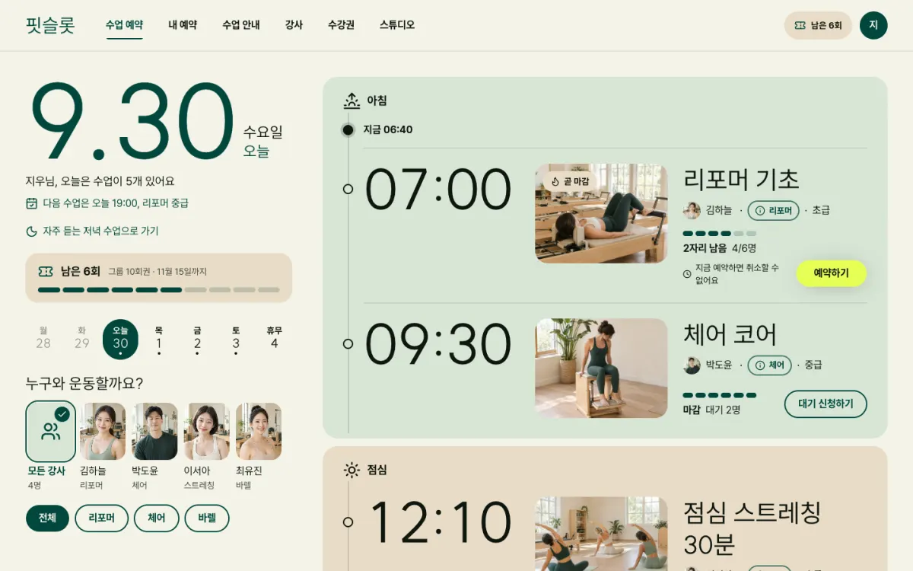
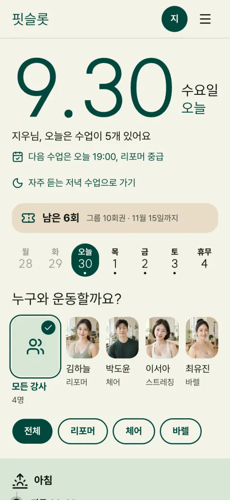

# 핏슬롯

동네 필라테스 스튜디오의 수업 예약 서비스예요. 이번 주 시간표에서 빈자리를 찾아 바로 예약하거나 취소하고, 수강권이 몇 번 남았는지와 언제까지 쓸 수 있는지 보여 줘요.



[프리셋 사이트 열기](https://roadkwon-ai.github.io/pro-kit/fitslot/) · [프로킷 사이트에서 모든 페이지 보기](https://prokit-web.vercel.app/work/fitslot/)

| 항목 | 내용 |
|---|---|
| 페이지 | <!-- v:preset.fitslot.pages -->20<!-- /v -->개: 수업 예약(홈), 내 예약, 수업 안내, 수업 상세 7개, 강사, 강사 상세 4명, 수강권, 프로필, 로그인, 가입하기, 스튜디오 안내 |
| 스타일 | <!-- v:preset.fitslot.design.src1 -->Refero Styles<!-- /v -->의 [<!-- v:preset.fitslot.design.rec1 -->sweetgreen<!-- /v -->](https://styles.refero.design/style/d91841cf-c717-43ef-97a2-400778fa6e1a) |
| 대표 색 | <!-- v:preset.fitslot.design.color -->짙은 숲색<!-- /v --> <!-- v:preset.fitslot.design.hexCode -->`#00473c`<!-- /v --> (예약 버튼만 라임색 `#e6ff55`) |
| 서체 | 제목 SUIT, 본문 Pretendard |
| AI로 그린 그림 | <!-- v:preset.fitslot.design.images -->18<!-- /v -->장 |
| 검사 | 버튼과 링크 <!-- v:preset.fitslot.design.clicks -->153<!-- /v -->번 눌러 봄. 없는 페이지 0, 콘솔 오류 0 |

## 프리셋 팩으로 만들어 보기

<!-- b:preset-pack name=fitslot -->
작업 폴더 `~/projects`에서 연 에이전트에 이 프롬프트를 보내면 핏슬롯 프리셋과 같은 서비스를 만들어요. [프리셋 팩](https://github.com/roadkwon-ai/pro-kit-packs/releases/tag/pack-fitslot)의 화면 구성, 디자인, 예시 데이터, 그림을 그대로 써서 AI 그림을 새로 그리지 않아요. `[ ]` 안의 이름만 바꾸면 이름만 다른 서비스가 나와요. 팩을 써도 AI가 만들기 때문에 100% 똑같지는 않을 수 있어요.

```prompt
https://github.com/roadkwon-ai/pro-kit 을 이 폴더에 받고, 그 안의 AGENTS.md대로 화면만 만들 프로젝트를 pro-kit 옆에 [fitslot] 폴더로 만들어줘.
DB는 쓰지 않아. 없는 준비물은 설치해줘.
옆 폴더 pro-kit의 packs/fitslot에 프리셋 팩을 받아줘.
그 팩대로 핏슬롯 프리셋과 똑같은 서비스를 만들 거야. 이름은 [핏슬롯].
팩의 README.md 순서대로 하고, 팩은 고치지 마. 이름을 바꿨으면 팩의 이름 대신 내가 정한 이름을 써.
디자인, 화면 구성, 그림은 팩에 있는 것을 써. 스타일 추천, 시안, 새 그림은 만들지 마.
모든 페이지를 팩의 스크린샷과 같게 만들고, 다 만들면 HTML 파일로 내보내줘.
```

> [!IMPORTANT]
> **프롬프트만 보내면 에이전트가 이 프리셋 팩을 자동으로 받아 설치해요. 따로 받지 않아도 돼요.**
>
> 직접 받으려면 [fitslot-pack.zip](https://github.com/roadkwon-ai/pro-kit-packs/releases/download/pack-fitslot/fitslot-pack.zip)(10.6MB, [릴리스](https://github.com/roadkwon-ai/pro-kit-packs/releases/tag/pack-fitslot))을 받고, 프롬프트 끝에 `프리셋 팩 zip은 [~/Downloads/fitslot-pack.zip]에 받아 뒀어.` 한 줄을 더하세요. 에이전트가 그 zip이 최신 판인지 확인하고, 옛 판이면 새로 받아요.
<!-- /b -->

<!-- b:preset-next-steps -->
에이전트를 아직 열지 않았으면 [1. 작업 폴더에서 에이전트 열기](README.md#1-작업-폴더에서-에이전트-열기)부터 하세요. 프롬프트를 보낸 다음에는 [3. 알려 준 한 줄로 이어 가기](README.md#3-알려-준-한-줄로-이어-가기)와 [4. 답하며 요청을 자세히 채우기](README.md#4-답하며-요청을-자세히-채우기)를 따라가면 돼요.
<!-- /b -->

<details>
<summary>막히면</summary>

<!-- b:trouble-pack name=fitslot -->
- **프리셋 팩을 못 찾는대요**: `프리셋 팩은 옆 폴더 pro-kit의 packs/fitslot에 있어. 없으면 pro-kit 폴더에서 node scripts/pack.mjs fitslot 명령으로 받아줘`라고 보내세요. pro-kit 폴더가 2026-10-08 전에 받은 것이라 팩 받기가 멈추면 `그 폴더 이름을 pro-kit-old로 바꾸고 새로 받아줘`라고 보내세요.
<!-- /b -->

</details>

## 프리셋 팩으로 나만의 서비스 만들기

<!-- b:preset-remix name=fitslot folder=yogaslot title="요가슬롯" changes="주제는 동네 요가 스튜디오, 대표 색은 진한 남색" topic="주제는 동네 요가 스튜디오 예약" -->
핏슬롯의 [프리셋 팩](https://github.com/roadkwon-ai/pro-kit-packs/releases/tag/pack-fitslot)을 바탕으로 이름, 색, 페이지, 주제를 바꿔 나만의 서비스를 만들어요. 화면 구성과 디자인이 정해져 있어서 처음부터 만들 때보다 빠르고, 맞지 않는 그림만 같은 화풍으로 다시 그려요.

```prompt
https://github.com/roadkwon-ai/pro-kit 을 이 폴더에 받고, 그 안의 AGENTS.md대로 화면만 만들 프로젝트를 pro-kit 옆에 [yogaslot] 폴더로 만들어줘.
DB는 쓰지 않아. 없는 준비물은 설치해줘.
옆 폴더 pro-kit의 packs/fitslot에 프리셋 팩을 받아줘.
그 팩을 바탕으로 나만의 서비스를 만들 거야. 이름은 [요가슬롯].
바꿀 것: [주제는 동네 요가 스튜디오, 대표 색은 진한 남색]
팩의 README.md와 CUSTOMIZE.md를 보고, 바꾸는 것에 맞춰 다시 할 일만 해줘. 다시 그릴 그림은 팩의 prompts.json을 고쳐 같은 화풍으로 그려줘.
팩은 고치지 말고, 바꾸지 않는 것은 팩대로 해. 다 만들면 HTML 파일로 내보내줘.
```

`바꿀 것`에는 이렇게 적어요.
- 색이나 서체: `대표 색은 짙은 파랑, 제목 서체는 더 둥글게`
- 페이지: `[페이지 이름] 페이지는 빼줘` 또는 `[페이지 이름] 페이지를 더해줘`
- 주제: `주제는 동네 요가 스튜디오 예약`

무엇을 바꾸면 무엇을 다시 하는지는 팩의 `CUSTOMIZE.md`에 있어요. **그림을 다시 그리려면 이미지를 그릴 수 있는 에이전트가 필요해요**([이미지 그리기](../reference/costs-and-keys.md#이미지-그리기)). 그릴 수 없으면 원래 그림을 그대로 써요.

팩 zip을 미리 받아 두었다면 [프리셋 팩으로 만들어 보기](#프리셋-팩으로-만들어-보기)처럼 이 프롬프트 끝에도 zip 경로 한 줄을 더하세요.
<!-- /b -->

## 이 컨셉으로 처음부터 만들기

<!-- b:preset-scratch-intro -->
작업 폴더 `~/projects`에서 연 에이전트에 이 프롬프트를 그대로 보내면 **바로** 시작돼요. [가장 쉬운 방법](README.md#가장-쉬운-방법)의 프롬프트와 같고, `[ ]` 안만 이 프리셋의 폴더 이름과 컨셉이에요. 원하는 대로 바꿔도 돼요.
<!-- /b -->

<!-- b:screen-prompt folder=fitslot concept="동네 필라테스 스튜디오 회원이 이번 주 시간표에서 빈자리를 찾아 수업을 예약하고 취소하고, 남은 수강권을 확인하는 서비스" -->
```prompt
https://github.com/roadkwon-ai/pro-kit 을 이 폴더에 받고, 그 안의 AGENTS.md대로 화면만 만들 프로젝트를 pro-kit 옆에 [fitslot] 폴더로 만들어줘.
DB는 쓰지 않아. 없는 준비물은 설치해줘.
[동네 필라테스 스튜디오 회원이 이번 주 시간표에서 빈자리를 찾아 수업을 예약하고 취소하고, 남은 수강권을 확인하는 서비스]를 만들고 싶어.
필요한 화면을 모두 예시 데이터로 만들어줘. 로그인이나 저장 같은 기능은 빼고 화면만 만들어.
디자인 스타일은 서비스에 어울리는 걸로 추천해주고, 다 만들면 HTML 파일로 내보내줘.
```
<!-- /b -->

<!-- b:preset-scratch-note -->
**같은 컨셉이라도 이름, 스타일, 화면은 매번 다르게 나와요.** 프리셋에 가깝게 만들려면 [프리셋 팩으로 만들어 보기](#프리셋-팩으로-만들어-보기)를 쓰세요.
<!-- /b -->

<!-- b:preset-next-steps -->
에이전트를 아직 열지 않았으면 [1. 작업 폴더에서 에이전트 열기](README.md#1-작업-폴더에서-에이전트-열기)부터 하세요. 프롬프트를 보낸 다음에는 [3. 알려 준 한 줄로 이어 가기](README.md#3-알려-준-한-줄로-이어-가기)와 [4. 답하며 요청을 자세히 채우기](README.md#4-답하며-요청을-자세히-채우기)를 따라가면 돼요.
<!-- /b -->

## 시간과 비용

<!-- b:preset-time-line name=fitslot -->
위 "프리셋 팩으로 만들어 보기" 프롬프트로 만들 때 **한 번에 완성하면 약 1시간 55분\~3시간 50분(여러 번 고쳐 달라고 하면 약 5시간 45분까지)** 걸리고, 토큰은 최소 **약 250만**(캐시 포함 약 1.2억)이 들어요. 팩 없이 [이 컨셉으로 처음부터](#이-컨셉으로-처음부터-만들기) 만들 때는 한 번에 완성하면 약 2시간 45분\~5시간 30분(여러 번 고쳐 달라고 하면 약 8시간 15분까지) 걸리고, 토큰은 최소 약 360만이 들어요.
<!-- /b -->

<!-- b:revise-time-detail -->
<details>
<summary>자세히 보기: 고쳐 달라고 하면 왜 늘어날까요</summary>

| 과정 | 하는 일 | 더 드는 시간 |
|---|---|---|
| 고치기 | 요청을 읽고 고칠 곳을 찾아 고쳐요 | 약 2\~12분 |
| 검사 | 타입 검사, 포맷, 빌드 | 약 1\~3분 |
| 모든 페이지 다시 확인 | 고친 부품이 다른 페이지를 깨지 않았는지 봐요 | 13쪽 약 5분, 203쪽 약 6\~37분 |
| 리뷰 에이전트 | 크게 고쳤으면 고친 코드를 한 번 더 검토해요 | 약 4\~10분 |
| 마무리 | 기록, 검사, 커밋. 마지막에 한 번만 해요 | 약 1\~15분 |

**한 군데를 고치면 약 10분, 두 군데면 약 28\~43분이 더 들어요.** 마무리 검토(디자인 리뷰, 리뷰 에이전트, 모든 페이지 다시 확인)를 한 번 더 하면 2\~3시간이 더 들어요. 프리셋을 만들 때 잰 값이고, 내가 결과를 보고 확인하는 시간은 따로예요. [고쳐 달라고 할 때마다 더 드는 시간](../reference/process-and-time.md#고쳐-달라고-할-때마다-더-드는-시간)

</details>
<!-- /b -->

<!-- b:limit-line name=fitslot -->
Claude Pro · ChatGPT Plus(Codex): 가능 (5시간 한도에 약 1번 걸려요) · [5시간 한도란?](../reference/costs-and-keys.md#5시간-한도에-걸리면)
<!-- /b -->

<!-- b:cost-note -->
시간의 앞 숫자와 토큰은 순조롭게 한 번에 끝날 때의 최솟값이에요. 토큰도 시간처럼 쓰는 AI와 고쳐 달라는 횟수에 따라 2~3배까지 늘 수 있어요. [읽는 법](../reference/costs-and-keys.md#시간과-비용-읽는-법) · [실제로 걸린 시간 자세히](../reference/process-and-time.md)
<!-- /b -->

<details>
<summary>단계별 예상</summary>

<!-- b:preset-stage-intro -->
칸마다 시간 · 토큰 · API 요금 환산이고, 순조롭게 한 번에 끝날 때의 최솟값이에요. 합계의 시간에만 한 번에 완성할 때의 범위와 여러 번 고칠 때를 붙였어요.
<!-- /b -->

| 단계 | 프리셋 팩으로 | 처음부터(내 컨셉으로) |
|---|---|---|
| 준비: pro-kit 받기, 프로젝트 만들기 | <!-- v:cost.stage.setup.time -->5분<!-- /v --> · <!-- v:cost.tokens.1 -->5.5만<!-- /v --> · 1달러 | <!-- v:cost.stage.setup.time -->5분<!-- /v --> · <!-- v:cost.tokens.1 -->5.5만<!-- /v --> · 1달러 |
| 기획: 서비스 질문, 이름, 사이트맵 | <!-- v:cost.stage.plan.pack.time -->5분<!-- /v --> · <!-- v:cost.tokens.1.5 -->8.3만<!-- /v --> · 2달러 | <!-- v:cost.stage.plan.scratch.time -->10분<!-- /v --> · <!-- v:cost.tokens.3 -->17만<!-- /v --> · 3달러 |
| 디자인: DESIGN.md (처음부터는 스타일 추천 1~3위 포함) | <!-- v:cost.stage.design.pack.time -->5분<!-- /v --> · <!-- v:cost.tokens.2 -->11만<!-- /v --> · 2달러 | <!-- v:cost.stage.design.scratch.time -->8분<!-- /v --> · <!-- v:cost.tokens.3.5 -->19만<!-- /v --> · 4달러 |
| 화면 구성 | 팩의 스크린샷을 따라요 | 시안 3장 <!-- v:cost.stage.mockup.time -->10분<!-- /v --> · <!-- v:cost.tokens.3 -->17만<!-- /v --> · 3달러 |
| 그림 <!-- v:preset.fitslot.design.images -->18<!-- /v -->장 | 팩에서 받기 <!-- v:cost.stage.packImages.time -->1분<!-- /v --> | <!-- v:preset.fitslot.stages.images.time -->9분<!-- /v --> · <!-- v:cost.tokens.5.5 -->30만<!-- /v --> · 6달러 |
| 첫 화면 | <!-- v:cost.stage.first.pack.time -->10분<!-- /v --> · <!-- v:cost.tokens.4 -->22만<!-- /v --> · 4달러 | <!-- v:cost.stage.first.scratch.time -->15분<!-- /v --> · <!-- v:cost.tokens.6 -->33만<!-- /v --> · 6달러 |
| 나머지 페이지 <!-- v:preset.fitslot.pages.rest -->19<!-- /v -->개 | <!-- v:preset.fitslot.stages.rest.pack.time -->1시간 16분<!-- /v --> · 165만 · 30달러 | <!-- v:preset.fitslot.stages.rest.scratch.time -->1시간 35분<!-- /v --> · 210만 · 38달러 |
| 검사와 디자인 리뷰 | <!-- v:preset.fitslot.stages.check.time -->11분<!-- /v --> · <!-- v:cost.tokens.6 -->33만<!-- /v --> · 6달러 | <!-- v:preset.fitslot.stages.check.time -->11분<!-- /v --> · <!-- v:cost.tokens.6 -->33만<!-- /v --> · 6달러 |
| HTML 내보내기 | <!-- v:cost.stage.export.time -->2분<!-- /v --> · <!-- v:cost.tokens.0.5 -->2.8만<!-- /v --> · 1달러 미만 | <!-- v:cost.stage.export.time -->2분<!-- /v --> · <!-- v:cost.tokens.0.5 -->2.8만<!-- /v --> · 1달러 미만 |
| (선택) GitHub Pages 배포 | <!-- v:cost.stage.pages.time -->5분<!-- /v --> · <!-- v:cost.tokens.1 -->5.5만<!-- /v --> · 1달러 | <!-- v:cost.stage.pages.time -->5분<!-- /v --> · <!-- v:cost.tokens.1 -->5.5만<!-- /v --> · 1달러 |
| 합계(배포 빼고) | <!-- v:preset.fitslot.pack.time.cell -->약 1시간 55분\~3시간 50분 (여러 번 고치면 약 5시간 45분까지)<!-- /v --> · 약 <!-- v:preset.fitslot.pack.tokens -->250만<!-- /v -->(캐시 포함 약 <!-- v:preset.fitslot.pack.cached -->1.2억<!-- /v -->) · 약 <!-- v:preset.fitslot.pack.usd -->45<!-- /v -->달러 | <!-- v:preset.fitslot.scratch.time.cell -->약 2시간 45분\~5시간 30분 (여러 번 고치면 약 8시간 15분까지)<!-- /v --> · 약 <!-- v:preset.fitslot.scratch.tokens -->360만<!-- /v -->(캐시 포함 약 <!-- v:preset.fitslot.scratch.cached -->1.8억<!-- /v -->) · 약 <!-- v:preset.fitslot.scratch.usd -->65<!-- /v -->달러 |

<!-- b:preset-cost-detail -->
프리셋 팩으로 나만의 서비스를 만들면 다시 그리는 그림 장당 약 30초, 약 1.7만 토큰이 더 들어요. 주제를 바꾸면 기획에 5분, 약 8.3만 토큰이 더 들어요.

모두 실제로 잰 단위값으로 어림한 예상이에요. 시안과 AI 그림을 OpenAI API 키로 그리면 이미지 요금이 따로 들어요. ChatGPT 요금제로 그리면 그 사용량 안이에요.
<!-- /b -->

</details>

<details>
<summary>만든 사람이 실제로 쓴 값</summary>

<!-- b:preset-actual-line name=fitslot -->
핏슬롯 프리셋을 만들 때는 첫 화면 리디자인과 모든 페이지로 넓히기에 약 2시간 25분, 약 550만 토큰(캐시 포함 약 2.8억, API 요금 환산 약 100달러)이 들었어요. **사이트에 실으려고 다시 디자인하고 다듬은 값이라 위 예상보다 커요.** 버린 첫 초안과 나중의 문구 바꾸기는 넣지 않았어요.
<!-- /b -->

</details>

## 실제로 거친 과정

핏슬롯은 한 번에 나오지 않았어요. 결과를 보고 몇 번 다시 요청했어요.

| 단계 | 한 일 | 결과 |
|---|---|---|
| 1. 기획 | 서비스 설명(`PRODUCT.md`)과 첫 화면·두 번째 화면 설계만 미리 적었어요. 스타일과 색은 적지 않았어요 | 이름은 핏슬롯 |
| 2. 첫 판 | 추천 후보(토스, 쏘카, 당근)와 직접 정하기 중 3위 당근을 고르고 대표 색을 `#0F766E`로 정했어요 | 디자인 리뷰 25/40 |
| 3. 리디자인 | "표 같은 목록뿐이라 스튜디오 분위기가 없고, 글자가 작아"라고 [다시 요청](refine.md#스타일과-색)했어요. 추천 1~3위(<!-- v:preset.fitslot.design.rec1 -->sweetgreen<!-- /v -->, <!-- v:preset.fitslot.design.rec2 -->Oakâme<!-- /v -->, <!-- v:preset.fitslot.design.rec3 -->MasterClass<!-- /v -->) 중 1위 <!-- v:preset.fitslot.design.rec1 -->sweetgreen<!-- /v -->, 대표 색은 원본 짙은 숲색 그대로. 시안 3장 중 <!-- v:preset.fitslot.design.comp -->C<!-- /v -->(<!-- v:preset.fitslot.design.compName -->시간 기둥<!-- /v -->)를 고르고, 시안에서 틀린 곳(아바타 글자, 19:00 수업의 난이도, 라임색을 쓴 곳)은 고치게 했어요 | 리디자인에 49분 |
| 4. 넓히기 | 첫 화면 하나를 모든 페이지를 갖춘 사이트로 넓혔어요. 이름은 그대로 두었어요. 예약 확인 창, 대기 신청, 예약 취소 확인, 수강권 구매(상품, 결제 요약, 완료), 캘린더 파일 내려받기가 동작해요 | 페이지 <!-- v:preset.fitslot.pages -->20<!-- /v -->개 |
| 5. 마무리 | 링크·버튼 검사, 디자인 리뷰, 다듬기. 바렐 플로우 사진의 다리가 이상하다고 짚어 줘서, 자세가 어색한 사진을 고치고 같은 조건으로 수업·강사·스튜디오 사진까지 모두 16장을 [다시 만들었어요](refine.md#사진-이미지를-그릴-수-있을-때) | 디자인 리뷰 <!-- v:preset.fitslot.design.critique -->28<!-- /v -->/40 |



## 실제 서비스로 만들 때

핏슬롯은 외부 서비스가 결제 대행사(PG) 하나뿐이에요. 대신 돈이 오가고, 여러 사람이 같은 자리를 동시에 예약하는 문제를 다뤄야 해요.

<!-- b:preset-real-service -->
바꾸는 순서는 [실제 서비스로 만들기](real-service.md)를 따르고, **기능은 아래 요청을 하나씩 보내세요.**
<!-- /b -->

**필요한 데이터**: 수업(이름, 기구, 난이도, 시간), 강사, 시간표(수업, 날짜, 시작 시각, 정원 6명), 회원, 수강권(상품, 총 횟수, 유효 기간), 예약(회원, 수업 시간, 예약·대기·취소 상태, 대기 순서), 수강권 사용 내역(횟수 증감)

**지킬 규칙**: 회원은 자기 예약과 수강권만 봐요. 정원 6명을 넘겨 예약할 수 없어요. 수강권 횟수는 0 아래로 내려가지 않아요. 취소는 수업 시작 4시간 전까지만 할 수 있어요.

```prompt
수업, 강사, 시간표, 회원, 수강권, 예약을 DB에 저장하게 해줘. 회원은 자기 예약과 수강권만 볼 수 있어야 해.
```

```prompt
수업을 예약하면 정원 확인과 수강권 1회 차감이 한꺼번에 처리되게 해줘. 하나라도 실패하면 둘 다 없던 일로 해줘. 마지막 한 자리를 두 사람이 동시에 눌러도 한 명만 예약돼야 해.
```

```prompt
자리가 다 찬 수업은 대기 신청을 받고, 취소가 생기면 대기 순서대로 자리를 채워 줘. 취소는 수업 시작 4시간 전까지만 되고, 취소하면 수강권 1회를 돌려줘.
```

```prompt
수강권 구매 화면에서 상품을 고르고 결제하면 결제가 끝난 뒤에만 횟수와 유효 기간이 들어오게 해줘. 같은 결제가 두 번 처리되지 않게 해줘.
```

```prompt
내 예약에서 수업을 캘린더 파일(.ics)로 내려받게 해줘. 파일에는 수업 이름, 시작과 끝 시각, 스튜디오 주소가 들어가야 해.
```

> [!TIP]
> 핏슬롯 프리셋은 화면만 만들 때 이미 취소 마감 시각을 구하는 코드(`apps/web/src/lib/data.ts`의 `cancelDeadline`)와 캘린더 파일을 만드는 코드(`apps/web/src/app/reservations/calendar.ts`의 `downloadIcs`)를 만들어 두었어요. 내 프로젝트에도 비슷한 코드가 있으면 새로 만들지 말고 그대로 쓰자고 하세요.

수강권을 실제로 팔려면 결제 대행사(PG) 계정이 따로 필요해요. 계정이 없으면 구매 화면은 예시 결제 흐름으로 두고, 수강권은 스튜디오가 직접 넣어 주는 방식으로 시작할 수 있어요.
