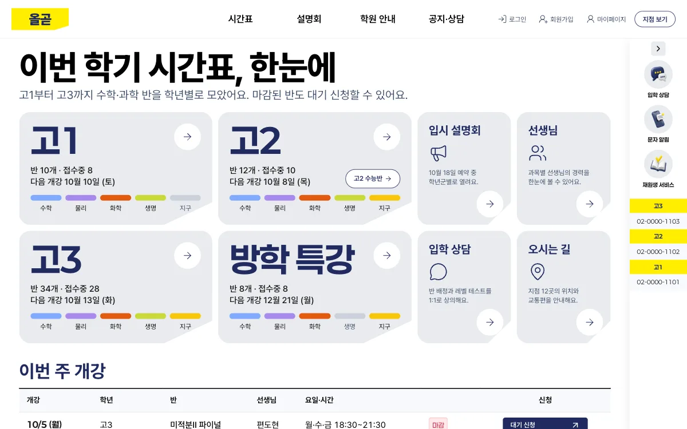
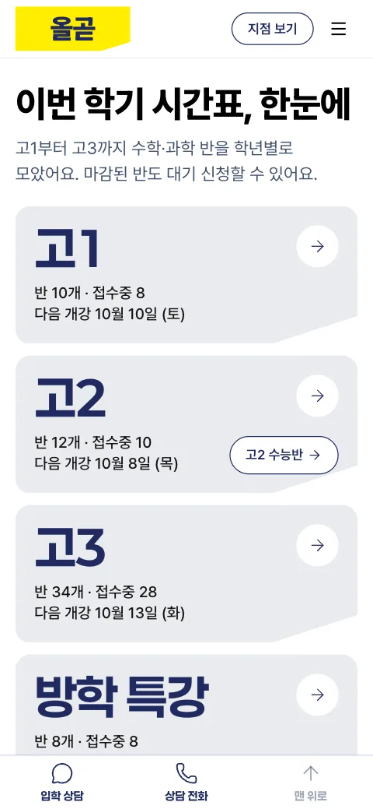

# 올곧

고등부 수학·과학 입시학원 웹 앱이에요. 학생과 학부모가 학년·과목별 시간표에서 반을 찾아 수강 신청이나 대기 신청을 하고, 입시 설명회를 예약하고 입학 상담을 신청해요. 로그인 뒤에는 재원생이 신청 내역, 좌석, 복습 영상, 질문, 성적을 한곳에서 봐요. 첫 화면 문구는 "이번 학기 시간표, 한눈에"예요. 학원, 선생님, 학생, 연락처, 성적은 모두 지어낸 예시이고, 합격 실적은 넣지 않았어요.



[프리셋 사이트 열기](https://roadkwon-ai.github.io/pro-kit/olgot/) · [프로킷 사이트에서 모든 페이지 보기](https://prokit-web.vercel.app/work/olgot/)

| 항목 | 내용 |
|---|---|
| 페이지 | <!-- v:preset.olgot.pages -->203<!-- /v -->개(<!-- v:preset.olgot.pageTypes -->48<!-- /v -->종): 홈, 학년별 시간표 6개, 반 상세 74개, 설명회 5개, 공지, 공지 상세 12개, 학원 소개, 선생님 소개, 시설 3곳, 주간 식단표, 오시는 길, 선생님 모집, 입학 상담 신청, 문자 수신 신청, 로그인·가입·찾기 7개, 약관 2개, 저작권 신고 안내, 로그인 뒤 학생 화면 84개(MY신청, 좌석 신청, 복습 영상 상세 60개, 질문, 성적 조회, 신청서 3개 등 21종) |
| 스타일 | 입시학원 사이트 한 곳을 실측한 값으로 만든 `DESIGN.md` (카탈로그 스타일이 아니에요) |
| 대표 색 | 남색 `#202a60`과 형광 노랑 `#ffee00` (노랑은 신청 버튼처럼 지금 누를 수 있는 것에만) |
| 서체 | Pretendard (배지와 과목 태그만 Paperlogy) |
| AI로 그린 그림 | <!-- v:preset.olgot.design.images -->81<!-- /v -->장 |
| 검사 | 버튼과 링크 <!-- v:preset.olgot.design.clicks -->2,025<!-- /v -->번 눌러 봄. 없는 페이지 0, 콘솔 오류 0 |

## 프리셋 팩으로 만들어 보기

<!-- b:preset-pack name=olgot -->
작업 폴더 `~/projects`에서 연 에이전트에 이 프롬프트를 보내면 올곧 프리셋과 같은 서비스를 만들어요. [프리셋 팩](https://github.com/roadkwon-ai/pro-kit-premium-packs/releases/tag/pack-olgot)의 화면 구성, 디자인, 예시 데이터, 그림을 그대로 써서 AI 그림을 새로 그리지 않아요. `[ ]` 안의 이름만 바꾸면 이름만 다른 서비스가 나와요. 팩을 써도 AI가 만들기 때문에 100% 똑같지는 않을 수 있어요.

```prompt
https://github.com/roadkwon-ai/pro-kit 을 이 폴더에 받고, 그 안의 AGENTS.md대로 화면만 만들 프로젝트를 pro-kit 옆에 [olgot] 폴더로 만들어줘.
DB는 쓰지 않아. 없는 준비물은 설치해줘.
옆 폴더 pro-kit의 packs/olgot에 프리셋 팩을 받아줘.
그 팩대로 올곧 프리셋과 똑같은 서비스를 만들 거야. 이름은 [올곧].
팩의 README.md 순서대로 하고, 팩은 고치지 마. 이름을 바꿨으면 팩의 이름 대신 내가 정한 이름을 써.
디자인, 화면 구성, 그림은 팩에 있는 것을 써. 스타일 추천, 시안, 새 그림은 만들지 마.
모든 페이지를 팩의 스크린샷과 같게 만들고, 다 만들면 HTML 파일로 내보내줘.
```

> [!IMPORTANT]
> **프롬프트만 보내면 에이전트가 이 프리셋 팩을 자동으로 받아 설치해요. 따로 받지 않아도 돼요.**
>
> 직접 받으려면 [olgot-pack.zip](https://github.com/roadkwon-ai/pro-kit-premium-packs/releases/download/pack-olgot/olgot-pack.zip)(29.9MB, [릴리스](https://github.com/roadkwon-ai/pro-kit-premium-packs/releases/tag/pack-olgot))을 받고, 프롬프트 끝에 `프리셋 팩 zip은 [~/Downloads/olgot-pack.zip]에 받아 뒀어.` 한 줄을 더하세요. 에이전트가 그 zip이 최신 판인지 확인하고, 옛 판이면 새로 받아요.
<!-- /b -->

<!-- b:preset-next-steps -->
에이전트를 아직 열지 않았으면 [1. 작업 폴더에서 에이전트 열기](README.md#1-작업-폴더에서-에이전트-열기)부터 하세요. 프롬프트를 보낸 다음에는 [3. 알려 준 한 줄로 이어 가기](README.md#3-알려-준-한-줄로-이어-가기)와 [4. 답하며 요청을 자세히 채우기](README.md#4-답하며-요청을-자세히-채우기)를 따라가면 돼요.
<!-- /b -->

<details>
<summary>막히면</summary>

<!-- b:trouble-pack name=olgot -->
- **프리셋 팩을 못 찾는대요**: `프리셋 팩은 옆 폴더 pro-kit의 packs/olgot에 있어. 없으면 pro-kit 폴더에서 node scripts/pack.mjs olgot 명령으로 받아줘`라고 보내세요. pro-kit 폴더가 2026-10-08 전에 받은 것이라 팩 받기가 멈추면 `그 폴더 이름을 pro-kit-old로 바꾸고 새로 받아줘`라고 보내세요.
<!-- /b -->

</details>

## 프리셋 팩으로 나만의 서비스 만들기

<!-- b:preset-remix name=olgot folder=olgot-english title="올곧 영어" changes="주제는 고등부 영어 입시학원, 대표 색은 짙은 초록" topic="주제는 고등부 영어 입시학원" -->
올곧의 [프리셋 팩](https://github.com/roadkwon-ai/pro-kit-premium-packs/releases/tag/pack-olgot)을 바탕으로 이름, 색, 페이지, 주제를 바꿔 나만의 서비스를 만들어요. 화면 구성과 디자인이 정해져 있어서 처음부터 만들 때보다 빠르고, 맞지 않는 그림만 같은 화풍으로 다시 그려요.

```prompt
https://github.com/roadkwon-ai/pro-kit 을 이 폴더에 받고, 그 안의 AGENTS.md대로 화면만 만들 프로젝트를 pro-kit 옆에 [olgot-english] 폴더로 만들어줘.
DB는 쓰지 않아. 없는 준비물은 설치해줘.
옆 폴더 pro-kit의 packs/olgot에 프리셋 팩을 받아줘.
그 팩을 바탕으로 나만의 서비스를 만들 거야. 이름은 [올곧 영어].
바꿀 것: [주제는 고등부 영어 입시학원, 대표 색은 짙은 초록]
팩의 README.md와 CUSTOMIZE.md를 보고, 바꾸는 것에 맞춰 다시 할 일만 해줘. 다시 그릴 그림은 팩의 prompts.json을 고쳐 같은 화풍으로 그려줘.
팩은 고치지 말고, 바꾸지 않는 것은 팩대로 해. 다 만들면 HTML 파일로 내보내줘.
```

`바꿀 것`에는 이렇게 적어요.
- 색이나 서체: `대표 색은 짙은 파랑, 제목 서체는 더 둥글게`
- 페이지: `[페이지 이름] 페이지는 빼줘` 또는 `[페이지 이름] 페이지를 더해줘`
- 주제: `주제는 고등부 영어 입시학원`

무엇을 바꾸면 무엇을 다시 하는지는 팩의 `CUSTOMIZE.md`에 있어요. **그림을 다시 그리려면 이미지를 그릴 수 있는 에이전트가 필요해요**([이미지 그리기](../reference/costs-and-keys.md#이미지-그리기)). 그릴 수 없으면 원래 그림을 그대로 써요.

팩 zip을 미리 받아 두었다면 [프리셋 팩으로 만들어 보기](#프리셋-팩으로-만들어-보기)처럼 이 프롬프트 끝에도 zip 경로 한 줄을 더하세요.
<!-- /b -->

## 이 컨셉으로 처음부터 만들기

<!-- b:preset-scratch-intro -->
작업 폴더 `~/projects`에서 연 에이전트에 이 프롬프트를 그대로 보내면 **바로** 시작돼요. [가장 쉬운 방법](README.md#가장-쉬운-방법)의 프롬프트와 같고, `[ ]` 안만 이 프리셋의 폴더 이름과 컨셉이에요. 원하는 대로 바꿔도 돼요.
<!-- /b -->

<!-- b:screen-prompt folder=olgot concept="고1~고3 학생과 학부모가 학년·과목별 시간표에서 수학·과학 반을 찾아 수강 신청과 대기 신청을 하고 입시 설명회를 예약하며, 재원생은 신청 내역과 복습 영상, 성적을 보는 입시학원 사이트" -->
```prompt
https://github.com/roadkwon-ai/pro-kit 을 이 폴더에 받고, 그 안의 AGENTS.md대로 화면만 만들 프로젝트를 pro-kit 옆에 [olgot] 폴더로 만들어줘.
DB는 쓰지 않아. 없는 준비물은 설치해줘.
[고1~고3 학생과 학부모가 학년·과목별 시간표에서 수학·과학 반을 찾아 수강 신청과 대기 신청을 하고 입시 설명회를 예약하며, 재원생은 신청 내역과 복습 영상, 성적을 보는 입시학원 사이트]를 만들고 싶어.
필요한 화면을 모두 예시 데이터로 만들어줘. 로그인이나 저장 같은 기능은 빼고 화면만 만들어.
디자인 스타일은 서비스에 어울리는 걸로 추천해주고, 다 만들면 HTML 파일로 내보내줘.
```
<!-- /b -->

<!-- b:preset-scratch-note -->
**같은 컨셉이라도 이름, 스타일, 화면은 매번 다르게 나와요.** 프리셋에 가깝게 만들려면 [프리셋 팩으로 만들어 보기](#프리셋-팩으로-만들어-보기)를 쓰세요.
<!-- /b -->

올곧의 디자인은 추천 목록에 있는 스타일이 아니라 입시학원 사이트 한 곳을 실측해 만든 `DESIGN.md`라서 처음부터 만들면 추천받은 다른 스타일로 나와요. 올곧의 디자인에 내 컨셉을 얹으려면 [프리셋 팩으로 나만의 서비스 만들기](#프리셋-팩으로-나만의-서비스-만들기)를 쓰세요.

<!-- b:preset-next-steps -->
에이전트를 아직 열지 않았으면 [1. 작업 폴더에서 에이전트 열기](README.md#1-작업-폴더에서-에이전트-열기)부터 하세요. 프롬프트를 보낸 다음에는 [3. 알려 준 한 줄로 이어 가기](README.md#3-알려-준-한-줄로-이어-가기)와 [4. 답하며 요청을 자세히 채우기](README.md#4-답하며-요청을-자세히-채우기)를 따라가면 돼요.
<!-- /b -->

## 시간과 비용

위 "프리셋 팩으로 만들어 보기" 프롬프트로 만들 때 **<!-- v:preset.olgot.pack.time.text -->한 번에 완성하면 약 3시간 55분\~7시간 50분(여러 번 고쳐 달라고 하면 약 11시간 45분까지)<!-- /v -->** 걸리고, 토큰은 최소 **약 <!-- v:preset.olgot.pack.tokens -->550만<!-- /v -->**(캐시 포함 약 <!-- v:preset.olgot.pack.cached -->2.8억<!-- /v -->)이 들어요. 팩 없이 [이 컨셉으로 처음부터](#이-컨셉으로-처음부터-만들기) 만들 때는 <!-- v:preset.olgot.scratch.time.text -->한 번에 완성하면 약 5시간 45분\~11시간 30분(여러 번 고쳐 달라고 하면 약 17시간 15분까지)<!-- /v --> 걸리고, 토큰은 최소 약 <!-- v:preset.olgot.scratch.tokens -->800만<!-- /v -->이라 <!-- v:limit.window -->5시간<!-- /v --> 한도에 약 <!-- v:preset.olgot.scratch.limit -->4<!-- /v -->번 걸려서 2~3일에 나눠 만들어요. 페이지는 <!-- v:preset.olgot.pages -->203<!-- /v -->개지만 반 상세 74개, 복습 영상 상세 60개처럼 같은 틀로 찍어 내는 페이지가 많아서 페이지 <!-- v:preset.olgot.pageTypes -->48<!-- /v -->종으로 어림했어요.

<!-- b:revise-time-detail -->
<details>
<summary>자세히 보기: 고쳐 달라고 하면 왜 늘어날까요</summary>

| 과정 | 하는 일 | 더 드는 시간 |
|---|---|---|
| 고치기 | 요청을 읽고 고칠 곳을 찾아 고쳐요 | 약 2\~12분 |
| 검사 | 타입 검사, 포맷, 빌드 | 약 1\~3분 |
| 모든 페이지 다시 확인 | 고친 부품이 다른 페이지를 깨지 않았는지 봐요 | 13쪽 약 5분, 203쪽 약 6\~37분 |
| 리뷰 에이전트 | 크게 고쳤으면 고친 코드를 한 번 더 검토해요 | 약 4\~10분 |
| 마무리 | 기록, 검사, 커밋. 마지막에 한 번만 해요 | 약 1\~15분 |

**한 군데를 고치면 약 10분, 두 군데면 약 28\~43분이 더 들어요.** 마무리 검토(디자인 리뷰, 리뷰 에이전트, 모든 페이지 다시 확인)를 한 번 더 하면 2\~3시간이 더 들어요. 프리셋을 만들 때 잰 값이고, 내가 결과를 보고 확인하는 시간은 따로예요. [고쳐 달라고 할 때마다 더 드는 시간](../reference/process-and-time.md#고쳐-달라고-할-때마다-더-드는-시간)

</details>
<!-- /b -->

<!-- b:limit-line name=olgot -->
Claude Pro · ChatGPT Plus(Codex): 가능 (5시간 한도에 약 3번 걸려요) · [5시간 한도란?](../reference/costs-and-keys.md#5시간-한도에-걸리면)
<!-- /b -->

<!-- b:cost-note -->
시간의 앞 숫자와 토큰은 순조롭게 한 번에 끝날 때의 최솟값이에요. 토큰도 시간처럼 쓰는 AI와 고쳐 달라는 횟수에 따라 2~3배까지 늘 수 있어요. [읽는 법](../reference/costs-and-keys.md#시간과-비용-읽는-법) · [실제로 걸린 시간 자세히](../reference/process-and-time.md)
<!-- /b -->

<details>
<summary>단계별 예상</summary>

<!-- b:preset-stage-intro -->
칸마다 시간 · 토큰 · API 요금 환산이고, 순조롭게 한 번에 끝날 때의 최솟값이에요. 합계의 시간에만 한 번에 완성할 때의 범위와 여러 번 고칠 때를 붙였어요.
<!-- /b -->

| 단계 | 프리셋 팩으로 | 처음부터(내 컨셉으로) |
|---|---|---|
| 준비: pro-kit 받기, 프로젝트 만들기 | <!-- v:cost.stage.setup.time -->5분<!-- /v --> · <!-- v:cost.tokens.1 -->5.5만<!-- /v --> · 1달러 | <!-- v:cost.stage.setup.time -->5분<!-- /v --> · <!-- v:cost.tokens.1 -->5.5만<!-- /v --> · 1달러 |
| 기획: 서비스 질문, 이름, 사이트맵 | <!-- v:cost.stage.plan.pack.time -->5분<!-- /v --> · <!-- v:cost.tokens.1.5 -->8.3만<!-- /v --> · 2달러 | <!-- v:cost.stage.plan.scratch.time -->10분<!-- /v --> · <!-- v:cost.tokens.3 -->17만<!-- /v --> · 3달러 |
| 디자인: DESIGN.md (처음부터는 스타일 추천 1~3위 포함) | <!-- v:cost.stage.design.pack.time -->5분<!-- /v --> · <!-- v:cost.tokens.2 -->11만<!-- /v --> · 2달러 | <!-- v:cost.stage.design.scratch.time -->8분<!-- /v --> · <!-- v:cost.tokens.3.5 -->19만<!-- /v --> · 4달러 |
| 화면 구성 | 팩의 스크린샷을 따라요 | 시안 3장 <!-- v:cost.stage.mockup.time -->10분<!-- /v --> · <!-- v:cost.tokens.3 -->17만<!-- /v --> · 3달러 |
| 그림 <!-- v:preset.olgot.design.images -->81<!-- /v -->장 | 팩에서 받기 <!-- v:cost.stage.packImages.time -->1분<!-- /v --> | <!-- v:preset.olgot.stages.images.time -->41분<!-- /v --> · <!-- v:cost.tokens.24.5 -->130만<!-- /v --> · 25달러 |
| 첫 화면 | <!-- v:cost.stage.first.pack.time -->10분<!-- /v --> · <!-- v:cost.tokens.4 -->22만<!-- /v --> · 4달러 | <!-- v:cost.stage.first.scratch.time -->15분<!-- /v --> · <!-- v:cost.tokens.6 -->33만<!-- /v --> · 6달러 |
| 나머지 페이지 <!-- v:preset.olgot.pageTypes.rest -->47<!-- /v -->종 | <!-- v:preset.olgot.stages.rest.pack.time -->3시간 8분<!-- /v --> · <!-- v:cost.tokens.80 -->440만<!-- /v --> · 80달러 | <!-- v:preset.olgot.stages.rest.scratch.time -->3시간 55분<!-- /v --> · <!-- v:cost.tokens.95 -->520만<!-- /v --> · 95달러 |
| 검사와 디자인 리뷰 | <!-- v:preset.olgot.stages.check.time -->19분<!-- /v --> · 64만 · 12달러 | <!-- v:preset.olgot.stages.check.time -->19분<!-- /v --> · 64만 · 12달러 |
| HTML 내보내기 | <!-- v:cost.stage.export.time -->2분<!-- /v --> · <!-- v:cost.tokens.0.5 -->2.8만<!-- /v --> · 1달러 미만 | <!-- v:cost.stage.export.time -->2분<!-- /v --> · <!-- v:cost.tokens.0.5 -->2.8만<!-- /v --> · 1달러 미만 |
| (선택) GitHub Pages 배포 | <!-- v:cost.stage.pages.time -->5분<!-- /v --> · <!-- v:cost.tokens.1 -->5.5만<!-- /v --> · 1달러 | <!-- v:cost.stage.pages.time -->5분<!-- /v --> · <!-- v:cost.tokens.1 -->5.5만<!-- /v --> · 1달러 |
| 합계(배포 빼고) | <!-- v:preset.olgot.pack.time.cell -->약 3시간 55분\~7시간 50분 (여러 번 고치면 약 11시간 45분까지)<!-- /v --> · 약 <!-- v:preset.olgot.pack.tokens -->550만<!-- /v -->(캐시 포함 약 <!-- v:preset.olgot.pack.cached -->2.8억<!-- /v -->) · 약 <!-- v:preset.olgot.pack.usd -->100<!-- /v -->달러 | <!-- v:preset.olgot.scratch.time.cell -->약 5시간 45분\~11시간 30분 (여러 번 고치면 약 17시간 15분까지)<!-- /v --> · 약 <!-- v:preset.olgot.scratch.tokens -->800만<!-- /v -->(캐시 포함 약 <!-- v:preset.olgot.scratch.cached -->4.0억<!-- /v -->) · 약 <!-- v:preset.olgot.scratch.usd -->145<!-- /v -->달러 |

<!-- b:preset-cost-detail -->
프리셋 팩으로 나만의 서비스를 만들면 다시 그리는 그림 장당 약 30초, 약 1.7만 토큰이 더 들어요. 주제를 바꾸면 기획에 5분, 약 8.3만 토큰이 더 들어요.

모두 실제로 잰 단위값으로 어림한 예상이에요. 시안과 AI 그림을 OpenAI API 키로 그리면 이미지 요금이 따로 들어요. ChatGPT 요금제로 그리면 그 사용량 안이에요.
<!-- /b -->

</details>

<details>
<summary>만든 사람이 실제로 쓴 값</summary>

올곧 프리셋을 만들 때는 기획과 홈 시안부터 모든 페이지 만들기, 디자인 리뷰, 직접 보고 두 번 고친 것까지 약 <!-- v:preset.olgot.actual.total.time -->8시간 20분<!-- /v -->, 약 <!-- v:preset.olgot.actual.total.tokens -->630만<!-- /v --> 토큰(캐시 포함 약 <!-- v:preset.olgot.actual.total.cached -->3.2억<!-- /v -->, API 요금 환산 약 <!-- v:preset.olgot.actual.total.usd -->115<!-- /v -->달러)이 들었어요. 다른 프리셋과 달리 버린 첫 판이나 리디자인 없이 처음부터 모든 페이지를 만든 값이에요. **사용자가 확인하고 고친 시간까지 더해져서 위 예상보다 길어요.** 그림 <!-- v:preset.olgot.design.images -->81<!-- /v -->장은 ChatGPT로 로그인한 Codex로 그려서 이 값에 들어가지 않아요.

</details>

## 실제로 거친 과정

올곧은 한 번에 나오지 않았어요. 결과를 보고 몇 번 다시 요청했어요.

| 단계 | 한 일 | 결과 |
|---|---|---|
| 1. 기획과 시안 | 첫 요청에서 스타일을 추천받지 않고, 입시학원 사이트 한 곳을 실측해 만든 `DESIGN.md`를 그대로 쓰게 했어요. 서비스 설명(`PRODUCT.md`)과 12페이지 사이트맵을 받고, 첫 화면 방식·바로가기 카드 배치·시간표를 보여 주는 방식이 다른 홈 시안 3장 중 <!-- v:preset.olgot.design.comp -->B<!-- /v -->(<!-- v:preset.olgot.design.compName -->학년 카드<!-- /v -->)를 골랐어요 | 이름은 처음부터 올곧 |
| 2. 범위 넓히기 | 공개 페이지 전부와 로그인 뒤 학생 화면까지 넣기로 정하고, 사이트맵을 12페이지에서 넓혔어요 | <!-- v:preset.olgot.pageTypes -->48<!-- /v -->종, 화면 68개 |
| 3. 1차 14페이지 | 홈, 시간표, 반 상세, 선생님, 설명회 예약, 공지, 학원 소개, 오시는 길, 입학 상담, 로그인, MY신청, 약관을 먼저 만들고 그림을 그렸어요. 아직 만들지 않은 페이지로 가는 링크도 없는 페이지가 뜨지 않게 자리를 먼저 두었어요 | 그림 37장 |
| 4. 나머지 35종 | 공개 페이지 나머지 15종과 로그인 뒤 화면 20종을 채우고 그림 44장을 더 그렸어요. 휴대폰에서 떠 있는 상담 버튼이 카드 화살표를 가리던 것과 노랗게 강조하는 카드가 화면 너비마다 다르던 것을 고쳤어요 | 페이지 <!-- v:preset.olgot.pages -->203<!-- /v -->개, 그림 <!-- v:preset.olgot.design.images -->81<!-- /v -->장 |
| 5. 마무리 | 링크·버튼 검사, 디자인 리뷰, 코드 리뷰, 다듬기. 로그인 뒤 돌아갈 주소에 바깥 사이트를 넣으면 그리로 보내던 문제(열린 리다이렉트)를 고치고, 모든 페이지 아래에 제작 표시를 넣었어요 | 디자인 리뷰 28/40에서 <!-- v:preset.olgot.design.critique -->30<!-- /v -->/40, 기술 점검(audit) 18/20 |
| 6. 직접 보고 고치기 | 결과를 둘러보며 "우측 사이드바에 오시는 길이 살짝 가려지는데 이건 의도한 거야?", "MY신청에서 새 신청 버튼이 약간 아래 사선 방향으로 나타나는데 이것도 의도한 거야?"라고 [짚었어요](refine.md#구도와-화면). 오른쪽 빠른 메뉴 폭만큼 내용을 비켜 놓고, <!-- v:preset.olgot.pages -->203<!-- /v -->페이지를 6가지 너비로 재는 겹침 검사로 가려진 곳 2,489곳을 0으로 줄였어요. 이어서 "주간 식단표에 Today가 개행이 된 거 고쳐야 될 것 같아"라고 해서, 배지가 두 줄로 끊긴 곳을 <!-- v:preset.olgot.pages -->203<!-- /v -->페이지 × 6가지 너비로 찾아 고쳤어요. 리뷰에서 미뤄 둔 두 가지(로그인 뒤 화면의 남색 머리 높이, 좁은 휴대폰에서 버튼을 두 개씩 나란히 놓는 배치)는 "추천대로 그대로 둬"라고 답해 `DESIGN.md`대로 두었어요 | "해결됐어", "고쳐졌어" |



## 실제 서비스로 만들 때

올곧은 페이지가 <!-- v:preset.olgot.pages -->203<!-- /v -->개로 가장 많고, 결제와 환불, 휴대폰 본인 확인, 문자, 복습 영상 재생, 지도까지 외부 서비스가 다섯 가지 필요해요. 학생의 성적과 연락처를 다루고, 학생·학부모·직원이 볼 수 있는 것이 서로 달라요. 선생님과 직원이 반, 성적, 영상을 올리는 관리 화면은 프리셋에 없어서 새로 만들어야 해요.

<!-- b:preset-real-service tail=" 앞의 것부터 차례로 하면 쉬워요." -->
바꾸는 순서는 [실제 서비스로 만들기](real-service.md)를 따르고, **기능은 아래 요청을 하나씩 보내세요.** 앞의 것부터 차례로 하면 쉬워요.
<!-- /b -->

**필요한 데이터**: 회원(학생·학부모, 학년, 학교, 휴대폰, 학부모와 자녀 연결), 반(학년 구분, 과목, 수준, 선생님, 요일·시간, 개강일, 정원, 월 수강료), 수강 신청(회원, 반, 수강·대기·전반, 상태, 대기 순서), 설명회와 예약, 결제와 환불(신청, 금액, 상태, 환불 사유), 좌석(반, 좌석 번호, 회원), 복습 영상(반, 회차, 볼 수 있는 기간), 기기(회원, 등록한 기기), 질문과 답변, 성적(시험, 과목, 점수)

**지킬 규칙**: 학생은 자기 신청, 좌석, 영상, 질문, 성적만 봐요. 학부모는 연결된 자녀의 것만 봐요. 시간표, 공지, 설명회 일정은 누구나 봐요. 정원을 넘겨 신청할 수 없고, 마감된 반은 대기 신청으로 받아요. 같은 좌석은 한 사람만 가져요. 환불 금액은 공지의 수강료 환불 규정대로 계산해요. 복습 영상은 듣는 반의 영상만, 등록한 기기에서만 봐요.

```prompt
회원(학생·학부모), 반, 수강 신청, 설명회 예약, 좌석을 DB에 저장하게 해줘. 학생은 자기 데이터만, 학부모는 연결된 자녀의 데이터만 볼 수 있어야 해.
```

```prompt
시간표와 반 상세의 남은 자리와 상태(접수중, 마감임박, 마감)를 DB의 신청 수로 계산해줘. 정원이 차면 대기 신청을 받고, 취소가 생기면 대기 순서대로 자리를 채워 줘. 마지막 한 자리나 같은 좌석을 두 사람이 동시에 눌러도 한 명만 돼야 해.
```

```prompt
직원 계정을 만들고, 직원이 반, 공지, 설명회, 성적을 올리고 고치는 관리 화면을 만들어줘. 직원만 들어갈 수 있어야 해.
```

```prompt
수강 신청 뒤 수강료를 결제하게 해줘. 결제는 결제 서비스의 테스트 모드로 하고, 결제가 끝난 뒤에만 신청완료로 바꿔줘. 환불 신청은 수강료 환불 규정대로 금액을 계산해서 결제를 취소해줘.
```

```prompt
문자 수신 신청, 복습 영상, 성적 조회의 본인 확인을 실제 휴대폰 인증으로 바꿔줘. 신청이 끝나거나 대기 순서가 오면 문자로 알려줘.
```

```prompt
복습 영상을 영상 서비스에 올려 재생하게 해줘. 듣는 반의 영상만, 기기 정보에 등록한 기기에서만 볼 수 있어야 해.
```

```prompt
오시는 길의 그림 지도를 지도 API로 바꿔서 지점 12곳을 실제 지도 위에 보여줘.
```

> [!TIP]
> 올곧 프리셋은 화면만 만들 때 이미 로그인 뒤 돌아갈 주소를 사이트 안 주소로만 받는 코드(`apps/web/src/lib/after-login.ts`의 `afterLogin`), 중복 신청과 전반 신청을 가리는 코드(`apps/web/src/components/classes/apply-utils.ts`), 폼 입력 규칙(`apps/web/src/lib/validation.ts`)을 만들어 두었어요. 내 프로젝트에도 비슷한 코드가 있으면 새로 만들지 말고 그대로 쓰자고 하세요.

외부 서비스는 계정과 키가 따로 필요해요. 결제와 환불은 결제 대행 서비스(PG)의 가맹 계정과 키, 휴대폰 본인 확인은 본인 확인 서비스 계약, 문자는 문자 발송 서비스 계정과 등록한 발신번호, 복습 영상은 영상 저장·재생 서비스 계정, 지도는 지도 서비스의 API 키가 있어야 해요. 결제와 본인 확인은 대개 사업자 등록이 있어야 계약할 수 있어요. 처음에는 결제를 테스트 모드로 두고, 본인 확인과 영상은 프리셋처럼 화면만 둔 채 신청 저장부터 붙여 보세요. 키는 대화창에 붙여 넣지 마세요([비용과 키](../reference/costs-and-keys.md)).
