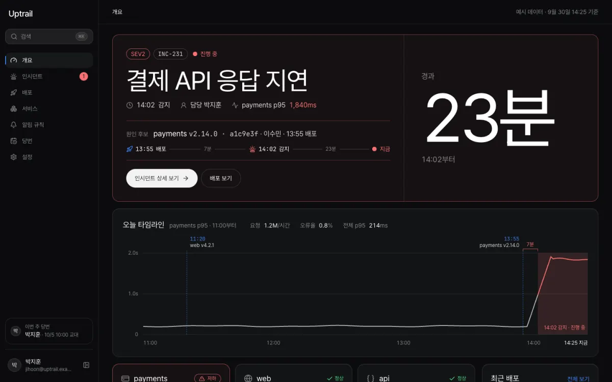
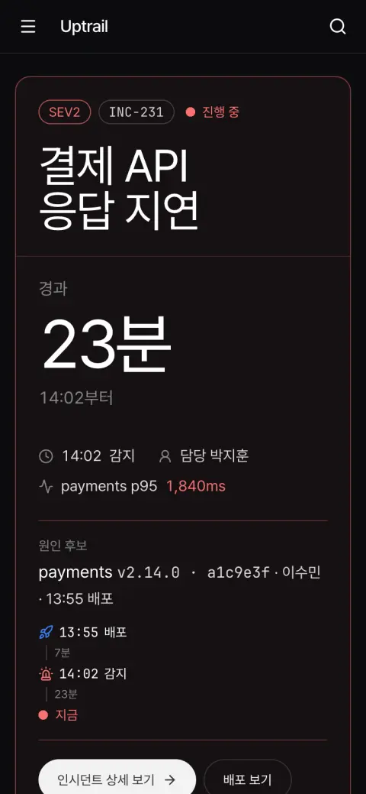

# Uptrail

개발팀이 만든 서비스가 잘 돌아가는지 한 화면에서 지켜보는 모니터링 서비스예요. 서비스별 가동률(얼마나 끊기지 않고 돌았는지)과 응답 시간, 최근 배포(새 버전을 내보낸 기록)를 보여 주고, 장애가 나면 어느 배포 뒤에 났는지 바로 찾아 줘요. 장애 하나하나는 인시던트라는 기록으로 남겨 처리해요.



[프리셋 사이트 열기](https://roadkwon-ai.github.io/pro-kit/uptrail/) · [프로킷 사이트에서 모든 페이지 보기](https://prokit-web.vercel.app/work/uptrail/)

| 항목 | 내용 |
|---|---|
| 페이지 | <!-- v:preset.uptrail.pages -->22<!-- /v -->개: 상태 개요, 서비스, 서비스 상세 6개, 인시던트, 인시던트 상세 7개, 배포, 알림 규칙, 당번 일정, 팀 설정, 프로필, 로그인 |
| 스타일 | <!-- v:preset.uptrail.design.src1 -->Refero Styles<!-- /v -->의 [<!-- v:preset.uptrail.design.rec1 -->Default<!-- /v -->](https://styles.refero.design/style/eeeb6ac9-fc07-4965-935a-e1989ed831f1) |
| 대표 색 | <!-- v:preset.uptrail.design.color -->시그널 블루<!-- /v --> <!-- v:preset.uptrail.design.hexCode -->`#3b82f6`<!-- /v --> |
| 서체 | Pretendard, JetBrains Mono |
| AI로 그린 그림 | <!-- v:preset.uptrail.design.images -->2<!-- /v -->장 |
| 검사 | 버튼과 링크 <!-- v:preset.uptrail.design.clicks -->282<!-- /v -->번 눌러 봄. 없는 페이지 0, 콘솔 오류 0 |

## 프리셋 팩으로 만들어 보기

<!-- b:preset-pack name=uptrail -->
작업 폴더 `~/projects`에서 연 에이전트에 이 프롬프트를 보내면 Uptrail 프리셋과 같은 서비스를 만들어요. [프리셋 팩](https://github.com/roadkwon-ai/pro-kit-packs/releases/tag/pack-uptrail)의 화면 구성, 디자인, 예시 데이터, 그림을 그대로 써서 AI 그림을 새로 그리지 않아요. `[ ]` 안의 이름만 바꾸면 이름만 다른 서비스가 나와요. 팩을 써도 AI가 만들기 때문에 100% 똑같지는 않을 수 있어요.

```prompt
https://github.com/roadkwon-ai/pro-kit 을 이 폴더에 받고, 그 안의 AGENTS.md대로 화면만 만들 프로젝트를 pro-kit 옆에 [uptrail] 폴더로 만들어줘.
DB는 쓰지 않아. 없는 준비물은 설치해줘.
옆 폴더 pro-kit의 packs/uptrail에 프리셋 팩을 받아줘.
그 팩대로 Uptrail 프리셋과 똑같은 서비스를 만들 거야. 이름은 [Uptrail].
팩의 README.md 순서대로 하고, 팩은 고치지 마. 이름을 바꿨으면 팩의 이름 대신 내가 정한 이름을 써.
디자인, 화면 구성, 그림은 팩에 있는 것을 써. 스타일 추천, 시안, 새 그림은 만들지 마.
모든 페이지를 팩의 스크린샷과 같게 만들고, 다 만들면 HTML 파일로 내보내줘.
```

> [!IMPORTANT]
> **프롬프트만 보내면 에이전트가 이 프리셋 팩을 자동으로 받아 설치해요. 따로 받지 않아도 돼요.**
>
> 직접 받으려면 [uptrail-pack.zip](https://github.com/roadkwon-ai/pro-kit-packs/releases/download/pack-uptrail/uptrail-pack.zip)(3.2MB, [릴리스](https://github.com/roadkwon-ai/pro-kit-packs/releases/tag/pack-uptrail))을 받고, 프롬프트 끝에 `프리셋 팩 zip은 [~/Downloads/uptrail-pack.zip]에 받아 뒀어.` 한 줄을 더하세요. 에이전트가 그 zip이 최신 판인지 확인하고, 옛 판이면 새로 받아요.
<!-- /b -->

<!-- b:preset-next-steps -->
에이전트를 아직 열지 않았으면 [1. 작업 폴더에서 에이전트 열기](README.md#1-작업-폴더에서-에이전트-열기)부터 하세요. 프롬프트를 보낸 다음에는 [3. 알려 준 한 줄로 이어 가기](README.md#3-알려-준-한-줄로-이어-가기)와 [4. 답하며 요청을 자세히 채우기](README.md#4-답하며-요청을-자세히-채우기)를 따라가면 돼요.
<!-- /b -->

<details>
<summary>막히면</summary>

<!-- b:trouble-pack name=uptrail -->
- **프리셋 팩을 못 찾는대요**: `프리셋 팩은 옆 폴더 pro-kit의 packs/uptrail에 있어. 없으면 pro-kit 폴더에서 node scripts/pack.mjs uptrail 명령으로 받아줘`라고 보내세요. pro-kit 폴더가 2026-10-08 전에 받은 것이라 팩 받기가 멈추면 `그 폴더 이름을 pro-kit-old로 바꾸고 새로 받아줘`라고 보내세요.
<!-- /b -->

</details>

## 프리셋 팩으로 나만의 서비스 만들기

<!-- b:preset-remix name=uptrail folder=jobtrail title="Jobtrail" changes="주제는 데이터 파이프라인 작업 모니터링, 대표 색은 초록" topic="주제는 데이터 파이프라인 작업 모니터링" -->
Uptrail의 [프리셋 팩](https://github.com/roadkwon-ai/pro-kit-packs/releases/tag/pack-uptrail)을 바탕으로 이름, 색, 페이지, 주제를 바꿔 나만의 서비스를 만들어요. 화면 구성과 디자인이 정해져 있어서 처음부터 만들 때보다 빠르고, 맞지 않는 그림만 같은 화풍으로 다시 그려요.

```prompt
https://github.com/roadkwon-ai/pro-kit 을 이 폴더에 받고, 그 안의 AGENTS.md대로 화면만 만들 프로젝트를 pro-kit 옆에 [jobtrail] 폴더로 만들어줘.
DB는 쓰지 않아. 없는 준비물은 설치해줘.
옆 폴더 pro-kit의 packs/uptrail에 프리셋 팩을 받아줘.
그 팩을 바탕으로 나만의 서비스를 만들 거야. 이름은 [Jobtrail].
바꿀 것: [주제는 데이터 파이프라인 작업 모니터링, 대표 색은 초록]
팩의 README.md와 CUSTOMIZE.md를 보고, 바꾸는 것에 맞춰 다시 할 일만 해줘. 다시 그릴 그림은 팩의 prompts.json을 고쳐 같은 화풍으로 그려줘.
팩은 고치지 말고, 바꾸지 않는 것은 팩대로 해. 다 만들면 HTML 파일로 내보내줘.
```

`바꿀 것`에는 이렇게 적어요.
- 색이나 서체: `대표 색은 짙은 파랑, 제목 서체는 더 둥글게`
- 페이지: `[페이지 이름] 페이지는 빼줘` 또는 `[페이지 이름] 페이지를 더해줘`
- 주제: `주제는 데이터 파이프라인 작업 모니터링`

무엇을 바꾸면 무엇을 다시 하는지는 팩의 `CUSTOMIZE.md`에 있어요. **그림을 다시 그리려면 이미지를 그릴 수 있는 에이전트가 필요해요**([이미지 그리기](../reference/costs-and-keys.md#이미지-그리기)). 그릴 수 없으면 원래 그림을 그대로 써요.

팩 zip을 미리 받아 두었다면 [프리셋 팩으로 만들어 보기](#프리셋-팩으로-만들어-보기)처럼 이 프롬프트 끝에도 zip 경로 한 줄을 더하세요.
<!-- /b -->

## 이 컨셉으로 처음부터 만들기

<!-- b:preset-scratch-intro -->
작업 폴더 `~/projects`에서 연 에이전트에 이 프롬프트를 그대로 보내면 **바로** 시작돼요. [가장 쉬운 방법](README.md#가장-쉬운-방법)의 프롬프트와 같고, `[ ]` 안만 이 프리셋의 폴더 이름과 컨셉이에요. 원하는 대로 바꿔도 돼요.
<!-- /b -->

<!-- b:screen-prompt folder=uptrail concept="5~20명 규모 개발팀이 자기 서비스들의 상태와 최근 배포를 한 화면에서 보고, 장애가 나면 어느 배포 뒤에 났는지 찾는 모니터링 서비스" -->
```prompt
https://github.com/roadkwon-ai/pro-kit 을 이 폴더에 받고, 그 안의 AGENTS.md대로 화면만 만들 프로젝트를 pro-kit 옆에 [uptrail] 폴더로 만들어줘.
DB는 쓰지 않아. 없는 준비물은 설치해줘.
[5~20명 규모 개발팀이 자기 서비스들의 상태와 최근 배포를 한 화면에서 보고, 장애가 나면 어느 배포 뒤에 났는지 찾는 모니터링 서비스]를 만들고 싶어.
필요한 화면을 모두 예시 데이터로 만들어줘. 로그인이나 저장 같은 기능은 빼고 화면만 만들어.
디자인 스타일은 서비스에 어울리는 걸로 추천해주고, 다 만들면 HTML 파일로 내보내줘.
```
<!-- /b -->

<!-- b:preset-scratch-note -->
**같은 컨셉이라도 이름, 스타일, 화면은 매번 다르게 나와요.** 프리셋에 가깝게 만들려면 [프리셋 팩으로 만들어 보기](#프리셋-팩으로-만들어-보기)를 쓰세요.
<!-- /b -->

<!-- b:preset-next-steps -->
에이전트를 아직 열지 않았으면 [1. 작업 폴더에서 에이전트 열기](README.md#1-작업-폴더에서-에이전트-열기)부터 하세요. 프롬프트를 보낸 다음에는 [3. 알려 준 한 줄로 이어 가기](README.md#3-알려-준-한-줄로-이어-가기)와 [4. 답하며 요청을 자세히 채우기](README.md#4-답하며-요청을-자세히-채우기)를 따라가면 돼요.
<!-- /b -->

## 시간과 비용

<!-- b:preset-time-line name=uptrail -->
위 "프리셋 팩으로 만들어 보기" 프롬프트로 만들 때 **한 번에 완성하면 약 2시간 5분\~4시간 10분(여러 번 고쳐 달라고 하면 약 6시간 15분까지)** 걸리고, 토큰은 최소 **약 280만**(캐시 포함 약 1.4억)이 들어요. 팩 없이 [이 컨셉으로 처음부터](#이-컨셉으로-처음부터-만들기) 만들 때는 한 번에 완성하면 약 2시간 50분\~5시간 40분(여러 번 고쳐 달라고 하면 약 8시간 30분까지) 걸리고, 토큰은 최소 약 360만이 들어요.
<!-- /b -->

<!-- b:revise-time-detail -->
<details>
<summary>자세히 보기: 고쳐 달라고 하면 왜 늘어날까요</summary>

| 과정 | 하는 일 | 더 드는 시간 |
|---|---|---|
| 고치기 | 요청을 읽고 고칠 곳을 찾아 고쳐요 | 약 2\~12분 |
| 검사 | 타입 검사, 포맷, 빌드 | 약 1\~3분 |
| 모든 페이지 다시 확인 | 고친 부품이 다른 페이지를 깨지 않았는지 봐요 | 13쪽 약 5분, 203쪽 약 6\~37분 |
| 리뷰 에이전트 | 크게 고쳤으면 고친 코드를 한 번 더 검토해요 | 약 4\~10분 |
| 마무리 | 기록, 검사, 커밋. 마지막에 한 번만 해요 | 약 1\~15분 |

**한 군데를 고치면 약 10분, 두 군데면 약 28\~43분이 더 들어요.** 마무리 검토(디자인 리뷰, 리뷰 에이전트, 모든 페이지 다시 확인)를 한 번 더 하면 2\~3시간이 더 들어요. 프리셋을 만들 때 잰 값이고, 내가 결과를 보고 확인하는 시간은 따로예요. [고쳐 달라고 할 때마다 더 드는 시간](../reference/process-and-time.md#고쳐-달라고-할-때마다-더-드는-시간)

</details>
<!-- /b -->

<!-- b:limit-line name=uptrail -->
Claude Pro · ChatGPT Plus(Codex): 가능 (5시간 한도에 약 1번 걸려요) · [5시간 한도란?](../reference/costs-and-keys.md#5시간-한도에-걸리면)
<!-- /b -->

<!-- b:cost-note -->
시간의 앞 숫자와 토큰은 순조롭게 한 번에 끝날 때의 최솟값이에요. 토큰도 시간처럼 쓰는 AI와 고쳐 달라는 횟수에 따라 2~3배까지 늘 수 있어요. [읽는 법](../reference/costs-and-keys.md#시간과-비용-읽는-법) · [실제로 걸린 시간 자세히](../reference/process-and-time.md)
<!-- /b -->

<details>
<summary>단계별 예상</summary>

<!-- b:preset-stage-intro -->
칸마다 시간 · 토큰 · API 요금 환산이고, 순조롭게 한 번에 끝날 때의 최솟값이에요. 합계의 시간에만 한 번에 완성할 때의 범위와 여러 번 고칠 때를 붙였어요.
<!-- /b -->

| 단계 | 프리셋 팩으로 | 처음부터(내 컨셉으로) |
|---|---|---|
| 준비: pro-kit 받기, 프로젝트 만들기 | <!-- v:cost.stage.setup.time -->5분<!-- /v --> · <!-- v:cost.tokens.1 -->5.5만<!-- /v --> · 1달러 | <!-- v:cost.stage.setup.time -->5분<!-- /v --> · <!-- v:cost.tokens.1 -->5.5만<!-- /v --> · 1달러 |
| 기획: 서비스 질문, 이름, 사이트맵 | <!-- v:cost.stage.plan.pack.time -->5분<!-- /v --> · <!-- v:cost.tokens.1.5 -->8.3만<!-- /v --> · 2달러 | <!-- v:cost.stage.plan.scratch.time -->10분<!-- /v --> · <!-- v:cost.tokens.3 -->17만<!-- /v --> · 3달러 |
| 디자인: DESIGN.md (처음부터는 스타일 추천 1~3위 포함) | <!-- v:cost.stage.design.pack.time -->5분<!-- /v --> · <!-- v:cost.tokens.2 -->11만<!-- /v --> · 2달러 | <!-- v:cost.stage.design.scratch.time -->8분<!-- /v --> · <!-- v:cost.tokens.3.5 -->19만<!-- /v --> · 4달러 |
| 화면 구성 | 팩의 스크린샷을 따라요 | 시안 3장 <!-- v:cost.stage.mockup.time -->10분<!-- /v --> · <!-- v:cost.tokens.3 -->17만<!-- /v --> · 3달러 |
| 그림 <!-- v:preset.uptrail.design.images -->2<!-- /v -->장 | 팩에서 받기 <!-- v:cost.stage.packImages.time -->1분<!-- /v --> | <!-- v:preset.uptrail.stages.images.time -->1분<!-- /v --> · 3.3만 · 1달러 미만 |
| 첫 화면 | <!-- v:cost.stage.first.pack.time -->10분<!-- /v --> · <!-- v:cost.tokens.4 -->22만<!-- /v --> · 4달러 | <!-- v:cost.stage.first.scratch.time -->15분<!-- /v --> · <!-- v:cost.tokens.6 -->33만<!-- /v --> · 6달러 |
| 나머지 페이지 <!-- v:preset.uptrail.pages.rest -->21<!-- /v -->개 | <!-- v:preset.uptrail.stages.rest.pack.time -->1시간 24분<!-- /v --> · <!-- v:cost.tokens.35.5 -->200만<!-- /v --> · 36달러 | <!-- v:preset.uptrail.stages.rest.scratch.time -->1시간 45분<!-- /v --> · 230만 · 42달러 |
| 검사와 디자인 리뷰 | <!-- v:preset.uptrail.stages.check.time -->12분<!-- /v --> · 35만 · 6달러 | <!-- v:preset.uptrail.stages.check.time -->12분<!-- /v --> · 35만 · 6달러 |
| HTML 내보내기 | <!-- v:cost.stage.export.time -->2분<!-- /v --> · <!-- v:cost.tokens.0.5 -->2.8만<!-- /v --> · 1달러 미만 | <!-- v:cost.stage.export.time -->2분<!-- /v --> · <!-- v:cost.tokens.0.5 -->2.8만<!-- /v --> · 1달러 미만 |
| (선택) GitHub Pages 배포 | <!-- v:cost.stage.pages.time -->5분<!-- /v --> · <!-- v:cost.tokens.1 -->5.5만<!-- /v --> · 1달러 | <!-- v:cost.stage.pages.time -->5분<!-- /v --> · <!-- v:cost.tokens.1 -->5.5만<!-- /v --> · 1달러 |
| 합계(배포 빼고) | <!-- v:preset.uptrail.pack.time.cell -->약 2시간 5분\~4시간 10분 (여러 번 고치면 약 6시간 15분까지)<!-- /v --> · 약 <!-- v:preset.uptrail.pack.tokens -->280만<!-- /v -->(캐시 포함 약 <!-- v:preset.uptrail.pack.cached -->1.4억<!-- /v -->) · 약 <!-- v:preset.uptrail.pack.usd -->50<!-- /v -->달러 | <!-- v:preset.uptrail.scratch.time.cell -->약 2시간 50분\~5시간 40분 (여러 번 고치면 약 8시간 30분까지)<!-- /v --> · 약 <!-- v:preset.uptrail.scratch.tokens -->360만<!-- /v -->(캐시 포함 약 <!-- v:preset.uptrail.scratch.cached -->1.8억<!-- /v -->) · 약 <!-- v:preset.uptrail.scratch.usd -->65<!-- /v -->달러 |

<!-- b:preset-cost-detail -->
프리셋 팩으로 나만의 서비스를 만들면 다시 그리는 그림 장당 약 30초, 약 1.7만 토큰이 더 들어요. 주제를 바꾸면 기획에 5분, 약 8.3만 토큰이 더 들어요.

모두 실제로 잰 단위값으로 어림한 예상이에요. 시안과 AI 그림을 OpenAI API 키로 그리면 이미지 요금이 따로 들어요. ChatGPT 요금제로 그리면 그 사용량 안이에요.
<!-- /b -->

</details>

<details>
<summary>만든 사람이 실제로 쓴 값</summary>

<!-- b:preset-actual-line name=uptrail -->
Uptrail 프리셋을 만들 때는 첫 화면 리디자인과 모든 페이지로 넓히기에 약 2시간 20분, 약 410만 토큰(캐시 포함 약 2.1억, API 요금 환산 약 75달러)이 들었어요. **사이트에 실으려고 다시 디자인하고 다듬은 값이라 위 예상보다 커요.** 버린 첫 초안과 나중의 문구 바꾸기는 넣지 않았어요.
<!-- /b -->

</details>

## 실제로 거친 과정

Uptrail은 한 번에 나오지 않았어요. 결과를 보고 몇 번 다시 요청했어요.

| 단계 | 한 일 | 결과 |
|---|---|---|
| 1. 기획 | 서비스 설명(`PRODUCT.md`)과 첫 화면(상태 개요)·두 번째 화면(인시던트 상세) 설계만 미리 적었어요. 스타일과 색은 적지 않았어요 | 이름은 처음부터 Uptrail |
| 2. 첫 판 | 추천 후보(그리팅, 구름 Vapor, 채널톡 Bezier)와 직접 정하기 중 2위 구름 Vapor를 고르고 대표 색은 원본 그대로 썼어요 | 디자인 리뷰 19/32 |
| 3. 리디자인 | "기본 관리자 화면 같아"라고 [다시 요청](refine.md#구도와-화면)했어요. 추천 1~3위(<!-- v:preset.uptrail.design.rec1 -->Default<!-- /v -->, <!-- v:preset.uptrail.design.rec2 -->리멤버<!-- /v -->, <!-- v:preset.uptrail.design.rec3 -->ClickHouse<!-- /v -->) 중 1위 <!-- v:preset.uptrail.design.rec1 -->Default<!-- /v -->, 대표 색은 원본 그대로예요. 시안 3장 중 <!-- v:preset.uptrail.design.comp -->B<!-- /v -->(<!-- v:preset.uptrail.design.compName -->관제 벽<!-- /v -->)를 고르고, 원인 후보 줄에는 A의 "배포 → 7분 → 장애 감지 → 23분" 흐름을 작게 섞었어요. HTML 파일로 내보낼 수 있게 고치는 요청도 한 번 더 보냈어요 | 리디자인에 45분 |
| 4. 넓히기 | 링크를 누르면 없는 페이지가 뜨던 첫 화면 하나를 모든 페이지를 갖춘 사이트로 넓혔어요. 사이트맵과 시안 12장을 보고 "모두 좋아"라고 답한 뒤 구현했어요. 인시던트 상태 바꾸기와 해결 확인, 배포 롤백 확인 창, 알림 규칙 편집이 동작해요 | 페이지 <!-- v:preset.uptrail.pages -->22<!-- /v -->개 |
| 5. 마무리 | 링크·버튼 검사, 디자인 리뷰, 다듬기. 다시 만든 사진은 없어요 | 디자인 리뷰 <!-- v:preset.uptrail.design.critique -->28<!-- /v -->/40 |



## 실제 서비스로 만들 때

Uptrail은 외부 서비스와 연결할 곳이 많고, 운영 중인 서비스를 직접 되돌리는 기능까지 있어요. 서비스의 상태를 직접 확인하러 다니는 일(지표 수집), 배포 도구가 새 배포를 알려 주는 연결(웹훅), 메신저나 메일로 알림을 보내는 일, 배포를 이전 버전으로 되돌리는 일(롤백)이 모두 밖의 서비스와 이어져요.

<!-- b:preset-real-service tail=" 앞의 것부터 차례로 하면 쉬워요." -->
바꾸는 순서는 [실제 서비스로 만들기](real-service.md)를 따르고, **기능은 아래 요청을 하나씩 보내세요.** 앞의 것부터 차례로 하면 쉬워요.
<!-- /b -->

**필요한 데이터**: 팀(팀원, 역할, 당번 일정), 서비스(이름, 확인할 주소, 의존하는 서비스), 지표(서비스, 시각, 성공 여부, 응답 시간), 배포(서비스, 버전, 커밋, 작성자, 시각, 결과), 인시던트(제목, 심각도, 서비스, 상태, 감지·해결 시각, 담당, 업데이트 기록), 알림 규칙(조건, 보낼 곳, 켜짐 여부)

**지킬 규칙**: 팀원은 자기 팀의 데이터만 봐요. 알림 규칙, 팀 설정, 롤백은 관리자만 바꿔요. 롤백은 누가 언제 했는지 기록을 남겨요.

```prompt
팀, 서비스, 지표, 배포, 인시던트, 알림 규칙을 DB에 저장하게 해줘. 인시던트 상태와 업데이트 기록도 저장해. 팀원은 자기 팀의 데이터만 볼 수 있어야 해.
```

```prompt
등록한 서비스 주소를 1분마다 확인해서 성공 여부와 응답 시간을 지표로 저장해줘. 가동률과 응답 시간 차트는 저장된 지표로 계산해.
```

```prompt
배포 도구가 배포를 끝낼 때 알려 주는 주소(웹훅)를 만들고, 알림이 오면 배포 기록으로 저장해줘. 아무나 보낼 수 없게 비밀 키로 보낸 곳을 확인해줘.
```

```prompt
알림 규칙 조건을 넘으면 인시던트를 열고, 정한 채널로 알림을 보내줘.
```

```prompt
인시던트가 열리면 직전에 같은 서비스에 나간 배포를 원인 후보로 보여 줘.
```

```prompt
배포 화면의 롤백 버튼을 누르고 확인하면 실제로 이전 버전으로 되돌리게 해줘. 관리자만 할 수 있고, 되돌린 기록이 남아야 해. 실패하면 이유를 보여 줘.
```

> [!TIP]
> Uptrail 프리셋은 화면만 만들 때 이미 "롤백 버튼을 보일지"를 정하는 규칙(`apps/web/src/lib/demo.ts`의 `canRollback`)을 만들어 두었어요. 서비스의 가장 최근 성공 배포이고, 이전 버전이 있고, 아직 되돌리지 않았을 때만 버튼이 떠요. 내 프로젝트에도 비슷한 규칙이 있으면 새로 만들지 말고 그대로 쓰자고 하세요.

1분마다 확인하는 요청부터는 외부 서비스가 필요해요. 정해진 시간마다 코드를 실행해 주는 서비스가 있어야 하는데, Vercel의 이 기능(Cron)은 무료 요금제에서 하루 한 번만 돌아요. 1분마다 확인하려면 유료 요금제나 따로 주기 실행 서비스가 필요해요. 웹훅은 GitHub 같은 배포 도구의 설정 화면에 주소와 비밀 키를 넣어야 해요. 메신저나 메일로 알림을 보내려면 메신저의 알림 주소(웹훅 URL)나 메일 발송 서비스의 계정과 키가 따로 필요해요. 롤백은 배포 서비스의 계정과 이전 버전으로 되돌릴 권한이 있는 키가 필요하고, 잘못 누르면 서비스가 바뀌니 처음에는 테스트용 서비스로 시험해 보세요. 키와 비밀번호는 대화에 붙여 넣지 말고, 에이전트가 알려 주는 `.env` 파일에 직접 넣으세요.
